# A01. Hola mundo
Esta va a ser la primera actividad y vamos a indicar brevemente el procedimiento que seguiremos en esta y sucesivas.

* Introduciremos los conceptos de programación para programar en BBC micro:bit MicroPython.
* También introduciremos conceptos de micro:bit Micropython API.
* Describiremos los bloques nuevos utilizados.
* Incluiremos esquemas si resultan necesarios.
* Describiremos cualquier aspecto que se considere relevante para entender la actividad.

La manera habitual de comenzar a programar en un nuevo lenguaje es hacer que el ordenador o dispositivo programable nos salude con un "¡Hola, mundo!". Pues hagamos esto en los tres sistemas elegidos: MicroPython, MakeCode y MicroBlocks. Animamos a probar otros programas de los citados en la webgrafía.

## **MicroPython**
Se explican los siguientes aspectos:

<b>

* API: El módulo *microbit*
* API: *Display* que traducimos como Mostrar o pantalla

</b>

### API: El módulo *microbit*
Todo lo necesario para interactuar con el hardware de la micro:bit está en el módulo *microbit* y se recomienda su uso escribiendo al principio del programa:

~~~python
from microbit import *
~~~

Las funciones disponibles directamente son:

~~~python
sleep(ms) #1
running_time() #2
temperature() #3
scale(valor_a_convertir, from_=(min, max), to=(min, max)) #4
panic(error_code) #5
reset() #6
set_volume(valor) #7 (V2)
'''
1 Esperar el número de milisegundos indicado
2 Devuelve el tiempo en ms desde la última vez que se encendió la micro:bit
3 Devuelve la temperatura en Celcius
4 Convierte un número de una escala de valores a otra
5 La micro:bit entra en modo pánico por falta de memoria y se dibuja una
cara triste en la pantalla. El valor de error_code puede ser cualquier entero.
6 Resetea la micro:bit
7 Estable el volumen de salida con un *valor* entre 0 y 255
'''
~~~

### API: *Display*
Control de la matriz de 5x5 LEDs que en micro:bit se conoce como pantalla. Los métodos de la clase son:

~~~python
display.get_pixel(x, y) #1
display.set_pixel(x, y, val) #2
display.clear() #3
display.show(image, delay=0, wait=True, loop=False, clear=False) #4
display.scroll(string, delay=400) #5
'''
1 Obtiene el brillo [0 (apagado) a 9 (máx))] del pixel (x,y)
2 Establece el brillo [0 (apagado) a 9 (máx))] del pixel (x,y)
3 Borra (apaga) la pantalla
4 Muestra la imagen
5 Desplaza una cadena por la pantalla a la velocidad en ms del *delay*
'''
~~~

En ambos casos de la API existen otras muchas opciones no incluidas. La funcionalidad de autocompletar nos ayudará para no tener que recordar la sintaxis y conocer las que no aparece aquí. En la animación siguiente vemos un ejemplo de ambos casos.

  
*Autocompletar funciones y métodos*

### Programa
El programa de la actividad lo vamos a hacer utilizando algunas de las cosas descritas y comentando las líneas para que se entienda mejor. El código del programa es el siguiente:

~~~python
# Las importaciones van a la cabeza
from microbit import * #Usar todo de la biblioteca microbit
display.clear() #Borra pantalla
display.scroll('¡Hola Mundo!', delay=100) #Desplaza el texto por pantalla
sleep(1000) #Espera 1s
display.show(Image.HAPPY) #Muestra carita alegre
sleep(1000)
display.clear()
display.set_pixel(0,0,3) #Encendemos pixel al brillo establecido
display.set_pixel(2,2,9)
display.set_pixel(4,0,3)
~~~

En la animación vemos el funcionamiento en el simulador y el efecto de cambiar el valor del *delay* y del valor del brillo de uno de los LED.

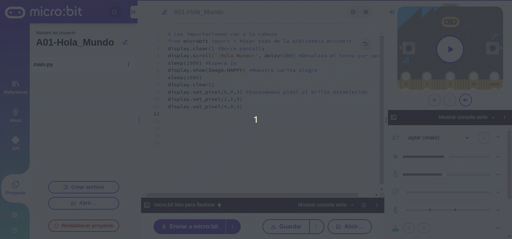  
*Funcionamiento del programa*

Si observamos bien, al principio del texto aparecen unas interrogaciones en lugar de el signo de abrir admiración. Esto es debido a que micro:bit no muestra caracteres especiales como ¡, ¿, ñ, acentos, etc.

El programa lo podemos descargar de:

* [A01-Hola_Mundo-main en hexadecimal](/docs/programas/upy/A01-Hola_Mundo-main.hex)
* [A01-Hola_Mundo-main en Python](/docs/programas/upy/A01-Hola_Mundo-main.py)

## **MakeCode**
Se explican los bloques utilizados de los menús de bloques. Referencia a **micro:bit reference** [The micro:bit APIs](https://makecode.microbit.org/reference).

<b>

* Básico: Funcionalidades básicas de micro:bit
* LED: Control de la pantalla LED

</b>

### Básico
En este grupo tenemos acceso a la funcionalidad básica de la micro:bit.

* **al iniciar**. Se trata del bloque de la imagen y es un bloque que se ejecuta una sola vez cuando se inicia la micro:bit. Es uno de los dos bloques que aparecen al principio cuando escogemos *Restablecer* o creamos un nuevo proyecto desde *Mis proyectos*.

  
*Bloque 'al iniciar'*

* **para siempre**. Se trata del bloque de la imagen y es un bloque que se ejecuta de manera infinita. Es el otro de los dos bloques que aparecen al principio cuando escogemos *Restablecer* o creamos un nuevo proyecto desde *Mis proyectos*.

  
*Bloque 'para siempre'*

* **mostrar cadena**. Muestra la cadena de texto en la pantalla caracter a caracter. En la imagen la palabra es **Hello**.

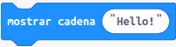  
*Bloque 'mostrar cadena'*

* **mostrar icono**. Dibuja el icono seleccionado en la pantalla.

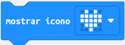  
*Bloque 'mostrar icono'*

* **borrar la pantalla**. Apaga todos los LEDs.

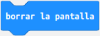  
*Bloque 'borrar la pantalla'*

* **pausa (ms)**. Detiene la ejecución del programa el tiempo establecido en milisegundos.

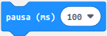  
*Bloque 'pausa (ms)'*

### LED
Control de la pantalla LED.

* **ajustar brillo**. Configura el brillo de la pantalla desde 0 (apagada) a 255 (máximo brillo). Los bloques de pantalla posteriores a este tendrán el brillo establecido hasta que no se cambien el valor a otro distinto.

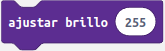  
*Bloque 'ajustar brillo'*

* **graficar x,y,brillo**. Enciende el LED indicado en la coordenada x,y con el brillo especificado. La coordenadas x es la horizontal y la y es la vertical. La coordenada 0,0 es la esquina superior ezquierda, la 0,4 es la derecha, la 4,0 es la inferior izquierda y la 4,4 la inferior derecha.

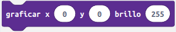  
*Bloque 'graficar x,y,brillo'*

### Programa
El programa de la actividad lo vamos a hacer utilizando los bloques descritos y comentando algunas de las líneas para que se entienda mejor. El programa es el siguiente:

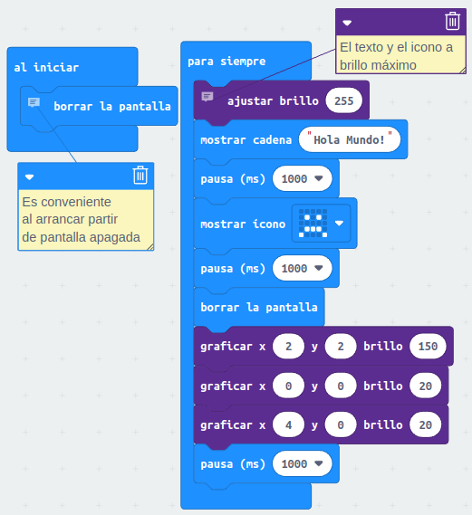  
*Programa de la actividad A01 en MakeCode*

En la animación vemos el funcionamiento en el simulador.

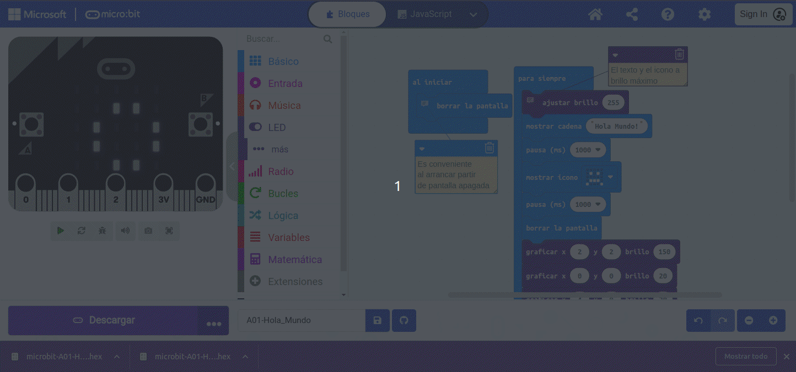  
*Funcionamiento del programa*

El programa lo podemos descargar de:

* [A01-Hola_Mundo-main en hexadecimal](/docs/programas/upy/microbit-A01-Hola_Mundo.hex)

## **MicroBlocks**
Se explican los bloques utilizados de los menús de bloques por defecto y de la libreria añadida. Referencia a [Blocks Reference](https://wiki.microblocks.fun/reference_manual).

<b>

* Control
* Pantalla LED

</b>

### Control
En este grupo tenemos acceso a los bloques de control de la micro:bit.

* **al empezar**. Los bloques debajo de este se ejecutan cuando se enciende la placa o cuando se hace clic en el icono verde EJECUTAR que tiene forma de flecha.

  
*Bloque 'al empezar'*

* **por siempre**. Se trata del bloque de la imagen y es un bloque que se ejecuta de manera indefinida.

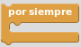  
*Bloque 'por siempre'*

* **espera xx milisegundos**. Espera el número de milisegundos indicado antes de continuar.

  
*Bloque 'espera xx milisegundos'*

### Pantalla LED
Libreria con los bloques de control de la pantalla LED.

* **limpia pantalla**. Apaga todos los LEDs.

  
*Bloque 'limpia pantalla'*

* **pantalla**. Muestra una imagen de la pantalla que permite cambiar el estado de cada LED haciendo clic sobre el mismo.

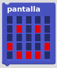  
*Bloque 'pantalla'*

* **anima el texto**. Muestra el texto introducido mediante desplazamiento caracter a caracter con el retardo en milisegundos que establezcamos.

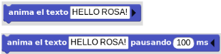  
*Bloque 'anima el texto'*

* **enciende x,y**. Enciende el LED indicado en la coordenada x,y. La coordenadas x es la horizontal y la y es la vertical. La coordenada 1,1 es la esquina superior ezquierda, la 1,5 es la derecha, la 5,1 es la inferior izquierda y la 5,5 la inferior derecha.

  
*Bloque 'enciende x,y'*

### Programa
El programa de la actividad lo vamos a hacer utilizando los bloques descritos. El programa es el siguiente:

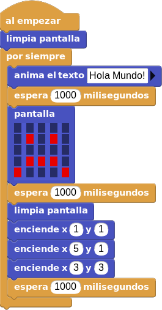  
*Programa de la actividad A01 en MicroBlocks*

En el caso de MicroBlocks no disponemos de simulador pero los botones Iniciar/parar nos permiten estar viendo en la placa real todo lo que ocurre mientra elaboramos nuestro programa.

El programa lo podemos descargar de:

* [A01-Hola_Mundo.ubp](/docs/programas/upy/A01-Hola_Mundo.ubp)
