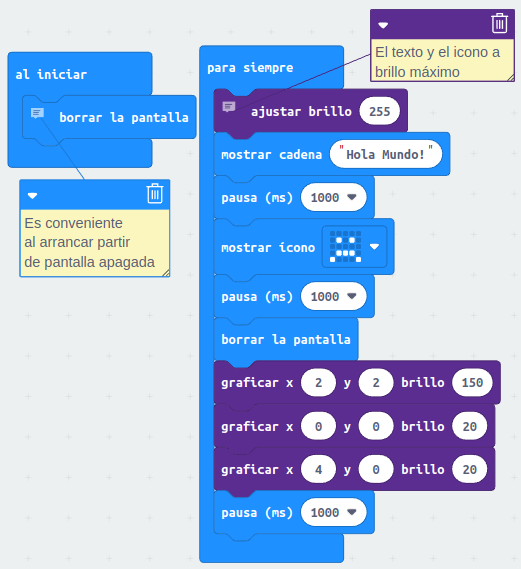
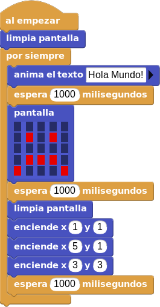

# A01. Hola mundo
La manera habitual de comenzar a programar en un nuevo lenguaje es hacer que el ordenador o dispositivo programable nos salude con un "¡Hola, mundo!". Pues hagamos esto en los tres sistemas elegidos: MicroPython, MakeCode y MicroBlocks. Animamos a probar otros programas de los citados en la webgrafía.

## **MicroPython**
El programa de la actividad lo vamos a hacer utilizando algunas de las cosas descritas y comentando las líneas para que se entienda mejor. El código del programa es el siguiente:

~~~python
# Las importaciones van a la cabeza
from microbit import * #Usar todo de la biblioteca microbit
display.clear() #Borra pantalla
display.scroll('¡Hola Mundo!', delay=100) #Desplaza el texto por pantalla
sleep(1000) #Espera 1s
display.show(Image.HAPPY) #Muestra carita alegre
sleep(1000)
display.clear()
display.set_pixel(0,0,3) #Encendemos pixel al brillo establecido
display.set_pixel(2,2,9)
display.set_pixel(4,0,3)
~~~

En la animación vemos el funcionamiento en el simulador y el efecto de cambiar el valor del *delay* y del valor del brillo de uno de los LED.

  
*Funcionamiento del programa*

Si observamos bien, al principio del texto aparecen unas interrogaciones en lugar de el signo de abrir admiración. Esto es debido a que micro:bit no muestra caracteres especiales como ¡, ¿, ñ, acentos, etc.

El programa lo podemos descargar de:

* [A01-Hola_Mundo-main en hexadecimal](../programas/upy/A01-Hola_Mundo-main.hex)
* [A01-Hola_Mundo-main en Python](../programas/upy/A01-Hola_Mundo-main.py)

## **MakeCode**
El programa de la actividad lo vamos a hacer utilizando los bloques descritos y comentando algunas de las líneas para que se entienda mejor. El programa es el siguiente:

  
*Programa de la actividad A01 en MakeCode*

En la animación vemos el funcionamiento en el simulador.

  
*Funcionamiento del programa*

El programa lo podemos descargar de:

* [microbit-A01-Hola_Mundo](../programas/makecode/microbit-A01-Hola_Mundo.hex)

## **MicroBlocks**
Se explican los bloques utilizados de los menús de bloques por defecto y de la libreria añadida. Referencia a [Blocks Reference](https://wiki.microblocks.fun/reference_manual).

El programa de la actividad lo vamos a hacer utilizando los bloques descritos. El programa es el siguiente:

  
*Programa de la actividad A01 en MicroBlocks*

En el caso de MicroBlocks no disponemos de simulador pero los botones Iniciar/parar nos permiten estar viendo en la placa real todo lo que ocurre mientra elaboramos nuestro programa.

El programa lo podemos descargar de:

* [A01-Hola_Mundo.ubp](../programas/ublocks/A01-Hola_Mundo.ubp)
