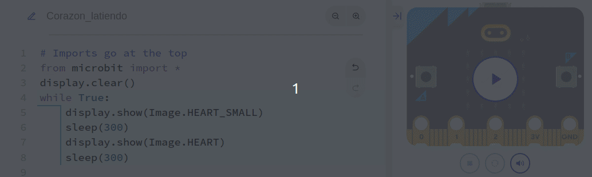
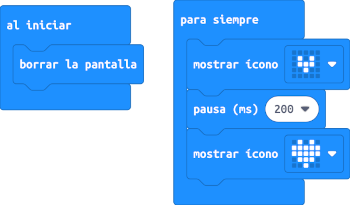
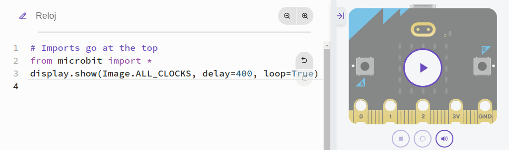
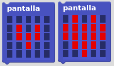
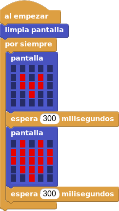

# A02. Imágenes
Vamos a entrar en las posibilidades artísticas que nos puede ofrecer una matriz cuadrada de 5x5 LEDs.

## **MicroPython**
Vamos a hacer el ejemplo del corazón que late. Resulta muy fácil de resolver pues ya están prediseñadas las imágenes de un corazón grande y pequeño.

~~~py
from microbit import *
display.clear()
while True:
    display.show(Image.HEART_SMALL)
    sleep(300)
    display.show(Image.HEART)
    sleep(300)
~~~

En la animación vemos su funcionamiento.

  
*Corazón latiendo*

El programa lo podemos descargar de:

* [A02-Corazon_latiendo en hexadecimal](../programas/upy/A02-Corazon_latiendo.hex)
* [A02-Corazon_latiendo en Python](../programas/upy/A02-Corazon_latiendo-main.py)

## **MakeCode**
El programa de corazon latiendo es el siguiente:

  
*Programa de la actividad A02 en MakeCode*

En la animación vemos el funcionamiento en el simulador.

  
*Funcionamiento del programa*

El programa lo podemos descargar de:

* [A02-Corazón_latiendo](../programas/makecode/microbit-A02-Corazón_latiendo.hex)

## **MicroBlocks**
Todos los bloques que se requieren para resolver el problema del corazón latiendo se han explicado y no se requiere nada nuevo. Pero en MicroBlocks no tenemos una definición previa de los corazones por lo que tendremos que crearla nosotros a partir del bloque "pantalla", tal y como vemos en la imagen siguiente.

  
*Dibujos de los corazones en el bloque pantalla*

El programa de la actividad lo vamos a hacer utilizando los bloques descritos. El programa es el siguiente:

  
*Programa de la actividad A02 en MicroBlocks*

El programa lo podemos descargar de:

* [A02-Corazon_latiendo.ubp](../programas/ublocks/A02-Corazon_latiendo.ubp)
