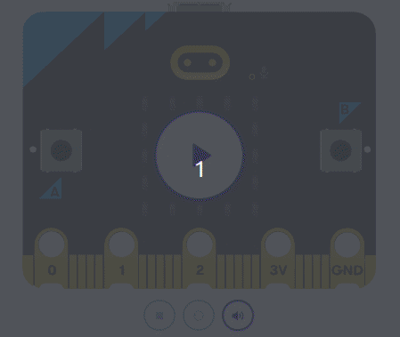
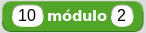
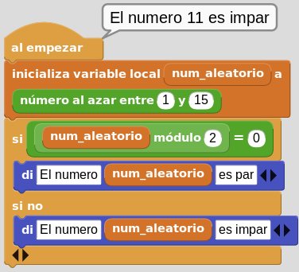
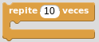
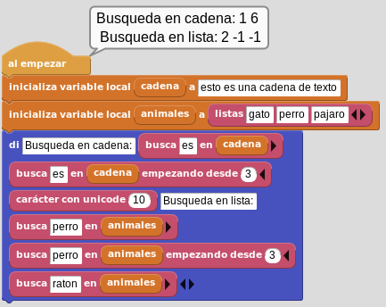
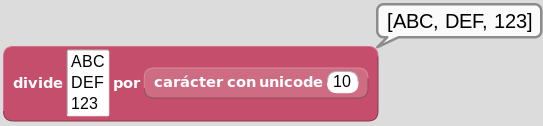

# <FONT COLOR=#8B008B>A02. Imágenes</font>
Vamos a entrar en las posibilidades artísticas que nos puede ofrecer una matriz cuadrada de 5x5 LEDs.

## <FONT COLOR=#007575>**MicroPython**</font>
Se explican los siguientes aspectos:

<FONT COLOR=#BB00FF><font size="5"><b>

* Las listas en Python
* Imágenes DIY
* Animar imágenes
* Bucles

</font color></font size></b>

MicroPython nos ofrece muchas imágenes integradas para mostrar por pantalla y podemos crear efectos interesantes. Mediante la característica de autocompletar se nos van a mostrar todas las definidas que están listadas en la documentación oficial. Ya hemos visto como cargar una imagen, lo que puedo aconsejar en este momento es realizar el ejercicio de mostrar cada una de las disponibles para familiarizarnos con ellas.

Es perfectamente posible crar nuestras propias imágenes configurando cada Pixel o LED de la pantalla. También es posible crear animaciones con imágenes.

## <FONT COLOR=#007575>**Las listas en Python**</font>
Se trata de un tipo de dato que permite almacenar series de datos de cualquier tipo bajo su estructura. Se suelen asociar a las matrices o arrays de otros lenguajes de programación.

En Python las listas son muy versatiles permitiendo almacenar un conjunto arbitrario de datos. Es decir, podemos guardar en ellas lo que sea.

Una lista se crea con [] y sus elementos se separan por comas. Una gran ventaja es que pueden tener datos de diferentes tipos.

~~~python
lista = [1, "Hola", 3.141592, [1 , 2, 3], Image.HAPPY]
~~~

Las de principales propiedades de las listas:

* Son ordenadas, mantienen el orden en el que han sido definidas
* Pueden ser formadas por tipos arbitrarios de datos
* Pueden ser indexadas con [i]
* Se pueden anidar, es decir, meter una lista dentro de otra
* Son mutables, ya que sus elementos pueden ser modificados
* Son dinámicas, ya que se pueden añadir o eliminar elementos

Evidentemente queda muchas cosas que aprender sobre las listas, pero con estos conocimientos tendremos suficiente para hacer lo que pretendemos, que no es otra cosa que animar imágenes.

## <FONT COLOR=#007575>**Bucles**</font>
Los **Bucles** son un tipo de estructura de control muy útil cuando queremos repetir un bloque de código varias veces. En Python existen dos tipos de bloques, el bucle ***for*** para contar la cantidad de veces que se ejecuta un bloque de código, y el bucle ***while*** que realiza la acción hasta que la condición especificada no sea cierta.

### <FONT COLOR=#AA0000>While</font>
La sintaxis de while es la siguiente:

~~~python
while condicion:
    bloque de codigo
~~~

donde "condicion", que se evalúa en cada iteración, puede ser cualquier expresión realizado con operadores condicionales que devuelva como resultado un valor True o False. Mientra que "bloque de codigo" es el conjunto de instrucciones que se estarán ejecutando mientras la condición sea verdadera (True o '1'). Es lo mismo poner ```while true:``` que poner ```while 1:```.

Para recorrer los bucles se utilizan variables que forman parte de la condición, estableciendose en esta lo que deben cumplir.

Un ejemplo sencillo podría ser el siguiente, controlar el riego de una planta en función del valor de la humedad de la tierra en la que está.

~~~py
from microbit import *

while (humedad() < 45):
    display.scroll(Image.SAD)
    sleep(1000)

display.show(Image.HAPPY)
~~~

que hará que si la humedad baja por debajo de 45 se muestre una carita triste indicando que hay que regar y si es mayor mostrará una carita feliz. Evidentemente hay que resolver el tema de como obtener la humedad, pero esa es una historia que veremos mas adelante.

El bucle ```while``` puede tener de manera opcional un bloque ```else``` cuyas sentencias se ejecutan cuando se han realizado todas las iteraciones del bucle. Un ejemplo lo vemos a continuación:

~~~py
cuenta = 0
while cuenta < 5:
    print("Iteración del bucle")
    cuenta = cuenta + 1
else:
    print("bucle finalizado")
~~~

### <FONT COLOR=#AA0000>for</font>
Son también bucles pero su acción está dirigida a contar el número de veces que ocurre algo o realizar una acción un determinado número de veces. Es especialmente útil para recorrer los datos de una lista, tupla o diccionario.

La sintaxis de este tipo de bucles en Python es:

~~~py
for variable in secuencia:
    declaracion
~~~

Siendo "variable" la variable que se va a recorrer en el bucle de forma que cuando se alcance el valor establecido se sale del bucle.

La variable puede ser una cadena, un rango de valores que se expresa con ```range(n)```, siendo n el número de valores del rango que se inicia en 0 y que pueden ser iterados con una variable. Mas ampliamente, la sintaxis de ```range()``` es ```range(start, stop, step)``` siendo ```start``` y ```stop``` opcionales.

Veamos un primer ejemplo en el que vamos a utilizar un bucle para encender uno a uno por filas los LEDs de la primera y última columna.

~~~py
from microbit import *
for var in range(5): # var puede tomar 5 valores, del 0 al 4
    display.set_pixel(0, var, 9) # Se ilumina el LED de la fila 0 y el valor de var para columna
    sleep(300)
    display.set_pixel(4, var, 9) # Se ilumina el LED de la fila 4 y el valor de var para columna
    sleep(300)
~~~

Los bucles se pueden anidar, es decir se puede crear un bucle dentro de otro del mismo o diferente tipo, de forma que por cada iteración del bucle mas externo se tienen que producir todas las iteraciones del bucle mas interno. Veamos como ejemplo el de encender todos los LEDs de uno en uno, de izquierda a derecha, utilizando el valor de sus coordenadas x,y. El programa sería:

~~~py
from microbit import *

display.clear()
for y in range(0, 5): # Valor de columna
    for x in range(0, 5): # Valor de fila
        display.set_pixel(x, y, 9) # Encender LED x,y
        sleep(100)
~~~

En la animación siguiente vemos el programa en funcionamiento.

<center>

  
*Uso de bucle for*

</center>

El bucle ```for``` puede tener de manera opcional un bloque ```else``` cuyas sentencias se ejecutan cuando se han realizado todas las iteraciones del bucle. Un ejemplo lo vemos a continuación:

~~~py
for var in range(5):
    print(var)
else:
    print("bucle finalizado")
~~~

### <FONT COLOR=#AA0000>Sentencias ```break``` y ```continue```</font>
La sentencia ```break``` se utiliza para terminar un bucle de forma inmediata al ser encontrada. En la imagen vemos la sintaxis de la sentencia ```break``` y su funcionamiento.

<center>

  
*Sintaxis y funcionamiento de ```break```*

</center>

La sentencia ```continue``` se utiliza para saltar la iteración actual del bucle y el flujo de control del programa pasa a la siguiente iteración. En la imagen vemos la sintaxis de la sentencia ```continue``` y su funcionamiento.

<center>

  
*Sintaxis y funcionamiento de ```continue```*

</center>

En la figura siguiente vemos dos ejemplos de esta sentencia.

<center>

  
*Funcionamiento de ```continue```*

</center>

### <FONT COLOR=#AA0000>Imágenes DIY</font>
Crear nuestras propias imágenes va a resultar una tarea sencilla cuando conozcamos la información para hacerlo. Cada pixel (LED) de la pantalla se puede configurar con diez valores que pueden tomar un valor entre 0 (cero) y 9 (nueve). Cuando le damos valor 0 (cero) es decirle literalmente que el brillo es nulo y sin embargo cuando le damos el valor 9 (nueve) lo ponemos al máximo de brillo posible. Podemos jugar con todos los valores intermedios para crear niveles de brillo.

La forma mas sencilla de definir una imagen consiste en utilizar la *clase microbit.Image* para crearla a partir de una cadena o string que devuelva el pictograma. Es decir utilizando el comando *Image(string)* teniendo que constar de dígitos con los valores 0 a 9 indicados. Para verlo rapidamente hacemos el ejemplos de dibujar una X en relieve asignándola a una variable.

~~~python
mi_imagen_X = Image("90009:"
                    "06060:"
                    "00300:"
                    "06060:"
                    "90009")
~~~

Los dos puntos indican un salto de línea por lo que se puede usar el ASCII no imprimible "\n" que es precisamente eso, un salto de línea.

~~~python
mi_imagen_X = Image("90009\n"
                    "06060\n"
                    "00300\n"
                    "06060\n"
                    "90009")
~~~

Los valores de brillo dan la sensación de relieve de profundidas a la X.

En cualquier caso esto no se escribe normalmente así, salvo para hacer mas o menos un gráfico del pixelado, sino en una sola línea.

~~~python
mi_imagen_X = Image("90009\n06060\n00300\n06060\n90009")
~~~

Ahora parece mas elegante utilizar los dos puntos como indicador de salto de línea.

~~~python
mi_imagen_X = Image("90009:06060:00300:06060:90009")
~~~

En la imagen vemos el resultado de lo explicado.

<center>

  
*mi imagen de una X en relieve*

</center>

Este es el código creado:

~~~python
from microbit import * 
"""mi_imagen_X = Image("90009\n"
                       "06060\n"
                       "00300\n"
                       "06060\n"
                       "90009")"""
#mi_imagen_X = Image("90009\n06060\n00300\n06060\n90009")
mi_imagen_X = Image("90009:06060:00300:06060:90009")
display.show(mi_imagen_X)
~~~

### <FONT COLOR=#AA0000>Animar imágenes</font>
En micro:bit Python ya disponemos de un par de listas de imágenes incorporadas que se llaman

~~~python
Image.ALL_Clocks
Image.ALL_ARROWS
~~~

Estas dos ordenes hacen que MicroPython entienda que necesita mostrar cada imagen de la lista, una tras otra.

Cuando queremos mostrar en la pantalla una imagen se nos muestra la siguiente ayuda contextual:

<center>

  
*Ayuda contextual para display.show()*

</center>

donde nos indica claramente qie **image** puede ser una cadena, un número, una imagen o una lista de imágenes. Además aparecen las opciones que podemos configurar.

Con esta información crear un "reloj" que esté continuamente marcando cada hora es bastante sencillo, basta con poner el siguiente código y darle a simular.

~~~python
# Imports go at the top
from microbit import *
display.show(Image.ALL_CLOCKS, delay=400, loop=True)
~~~

En la animación vemos el funcionamiento de este "reloj".

<center>

  
*"Reloj" creado con display.show() y mostrar una lista*

</center>

Si cambiamos el reloj por las flechas veremos como van rotando flechas en ángulos de 45 grados.

<center>

  
*Flechas creado con display.show() y mostrar una lista*

</center>

Para animar nuestras propias imágenes tendremos que crear cada una sobre un lienzo de 5x5 pixeles y establecer las diferencias para crear la animación. Podemos crear tantas imágenes como creamos oportuno. Creamos una lista con todas las imágenes en el orden que se tienen que reproducir y ya podemos mostrar nuestra lista en la pantalla.

En la animación siguiente vemos un efecto creado de esta forma.

<center>

  
*Cortinilla animada*

</center>

Este es el código para crear la animación.

~~~python
# Imports go at the top
from microbit import *
display.clear()
cor1=Image("90000:90000:90000:90000:90000")
cor2=Image("79000:79000:79000:79000:79000")
cor3=Image("57900:57900:57900:57900:57900")
cor4=Image("35790:35790:35790:35790:35790")
cor5=Image("13579:13579:13579:13579:13579")
cor6=Image("01357:01357:01357:01357:01357")
cor7=Image("00135:00135:00135:00135:00135")
cor8=Image("00013:00013:00013:00013:00013")
cor9=Image("00001:00001:00001:00001:00001")
cor10=Image("00000:00000:00000:00000:00000")
todas_las_cortinas=[cor1,cor2,cor3,cor4,cor5,cor6,cor7,cor8,cor9,cor10]
display.show(todas_las_cortinas, delay=100, loop=True)
~~~

### <FONT COLOR=#AA0000>Programa</font>
Cualquiera de los ejemplos vistos nos puede valer como programa de ejemplo para el apartado Imágenes, pero por su facilidad vamos a hacer el ejemplo del corazón que late. Resulta muy fácil de resolver pues ya están prediseñadas las imágenes de un corazón grande y pequeño.

~~~py
from microbit import *
display.clear()
while True:
    display.show(Image.HEART_SMALL)
    sleep(300)
    display.show(Image.HEART)
    sleep(300)
~~~

En la animación vemos su funcionamiento.

<center>

  
*Corazón latiendo*

</center>

El programa lo podemos descargar de:

* [A02-Corazon_latiendo en hexadecimal](../programas/upy/A02-Corazon_latiendo.hex)
* [A02-Corazon_latiendo en Python](../programas/upy/A02-Corazon_latiendo-main.py)

## <FONT COLOR=#007575>**MakeCode**</font>
Aunque todos los bloques que se requieren para resolver el problema del corazón latiendo ya se han explicado y no se requiere nada nuevo vamos a explicar como son los bloques para bucles y para imágenes en MakeCode.

Se explican los siguientes aspectos:

<FONT COLOR=#BB00FF><font size="5"><b>

* Arrays o arreglos
* Variables
* Bucles
* Imágenes

</font color></font size></b>

## <FONT COLOR=#007575>**Arrays o arreglos**</font>
Se van a utilizar para agregar, eliminar y sustituir elementos en listas. En MakeCode las listas se nombran indistintamente como array, matriz o lista y tienen su propio menú de bloques que es visible cuando desplegamos 'Avanzado'. Los bloques existentes están clasificados en los siguientes grupos:

1. **Create**
2. **Leer**
3. **Modificar**
4. **Operaciones**

Describiremos estos grupos de forma somera porque esta es suficiente para entender lo que hace el bloque. No obstante, algunos se describen de manera mas explicita.

### <FONT COLOR=#AA0000>Create</font>

* **fijar 'nn' a**. Le da a la variable el valor de la entrada, para valores numéricos.
* **fijar 'tt' a**. Le da a la variable el valor de la entrada, para texto.
* **matriz vacia**. Crea una lista con los elementos que introduzcamos con el '+'.

### <FONT COLOR=#AA0000>Leer</font>

* **longitud del arreglo**. Devuelve el número de elementos de una lista.
* **obtener el valor en 'x'**. Obtiene el valor del elemento 'x'.
* **eliminar el valor en 'x'**. Elimina el elemento 'x' de la lista.
* **obtener y eliminar el último valor de (```pop```)**. Elimina y devuelve el último elemento de una matriz. Se elimina el último elemento de la matriz, por lo que la matriz se reduce en un elemento.
* **obtener y eliminar el primer valor de (```shift```)**. Elimina y devuelve el primer elemento de una matriz. Se elimina el primer elemento de la matriz, por lo que la matriz se reduce en un elemento.
* **obtener valor aleatorio**. Devuelve un valor al azar de la matriz.

### <FONT COLOR=#AA0000>Modificar</font>

* **establecer el valor en 'x' a 'nn'**. Estable el valor del elemento 'x' al valor indicado en 'nn'.
* **añadir valor 'nn' al final (```push```)**. Añade un nuevo elemento al final de una matriz.
* **eliminar el último valor de**. Elimina el último elemento de la matriz y lo devuelve.
* **eliminar el primer valor de**. Elimina el primer elemento de la matriz y lo devuelve.
* **insertar 'nn' al principio (```unshift```)**. Añadir un elemento al principio de una matriz y devolver la nueva longitud de la matriz.
* **insertar en 'x' valor 'nn' (```insertAt```)**. Inserta el valor 'nn' en la posición espeífica indicada por 'x' aumentando la longitud del array en uno. El elemento se agrega a la matriz en la posición que indiquemos. Si ya hay un elemento en esa posición, entonces él y todos los elementos posteriores se desplazan a la posición superior siguiente.
* **eliminar valor en 'x' (```removeAt```)**. Elimina el elemento que hay en la posición 'x'. El tamaño de la matriz se reduce en uno. El elemento se elimina de la matriz en la posición que indiquemos. Todos los demás elementos posteriores se desplazan hacia abajo a la posición inferior siguiente.

### <FONT COLOR=#AA0000>Operaciones</font>

* **bloque encontrar indice de (```IndexOf```)**. Devuelve la posición o índice de la primera aparición de un valor en una matriz. Devuelve un número, que es la posición en la matriz del elemento. El resultado es -1 si no se encuentra ninguna coincidencia.
* **invertir (```reverse```)**. Invertir los elementos de una matriz.

## <FONT COLOR=#007575>**Variables**</font>
Cuando vamos a utilizar bucles, estos siempre llevan asociada una variable, y por eso debemos aprender a gestionar el tema de las variables en MakeCode. Las variables tienen su propio menú y es relativamente sencillo de usar. Como ya se ha dicho, una variable es un espacio en la memoria donde el programa puede almacenar valores. El sistema nos permite asignarles un nombre simbólico como por ejemplo “temperatura”, “velocidad”, ”estado”,… para facilitar su uso.

Cuando accedemos al menú 'Variables' por primera vez y si no hemos pues ningún bloque en el área de programa, el aspecto del menú es el siguiente:

<center>

  
*Variables en MakeCode*

</center>

Veamos como funciona la creación de una variable, cambiarle el nombre, eliminarla y demás tareas que podemos hacer con ellas. En la animación siguiente vemos el proceso de crear y poner nombre a una variable. Vemos que al hacer clic en el botón se abre una ventana de diálogo donde nos pide el nombre, que tecleamos según las reglas establecidas, y que al hacer clic en 'Aceptar' se nos crean tres bloques, dos para trabajar con la variable creada y uno que es la propia variable, todos ellos con el nombre que hemos puesto a esa variable.

<center>

  
*Creación de una variable en MakeCode*

</center>

El bloque 'fijar' sirve para inicializar la variable al valor especificado, el bloque 'cambiar' es el equivalente al operador '+=' con el incremento que establezcamos en 'por' y el último bloque es el valor de la variable.

Al final de la animación también vemos que al hacer clic en la flechita de cualquiera de los bloques se despliega un menú en el que aparece la variable, la opción de crear otra nueva, renombrarla o borrar la variable que está seleccionada en ese momento. En la animación siguiente vemos estos aspectos en funcionamiento.

<center>

  
*Trabajo con el menú desplegable en una variable en MakeCode*

</center>

Cuando pasamos por el menú de bloques vemos que 'fijar' y 'cambiar' no se vuelven a crear cuando creamos nuevas variables ya que están todas en el desplegable y lo único que tenemos que hacer es seleccionarlas. Si se crea, en cambio, un bloque para el contenido de cada variable. También vemos que si eliminamos una variable que está en uso en varios sitios se elimina, preva advertencia, de todos ellos.

Ahora bien, la variables como tal se eliminan de la zona de programa pero no del menú 'Variables, donde siguen estando disponibles hasta que las eliminemos, tarea que solamente es posible hacer desde alguno de los bloques situado en la zona de programa.

## <FONT COLOR=#007575>**Bucles**</font>

### <FONT COLOR=#AA0000>Bloque for</font>
Son bloques que repiten el código asociado un número determinado de veces, Lo pueden hacer utilizando una variable como índice o estableciendo el número exacto de veces.

El aspecto del bloque para recorrer con una variable lo vemos en la imagen siguiente:

<center>

  
*Bloque for en MakeCode*

</center>

Cuando llevamos el bloque a la zona de programa se creará una variable index, salvo que esta ya exista. Un bloque como el siguiente creará un contador con la variable i desde 0 hasta 4 y mostrará los números 0 al 9 uno tras otro en la pantalla LED.

<center>

  
*Contador de 0 a 9*

</center>

Una variedad de este bloque la tenemos en el bloque 'repetir' para el número de veces que indiquemos, que tiene el aspecto que vemos en la figura siguiente.

<center>

  
*Bloque repetir nn veces*

</center>

En el ejemplo siguiente, cuando se inicia el dispositivo, se producen tres efectos de latido de un corazón.

<center>

  
*Ejemplo de uso del bloque repetir nn veces*

</center>

Otro bloque que utiliza el bucle for es el que vemos en la imagen siguiente, un bloque pensado para repetir el código para cada valor de los contenidos en una lista.

<center>

  
*Bucle for para elementos de una lista*

</center>

En la imagen siguiente vemos un programa que utiliza este bloque. Hemos creado una lista aleatoria de valores y el programa lo que hace es encontrar y mostrar el mayor de ellos. El funcionamiento del programa lo leemos asi: se crea una variable ```mayor``` para guardar el valor del elemento de la lista de mayor valor, la matriz le hemos dejado el nombre ```lista``` y para recorrerla se utiliza la variable ```valor```. El condicional (los veremos en una actividad posterior) va comprobando si ```valor > mayor``` y mientras sea cierto se guarda en ```mayor``` el ```valor``` leido y si no es cierto se continúa con el siguiente elemento de la lista. Una vez finalizado el condicional se mestra la cadena con la variable ```mayor```.

<center>

  
*Ejemplo de bucle for para elementos de una lista*

</center>

### <FONT COLOR=#AA0000>Bloque while</font>
Se trata de un bloque que repite su bloque de código mientras la condición sea cierta (```True```). Su aspecto lo vemos en la imagen siguiente.

<center>

  
*Bucle while*

</center>

El bucle while tiene una condición que se evalúa con un valor ```booleano```. La condición se comprueba antes de que se ejecute ningún código. Lo que significa que si la condición es falsa la primera vez que se evalúa, el código dentro del bucle no se ejecuta núnca.

Con el bloque tal cual es solamente podemos establecer la condición como ```True``` o ```False```, lo que es muy poca cosa. Es evidente que podrá tener mucha mas potencia si recurrimos a condiciones mas complejas y utilizamos los operadores. Este apartado no lo vamos a estudiar en este momento, pero si diremos que estos bloques están en el menú 'Lógica' y su funcionamiento es el mismo que en visto en [Python -> Introducción](../guias/intro.md).

Como ejemplo vamos a ver como dibujar una línea diagonal en los LEDs [(0,0) - (1,1) - (2,2) - (3,3) - (4,4) y (5,5)] de la pantalla. En la imagen vemos el programa final, donde observamos que la condición va a ser cierta hasta que index alcance el valor 4, por lo que se va a ir encendiendo cada LED a intervalos de un segundo. Esto solamente va a ocurrir cuando se inicia el disposiivo, aunque en este ejemplo concreto esto no tiene importancia.

<center>

  
*Programa bucle while*

</center>

### <FONT COLOR=#AA0000>Bloque cada 'nn' ms</font>
Repite el código en segundo plano de forma contnuada en el intervalo de tiempo que se indique. Establecemos la cantidad de tiempo que el bucle espera antes de que el código en su interior se ejecute de nuevo. Esto es similar a un bucle "forever" (por siempre), en el sentido de que se ejecuta continuamente, excepto que hay un intervalo de tiempo establecido para esperar antes de que el bucle se ejecute la próxima vez. El bloque es muy útil si, por ejemplo, queremos estar comprobando cada cierto tiempo si ocurre un evento, como pulsar una tecla, escuchar un sonido, etc.

En la imagen siguiente vemos el aspecto que tiene el bloque.

<center>

  
*Bloque cada 'nn' ms*

</center>

### <FONT COLOR=#AA0000>Bloques salir y continuar </font>
Son los bloques equivalentes a las sentencias ```break``` y ```continue``` en MicroPython y funcionan exactamente igual, es decir, el bloque 'salir' permite salir de un bucle de forma inmediata y el bloque 'continuar' sirve para saltarse la iteración actual del bucle.

Los bloques tienen el aspecto que vemos en la imagen.

<center>

  
*```break``` y ```continue```*

</center>

### <FONT COLOR=#AA0000>Programa</font>
El programa de corazon latiendo es el siguiente:

<center>

  
*Programa de la actividad A02 en MakeCode*

</center>

En la animación vemos el funcionamiento en el simulador.

<center>

  
*Funcionamiento del programa*

</center>

El programa lo podemos descargar de:

* [A02-Corazón_latiendo](../programas/makecode/microbit-A02-Corazón_latiendo.hex)

## <FONT COLOR=#007575>**MicroBlocks**</font>
Por tema de hacer homogénea esta actividad se explican los siguientes aspectos:

<FONT COLOR=#BB00FF><font size="5"><b>

* Operadores
* Variables
* Bucles
* Listas

</font color></font size></b>

### <FONT COLOR=#AA0000>Operadores</font>
Esta entrada se crea porque en MicroBlocks, en el menú específico, aparecen algunos operadores especiales. Las descripciones siguiente son las obtenidas de [MicroBlocks Wiki](https://wiki.microblocks.fun/reference_manual/operators).

Dentro del grupo de bloques estándar tenemos los que se ven en la imagen.

<center>

  
*Bloques estándar*

</center>

*   Devuelve el resto de la división entre los dos números introducidos, ambos inclusive.
*  Devuelve un número aleatorio (al azar) entre el primer y el segundo valor indicado.

En la imagen vemos un ejemplo donde se averigua si un número generado al azar es par o impar.
  
A la variable ```num_aleatorio``` se le asigna un número aleatorio del 1 al 15. La operación ```módulo``` se utiliza para comprobar si el resto es 0 y así saber si el número es par. Si el resto de la operación ```num_aleatorio``` dividido por 2 da como resultado 0, el número es par, en caso contrario es impar.

<center>

  
*Par o impar*

</center>

Con este ejemplo comprobamos que una vez conectada la micro:bit (si no el programa nos indica que no lo está y no funcionará), el bloque ```di``` muestra como retorno un mensaje que aparece asociado al bloque ```al empezar``` en la pantalla del ordenador. Esta es la forma de trabajar de MicroBlocks y hace que el código se compruebe de manera instantánea siempre que los bloques estén acoplados a ```al empezar```.

[Descargar el programa](../ejemplos/par_impar.ubp)

*   Devuelve ```True``` si la expesión de entrada del lado izquierdo coincide con la selección del menú de tipos de datos realizada en el lado derecho. Los tipos de datos son importantes a la hora de programar. Aunque un entorno como MicroBlocks facilita las cosas a los usuarios principiantes al encargarse de las conversiones de tipos de datos, todavía es posible engañarse visualmente al comparar variables cuyos valores parecen iguales. Este bloque pertenece al grupo de condicionales, pero se describe ahora porque se utiliza en el ejemplo siguiente.

<center>

  
*Número o cadena*

</center>

[Descargar el programa](../ejemplos/num_cad.ubp)

Desplegando la sección 'Avanzados' vemos algunos bloques que representan operaciones bit a bit. Los operadores bit a bit (bitwise) trabajan sobre representaciones binarias de datos y su utilidad está en cambiar bits individuales en un operando. Los dos operandos asociados al operador bit a bit deben ser enteros. En la imagen vemos los bloques que aparecen en avanzados.

<center>

  
*Bloques de operadores avanzados*

</center>

*  Permite modificar el rango de un valor o variable desde un rango origen a un rango destino. Esta función es especialmente útil para adaptar los valores leídos de sensores o para adaptar valores a aplicar en un actuador.
*  Convierte una cadena Hexadecimal en un número decimal. Por ejemplo, 5A hex. = 90 dec.
*   El operador AND compara dos bits y genera un resultado igual a 1 si ambos bits son 1; en caso contrario, devuelve 0. Números de mas de un bit son comparados bit a bit. Un ejemplo de aplicación lo vemos en la imagen siguiente.

<center>

  
*bitwise AND*

</center>

La tabla siguiente muestra la forma de obtener el resultado de forma teórica.

<center>

  

</center>

*   El operador OR compara dos bits y devuelve 1 si uno o ambos bits son 1 y da 0 si ambos bits son 0. Bitwise OR compara todas las posiciones de bits de ambos números e informa de aquellas en las que cualquiera de los dos está a 1.

Un ejemplo de aplicación lo vemos en la imagen siguiente.

<center>

  
*bitwise OR*

</center>

La tabla siguiente muestra la forma de obtener el resultado de forma teórica.

<center>

  

</center>

*   El operador EXCLUSIVE-OR compara dos bits y genera un resultado de 1 si los bits son complementarios (el bit se establece en un operando pero no en ambos); en caso contrario, devuelve 0. Otra forma de pensar en la operación XOR es que invertirá las posiciones de los bits en las que el segundo operando tenga un 1. Todas las demás se copiarán igual.

Un ejemplo de aplicación lo vemos en la imagen siguiente.

<center>

  
*bitwise XOR*

</center>

La tabla siguiente muestra la forma de obtener el resultado de forma teórica.

<center>

  

</center>

*   El operador NOT se utiliza para invertir (BIT FLIP) todos los bits del operando Cuando el bit de posición más alta de un número se convierte en 1, ese número se considera un número negativo. La representación informática real de un número entero con signo en MicroBlocks es de 31 bits. El bit de mayor peso es un bit de signo. Esto permite números en el rango de -1073741824 a 1073741823. Cuando el bit de signo es 0, el número es positivo; y cuando es 1, el número es negativo.

Un ejemplo de aplicación lo vemos en la imagen siguiente.

<center>

  
*bitwise NOT*

</center>

La explicación es sencilla, el número 3 (0011) se convierte al binario 1100 y como el bit de mayor peso es 1 indica que es negativo y el número es 4, por lo tanto el resultado es -4.

*  El valor del operando izquierdo se desplaza hacia la izquierda el número de bits especificado por el operando derecho. Los bits se desplazan hacia la izquierda, el bit situado más a la izquierda se descarta y al bit situado más a la derecha se le asigna el valor 0. Cada posición de bit desplazada a la izquierda equivale en binario a multiplicar por 2. En la imagen siguiente vemos el funcionamiento del desplazamiento a la izquierda a nivel de bit.

<center>

  
*bitwise desplazamiento izquierda*

</center>

*  El valor del operando izquierdo se desplaza hacia la derecha el número de bits especificado por el operando derecho. Los bits se desplazan hacia la derecha, el bit situado más a la derecha se descarta y al bit situado más a la izquierda se le asigna una copia del bit de signo. Esto se denomina desplazamiento aritmético. Por cada posición de bit desplazada a la derecha, esta operación es el equivalente binario de dividir por 2. En la imagen siguiente vemos el funcionamiento del desplazamiento a la derecha a nivel de bit.

<center>

  
*bitwise desplazamiento izquierda*

</center>

### <FONT COLOR=#AA0000>Variables</font>
En MicroBlocks se contemplan dos tipos de variables, las globales y las locales. Cuando hablamos en estos términos hablamos de ámbito (scope) de las variables y determina la zona donde se define la variable, que son global y local.

Las variables locales son las definidas dentro de una función y solamente está disponible para el código que se ejecuta dentro de la función.

Las variables globales se definen en cualquier punto del programa, normalmente al principio, y pueden ser llamadas desde cualquier sitio del programa, incluso desde las funciones.

*  Este bloque es en realidad un botón que crea una nueva variable global. Si existe una variable con el mismo nombre, se creará una nueva con el mismo nombre y el número 2 añadido. Cuando creamos una variable se nos pide el nombre de la misma en una ventana emergente y una vez creada aparecerá un nuevo bloque para acceder al valor de la variable creada. Además esta nueva variable estará disponible para su selección en dos de los bloques que explicaremos después.
*   Este bloque es en realidad un botón que sirve para eliminar una variable previamente creada.

En la animación siguiente vemos el proceso de creación y eliminación de variables.

<center>

  
*Creación y eliminación de variables*

</center>

La opción de mostrar el nombre de las variables mostrada desde el bloque se puede utilizar para añadir variables mientras se edita el código del programa, sin pasar a las opciones de la categoría variables.

*   Este bloque asigna el valor a cualquier variable, global o local, en la cantidad especificada en el área de entrada. La cantidad que se asigna puede ser un número positivo o negativo. Para mostrar los nombres de las variables locales en el menú de selección, este bloque debe estar físicamente unido a la secuencia de bloques en la que se utiliza el bloque 'Inicializar local' que veremos a continuación.
*   Este bloque suma algebraicamente (cambia) el valor de cualquier variable, global o local, en la cantidad especificada en el área de entrada. La cantidad de cambio puede ser un número positivo o negativo.
*   Este bloque se utiliza para crear e inicializar variables locales. El nombre predeterminado de la variable 'var' puede cambiarse por cualquier otro haciendo clic en el nombre y escribiendo un nuevo nombre en el cuadro de diálogo que se abre. Despés, si es necesario cambiar el valor de la variable local, se puede utilizar el bloque 'asigna valor a' de la categoría variables. En la animación siguiente vemos este proceso y la disponibilidad o no de la variable local.

<center>

  
*Inicializa variable local*

</center>

Una variable global tiene:

* **Alcance global**: Una variable global puede utilizarse en cualquier script que no tenga una variable local del mismo nombre que la anule.
* **Tiempo de vida largo**: Una variable global es creada explícitamente y vive hasta que es explícitamente borrada. Conserva su valor cuando los scripts se inician y detienen e incluso cuando no hay scripts en ejecución. Sin embargo, al hacer clic en el botón "Detener", todas las variables globales se borran e inicializan con el valor cero. Las variables globales también se inicializan a cero cuando se crean por primera vez y cuando se carga un proyecto.

Por el contrario, una **variable local** tiene:

* **Ámbito local**: Una variable local sólo puede utilizarse en el script en el que aparece. Si varios scripts utilizan variables locales con el mismo nombre, esas variables son independientes entre sí. Aunque esta práctica se desaconseja porque puede inducir a errores.
* **Tiempo de vida limitado**: Una variable local de un script se crea cuando se inicia el script y se elimina cuando éste finaliza. Se crea una nueva variable local cada vez que se inicia un script (incluyendo un script de función), y las variables locales de cada invocación de script son independientes entre sí.
* **Precedencia sobre las globales**: Si una variable local tiene el mismo nombre que una variable global, la variable local prevalece sobre la global en el script en el que aparece la variable local. Una variable es local en todo el script sin importar en qué parte del script aparezca "inicializar var local a", aunque es una buena práctica de codificación que "inicializar var local a" preceda a cualquier otra referencia a esa variable.

Un ejemplo comentado de aplicación lo vemos en la imagen siguiente.

<center>

  
*Variables*

</center>

[Descargar el programa](../ejemplos/variables.ubp)

### <FONT COLOR=#AA0000>Bucles</font>
En el caso de MicroBlocks los bucles, condicionales y funciones están todos englobados en la categoría 'Control'. Vamos a ver algunos de ellos en esta ocasión y los que no veamos en esta actividad se irán viendo cuando los necesitemos.

*   Los bloques con forma de sombrero forman parte de un grupo de bloques de control que comienzan a ejecutarse cuando se pulsa el icono verde ```Inicia```. Este bloque se activa cuando se cumple la condición de inicio del programa.
*   Los bloques con forma de "C" son un grupo de bloques de control que ejecutan el código colocado en su interior siempre que se cumplan las condiciones descritas en sus subtítulos. Estos son los bloques de tipo bucle. Este en particular ejecutará los bloques en su interior indefinidamente.
*   Este bloque C ejecuta el código colocado en su interior el número especificado de veces. En el ejemplo siguiente veremos tanto en el programa como en la pantalla la suma de los 10 primero números naturales.

<center>

  
*Suma de los 10 primeros números*

</center>

[Descargar el programa](../ejemplos/suma_10__primeros_numeros.ubp)

*   Este bloque estambién de tipo C y pertenece al grupo de los bucles. Funciona de dos formas distintas en función del tipo de entrada especificado.

- Si la **entrada es un número**, los bloques interiores se ejecutarán tantas veces como el número. En cada iteración del bucle, empezando por uno, el parámetro o variable de control es 'i' por defecto y se incrementará en uno. Este valor se puede utilizar en el código del programa como se crea conveniente.
- El nombre del parámetro de control puede cambiarse por otro haciendo clic en la 'i' y escribiendo un nuevo nombre.
- Si la **entrada es una lista**, los bloques colocados dentro se ejecutarán tantas veces como elementos tenga la lista. En cada iteración, el parámetro de control 'i' tomará el valor de cada elemento de la lista de manera secuencia. En el ejemplo siguiente vemos una animación de un sencillo programa de como hacer un contador con los 5 primeros números y hacer que se muestre en el ordenador y en la pantalla de la micro:bit.

<center>

  
*Mostrar los 5 primeros números*

</center>

[Descargar el programa](../ejemplos/muestra_5_primeros_numeros.ubp)

*   Este bloque pausa el flujo de ejecución del programa por el tiempo especificado en milisegundos. Se utiliza para pausar y reanudar la ejecución de código de forma controlada.
*   Este bloque pausa el flujo de ejecución del programa por el tiempo especificado en microsegundos. Se utiliza para pausar y reanudar la ejecución de código de forma controlada.
*   Emite el mensaje especificado. Véase en conjunto a . Este bloque envía el contenido del mensaje especificado. Todos los bloques de mensajes ```al recibir``` con el mismo mensaje en su contenido recibirán el mensaje y actuarán ejecutando su contenido.
*   Ejecuta cuando se emita el mensaje especificado. Este bloque y su par funcional  se suelen utilizar juntos para conseguir un medio de comunicación dentro del programa. Cualquier mensaje enviado con el comando ```envía``` es detectado y recibido por este bloque. Así, los bloques colocados bajo este bloque se ejecutarán al recibir el mensaje correspondiente. Los mensajes pueden ser cadenas o números. Además, el bloque  contiene el último mensaje emitido y recibido.
*   Devuelve el último mensaje enviado en todo el programa, cronológicamente hablando. Nótese que **NO** es el último mensaje recibido por una secuencia de bloques concreta del programa, y es independiente de la ejecución del bloque ```al recibir```. No hay colas de mensajes en el sistema. Si no hay ningún ```al recibir``` en espera cuando se envía un mensaje, se perderá y será sobrescrito por el siguiente mensaje.

En el ejemplo siguiente vemos de forma sencilla el funcionamiento de estos tres últimos bloques.

<center>

  
*Di el último mensaje*

</center>

[Descargar el programa](../ejemplos/ultimo_mensaje.ubp)

### <FONT COLOR=#AA0000>Listas</font>
Los bloques para trabajar con listas están en el menú 'Datos' y sus bloques los vemos en la imagen siguiente.

<center>

  
*Bloques para Listas. Datos*

</center>

*  Devuelve una lista corta que contiene algunos elementos en inglés. Con las flechas podemos añadir o eliminar elementos a la lista aunquw a partir del cuarto se repite siempre el mismo. Para crear una lista vacía () basta con eliminar el único elemento existente cuando se crea una nueva.
*  Une (concatena) cadenas, listas o matrices de bytes y devuelve el resultado.
*  Devuelve el carácter [Unicode](https://en.wikipedia.org/wiki/List_of_Unicode_characters) del número dado.
*  Devuelve el enésimo elemento de una lista, cadena o matriz de bytes.
*   Combina los elementos de una lista en una cadena, opcionalmente se puede usar un carácter delimitador.
*   Añade un elemento al final de una lista.

En el ejemplo siguiente vemos el uso de estos bloques. Comenzamos por crear una cadena de caracteres de la que vamos a extraer la palabra un mediante la unión de los elementos 9 y 10 de la cadena. Se crea una lista con cuatros animales y finalmente se muestra la palabra 'un' seguida de la posición 3 de la lista creada.

<center>

  
*Un pajaro*

</center>

[Descargar el programa](../ejemplos/un_pajaro.ubp)

En este otro ejemplo vemos como se generan los caracteres de latín básico comenzando por el espacio en blanco (32), diferentes símbolos, números, letras mayúsculas y letras minúsculas.

<center>

  
*Caracteres Unicode de Latín básico*

</center>

[Descargar el programa](../ejemplos/unicode.ubp)

*  Devuelve el número de elementos de una lista, cadena o matriz de bytes.
*  Sustituye el enésimo elemento de una lista por el valor dado. También puede sustituir todos los elementos por un valor.
*  Elimina el elemento N de una lista. La lista resultante se reduce de tamaño. También puede eliminar todos los elementos.

A continuación vemos un ejemplo en el que se demuestra la funcionalidad de estos tres bloques.

<center>

  
*Sustituir, eliminar y tamaño*

</center>

[Descargar el programa](../ejemplos/sustituir_eliminar_long.ubp)

*  Devuelve la posición de la primera coincidencia de una subcadena dentro de una cadena o un elemento de una lista. Devuelve -1 si no encuentra coincidencias.

En el ejemplo las variables locales ```cadena``` y ```animales``` se inicializan como de tipo string y list respectivamente. El primer conjunto de resultados opera sobre la cadena, buscando la posición de la primera apariciones de "es". La primera coincidencia se encuentra en el carácter número uno. La segunda búsqueda se inicia en el carácter número tres, y localiza el objetivo de la búsqueda en el carácter número seis. La búsqueda de "perro" en la lista 'animales' la encuentra en el elemento número dos de la lista. La segunda búsqueda de "perro" en la lista 'animales' comienza en el elemento número tres y devuelve -1 porque no lo encuentra. No hay ningún "raton" en la lista, por lo que la búsqueda devuelve -1.

<center>

  
*Buscar*

</center>

[Descargar el programa](../ejemplos/buscar.ubp)

*  Copia una cadena desde/hasta el caracter especificado, o una desde/hasta el elemento indicado. Como ya sabemos para mostrar el parámetro hasta hay que hacer clic en el triángulo negro.

<center>

  
*Copiar*

</center>

[Descargar el programa](../ejemplos/copiar.ubp)

*  Devuelve una lista separando la cadena especificada por el delimitador opcional. Si no se especifica ningún delimitador, la cadena se divide por cada carácter.

En la imagen vemos una cadena delimitada por comas que separa los caracteres mediante el delimitador coma en una lista de tres elementos.

<center>


</center>

A continuación vemos una cadena que incluye un carácter retorno de línea después del ABC y DEF que se separa mediante el caracter unicode de nueva línea (return) en una lista de tres elementos.

<center>



</center>

En este otro caso separamos la URL de la descarga de MicroBlocks en partes mediante el delimitador /.

<center>


</center>

*   Devuelve el valor Unicode del carácter enésimo de la cadena introducida. El número de caracteres introducido debe estar comprendido entre uno y la longitud de la cadena. Este bloque es el opuesto de .

<center>


</center>

*  Crea una nueva lista del número de elementos especificado. Hay que controlar la disponibilidad de memoria. Los elementos de la lista creada se pueden inicializar a cualquier valor utilizando la opción de bloque con todos.
*  Crea una matriz del número de elementos especificado en función de la disponibilidad de memoria. Cada elemento es de tamaño byte y se le pueden asignar valores en el rango de 0-255 (0-FF).
*  Devuelve una cadena que indica el número de palabras de 32 bits de memoria dinámica disponibles para asignar nuevos objetos (cadenas, listas o matrices de bytes). Al pulsar el botón de parada se libera toda la memoria. Justo después de pulsar el botón de parada, este bloque informa del total de memoria dinámica disponible en un dispositivo determinado. Los dispositivos tienen diferentes cantidades de memoria dinámica, basadas en la cantidad de RAM proporcionada por el hardware. Por ejemplo, la micro:bit v2 tiene mucha más RAM que la micro:bit original.

Un ejemplo de uso.

<center>

  
*Copiar*

</center>

[Descargar el programa](../ejemplos/nueva_lista_mem.ubp)

*   Convierte un byte, una lista o una cadena especificada en una matriz de bytes. Cada elemento es el valor unicode de las letras de la cadena en el rango de 0-255 (0-FF).

### <FONT COLOR=#AA0000>Programa</font>
Todos los bloques que se requieren para resolver el problema del corazón latiendo ya se han explicado y no se requiere nada nuevo. Pero en MicroBlocks no tenemos una definición previa de los corazones por lo que tendremos que crearla nosotros a partir del bloque "pantalla", tal y como vemos en la imagen siguiente.

<center>

  
*Dibujos de los corazones en el bloque pantalla*

</center>

El programa de la actividad lo vamos a hacer utilizando los bloques descritos. El programa es el siguiente:

<center>

  
*Programa de la actividad A02 en MicroBlocks*

</center>

El programa lo podemos descargar de:

* [A02-Corazon_latiendo.ubp](../programas/ublocks/A02-Corazon_latiendo.ubp)