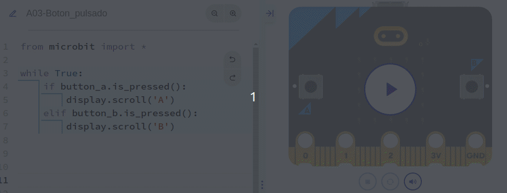
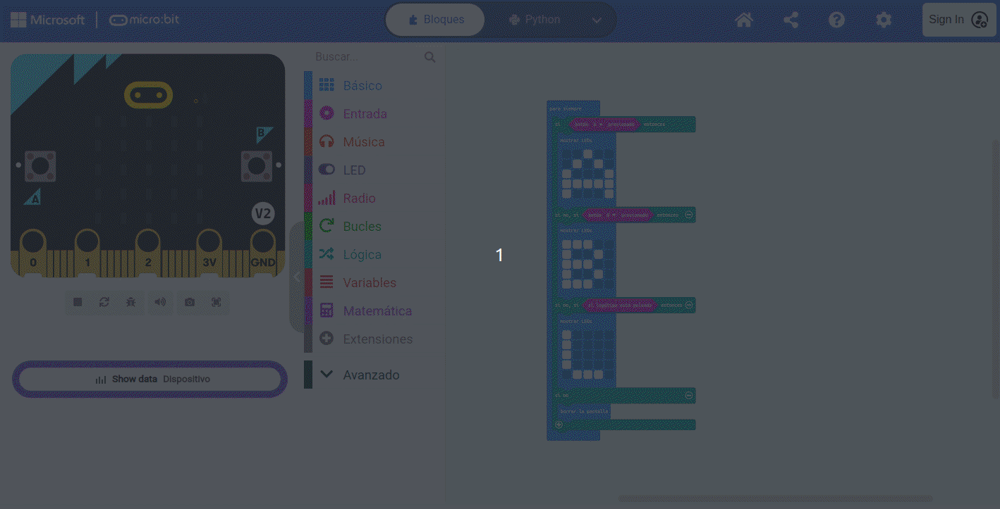
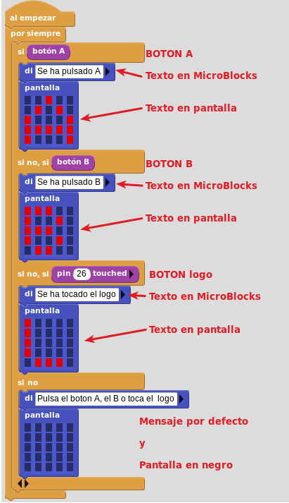

# A03. Botones on board
Los ejemplos vistos hasta ahora han permitido que la micro:bit nos muestre algo. Esto es lo que se conoce como salida. Ahora bien, es evidente que necesitamos también que la micro:bit reaccione a cosas externas, y estas cosas se denominan entradas. Para que sea fácil de recordar:

* **Salida** es lo que micro:bit nos muestra
* **Entrada** es lo que recibe la micro:bit para procesarlo

Aunque existen otros sistemas, por ahora nos vamos a centrar en los botones de la micro:bit. Si trabajamos con versiones anteriores a la V2 disponemos de dos botones etiquetados como A y B. Si trabajamos con alguna versión V2 disponemos además de un tercer botón, en este caso tactil, que está en el logo de la placa. En la imagen vemos estos botones.

  
*Botones en las micro:bit V1 y V2*

## **MicroPython**
El programa que vamos a crear como ejemplo nos va a mostrar en la pantalla el botón que estamos pulsando mientras lo mantengamos accionado.

El código del programa 'Boton_pulsado' es el siguiente:

~~~py
from microbit import *

while True:
    if button_a.is_pressed():
        display.scroll('A')
    elif button_b.is_pressed():
        display.scroll('B')
~~~

El funcionamiento lo vemos en la animación siguiente:

  
*Muestra 'Boton_pulsado' funcionando*

El programa lo podemos descargar de:

* [A03-Boton_pulsado en hexadecimal](../programas/upy/A03-Boton_pulsado.hex)
* [A03-Boton_pulsado en Python](../programas/upy/A03-Boton_pulsado-main.py)

## **MakeCode**
El programa que vamos a crear como ejemplo nos va a mostrar en la pantalla el botón que estamos pulsando mientras lo mantengamos accionado. El programa es el siguiente:

  

En la animación vemos el funcionamiento en el simulador.

  

*Funcionamiento del programa*

El programa lo podemos descargar de:

* [A03-boton_pulsado](../programas/makecode/microbit-A03-boton_pulsado.hex)

## **MicroBlocks**
El programa que vamos a crear como ejemplo nos va a mostrar en la pantalla el botón que estamos pulsando mientras lo mantengamos accionado. El programa es el siguiente:

  
*Programa de la actividad A03 en MicroBlocks*

El programa lo podemos descargar de:

* [A03-boton-pulsado.ubp](../programas/ublocks/A03-boton_pulsado.ubp)
