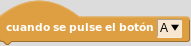
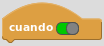
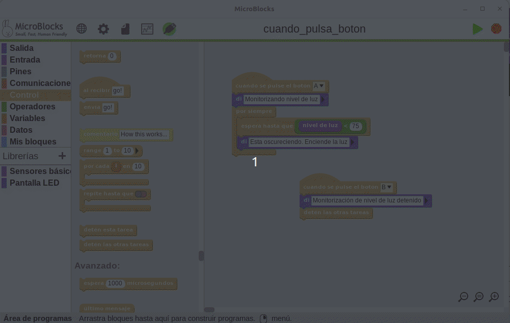

# <FONT COLOR=#8B008B>A03. Botones</font>
Los ejemplos vistos hasta ahora han permitido que la micro:bit nos muestre algo. Esto es lo que se conoce como salida. Ahora bien, es evidente que necesitamos también que la micro:bit reacciones a cosas externas, y estas cosas se denominan entradas. Para que sea fácil de recordar:

* **Salida** es lo que micro:bit nos muestra
* **Entrada** es lo que recibe la micro:bit para procesarlo

Aunque existen otros sistemas, por ahora nos vamos a centrar en los botones de la micro:bit. Si trabajamos con versiones anteriores a la V2 disponemos de dos botones etiquetados como A y B. Si trabajamos con alguna versión V2 disponemos además de un tercer botón, en este caso tactil, que está en el logo de la placa. En la imagen vemos estos botones.

<center>

  
*Botones en las micro:bit V1 y V2*

</center>

## <FONT COLOR=#007575>**MicroPython**</font>
Se explican los siguientes aspectos:

<FONT COLOR=#BB00FF><font size="5"><b>

* Sentencia condicional *if...else*
* Funciones en Python
* Módulos en Python
* Funciones definidas en MicroPython para los botones

</font color></font size></b>

### <FONT COLOR=#AA0000>Sentencia condicional *if...else*</font>
En Python hay tres formas de declaración de ```if...else```
>
1. Declaración ```if```
2. Declaración ```if...else```
3. Declaración ```if...elif...else```

1. Declaración ```if```. La sintaxix de esta declaración en Python tiene la forma siguiente:

~~~py
if condicion:
    # Cuerpo de la sentencia if

# Código después del if
~~~

Si el resultado de evaluar la condición es cierto (True o 1), el código en "Cuerpo de la sentencia if" y lo estará haciendo mientras se cumpla la condición.

En el momento que la condición sea evaluada como falsa (False o 0) el código en "Cuerpo de la sentencia if" se omite y  continua la ejecución del programa por "Código después del if". En la figura siguiente vemos la explicación de forma gráfica.

<center>

  
*Funcionamiento de la sentencia ```if```*

</center>

2. Declaración ```if...else```. Una sentencia ```if``` puede tener de manera opcional una clausula ```else```. La sintaxix de esta declaración en Python tiene la forma siguiente:

~~~py
if condicion:
    # Bloque de sentencias si condicion es True

    else:
    # Bloque de sentencias si condicion es False
~~~

La sentencia se evalúa de la siguiente forma: Si ```condición``` es ```True``` se ejecuta el código dentro del ```if``` y el código dentro del ```else``` se omite. Si ```condición``` es ```False``` se ejecuta el código dentro del ```else``` y el código dentro del ```if``` se omite. Cuando finaliza bien la parte del ```if``` o bien la del ```else``` el programa continua con la siguiente sentencia.

En la figura siguiente vemos la explicación de forma gráfica.

<center>

  
*Funcionamiento de la sentencia ```if...else```*

</center>

3. Declaración ```if...elif...else```. La sentencia ```if...else``` se utiliza para ejecutar un bloque de código entre dos alternativas posibles. Sin embargo, si necesitamos elegir entre más de dos alternativas, entonces utilizamos la sentencia ```if...elif...else```. La sintaxis de la sentencia ```if...elif...else``` es:

~~~py
if condicion_1:
    # Bloque 1
elif condicion_2:
    #Bloque 2

    else:
    # Bloque 3
~~~

Se evalúa así: Si ```condicion_1``` es ```True```, se ejecuta Bloque 1. Si ```condicion_1``` es ```False```, se evalúa ```condicion_2```. Si ```condicion_2``` es ```True```, se ejecuta Bloque 2. Si ```condicion_2``` es ```False```, se ejecuta Bloque 3.

En la figura siguiente vemos la explicación de forma gráfica.

<center>

  
*Funcionamiento de la sentencia ```if...elif...else```*

</center>

### <FONT COLOR=#AA0000>Funciones en Python</font>
En esta sección vamos a dar solamente una breve introducción a lo que son las funciones y los módulos en Python para estudiar dos funciones concretas definidas en MicroPhyton para micro:bit.

Una función es un bloque de código que realiza una tarea específica.

Supongamos que necesitas crear un programa para crear un círculo y colorearlo. Puedes crear dos funciones para resolver este problema:

* crear una función de círculo
* crear una función de color

Dividir un problema complejo en trozos más pequeños hace que nuestro programa sea fácil de entender y reutilizar.

Existen dos tipos de funciones en Python:

* **Standard library functions (Funciones de biblioteca estándar)**. Son funciones incorporadas en Python que están disponibles para su uso.
* **User-defined functions (Funciones definidas por el usuario)**. Podemos crear nuestras propias funciones para que cumplan con nuestros requisitos.

La sintaxis de una función es la siguiente:

~~~py
def nombre_funcion(argumentos):
    #Cuerpo de la función
    
    return
~~~

Donde,

* ```def``` es la palabra reservada para declarar una función
* ```nombre_funcion``` es el nombre que le damos a la función
* ```argumentos``` es el valor o valores pasados a la función
* ```return``` retorna un valor desde la función. Es opcional

Veamos un ejemplo sencillo que no manda parametros ni retorna nada.

~~~py
def saludo():
    print("Hola Mundo!")
    
saludo() #Llama a la función
print("Programa")
saludo()
print("Otra vez programa")
~~~
Va a generar como salida la cadena "Hola Mundo!" seguida de la cadena "Programa" seguida otra vez de "Hola Mundo!" y finaliza con "Otra vez programa".

Cuando se llama a la función, el control del programa pasa a la definición de la función, se ejecuta todo el código dentro de la función y despés el control del programa salta a la siguiente sentencia después de la llamada a la función.

Como ya se ha mencionado, una función también puede tener argumentos. Un argumento es un valor aceptado por una función. Cuando creamos una función con argumentos necesitamos pasar los correspondientes valores cuando la llamamos.

De forma genérica una función con argumentos tiene la siguiente sintaxis:

~~~py
def funcion(arg1, arg2, ar3,...):
    #Código

#Llamada a la función
funcion(valor1, valor2, valor3, ...)
#Código
~~~

Cuando llamamos a la función le pasamos los valores correspondiendo valor1 a arg1, valor2 a arg2 y así sucesivamente.

La llamada a la función se puede hacer mencionando el nombre del argumento, que es lo que se conoce como 'argumentos con nombre', siendo el código totalmente equivalente al anterior.

~~~py
funcion(arg1=valor1, arg2=valor2, arg3=valor3, ...)
~~~

Una función Python puede o no devolver un valor. Si queremos que nuestra función devuelva algún valor a una llamada realizada a función, utilizamos la sentencia ```return```.

En el ejemplo siguiente se llama a la función cuatro veces con valores diferentes.

~~~py
def cal_potencia(base, exponente):
    resultado = base ** exponente
    return resultado
    
#Llamadas a la función
print('Potencia =', cal_potencia(2,8))
print('Potencia =', cal_potencia(3,3))
print('Potencia =', cal_potencia(4,5))
print('Potencia =', cal_potencia(9,6))
~~~

El resultado es:

~~~py
Potencia = 256
Potencia = 27
Potencia = 1024
Potencia = 531441
~~~

En Python, las funciones de la biblioteca estándar son las funciones incorporadas que se pueden utilizar directamente en nuestro programa. Por ejemplo,

* ```print()```, imprime la cadena entre comillas
* ```sqrt()```, devuelve la raíz cuadrada de un número
* ```pow() ```, devuelve la potencia de un número

Estas funciones están definidas dentro de un módulo. Y, para utilizarlas debemos incluir dicho módulo en nuestro programa. Por ejemplo, ```sqrt()``` y ```pow()``` están definidos en el módulo ```math```. Para usar las funciones podemos hacer como en el ejemplo siguiente:

~~~py
import math #Carga el módulo math

raiz = math.sqrt(25)
print("La raiz cuadrada de 25 es ", raiz)

potencia = pow(2, 8)
print("2^8 =", potencia)
~~~

En el ejemplo la variable raiz contendrá el cálculo de la raiz cuadrada y se define por defecto como variable real o decimal y potencia contendrá el resultado de elevar a 8 el número 2. Los resultados obtenidos son:

~~~py
La raiz cuadrada de 25 es 5.0
2^8 = 256
~~~

Las principales ventajas de utilizar funciones son:

* **Código reutilizable**. Podemos llamar a la misma función tantas veces en nuestro programa como necesitemos, lo que hace que nuestro código sea reutilizable.
* **Código legible**. Las funciones nos ayudan a dividir nuestro código en trozos para que nuestro programa sea mas legible y fácil de entender.

### <FONT COLOR=#AA0000>Módulos en Python</font>
A medida que nuestro programa crece, puede contener muchas líneas de código. En lugar de poner todo en un solo archivo, podemos utilizar módulos para separar por funcionalidad los códigos en varios archivos. Esto hace que nuestro código quede organizado y sea más fácil de mantener.

Un módulo es un archivo que contiene código para realizar una tarea específica. Un módulo puede contener variables, funciones, clases, etc. Veamos un ejemplo, vamos a crear un módulo escribiendo algo como lo siguiente:

~~~py
#Definición del módulo suma

def sumar(a, b):

    resultado = a + b
    return resultado
~~~

Guardamos este programa en un archivo, por ejemplo ```modulo_sumar.py``` y tendremos definida una función de nombre ```sumar``` en ese módulo. La función recibe dos valores y devuelve la suma.

Cuando, en un programa diferente, queramos sumar dos números podemos importar la definición creada utilizando la palabra reservada ```import```. Para acceder a la función definida en el módulo tenemos que utilizar el operador ```.``` (punto). Se parece mucho a que el módulo es una clase y la función una instancia de esa clase.

~~~py
# Programa de sumas
import modulo_sumar

modulo_sumar.sumar(4, 5) #devolverá 9
~~~

Python tiene mas de 200 módulos estándar que pueden ser importados de la misma manera que importamos los módulos definidos por nosotros. En la documentación de Python en español encontramos la referencia a [La biblioteca estándar de Python](https://docs.python.org/es/3/library/index.html).

### <FONT COLOR=#AA0000>Los botones. Eventos</font>
Si trabajamos con versiones anteriores a V2 solamente disponemos de los botones A, B y A+B, pero si tenemos una versión V2 también disponemos del botón táctil incorporado en el logo, aunque a todos los efectos este se considera un pin de entrada.

El logo no es tratado exactamente como un botón, sino como un pin de nombre logo. En el borde existen otros tres pines, los 0, 1 y 2. Por ello la forma de trabajar con el logo va a ser un poco diferente, como veremos en la actividad A04.

La diferencia fundamental, ademas de la forma, es que el logo es un sensor capacitivo y los pines son sensores resistivos. En la práctica esto significa que el logo funciona simplemente tocandolo y los pines necesitan cerrar el circuito con GND, por lo que para que funcionen como pulsador debemos tocar tanto el pinto como GND.

Si queremos que MicroPython reaccione a los eventos de pulsación de los botones, debemos ponerlo en un bucle infinito y comprobar si el botón ```is_pressed```.

* **Función ```is_pressed()```**

Para trabajar con los botones de la micro:bit tenemos disponibles funciones que se han cargado al importar el módulo ```microbit```. Estas funciones están basadas en la función genérica ```is_pressed()``` pensada para saber que tecla de un teclado se ha pulsado. Sin embargo, en el caso de MicroPython a para micro:bit a estos botones se les ha asignado un nombre a cada uno, ```button_a``` para el A y  ```button_b``` para el B, de manera que para usarlos se llama al botón y con el operador ```.``` a la función ```is_pressed()```. Por ejemplo, ```button_a.is_pressed()``` es el código encargado de saber si estamos pulsando el botón A y ```button_b.is_pressed()``` si lo es el B.

* **Función ```get_pressed()```**

Esta función retorna el total acumulado de pulsaciones de botones y restablece este total a cero antes de volver. Es decir, podemos capturar el número de veces que hemos pulsado un botón. El valor de retorno es un número, por lo que, para mostrarlo en la pantalla de LEDs hay que convertirlo en cadena con la función ```str()```.

* **Función ```was_pressed()```**

Devuelve ```True``` o ```False``` para indicar si se ha presionado el botón desde la última vez que se inicio el dispositivo o se llamó a este método. Llamar a este método borra el estado de que ha sido pulsado, de modo que el botón debe pulsarse de nuevo antes de que este método vuelva a retornar ```True```.

Vamos a hacer un ejemplo que aclarará mejor lo explicado. Se trata de crear un programa (le podremos de nombre Caritas_X) en el que mientras mantegamos pulsado el botón A se muestra una cara sonriente, si no se pulsa ningún botón se muestra una cara triste y si se pulsa el botón B la cara desaparece (se apagan todos los LEDs) y tras 2 segundos aparece una X que se va haciendo cada vez mas grande partiendo del punto central. Finalmente pasados otros 2 segundos el programa vuelve a empezar. El código es:

~~~py
from microbit import *
while True:
    while True:
        if button_a.is_pressed():
            display.show(Image.HAPPY)
        elif button_b.is_pressed():
            break
        else:
            display.show(Image.SAD)

    display.clear()
    sleep(2000)
    mi_X_peque = Image("00000:00000:00900:00000:0000")
    display.show(mi_X_peque)
    sleep(200)
    mi_X_media = Image("00000:09090:00900:09090:0000")
    display.show(mi_X_media)
    sleep(200)
    mi_X_grande = Image("90009:09090:00900:09090:90009")
    display.show(mi_X_grande)
    sleep(2000)
~~~

En la animación siguiente vemos como funciona

<center>

  
*Funcionamiento de Caritas_X*

</center>

Si observamos con cuidado apreciaremos que en algún momento se accionan los botones A y B pero los que aparecen en la parte inferior, debajo de la pantalla de simulación. Están al lado de un logotipo que indica que se pulsen con una flechita. Justo debajo de estos aparecen los citados del borde de placa y el logo junto a ellos, pues es tratado asi, como un pin, y además a su izquierda hay un candado cerrado indicativo de que no se está usando ninguno de ellos. En la imagen siguiente se ve mejor lo indicado.

<center>

  
*Control de acciones del simulador*

</center>

Vamos a crear otro ejemplo en el que se cuenten las veces que pulsamos el botón A o el botón B durante un tiempo de 3 segundo. El programa es el siguiente:

~~~py
from microbit import *

sleep(3000) #Espera de 3 segundos

#Convertimos número a cadena con str()
pulsado = str(button_b.get_presses())

display.show(pulsado)

# Por si hemos pulsado mas de 9 veces
display.scroll(pulsado)
~~~

En la 'Referencia' del compilador, dentro de Botones tenemos un ejemplo que nos indica el botón que hemos pulsado con cuatro opciones posibles, el A, el B, A o B y finalmente A y B. Animamos a cargarlos y probarlos para familiarizarnos todo lo posible con ellos.

### <FONT COLOR=#AA0000>Programa</font>
El programa que vamos a crear como ejemplo nos va a mostrar en la pantalla el botón que estamos pulsando mientras lo mantengamos accionado.

El código del programa 'Boton_pulsado' es el siguiente:

~~~py
from microbit import *

while True:
    if button_a.is_pressed():
        display.scroll('A')
    elif button_b.is_pressed():
        display.scroll('B')
~~~

El funcionamiento lo vemos en la animación siguiente:

<center>

  
*Muestra 'Boton_pulsado' funcionando*

</center>

El programa lo podemos descargar de:

* [A03-Boton_pulsado en hexadecimal](../programas/upy/A03-Boton_pulsado.hex)
* [A03-Boton_pulsado en Python](../programas/upy/A03-Boton_pulsado-main.py)

## <FONT COLOR=#007575>**MakeCode**</font>
Se explican los siguientes aspectos:

<FONT COLOR=#BB00FF><font size="5"><b>

* Operadores de comparación y booleanos
* Sentencia condicional *if...elif...else*
* Texto
* Bloques de 'Entrada' para los botones

</font color></font size></b>

### <FONT COLOR=#AA0000>Operadores de comparación y booleanos</font>
Como sabemos un valor booleano solamente puede tomar uno de dos valores posibles: ```True (verdadero)``` o ```False (falso)```. Estos bloques los encontramos en la entrada 'Lógica' y son:

<center>

  
*Valores booleanos*

</center>

Los dos bloques existen de forma separada, pero cada uno de ellos puede adoptar el valor contrario al que muestra por defecto seleccionandolo con la flechita.

Los operadores booleanos u operadores lógicos son AND, OR y NOT y son operadores que a partir de valores de entrada booleanos crean otro valor también booleano. Estos bloques también los encontramos en la entrada 'Lógica' y son:

<center>

  
*Operadores booleanos*

</center>

A continuación vemos una serie de bloques con operadores que satisfacen la condición.

<center>

  
*Operadores booleanos*

</center>

Tanto los valores booleanos como los operadores se usan con instrucciones ```if``` o ```while``` para determinar qué código se ejecutará a continuación. Por ejemplo:

<center>

  
*Bucle ```while``` con una condición*

</center>

En el siguiente ejemplo se utilizan operadores booleanos en el bucle.

<center>

  
*Bucle ```while``` con una condición y operadores booleanos*

</center>

### <FONT COLOR=#AA0000>Sentencia condicional *if...elif...else*</font>

* **```if```**. Ejecuta código dependiendo de si una condición booleana es verdadera o falsa. El código dentro del bloque ```if``` sólo se ejecuta cuando el bloque ```condición``` es verdadero.

<center>

  
*Condicional ```if```*

</center>

Se pueden comparar variables con valores o variables con variables, para una condición verdadera o falsa.

* **```else```**. Si necesitamos que se ejecute algún otro código cuando la condición del ```if``` no sea verdadera, lo ponemos en un área de bloque adicional llamada ```else``` (si no).

<center>

  
*Condicional ```if...else```*

</center>

Un condicional como el siguiente se podría leer como: "``si`` tengo dinero por encima de una cantidad, ```entonces``` estoy feliz y ```si no``` estoy triste.

<center>

  
*Condicional ```if...else```*

</center>

Cambiando el valor asignado a dinero vemos el funcionamiento.

La clausula ```else``` se añade al condicional ```if``` haciendo clic en el signo '+'.

* **```if...else if```**. Condición ```if``` que si resulta falsa se evalua una nueva condición puesta en ```elif```. Otra acción condicional es añadir un ```if``` a un ```else``` para obtener un ```else if```. Funciona así

<center>

  
*Condicional ```if...else if```*

</center>

Hacemos clic en el símbolo más '+' para añadir secciones ```else``` o ```else if``` al bloque ```if``` actual.

### <FONT COLOR=#AA0000>Texto</font>
Si expandimos el menú 'Avanzado' nos encontraremos con una entrada 'Texto' que vamos a describir en esta actividad.

*  Una letra, palabra o línea de texto que puede contener letras, números y caracteres.
*  Devuelve el número de caracteres de la cadena de texto.
*  Añade una cadena de texto a otra para crear una cadena mas larga. Se pueden añadir mas cadenas.
*  Convierte un texto que sólo tiene caracteres numéricos en un valor numérico de coma flotante. Se puede convertir una cadena de texto con caracteres numéricos en un valor real de coma flotante. El texto debe tener sólo caracteres numéricos. Aunque también puede incluir los símbolos '-' y '.'. Si el texto tiene otros caracteres, como "-5.8g5u7", sólo se devuelve -5.8 ya que es el mejor intento de conversión a un número. Por lo tanto, hay que no mezclar caracteres numéricos con letras u otros símbolos.

**Potencias de 10**. Si la cadena de texto tiene la letra 'e' después de los caracteres numéricos y luego algunos caracteres numéricos más como "2e4", entonces los caracteres numéricos después de la 'e' son un exponente de 10. Esto significa que una cadena con "7.5e2" se convierte en el valor de 750 cuando se convierte a un número de coma flotante. Esto se debe a que el 2 después de la 'e' indica 10², lo que equivale a ```10 * 10 =  100```. El valor resultante es entonces 7.5 * 100 que es igual a 750. En el siguiente ejemplo se toman los primeros dígitos de PI de la frase "pi vale 3.141592" y los convierte en un número.

<center>

  
*Extraer PI de una cadena*

</center>

[Descargar el programa](../ejemplos/microbit-PI.hex)

*  Divide una cadena en cadenas más pequeñas utilizando un caracter (una cadena) de separación para dividir la cadena más grande.
*  Determina si una cadena contiene los caracteres de una cadena especificada.
*  Obtiene la posición (índice) de la primera aparición de un valor especificado en una cadena.
*  Determina si una cadena de texto contiene caracteres o no. TODO
*  Toma una parte de la cadena "this" para hacer una cadena más pequeña (subcadena). * Si una cadena tiene una parte que está copiada de otra cadena, se llama subcadena. Se puede crear una nueva cadena que sólo contenga la palabra "aquí" a partir de una cadena mayor que diga "¡Hola, estamos aquí!". Para ello, la subcadena se copia desde la posición de carácter 15 en la primera cadena y se copian 4 caracteres. Se hace así: . En el ejemplo se copian los sustantivos de la frase en dos cadenas más pequeñas.

<center>

  
*Extraer de cade a subcadenas*

</center>

[Descargar el programa](../ejemplos/microbit-subcadenas_de_cadena.hex)

*  Se comparan dos cadenas de texto en función de los caracteres que aparecen en primer lugar. Dos cadenas se comparan en función del orden de sus caracteres. Si la cadena "A" vale "111" será menor que una cadena con "512". Una cadena con "Everything (Todo)" es menor que "Nothing (Nada)" porque la 'N' viene después de la 'E' en el alfabeto. La cadena "abcdefg" es mayor que "abcdefa". Son casi iguales, pero la última letra de la segunda cadena es menor que la última letra de la primera. Esto hace que toda la segunda cadena se compare como menor. En bloques, la comparación de estas cadenas tiene el siguiente aspecto:

<center>

  
*Comparar cadenas*

</center>

*  Obtiene un carácter (letra, número o símbolo) de un lugar de la cadena de texto. Podemos averiguar qué carácter se encuentra en cualquier lugar de un texto. Puedes tener un texto que diga "Hello there!". El carácter en la posición 6 es 't'. La palabra "Hello" más el espacio tienen las posiciones 0 - 5, así que, 't' está en la posición 6. Para obtener el carácter en esta posición, la letra 't', se podría usar un bloque como este:

<center>

  
*Extraer caracter de una cadena*

</center>

*  Convierte el valor de cualquier tipo de dato a una cadena de texto. El siguiente ejemplo convierte un valor booleano y un valor numérico en cadenas y las une en una cadena o frase.

<center>

  
*Convertir valores booleanos y numéricos en cadena*

</center>

[Descargar el programa](../ejemplos/microbit-convertir_a_cadena.hex)

*  Hacer que una cadena de un caracter sea representada a partir del código numérico que le asignemos. Al igual que el código ASCII es un juego de caracteres que asigna un valor a cada uno de ellos, nosotros podemos crear nuestro propio código asignándole un código con este bloque. Por ejemplo, hacer que la letra B sea: 

### <FONT COLOR=#AA0000>Bloques de 'Entrada' para los botones</font>
Cuando presionamos los botones A y/o B ocurre un evento (se ha presionado un botón). Este tipo de acción se considera una entrada a la microbit y tenemos bloques para manejarlo.

* **al presionar el botón**

Presionar un botón inicia un manejador de eventos, que es una parte del programa que se ejecutará cuando ocurra algo, como por ejemplo,  cuando se pulsa un botón. Este manejador funciona cuando se pulsa el botón A o B, o A y B al mismo tiempo.Cuando estemos utilizando esta función en un navegador, pulsaremos los botones de la pantalla en lugar de los del micro:bit.

* Para el botón **A** o **B**: Este manejador de evento funciona cuando el botón se pulsa y se suelta en menos de un segundo.
* Para **A** y **B** juntos: Este manejador funciona cuando A y B son presionados simultanemente. Disponemos de un segundo y medio desde que pulsamos el primer botón hasta que pulsamos el segúndo para que se consideren ambos pulsados a la vez.

<center>

  
*Bloque 'Al presionar el botón...'*

</center>

En el siguiente ejemplo se cuenta cuántas veces se pulsa el botón A. Cada vez que se pulsa el botón, la pantalla LED muestra la variable de recuento que cada vez será mayor.

<center>


*Contar pulsaciones de A*

</center>

[Descargar el programa](../ejemplos/microbit-cuenta_puls_A.hex)

En el ejemplo siguiente se simula un dado mostrando un número del 1 al 6 cuando pulsamos el botón B. En el programa se utiliza el bloque de generación de número aleatorios entre dos valores dados que podemos encontrar en el menú 'Matemáticas'.

<center>


*Dado*

</center>

[Descargar el programa](../ejemplos/microbit-dado_B.hex)

* **botón A o B presionado**

El bloque siguiente comprueba si se está pulsando un botón en ese momento.

<center>


*Se ha presionado el botón*

</center>

Un sencillo ejemplo nos aclara como funciona el bloque.

<center>


*Botón A presionado*

</center>

[Descargar el programa](../ejemplos/microbit-pulsado_A.hex)

* **al pulsar el logotipo <font color=#FF0000> (solo en versiones V2)</font color>**

El logo de **micro:bit V2** actúa como un botón táctil, por lo que es un actuador de entrada que cuando lo pulsamos (tocamos) se ejecuta su código y cuando lo soltamos (no lo tocamos) deja de hacerlo.

<center>


*Botón táctil*

</center>

El bloque funciona solamente con micro:bit V2 y si lo usamos con una placa V1 nos generará el código de error **927** en la pantalla.

* **el logotipo está pulsado <font color=#FF0000> (solo en versiones V2)</font color>**

Comprueba si se está pulsando el logotipo de micro:bit. Utilizamos el valor booleano del estado de la pulsación del logo para tomar una decisión lógica en el programa. 

El ejemplo muestra una u otra imagen en función de si se ha pulsado el logo o no.

<center>


*Logo presionado*

</center>

[Descargar el programa](../ejemplos/microbit-pulsado_logo.hex)

### <FONT COLOR=#AA0000>Programa</font>
El programa que vamos a crear como ejemplo nos va a mostrar en la pantalla el botón que estamos pulsando mientras lo mantengamos accionado. El programa es el siguiente:

<center>

  

</center>

En la animación vemos el funcionamiento en el simulador.

<center>

  

*Funcionamiento del programa*

</center>

El programa lo podemos descargar de:

* [A03-boton_pulsado](../programas/makecode/microbit-A03-boton_pulsado.hex)

## <FONT COLOR=#007575>**MicroBlocks**</font>
Se explican los siguientes aspectos:

<FONT COLOR=#BB00FF><font size="5"><b>

* Operadores
* Bloques de control
* Bloques de 'Entrada' para los botones

</font color></font size></b>

### <FONT COLOR=#AA0000>Operadores</font>
Los operadores aún no vistos son:

<center>


*Operadores aritméticos, de comparación y booleanos*

</center>

Los operadores aritméticos y de comparación no requieren de mayor explicación por lo que nos vamos a centrar en los booleanos.

*  Operador booleano ```True``` o ```False```. Devuelve verdadero o falso en función de la posición del selector, o de la evaluación binaria de la expresión utilizada como entrada. Este bloque se usa dentro de muchos otros bloques, donde se utiliza para controlar el flujo de las ejecuciones y eventos.

El bloque ```if``` es un buen ejemplo para demostrar el uso del bloque verdadero/falso.

<center>


*Uso sencillo del operador ```True/False```*

</center>

[Descargar el programa](../ejemplos/verdadero_falso.ubp)

El código del ejemplo se ejecuta de dos maneras diferentes siempre dentro de un bucle infinito en el que se genera un número aleatorio que puede valer 1, 2 o 3:

* La primera es la condición de la rama ```IF``` que será verdadera si el número generado es 1.
* La segunda es la rama ```ELSE IF``` que se evalúa si la condición del ```IF``` no es verdadera y se pone a verdadero, ejecutando su código.
* La tercera es la condición ```ELSE``` a la que nunca se llega porque si el número vale 1 se ejecuta el ```IF``` y si no se ejecuta el ```ELSE IF``` que siempre es cierto. Es decir, aunque se genere ```variable = 3``` la condición ```ELSE``` no se ejecuta.

*  Invierte el valor lógico asociado a la expresión sobre la que opera. Tal y como se muestra, ```NOT``` devolverá ```FALSE``` si el deslizador se establece en ```TRUE```, y ```TRUE``` si se establece en ```FALSE```.

En el ejemplo siguiente, una variable llamada ```cadena``` se inicializa como "MicroBlocks es genial", y una variable llamada ```expresion``` se inicializa en ```TRUE``` de una forma peculiar, diciendo que algo es igual a si mismo. Cuando se aplica ```NOT``` al resultado de la expresión de igualdad, se cambia a ```FALSE```.

<center>


*Uso sencillo del operador ```NOT```*

</center>

[Descargar el programa](../ejemplos/not.ubp)

*   Devuelve verdadero sólo si todas sus entradas son verdadero y devuelve falso en caso contrario. Como ambas condiciones tienen que ser verdaderas para obtener un resultado verdadero, si se detecta un falso en la primera condición, no es necesario evaluar la segunda; se devuelve falso inmediatamente.

En el ejemplo tenemos dos variables ```salir``` y ```llueve``` que se inicializan a verdadero. Se muestran una serie de mensajes y al final se evalúa si "necesito un paraguas" comprobando si es voy a salir y si llueve. Ambas condiciones tienen que ser verdaderas para que necesitemos un paraguas. Podemos cambiar el estado de las variables y comprobar lo que ocurre.

<center>


*Uso sencillo del operador ```AND```*

</center>

[Descargar el programa](../ejemplos/and.ubp)

*   Devuelve verdadero si uno o ambos operandos son verdaderos y devuelve falso en caso contrario. Similar a ```AND``` pero opuesto a él, aquí sólo una de las dos condiciones tiene que ser verdadera para un resultado verdadero. Por lo tanto, si la primera condición es verdadera, no es necesario comprobar la segunda.

En el ejemplo estamos generando aleatoriamente dos números en el rango de 1 a 5. A continuación, comprobamos si alguno de los dos números es igual al número que estamos buscando (3). El bloque ```OR``` se utiliza para verificar el resultado de la comparación.

<center>


*Uso sencillo del operador ```OR```*

</center>

[Descargar el programa](../ejemplos/or.ubp)

Cada vez que pulsemos en 'Iniciar' se genera un nuevo resultado.

### <FONT COLOR=#AA0000>Bloques de control</font>

*   Los bloques en este bloque de sombrero se ejecutan cuando se pulsan los botones A, B, o A+B. Se dispara una vez por cada pulsación de botón. Si se mantiene pulsado el botón, no se vuelve a disparar hasta que se suelta el botón y se vuelve a pulsar. Por ejemplo, cuando se pulsa el botón A aparece en pantalla una A.

<center>


*cuando se pulsa el botón*

</center>

*   El bloque ```IF``` comprueba la condición booleana y ejecuta los bloques de una sola vez si la condición booleana se evalúa como verdadera. El triángulo negro permite la expansión del bloque ```IF``` con múltiples condiciones ```ELSE IF``` añadidas. En caso de que las ramas ```IF``` o ```ELSE IF``` anteriores no sean verdaderas, entonces se evalúan y ejecutan sucesivamente cada una de las siguientes ```ELSE IF```.

En el ejemplo, a la variable ```aleatorio``` se le asigna un número al azar entre el 1 y el 10. La operación MOD se utiliza para sondear el estado par/impar del número. Si el resto de la operación num dividido por 2 da como resultado 0, el número es par, en caso contrario es impar.

<center>


*Sentencia ```IF```*

</center>

[Descargar el programa](../ejemplos/if_else.ubp)

Cada vez que pulsemos en 'Iniciar' se genera un nuevo resultado.

*   El bloque 'cuando' comprueba repetidamente una condición booleana. Cuando la condición se convierte en verdadera, se ejecutan los bloques bajo el sombrero. Si la condición sigue siendo verdadera al final de la ejecución, entonces los bloques se ejecutarán de nuevo, y ese proceso se repite hasta que la condición se convierte en falsa.

Nota: El sombrero 'cuando' incluye una espera de 10 milisegundos entre ciclos. Esto es útil para eliminar ruido en las entradas, por ejemplo rebotes en los botones, pero limita el rendimiento a un máximo de 100 iteraciones/segundo.

Vamos a ver el mismo ejemplo que en el bloque ```IF``` pero utilizando este bloque. Los tres bloques del tipo ```WHEN``` empiezan a funcionar simultáneamente cuando se pulsa el icono ```START```. El bloque 'por siempre' debajo de 'al empezar' genera un número aleatorio cada segundo. Y de forma simultanea los otros dos bloques evaluan continuamente sus condiciones mostrando el resultado que corresponde a cada uno.

<center>


*Bloque 'cuando'*

</center>

[Descargar el programa](../ejemplos/cuando.ubp)

*   Este bloque de control pausa la ejecución del programa y espera hasta que la condición booleana especificada se convierta en verdadera. Se puede utilizar para sincronizar bloques de código que se ejecutan en paralelo, basándose en los eventos monitorizados.

En este ejemplo, el nivel de luz ambiental se controla mediante el sensor de luz integrado. El sensor de luz tiene un rango de 0-255, siendo 0 oscuridad total y 255 claridad máxima. Cuando se inicia el programa, ambos bloques 'cuando se pulse el boton' comienzan a ejecutarse y a comprobar el estado del botón.

Al pulsar el botón A, se inicia la monitorización de la luz y el programa espera hasta que los sensores de la micro:bit informen de un nivel de luz < 75. Cuando esa condición se cumple, se emite una alerta para avisar de que hay que encender las luces.

El botón B está programado para detener el proceso de monitorización. Al pulsarlo, detiene la ejecución de esa rama del programa.

<center>



*Bloque 'cuando se pulsa el boton'*

</center>

[Descargar el programa](../ejemplos/cuando_pulsa_boton.ubp)

El bloque 'nivel de luz' se encuentra en la libreria 'Sensores básicos' y el bloque 'deten las otras tareas' se explica un poco mas abajo.

*   El bloque ```RETURN``` se utiliza para devolver el valor especificado en su área de entrada. El valor retornado puede ser cualquier tipo de dato. Aunque es posible utilizar el bloque ```RETURN``` en cualquier parte de un programa para mostrar un valor, de forma similar al bloque ```di```, su uso correcto y más común es en una función (o bloque personalizado) para devolver un valor como resultado del proceso realizado. Hay que tener en cuenta que los bloques colocados después del bloque ```RETURN``` no se ejecutarán.

*   Este bloque tipo C es un bucle que se utiliza para ejecutar los bloques colocados dentro de él, hasta que la condición booleana especificada se convierte en verdadera. En ese momento, se ejecutará el siguiente bloque después del bloque en forma de C.

En el ejemplo vemos como se monitoriza si se ha pulsado el botón A enviando un mensaje 

<center>


*Bloque 'repetir hasta que'*

</center>

*   Este bloque, y su par relacionado , se utilizan para controlar el hilo de ejecución del programa. Este bloque detiene la ejecución de todos los bloques de los que forma parte, o que están bajo el mismo bloque sombrero. Una vez ejecutado este bloque en un grupo de bloques, no se ejecutará nada más en ese grupo.

En el ejemplo, el grupo de bloques de la derecha está en un bucle continuo que cuenta hacia atrás y decrementa su variable local ```numero```. El grupo de bloques de la izquierda también está en un bucle continuo, contando hacia abajo y decrementando su variable local ```numero```. Cuando la cuenta atrás alcanza el valor 7 se cumple la condición del ```else if``` y se detiene la cuenta del bloque derecho, mientras que la secuencia del bloque izquierdo continua su ejecución hasta que se cumpla la condición del ```if``` que será cuando se alcance el número 2, momento en que se detiene esta tarea.

Podemos comprobar como el último bloque ```di``` de la secuencia de la izquierda **NUNCA** se ejecuta porque una vez que el bloque 'deten esta tarea' se ejecuta, todas las actividades de este bloque izquierdo terminan.

<center>


*Bloques 'deten esta tarea' y 'deten las otras tareas'*

</center>

Podemos observar como desaparece el marco verde de cada bloque cuando su tarea finaliza indicando precisamente eso, que el bloque no se está ejecutando.

[Descargar el programa](../ejemplos/deten_tareas.ubp)

### <FONT COLOR=#AA0000>Bloques de 'Entrada' para los botones</font>

*  y   Devuelve el estado del botón A o B. ```true``` = pulsado y ```false``` = no pulsado.
*  equivalente al bloque  cuando lo configuramos con el pin 26, que es el correspondiente al logotipo .  Devuelve el estado del logo. ```true``` si lo tocamos (equivale a pulsador A o B pulsado) y ```false``` cuando no lo tocamos. Estos bloques están disponibles dentro la 'Libreria' 'Sensores[ ]' y aparece como 'Touch (microbit)'. El bloque para configurar el número de pin tiene su sentido en la existencia de sensores táctiles en el borde de placa, como veremos mas adelante.

En el ejemplo vemos como chequear el estado de los botones mediante la sentencia ```IF```.

<center>


*Bloques para chequear el estado de los botones*

</center>

[Descargar el programa](../ejemplos/chequeo_botones.ubp)

### <FONT COLOR=#AA0000>Programa</font>
El programa que vamos a crear como ejemplo nos va a mostrar en la pantalla el botón que estamos pulsando mientras lo mantengamos accionado. El programa es el siguiente:

<center>

  
*Programa de la actividad A03 en MicroBlocks*

</center>

El programa lo podemos descargar de:

* [A03-boton-pulsado.ubp](../programas/ublocks/A03-boton_pulsado.ubp)