# Pines de entrada/salida
En el borde inferior de la BBC micro:bit hay unos pads (tiras o pines) de color dorado, metálicos que constituyen los pines de entrada/salida (E/S para abreviar).

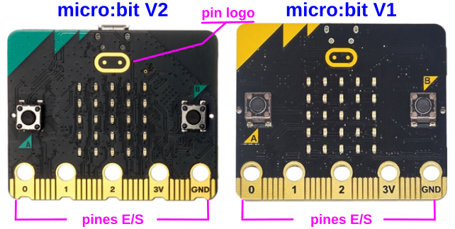  
*Pines de E/S para las micro:bit versiones V1 y V2*

Como podemos observar, las patillas serigrafiadas (0, 1, 2, 3V y GND) son más grandes que las otras. Esto se hace así para poder sujetar en las mismas cables con pinzas de cocodrilo. Para poder acceder al resto de patillas será necesario conectar una placa de extensión de conectores al dispositivo micro:bit, y así hacer posible la conexión de cables a esos pines más pequeños. Describiremos estas placas mas adelante en este apartado

En la micro:bit V2 el logo también se puede utilizar como entrada táctil, es decir, es un pin de entrada, en concreto el 26.

## **Información técnica**
Fuente: [Edge Connector & micro:bit pinout](https://tech.microbit.org/hardware/edgeconnector/#microbitpinoutxyz).

El conector de borde del micro:bit se utiliza para conectar circuitos y componentes externos.

Hay en total 25 pads o pines que incluyen 5 orificios para usar con conectores tipo banana de 4mm o pinzas de cocodrilo. Tres de estos pines son para E/S de propósito general y también pueden ser entradas analógicas, PWM y sensores táctiles, estándo dos de ellas conectadas a la fuente de alimentación de micro:bit.

Las tiras más pequeñas están distanciadas a 1,27 mm (50 mils) en el conector de borde y algunas están utilizadas por la micro:bit, mientras que otras quedan libres para su utilización.

Aunque los pines están en ambas caras realmente sólo los de la cara frontal están conectados a señales. Los agujeros si conectan ambas caras entre si pero no así los pines mas delgados.

### Pines del conector de borde
La imagen siguiente muestra la asignación de los pines de la micro:bit para ambas versiones de placa. En las placas V2, el pin 9 ya no se comparte con la pantalla LED. Aunque la característica está dfesactivada por defecto, los pines 8 y 9 pueden configurarse para NFC (Near-field communication) o comunicación de campo cercano, que es una tecnología de comunicación inalámbrica, de corto alcance y alta frecuencia que permite el intercambio de datos entre dispositivos. Esto es lo que se conoce como comunicaciones por radio en placas micro:bit.

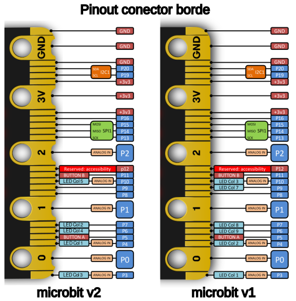  
*Pinout micro:bit V2 y V1*

Hay disponible un recurso externo fantástico para obtener más información sobre los pines de la micro:bit y cómo los utilizan algunos accesorios, se trata de [microbit.pinout.xyz](https://microbit.pinout.xyz/).

En la imagen siguiente se muestran mas datos sobre cada uno de los pines del conector de borde de la micro:bit V1.

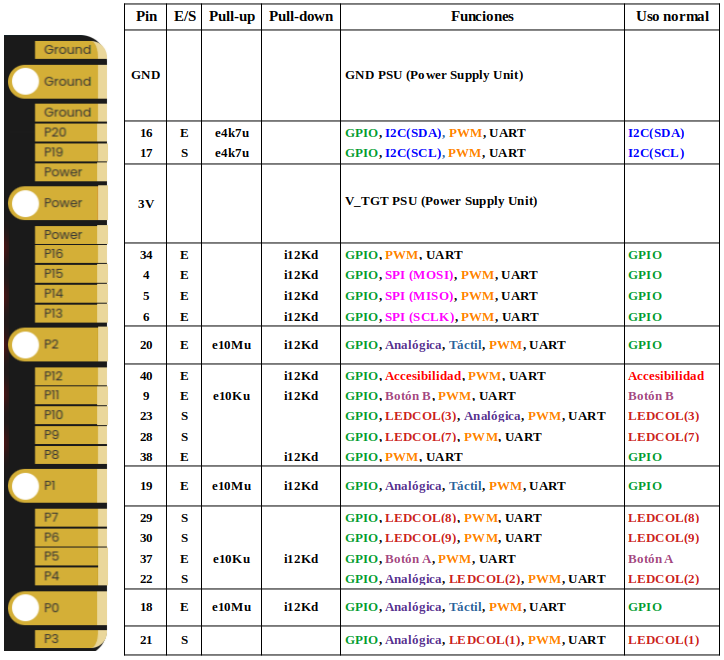  
*Información de pines micro:bit V1*

En la imagen siguiente se muestran mas datos sobre cada uno de los pines del conector de borde de la micro:bit V2.

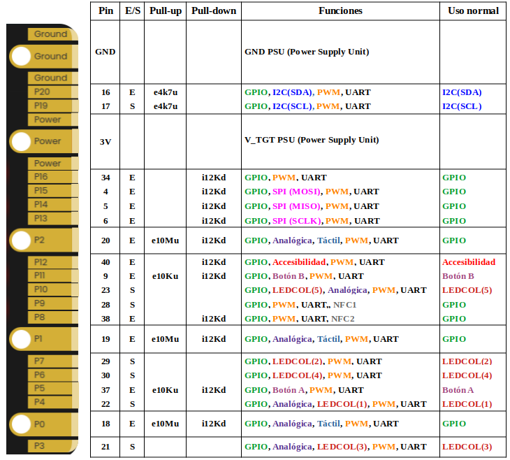  
*Información de pines micro:bit V2*

Las siguientes **notas** están referidas a las dos figuras anteriores:

* Las resistencias de pull-up o pull-down se especifican, por ejemplo como e10Mu que significa: externa de 10Mohm en pullup o bien i12Kd, que significa: interna de 12K en pulldown.

En las figuras del borde de placa se espcifican los valores y tipos de resistencia disponibles en el caso de micro:bit.

* Los anillos para 0, 1, 2, 3V y GND también están conectados a los respectivos anillos de la parte posterior del conector de borde.
* Los anillos de 3V y GND tienen unos pines protectores a ambos lados de los mas grandes, para evitar cualquier degradación del rendimiento del dispositivo debido al deslizamiento de las conexiones de las pinzas de cocodrilo. Se debe tener precaución en los anillos 0, 1 y 2 para evitar cortocircuitar las pinzas de cocodrilo con los pines adyacentes.
* Los pines de entrada digital están configurados por defecto con resistencias pull down internas.
* El pin marcado como Accesibilidad se utiliza para activar/desactivar el modo de acceso a configuraciones de fábrica y no debe ser utilizado para otra cosa, a pesar de que puede ser utilizado como un GPIO para pruebas.
* En cuanto a la alimentación de la placa existe un punto clave a tener en cuenta, que son los dos diodos BAT60A que hay, uno de la alimentación de 3,3V del chip de interface y otro del conector de la batería externa. Hay que tener en cuenta que el anillo de 3V en el conector de borde es V_TGT, que significa que está conectado al suministro en bruto proporcionado a todos los chips de la placa.

### Cambiar la funcionalidad por defecto

* pines P3, P4, P6, P7, P9, P10

Estos pines están dedicados a la pantalla matriz de LEDs, y también a su modo asociado de detección de luz ambiental. Para desactivar la función de controlador de pantalla (que automáticamente desactivará la función de detección de luz) se invoca a la función ***'display.enable(false)'***. Para volver a activar el controlador de pantalla, se invoca a la función ***'display.enable(true)'***.

* pines P5, P11

Estos pines están asignados a los dos botones A y B de la placa. En su configuración por defecto con todos los lenguajes de alto nivel estándar, hay una instancia uBit global que contiene: ***uBit.buttonA***, ***uBit.buttonB*** y ***uBit.buttonAB***.

Los botones están conectados con al temporizador del sistema en su construcción. Sin embargo, si necesitamos eliminar completamente esta característica y utilizar los pines físicos para otros fines, se pueden eliminar ***uBit.buttonA*** llamando al destructor de C++. Hay que tener en cuenta, sin embargo, que hay resistencias pull-up externas de 10K instaladas en la placa micro:bit.

* pines P19, P20

Estos pines están asignados al bus I2C, que es utilizado tanto por el sensor de movimiento integrado. Se recomienda evitar el uso de estos pines para cualquier función que no sea I2C.

### Alimentación
A la micro:bit se le puede suministrar alimentación por:

* USB a través del chip de interface que incorpora su propio regulador en la placa.
* Una batería conectada al conector tipo JST que está junto al botón de reset.
* Los pines de 3V y GND en el conector de borde.
* Los dos pads ovalados (rectangulares redondeados) en la parte posterior derecha de la placa.
* La micro:bit puede suministrar alimentación desde los pines 3V y GND a pequeños circuitos externos.

Es importante respetar los parámetros máximos para los que está diseñada la placa:

* Cuando se alimenta desde USB, el chip de interface de la placa, en V1 la versión (KL26) utiliza su regulador para proporcionar la energía, y este chip puede entregar como máximo 120mA.
* El consumo de corriente de la placa variará en función del uso de la pantalla, el Bluetooth, el micrófono, el altavoz y otros periféricos. En el peor de los casos, tenemos que prever una demanda de 30 mA cuando se utilizan todos los periféricos integrados, dejando para el conector de borde 90 mA en el caso de V1 y 270 mA en el de V2.
* Cuando se alimenta desde una batería, el chip KL no interviene y el LED indicador de USB no se ilumina.
* Se utiliza un diodo de baja tensión directa o Vf para conmutar entre fuentes. El diodo evita la retroalimentación de cualquier fuente desde otra fuente, lo que significa que se puede tener un cable USB y un pack de baterías conectados simultáneamente.

El rango de tensiones de alimentación depende de la versión concreta, vienen impuestas por la circuitería que utilizan, y son:

* Variantes de V1.3: 1.95V min y 3.6V max
* Variantes de V1.5: 1.8V min y 3.6V max
* Revisión V2.00: 1.7V min y 3.6V max
* Revisión V2.2x: 1.7V min y 3.6V max

A continuación se dan algunos detalles prácticos sobre alimentación por USB:

* Cuando alimentamos desde USB V1 entrega los 3.3V a través de un regulador integrado en la interface. La última revisión de V2 utiliza un regulador separado.
* Para tener un margen de seguridad adecuado, en placas V1 no debemos superar los 90 mA de consumo mientras que en V2, al tener su propio regulador, podemos alcanzar los 190 mA. Si necesitamos corriente mayores podemos retroalimentar la micro:bit a partir de los pads 3V y GND, pero asegurando que la alimentación es regulada y utilizando un diodo de protección. Para esto no se recomienda el uso de baterias USB ya que pueden generar tensiones fuera del rango permitido y dañar a la micro:bit.

En el caso de alimentación con baterias:

* Cuando se alimenta desde una batería conectada al JST, el chip de interface y el de sistema en la versión V1 no se encienden. En la micro:bit V2 la energía de la batería pasa a través del regulador y alimenta también el chip de interface. Si la placa micro:bit no está en modo reposo, el LED rojo (a la izquierda del conector USB) debería estar encendido.
* Una batería LiPo de una celda completamente cargada está especificada para entregar 4,2V **Esto es más de los 3,6V máximos indicados**.

La micro:bit puede ser alimentada desde los pads 3V/GND del conector de borde. También hay dos pads en la parte derecha de la cara posterior de la PCB que se pueden utilizar para suministrar energía, por ejemplo, desde un soporte con pilas 2xAAA o 2XAA que podemos soldar en esos pads. En la imagen se destacan estos pads.

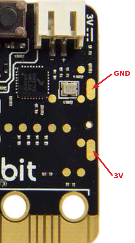  
*Extension board de Freenove*

## **MicroPython**
En MicroPython, cada pin en la BBC micro:bit está representado por un objeto llamado pinN, donde N es el número del pin.

Por ejemplo, para usar el pin etiquetado 0 (cero), puedes usar el objeto llamado pin0 en tu script. El pin del logo V2 utiliza pin_logo.

Estos objetos tienen varios métodos asociados dependiendo de lo que el pin específico es capaz de hacer, por ejemplo, leer, escribir o tocar.

Quizá lo mas sencillo que podemos hacer es comprobar que los pines 0, 1 y 2 del borde de placa son táctiles. Haremos como ejemplo que al tocar cualquiera de ellos la micro:bit sonria y si no se toca ningúno que esté triste. Le hacemos cosquillas a la micro:bit. El programa es:

~~~py
from microbit import *
"""
pin0.set_touch_mode(pin0.CAPACITIVE)
pin1.set_touch_mode(pin0.CAPACITIVE)
pin2.set_touch_mode(pin0.CAPACITIVE)
"""
while True:
    if (pin0.is_touched() or pin1.is_touched() or pin2.is_touched()):
        display.show(Image.HAPPY)
    else:
        display.show(Image.SAD)
~~~

En la animación vemos el funcionamiento del programa.

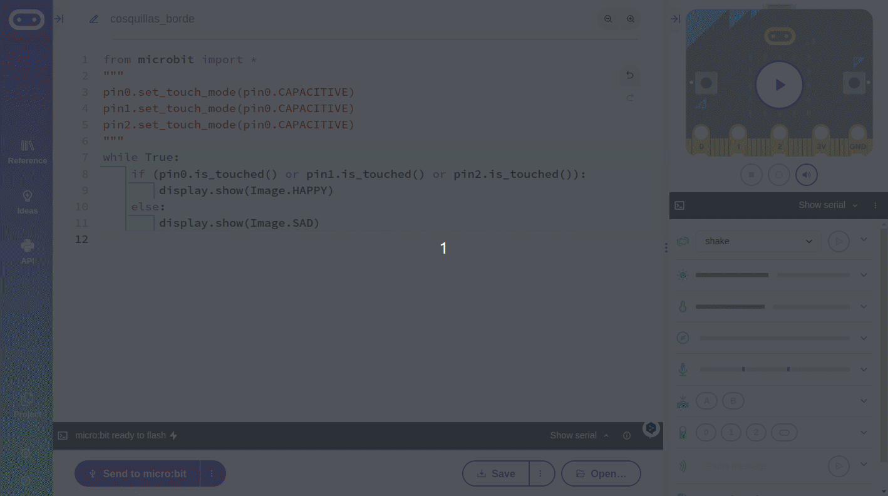  
*Pines táctiles en el borde de placa*

Si descargamos firmware en una placa para probar el programa debemos saber que no basta con tocar alguno de los pines con una mano, hay que tocarlo simultaneamente con la otra mano en GND para cerrar el circuito eléctrico.

En la última versión de micro:bit V2 es posible cambiar el comportamiento predeterminado de la patilla, de modo que no sea necesario tocar GND. En los programas siguientes el código que hace esto está comentado por lo que si queremos probarlo debemos eliminar esos comentarios. Recordemos que por defecto los pines del conector de borde son sensores táctiles resistivos mientras que el pin logo V2 es capacitivo.

* [Descargar el programa .hex](../ejemplos/cosquillas_borde.hex)
* [Descargar el programa .py](../ejemplos/cosquillas_borde-main.py)

### Circuito
Los diodos LEDs no deben conectarse directamente a la fuente de alimentación, sino con una resistencia en serie que se calcula como hemos visto. No hacerlo suele acabar con el componente dañado de manera irreversible.

Al realizar el **conexionado**, es conveniente **desconectar** todas las **fuentes de alimentación** y, a continuación, montar el circuito según el esquema concreto. La placa micro:bit no se puede insertar al revés.

El positivo del LED o ánodo (patilla larga) debe conectarse a la resistencia (el otro extremo va al positivo de alimentación), mientras que su polo negativo o cátodo (patilla corta) debe ir a GND. Una vez construido el circuito y verificado que es correcto, utilizamos el cable USB para conectar la micro:bit al ordenador y así alimentar el circuito.

El esquema del circuito a montar lo vemos a continuación.

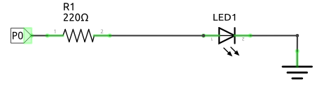  
*Esquema de montaje de una LED*

Un sencillo cáculo del valor de la resistencia es el siguiente:

$R_{red} = \dfrac{3.3 - 1.5}{15mA} = \dfrac{1.8V}{15mA}=0.12K = 120 \Omega \sim 220 \Omega$

Se adopta un valor de resitencia de 220 ohmios para mayor seguridad.

El conexionado deberá parecerse al siguiente:

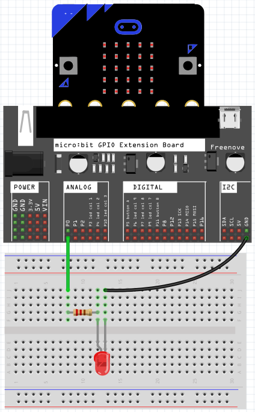  
*Conexionado real del esquema de montaje de una LED*

### Programa
El programa para el circuito anterior va a consistir en hacer parpadear al LED a intervalos de un segundo.

Se trata de un programa muy simple pero que requiere un montaje externo que ya no podremos ver como funciona en el simulador del programa. Así que toca realizar montaje, conectar la micro:bit a una extension board y probar en la práctica. El programa es:

~~~py
from microbit import *

while True:
    pin0.write_digital(1)
    sleep(1000)
    pin0.write_digital(0)
    sleep(1000)
~~~

El programa lo podemos descargar de:

* [A04-parpadeo .hex](../programas/upy/A04-parpadeo.hex)
* [A04-parpadeo .py](../programas/upy/A04-parpadeo-main.py)

Vamos a realizar una ampliación del programa aplicando los conocimientos de PWM y de bucles. Se trata de hacer que el diodo LED se encienda y se apague de manera progresiva realizando una escritura analógica del valor PWM del pin P0 (0 a 255). Para ello utilizaremos dos bucles for, uno con cuenta ascendente de 0 a 255 y otro con cuenta descendente también de 0 a 255. El programa es:

~~~py
from microbit import *

while True:
    for i in range(255):
        pin0.write_analog(i)
        sleep(10)
    #bucle decreciente: 
        #se antepone al rango reversed
    for j in reversed(range(255)):
        pin0.write_analog(j)
        sleep(10)
~~~

El programa lo podemos descargar de:

* [A04-Encendido y apagado por PWM .hex](../programas/upy/A04-Encendio_apagado_PWM.hex)
* [A04-Encendido y apagado por PWM .py](../programas/upy/A04-Encendio_apagado_PWM-main.py)

## **MakeCode**
Para hacer el ejemplo de parpadeo de un LED externo utilizamos el mismo circuito que el visto en Python. El programa es el siguiente:

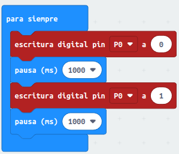  
*Programa pardeo de LED externo*

El programa lo podemos descargar de:

* [A04-parpadeo](../programas/makecode/microbit-A04-parpadeo.hex)

Realizamos la ampliación del programa controlando el encendido y apagado progresivo por PWM.

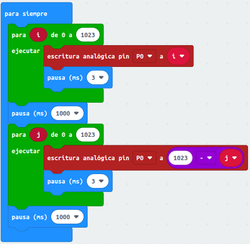  
*Programa pardeo de LED externo*

Dos cosas a observar:

1. El contador hacia atrás se realiza restando al valor inicial de cuenta la variable en un bucle de 0 a xx
2. Como hemos establecido el valor máximo posible analógico como límite, el retardo lo hemos puesto de 3ms para que tarde aproximadamente 3 segundos (3ms x 1023 = 3069ms = 3,069s) en realizar la cuenta (o decontaje) completo.

El programa lo podemos descargar de:

* [A04-parpadeo PWM](../programas/makecode/microbit-A04-parpadeo_PWM.hex)

Resulta interesante observar el funcionamiento del programa en el simulador, donde se aprecia a la perfección tanto la cuenta ascendente como la descendente. En la animación lo vemos.

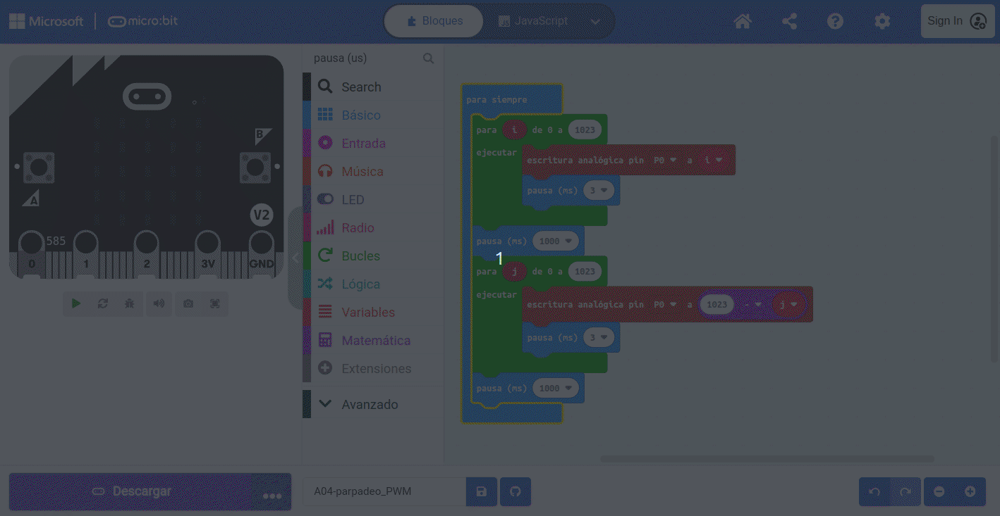  
*Simulación del programa pardeo de LED externo*

## **MicroBlocks**
SPara hacer el ejemplo de parpadeo de un LED externo utilizamos el mismo circuito que el visto en Python. El programa es el siguiente:

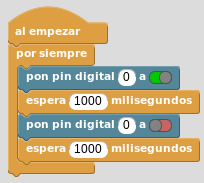  
*Programa pardeo de LED externo*

El programa lo podemos descargar de:

* [A04-parpadeo](../programas/ublocks/A04-parpadeo.ubp)

Realizamos la ampliación del programa de la misma forma que en MakeCode.

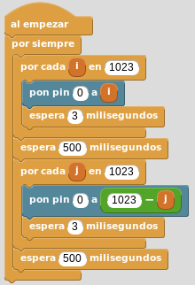  
*Programa pardeo de LED externo*

En este caso también tenemos dos cosas a observar:

1. El contador hacia atrás se realiza restando al valor inicial de cuenta la variable en un bucle de 0 a xx
2. Como hemos establecido el valor máximo posible analógico como límite, el retardo lo hemos puesto de 3ms para que tarde aproximadamente 3 segundos (3ms x 1023 = 3069ms = 3,069s) en realizar la cuenta (o decontaje) completo.

El programa lo podemos descargar de:

* [A04-parpadeo PWM](../programas/ublocks/A04-parpadeo_PWM.ubp)
