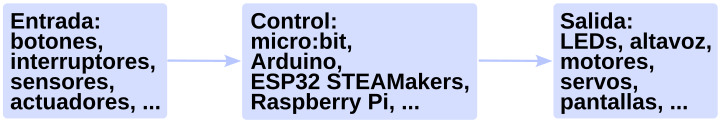
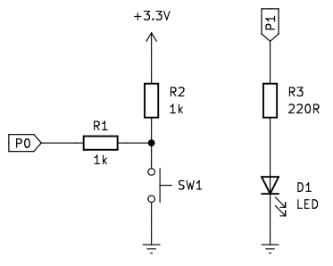
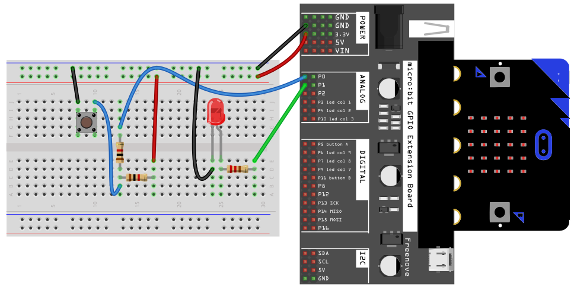
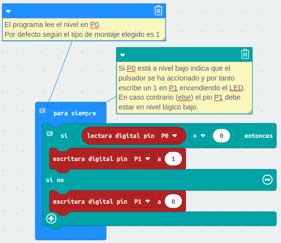
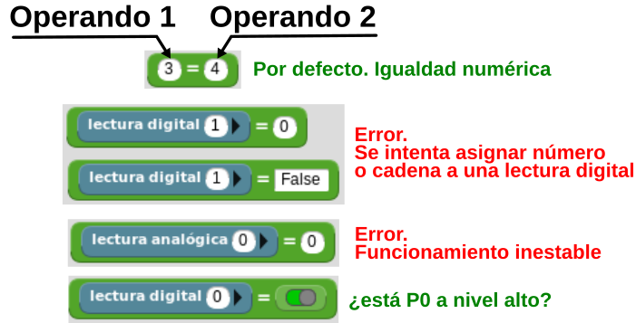
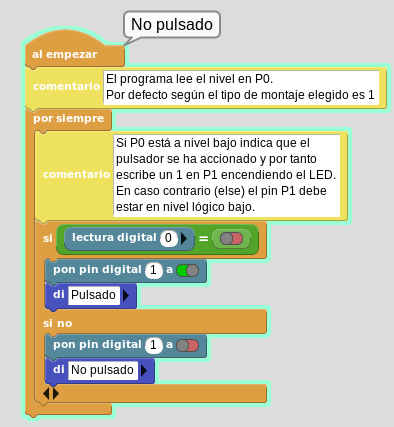
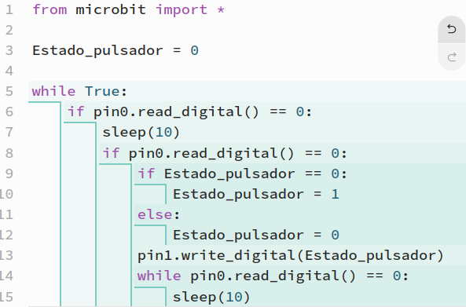
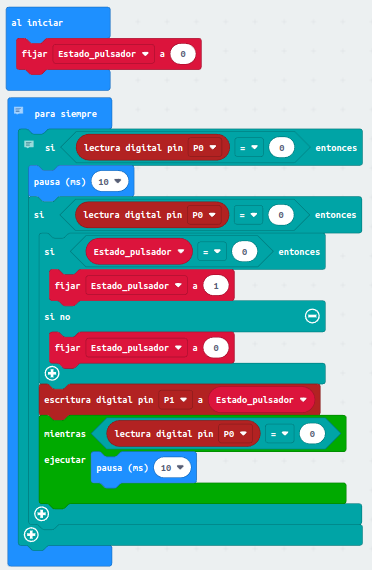
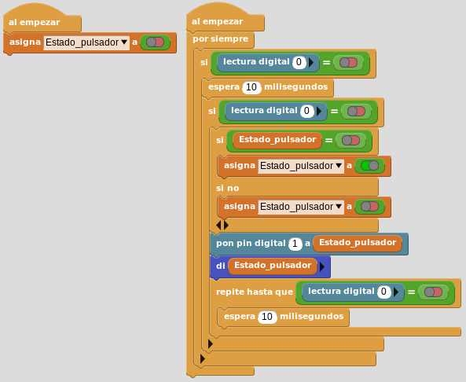

# <FONT COLOR=#8B008B>Botón pulsador</font>
En esta actividad vamos a realizar el control de un diodo LED externo mediante un pulsador también externo. Este circuito, aunque sencillo, es lo que se conoce como sistema de control y lo vamos a definir en este momento.

Lo mas simple como sistema de control automático es considerar que tiene tres partes esenciales que se denominan: Entrada, Salida y Control. Hasta ahora hemos estado utilizando dos de ellos, como sistema de control la micro:bit y como sistema de salida el LED. En la práctica lo habitual es que algún dispositivo detecte variables del entorno, que el sistema de control detecte los cambios y decida la acción que tiene que realizar con la salida. Si consideramos a estas tres partes como cajas que contienen los elementos de cada uno de ellos, un diagrama en bloques de un primer sistema de control automático es:

<center>

  
*Diagrama de un sistema de control automático*

</center>

## <FONT COLOR=#007575>**Circuito**</font>
Como elemento de entrada vamos a utilizar un pulsador, lo que nos obliga a escoger uno de los dos circuitos posibles para obtener una señal de control a partir del mismo. Vamos a trabajar escogiendo el que por defecto nos entrega un nivel alto y cuando pulsamos un nivel bajo y lo vamos a conectar al pin P0 que actuará como entrada. Vamos a realizar un pequeño cambio respecto al circuito genérico visto y es que vamos a colocar una resistencia en serie con el pin P0, para de esta forma no conectar el pin directamente a GND cuando accionemos el pulsador. El circuito de salida es el del diodo LED que lo conectaremos en el pin P1.

<center>

  
*Esquematico del circuito*

</center>

El montaje puede ser similar al siguiente:

<center>

  
*Montaje del circuito*

</center>

## <FONT COLOR=#007575>**MicroPython**</font>
El programa es el siguiente:

~~~py
from microbit import *

while True:
    #Estado_boton = pin0.read_digital()
    #if Estado_boton == 0:
    if pin0.read_digital() == 0:
        pin1.write_digital(1)
    else:
        pin1.write_digital(0)
~~~

Se han puesto las dos líneas comentadas porque quizá sea la forma mas apropiada de hacer lo que se hace en la línea ```if pin0.read_digital() == 0:```, es decir asignar a variable el estado del pin y preguntar por el estado de la variable. El programa funciona exactamente igual como está que si lo cambiamos a este otro:

~~~py
from microbit import *

while True:
    Estado_boton = pin0.read_digital()
    if Estado_boton == 0:
    #if pin0.read_digital() == 0:
        pin1.write_digital(1)
    else:
        pin1.write_digital(0)
~~~

El programa lo podemos descargar de:

* [A05-pulsador_LED](../programas/upy/A05-pulsador_LED.hex)
* [A05-pulsador_LED](../programas/upy/A05-pulsador_LED-main.py)

## <FONT COLOR=#007575>**MakeCode**</font>
El programa es el siguiente:

<center>

  
*A05-pulsador_LED*

</center>

Aunque es bastante sencillo se ha explicado paso a paso en los comentarios.

El programa lo podemos descargar de:

* [A05-pulsador_LED](../programas/makecode/microbit-A05-pulsador_LED.hex)

## <FONT COLOR=#007575>**MicroBlocks**</font>
Antres de nada vamos a repasar brevemente el funcionamiento del operador de igualdad. Al contrario que en otros programas en MicroBlocks no se dintingue un operador de asignación (=) y un operador condicional de igualdad (==), sino que se hace en función de los datos de los operandos del operador. En la imagen siguiente se expone lo que es correcto y lo que no.

<center>

  
*Operador =*

</center>

El programa funcionando tiene el siguiente aspecto:

<center>

  
*A05-pulsador_LED*

</center>

El programa lo podemos descargar de:

* [A05-pulsador_LED](../programas/ublocks/A05-pulsador_LED.ubp)

## <FONT COLOR=#007575>**Ampliación de la actividad**</font>
Antes de nada vamos a indicar que solamente se aportan las soluciones de forma gráfica, quedando como propuesta la actividad de crear los programas reales en cada aplicación, montar el circuito y realizar la comprobación del funcionamiento.

El circuito utilizado en esta actividad es perfecto para crear un programa que tenga en cuenta la eliminación de rebotes en pulsadores. De paso también servirá como una forma de ver en que consiste la tarea de anidar sentencias condicionales.

Los componentes y circuitos utilizados son los mismos que antes, pero va mos a establecer un funcionamiento diferente: Partiendo de la situación inicial del LED apagado, cada vez que pulsemos el botón el LED cambiará su estado, encendiendose si estaba apagado o apagandose si estaba encendido. De esta forma la acción del interruptor ya no es momentánea (como un pulsador normal), sino que permanece en uno de los estados sin necesidad de pulsar continuamente sobre el mismo. El funcionamiento es bastante clásico para muchas aplicaciones, como encender/apagar una lámpara. Ver el funcionamiento del programa mas abajo, después de las soluciones.

### <FONT COLOR=#AA0000>Solución MicroPython</font>

<center>

  
*A05_ampliación-Interruptor para lámpara*

</center>

### <FONT COLOR=#AA0000>Solución MakeCode</font>

<center>

  
*A05_ampliación-Interruptor para lámpara*

</center>

### <FONT COLOR=#AA0000>Solución MicroBlocks</font>

<center>

  
*A05_ampliación-Interruptor para lámpara*

</center>

## <FONT COLOR=#007575>**Funcionamiento del programa**</font>
Recordemos que el estado de la salida del circuito del pulsador con este en reposo es alto, por lo que detectar si se ha pulsado es comprobar si se ha puesto a estado bajo. El funcionamiento del programa es el siguiente:

* **Primer if**. Cuando el programa detecta que se pulsa el botón por primera vez, se establece un retardo de 10 ms para detectar si se vuelve a pulsar. Esto se hace con el fin de saltarse los rebotes de la pulsación.
* **Segundi if**. Si transcurridos los 10 ms se sigue detectando el botón como pulsado ya podemos considerar de forma estable que el botón ha sido pulsado. En caso contrario, se considerará como un rebote y el programa dejará de detectar.
* **Tercer if**. Cuando se determina que la tecla está pulsada, se cambia el valor de la variable, que se utiliza para guardar el estado del LED. Tras cambiar el estado de la variable se realiza la escritura en P1 con su nuevo valor.
* **While**. Si se cumple la condición es que hemos dejado de accionar el pulsador por lo que se mientras se cumpla la condición se genera un retardo de 10 ms para eliminar el retardo de liberación del pulsador.
primero eliminará el rebote del botón.