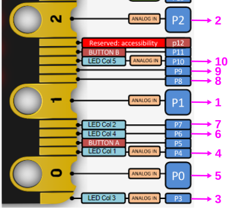
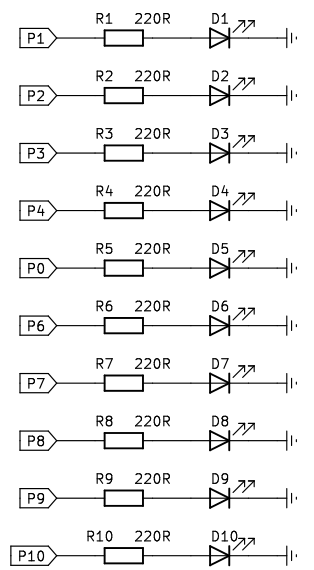
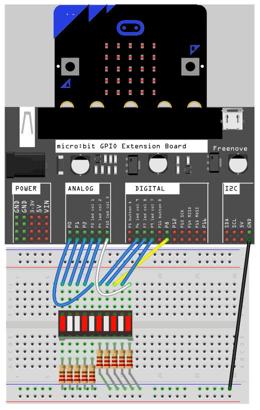
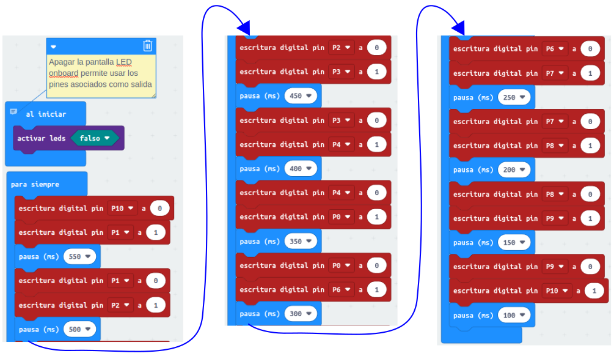
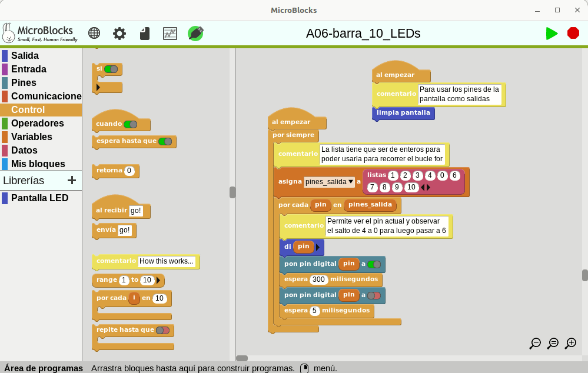

# <FONT COLOR=#8B008B>Matriz de de barras de LEDs</font>
Vamos a hacer un proyecto sencillo que haga que los LEDs se enciendan y apaguen simulando un desplazamiento del LED encendido. Jugaremos un poco con el valor de los retardos para dar sensación de aceleración.

Lo primero que tenemos que hacer es recurrir al pinout del borde de placa y realizar una asignación de pines de borde a cada diodo y así saber en que orden trabajar con los mismos. Esto nos permitirá, en el caso de Python y MicroBlocks, crear una lista con los pines de borde de placa elegidos y ordenados como nos interese. En el caso de MakeCode lo haremos de manera manual. En la imagen vemos el orden asignado.

<center>

  
*Asignación de pines a diodos de la barra de LEDs*

</center>

## <FONT COLOR=#007575>**Circuito**</font>
El esquema del circuito que tenemos que montar con esa asignación de pines es:

<center>

  
*Esquema del circuito*

</center>

El montaje en protoboard tendrá un aspecto similar al siguiente.

<center>

  
*Montaje del circuito*

</center>

## <FONT COLOR=#007575>**MicroPython**</font>
El código es:

~~~py
from microbit import *

#Permite usar los pines de pantalla como entradas externas
display.off() 

#Creamos la lista de pines reasignando el 5 a pin0
pines_salida =[pin1,pin2,pin3,pin4,pin0,pin6,pin7,pin8,pin9,pin10]

while True:
    for pin in pines_salida:
        pin.write_digital(1)
        sleep(150)
        pin.write_digital(0)
        sleep(5)
~~~

El programa lo podemos descargar de:

* [A06-barra_10_LEDs](../programas/upy/A06-barra_10_LEDs.hex)
* [A06-barra_10_LEDs](../programas/upy/A06-barra_10_LEDs-main.py)

## <FONT COLOR=#007575>**MakeCode**</font>
El programa lo hemos dividido en tres sectores para ponerlo en horizontal y que se vea en una sola imagen. El bloque 'activar led' hay que ponerlo en ```False``` para poder utilizar como pines de salida los que están asignados por defecto a los LEDs de la pantalla. El pin P5 se ha asignado a P0 porque en P5 está el botón A de la placa y por tanto es una entrada.

<center>

  
*LED que se desplaza con barra de 10 LEDs*

</center>

El programa lo podemos descargar de:

* [microbit-A06-barra_10_LEDs](../programas/makecode/microbit-A06-barra_10_LEDs.hex)

## <FONT COLOR=#007575>**MicroBlocks**</font>
En la animación vemos el programa funcionando.

<center>

  
*LED que se desplaza con barra de 10 LEDs*

</center>

El programa lo podemos descargar de:

* [A06-barra_10_LEDs](../programas/ublocks/A06-barra_10_LEDs.ubp)
