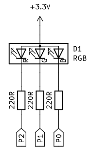
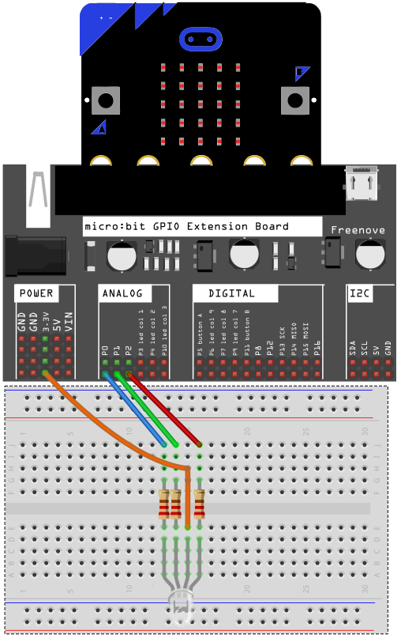
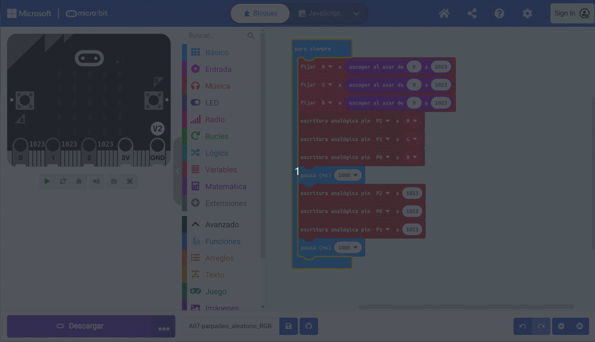
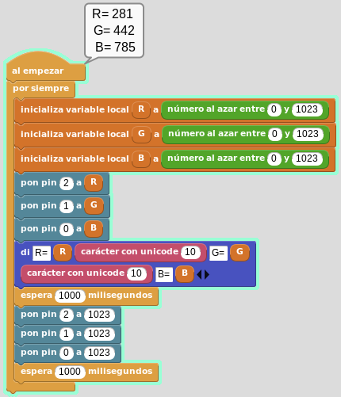

# Diodo LED RGB
Utilizaremos un LED RGB de ánodo común para desarrollar la actividad, lo que significa que los LED se iluminarán cuando llevemos el pin de cada color a GND y tengamos el ánodo a 3.3V. La actividad va a consistir en hacer que el LED parpadee a intervalos de un segundo entre un color aleatorio y estar apagado.

## **Circuito**
El esquema del circuito que vamos a utilizar es el siguiente:

  
*Esquema del circuito*

Los pines van a trabajar como pines de salida analógicos.

¿Hay que colocar una resistencia para cada diodo? La respuesta es que SI, porque internamente son tres diodos individuales que lo único que tienen en común es el encapsulado y que se han unidos sus ánodos en un solo pin.

El montaje a realizar es el siguiente:

  
*Montaje del circuito*

## **MicroPython**
El código del programa es:

~~~py
from microbit import *

#Importamos módulo random
import random

while True:
    #Generamos RGB aleatorio
    R=random.randint(0,1023)
    G=random.randint(0,1023)
    B=random.randint(0,1023)

    #Escribe RGB aleatorio en pines
    pin2.write_analog(R)
    pin1.write_analog(G)
    pin0.write_analog(B)
    sleep(1000)

    #Apaga los tres LED
    pin2.write_analog(1023)
    pin1.write_analog(1023)
    pin0.write_analog(1023)
    sleep(1000)
~~~

El programa lo podemos descargar de:

* [A07-parpadeo_aleatorio_RGB](../programas/upy/A07-parpadeo_aleatorio_RGB.hex)
* [A07-parpadeo_aleatorio_RGB](../programas/upy/A07-parpadeo_aleatorio_RGB-main.py)

## **MakeCode**
En la animación tenemos una captura del programa y del simulador, donde podemos apreciar como cambian los números aleatorios cada segundo y como también como todos los pines toman el valor máximo que equivale a LED apagado.

*Parpadeo color aleatorio LED RGB*

El programa lo podemos descargar de:

* [A07-parpadeo_aleatorio_RGB](../programas/makecode/microbit-A07-parpadeo_aleatorio_RGB.hex)

## **MicroBlocks**
En la imagren vemos el programa en un instante de su funcionamiento.

*Parpadeo color aleatorio LED RGB*

El programa lo podemos descargar de:

* [A07-parpadeo_aleatorio_RGB](../programas/ublocks/A07-parpadeo_aleatorio_RGB.ubp)
