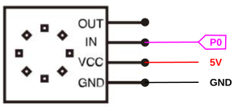
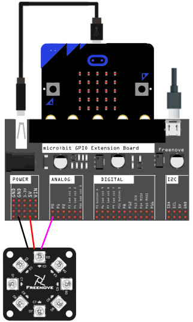
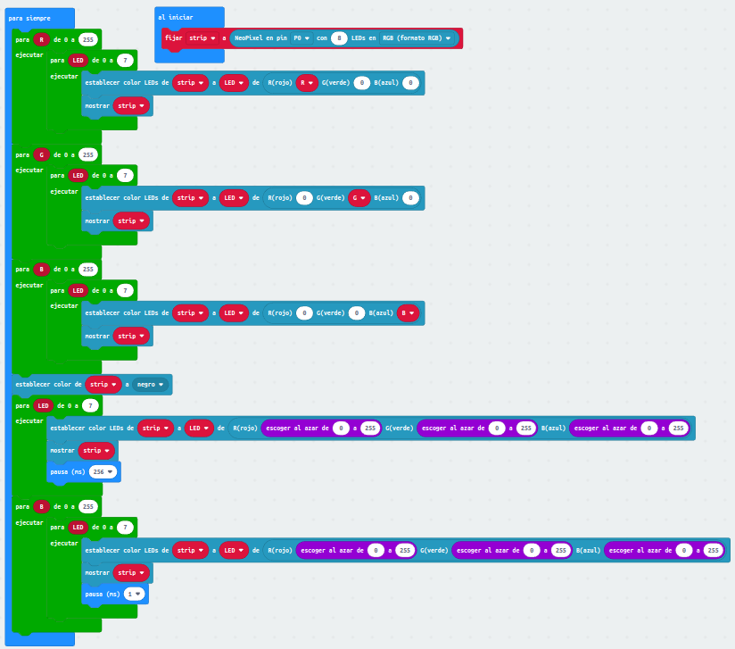
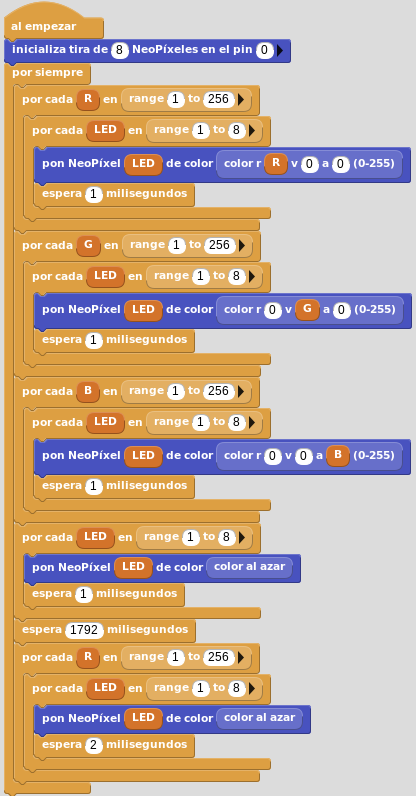

# Diodos LEDs RGB direccionables
En el apartado correspondiente de teoría se han visto muchos ejemplos para MakeCode, vamos a trabajar con un ejemplo sencillo en los tres programas que estamos viendo.

La actividad va a consistir en encender, progresivamente el tono del color, los 8 LED en los colors base RGB, después hacer que se enciendan uno a uno en un color aleatorio y finalemente hacer que cambien de color de forma aleatoria durante un tiempo.

## **Circuito**
El esquema del circuito que vamos a utilizar es el siguiente:

  
*Esquema del circuito*

El montaje a realizar es el siguiente:

  
*Montaje del circuito*

## **MicroPython**
El programa es el siguiente:

~~~py
from microbit import *
import neopixel
from random import randint

# Configuramos los Neopixel en pin0 y tira de 8 pixeles
neo = neopixel.NeoPixel(pin0, 8)
num_pixel = 0

while True:

    #Iteramos el color rojo
    for rojo in range(0,255):
        for num_pixel in range(0, len(neo)):
            neo[num_pixel] = (rojo,0,0)
            sleep(1/1000) #retardo de 1us
            neo.show()

    #Iteramos el color verde
    for verde in range(0,255):
        for num_pixel in range(0, len(neo)):
            neo[num_pixel] = (0,verde,0)
            sleep(1/1000)
            neo.show()

    #Iteramos el color azul
    for azul in range(0,255):
        for num_pixel in range(0, len(neo)):
            neo[num_pixel] = (0,0,azul)
            sleep(1/1000)
            neo.show()

    #Iteramos sobre cada LED con color aleatorio
    neo.clear()
    for num_pixel in range(0, len(neo)):
        R = randint(0, 255)
        G = randint(0, 255)
        B = randint(0, 255)
        neo[num_pixel] = (R,G,B)
        sleep(500)
        neo.show()   
        
  #Iteramos todos los LEDs con un color diferente y aleatorio para cada uno
    neo.clear()
    for color in range(0,255):
        for num_pixel in range(0, len(neo)):
            R = randint(0, color)
            G = randint(0, color)
            B = randint(0, color)
            neo[num_pixel] = (R,G,B)
            sleep(1)
            neo.show()
~~~

El programa lo podemos descargar de:

* [A08-Neopixels_python](../programas/upy/A08-Neopixels_python.hex)
* [A08-Neopixels_python](../programas/upy/A08-Neopixels_python-main.py)

## **MakeCode**
El programa es el siguiente:

  
*Trabajo con Neopixels*

El programa lo podemos descargar de:

* [A08-Neopixels](../programas/makecode/microbit-A08-Neopixels.hex)

## **MicroBlocks**
Aspecto del programa en MicroBlocks:

  
*A08-Neopixels*

El programa lo podemos descargar de:

* [A08-Neopixels](../programas/ublocks/A08-Neopixels.ubp)
