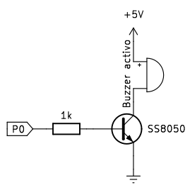
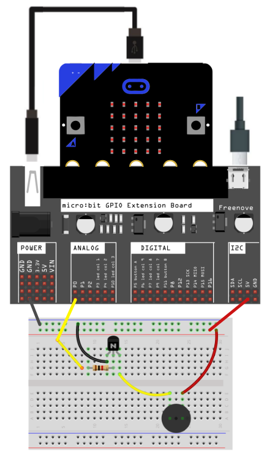
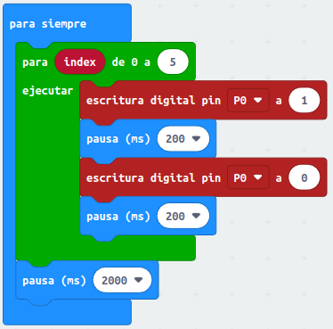
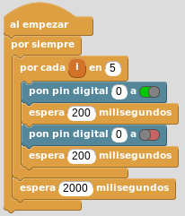
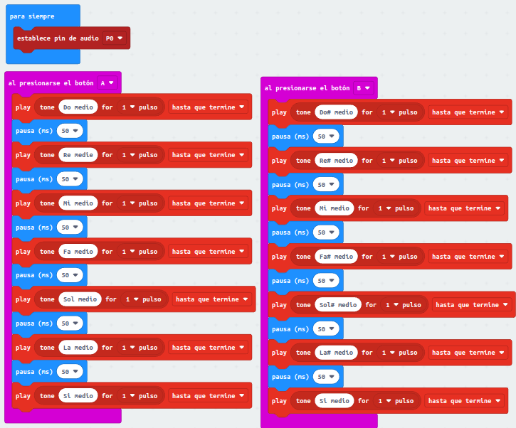
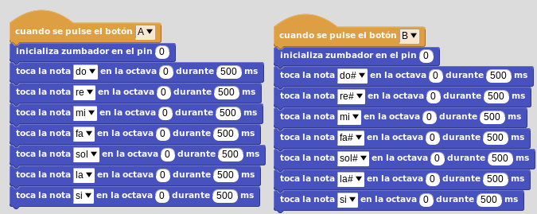
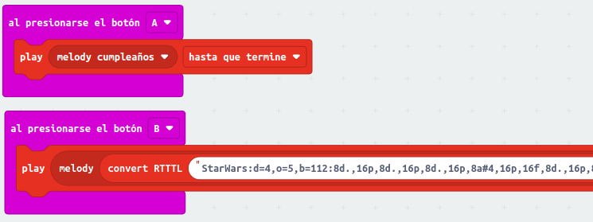
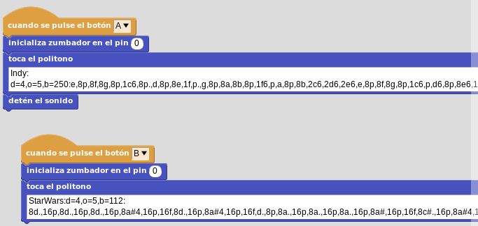
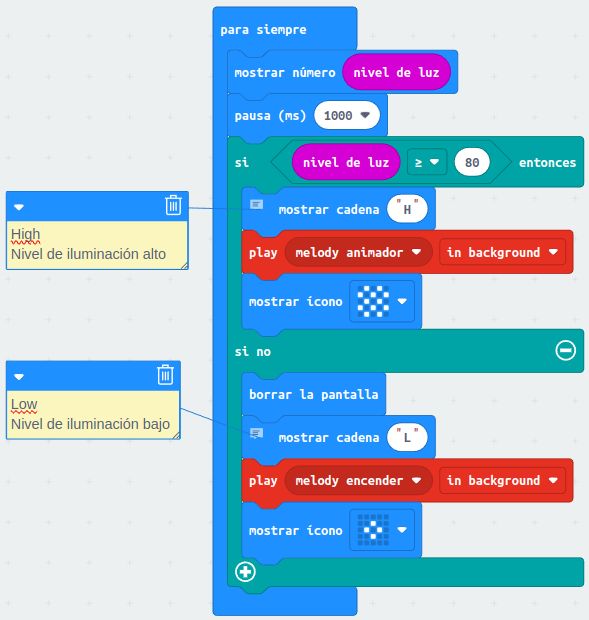
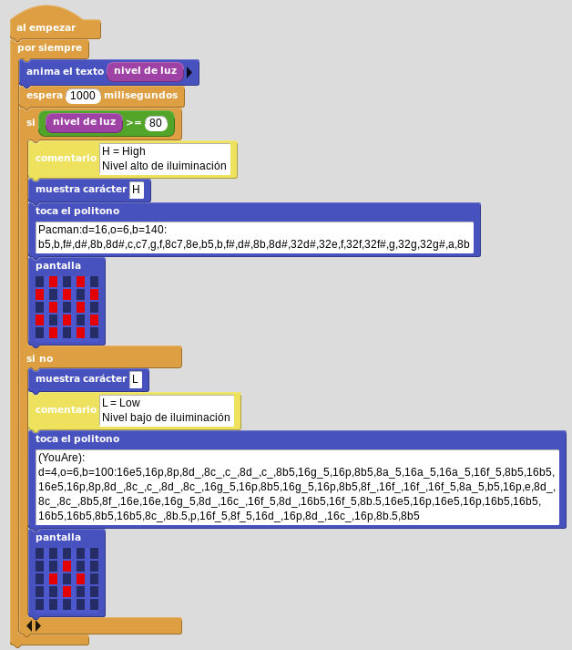

# Zumbador o buzzer
En este caso la actividad va a estar compuesta por cuatro proyectos y se harán todos montando elementos externos a la micro:bit. Si disponemos de una versión V2 las tres actividades primeras o bien funcionan directamente en el altavoz que incorpora o bien son facilmente adaptables. La última actividad no es realizable sin una micro:bit V2.

## **Circuito**
El esquema del circuito que vamos a utilizar es el siguiente:

  
*Esquema del circuito*

El montaje a realizar es el siguiente:

  
*Montaje del circuito*

## **A09-1. Buzzer activo**
El programa repetirá 5 veces sucesivas un pitido durante 200 ms, realizará una pausa de 2 segundos y volverá a repetirse indefinidamente.

### MicroPython
El programa es:

~~~py
from microbit import *

while True:
    for i in range(5):
        pin0.write_digital(1)
        sleep(200)
        pin0.write_digital(0)
        sleep(200)
    sleep(2000)
~~~

El programa lo podemos descargar de:

* [A09-1_Buzzer_activo](../programas/upy/A09-1_Buzzer_activo.hex)
* [A09-1_Buzzer_activo](../programas/upy/A09-1_Buzzer_activo-main.py)

### MakeCode
El programa es:

  
*A09-1. Buzzer activo*

El programa lo podemos descargar de:

* [microbit-A09-1_Buzzer_activo](../programas/makecode/microbit-A09-1_Buzzer_activo.hex)

### MicroBlocks
Este es el programa:

  
*A09-1. Buzzer activo*

El programa lo podemos descargar de:

* [A09-1_Buzzer_activo](../programas/ublocks/A09-1_Buzzer_activo.ubp)

## **A09-2. Buzzer pasivo. Notas**
El programa va a consistir en que cuando pulsamos la tecla A se reproduce la escala normal y cuando se pulsa la B la escala con las notas en sostenido.

### MicroPython
El programa es:

~~~py
from microbit import *
import music

notas = ['C','D','E','F','G','A','B']
notasS = ['C#','D#','E','F#','G#','A#','B']
while True:
    if button_a.is_pressed():
        music.play(notas)
    if button_b.is_pressed():
        music.play(notasS)
~~~

El programa lo podemos descargar de:

* [A09-2_Buzzer-pasivo_Notas](../programas/upy/A09-2. Buzzer pasivo. Notas.hex)
* [A09-2_Buzzer-pasivo_Notas](../programas/upy/A09-2. Buzzer pasivo. Notas-main.py)

### MakeCode
El programa es:

  
*A09-2. Buzzer pasivo. Notas*

El programa lo podemos descargar de:

* [A09-2_Buzzer pasivo_Notas](../programas/makecode/microbit-A09-2_Buzzer-pasivo_Notas.hex)

### MicroBlocks
Este es el programa:

  
*A09-2. Buzzer pasivo. Notas*

El programa lo podemos descargar de:

* [A09-2_Buzzer-pasivo_Notas](../programas/ublocks/A09-2_Buzzer-pasivo_Notas.ubp)

## **A09-3. Buzzer pasivo. Melodia**
En este caso haremos sonar una melodia de las que acompañan a los diferentes programas cuando pulsamos el botón A y otra cuando pulsamos el B. En el caso de MakeCode será una melodia y un tono RTTTL y en el caso de MicroBlocks serán dos tonos RTTTL.

### MicroPython
El programa es:

~~~py
from microbit import *
import music

while True:
    if button_a.is_pressed():
        music.play(music.BIRTHDAY)
    if button_b.is_pressed():
        music.play(music.ODE)
~~~

El programa lo podemos descargar de:

* [A09-3_Buzzer_pasivo_Melodia](../programas/upy/A09-3_Buzzer_pasivo_Melodia.hex)
* [A09-3_Buzzer_pasivo_Melodia](../programas/upy/A09-3_Buzzer_pasivo_Melodia-main.py)

### MakeCode
El programa es:

  
*A09-3_Buzzer_pasivo_Melodia*

En este caso hemos utilizado el bloque "convert RTTTL " " to melody":

En el que hemos pegado un trozo del politono de la Marcha Imperial de Star Wars:

~~~
StarWars:d=4,o=5,b=112:8d.,16p,8d.,16p,8d.,16p,8a#4,16p,16f,8d.,16p, 8a#4,16p,16f,

d.,8p,8a.,16p,8a.,16p,8a.,16p,8a#,16p,16f,8c#.,16p,8a#4,16p,16f,d.,8p,8d.6,16p,8d,

16p,16d,8d6,8p,8c#6,16p,16c6,16b,16a#,8b,8p,16d#,16p,8g#,8p,8g,16p,16f#,16f,16e,8f,

8p,16a#4,16p,8c#,8p,8a#4,16p,16c#,8f.,16p,8d,16p,16f,a.,8p,8d.6,16p,8d,16p,16d,8d6,

8p,8c#6,16p,16c6,16b,16a#,8b,8p,16d#,16p,8g#,8p,8g,16p,16f#,16f,16e,8f,8p,16a#4,16p,8c#
~~~

La cadena de texto debe ir toda seguida sin espacios ni retornos de línea.

El programa lo podemos descargar de:

* [A09-3_Buzzer_pasivo_Melodia](../programas/makecode/microbit-A09-3_Buzzer_pasivo_Melodia.hex)

### MicroBlocks
Este es el programa:

  
*A09-3_Buzzer_pasivo_Melodia*

El programa lo podemos descargar de:

* [A09-3_Buzzer_pasivo_Melodia](../programas/ublocks/A09-3_Buzzer_pasivo_Melodia.ubp)

## **A09-4. Brújula**

### MicroPython
El programa es:

~~~py
from microbit import *
import music

while True:
    display.scroll(display.read_light_level())
    sleep(1000)   
    if display.read_light_level() >= 80:
        #H = High- nivel de iluminación alto
        display.show("H")
        music.play(music.ENTERTAINER)
        display.show(Image.CHESSBOARD)
    else:
        display.clear()
        #L = Low- nivel de iluminación bajo
        display.show("L")
        music.play(music.NYAN)
        display.show(Image.DIAMOND_SMALL)
~~~

El programa lo podemos descargar de:

* [Avisador_nivel_iluminacion](../programas/upy/A09-4_Avisador_nivel_iluminacion.hex)
* [Avisador_nivel_iluminacion](../programas/upy/A09-4_Avisador_nivel_iluminacion-main.py)

### MakeCode
El programa es:

  
*A09-4. Avisador nivel iluminación*

El programa lo podemos descargar de:

* [Avisador_nivel_iluminacion](../programas/makecode/microbit-A09-4_Avisador_nivel_iluminacion.hex)

### MicroBlocks
Este es el programa:

  
*A09-4. Avisador nivel iluminación*

El programa lo podemos descargar de:

* [Avisador_nivel_iluminacion](../programas/ublocks/A09-4_Avisador_nivel_iluminacion.ubp)
