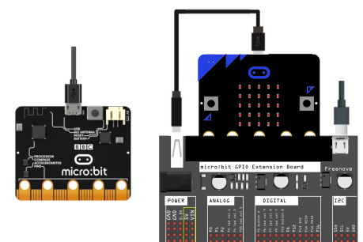

# Comunicación serie
Utilizaremos el puerto serie para enviar y recibir datos.

## **Circuito**
No se requiere de ningún elemento externo por lo que o bien conectamos la micro:bit directamente o bien a través de la placa de expansión.

  
*Conexionado de la micro:bit*

## **MicroPython**
Un programa como el siguiente:

~~~py
from microbit import *

cuenta=0
# Code in a 'while True:' loop repeats forever
while True:
    uart.write('Contador: '+str(cuenta)+"\r\n")
    sleep(1000)
    cuenta=cuenta+1
~~~

Es la forma de crear un contador en MicroPython y enviar los datos via serie.

En la animación siguiente vemos el resultado en el simulador y su consola serie.

  
*Simulador. Contador en el puerto serie*

A continuación vemos el resultado en la realidad.

  
*Dispositivo. Contador en el puerto serie*

El programa lo podemos descargar de:

* [A10-Contador_puerto_serie](../programas/upy/A10-Contador_puerto_serie.hex)
* [A10-Contador_puerto_serie](../programas/upy/A10-Contador_puerto_serie-main.py)

## **MakeCode**
El programa que vamos a hacer es simplemente crear un contador infinito e ir escribiendo el valor que toma cada segundo en el puerto serie.

  
*Contador en el puerto serie*

Ya conocemos algunas formas de visualizar el dato que se está escribiendo en el puerto serie. Veamos ahora los dos disponibles mediante webUSB. Debajo de la imagen de la microbit hay disponibles dos botones grandes:

* **Show data** Simulador. Nos abre a la derecha, sustituyendo la ventana de programa, una ventana dividia en dos partes, en la superior se va graficando el dato enviado por el bloque de escritura y en la inferior se va mostrando en forma de texto. Siempre referido a los datos enviados por el simulador En la animación siguiente lo vemos funcionando.

  
*Simulador. Contador en el puerto serie*

* **Show data** Dispositivo. Nos abre a la derecha, sustituyendo la ventana de programa, una ventana dividia en dos partes, en la superior se va graficando el dato enviado por el bloque de escritura y en la inferior se va mostrando en forma de texto. Ahora los datos que vemos son los enviados por la placa micro:bit conectada y en la que se ejecuta el programa. En la animación siguiente lo vemos funcionando.

  
*Dispositivo. Contador en el puerto serie*

El programa lo podemos descargar de:

* [A10-Contador_puerto_serie](../programas/makecode/microbit-A10-Contador_puerto_serie.hex)

## **MicroBlocks**
Con los bloques que implementa MicroBlocks no me ha sido posible realizar una escritura y lectura correctas del puerto serie. Un programa como el siguiente:

  
*Programa contador en el puerto serie*

Nos devuelve un resultado poco claro.

  
*Consola PuTTY para el programa contador en el puerto serie*

Aunque si aparecen algunos números al cabo de un tiempo todas las tareas se detienen y ya no se recibe nada.

En la wiki de MicroBlocks podemos encontrar la entrada [How Does Serial Communications Work?](https://wiki.microblocks.fun/serial) si se quiere profundizar en el tema, pero para el nivel que tenemos en este momento esto queda fuera de nuestro alcance. En cualquier caso, en esa misma entrada se aconseja, para trabajar con la uart, que escribamos nuestro propio código.

Para no dejar vacía la sección realizaremos el programa de la actividad con el editor Mu que incorpora REPL. El programa es:

~~~py
from microbit import *

cuenta = 0

while True:
    uart.write("Contador: " + str(cuenta) + "\r\n")
    sleep(1000)
    cuenta = cuenta + 1
~~~

Una vez flasheado el programa abrimos PERL y vemos como el contador está funcionando sin problemas.

  
*PERL en Mu  para el programa contador en el puerto serie*

El programa lo podemos descargar de:

* [A10-Contador_puerto_serie-Mu](../programas/ublocks/A10-Contador_puerto_serie.py)
