# Magnetómetro

[Magnetómetro](#item1mag)
  [Acelerómetro](#item2mag) 

La actividad va a consistir en crear una brújula electrónica que nos muestre una flecha que siempre apunte al norte geográfico. Dividimos la actividad en dos partes, la primera hacemos que encuentre el rumbo y nos muestre una letra que indique si la orientación es al norte (N), al sur (S), al este (E), o al oeste (O).

## **Circuito**
No se requiere de ningún elemento externo por lo que o bien conectamos la micro:bit directamente o bien a través de la placa de expansión.

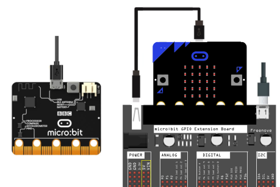  
*Conexionado de la micro:bit*

[Volver](#item0mag)

## - Magnetómetro -

## **MicroPython**

### A11-Brújula N,S,E,O
El programa, de muy poca precisión es el siguiente:

~~~py
from microbit import *

compass.calibrate()
while True:
    angulo = compass.heading()
    if angulo < 45:
        display.show("N")
    elif angulo < 135:
        display.show("E")
    elif angulo < 225:
        display.show("S")
    elif angulo < 315:
        display.show("O")
    else:
        display.show("N")
~~~

El programa lo podemos descargar de:

* [A11-Brújula-NSEO](../programas/upy/A11-Brujula-NSEO.hex)
* [A11-Brújula-NSEO](../programas/upy/A11-Brujula-NSEO.py)

### A11-Brújula a 45º
Lo que vamos a hacer ahora es localizar las siguientes ocho direcciones, separadas entre si un ángulo de 45º: noroeste (NE), oeste (O), suroeste (SO), sur (S), sureste (SE), este (E), noreste (NE), norte (N). El margen o ángulo que va a englobar cada dirección estará ajustado dentro de otro ángulo de 45º dividido en dos iguales de 22.5º respecto a la dirección principal. Un gráfico nos aclara mejor la idea.

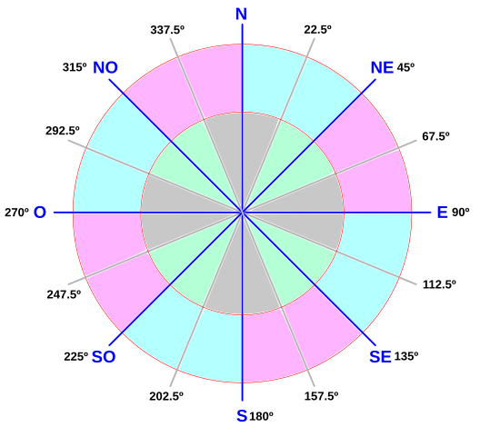  
*Direcciones a 45º*

En lugar de letras ahora utilizaremos las flechas predefinidas.

El programa es:

~~~py
from microbit import *

compass.calibrate()
while True:
    angulo = compass.heading()
    if angulo > 22.5 and angulo <= 67.5:
        display.show(Image.ARROW_NE)
    elif angulo > 67.5 and angulo <= 112.5:
        display.show(Image.ARROW_E)
    elif angulo > 112.5 and angulo <= 157.5:
        display.show(Image.ARROW_SE)
    elif angulo > 157.5 and angulo <= 202.5:
        display.show(Image.ARROW_S)
    elif angulo > 202.5 and angulo <= 247.5:
        display.show(Image.ARROW_SW)
    elif angulo > 247.5 and angulo <= 292.5:
        display.show(Image.ARROW_W)
    elif angulo > 292.5 and angulo <= 337.5:
        display.show(Image.ARROW_NW)
    elif angulo > 337.5 and angulo <= 22.5:
        display.show(Image.ARROW_N)
~~~

El programa lo podemos descargar de:

* [A11-Brújula a 45º](../programas/upy/A11-Brujula45.hex)
* [A11-Brújula a 45º](../programas/upy/A11-Brujula45-main.py)

## **MakeCode**

### A11-Brújula N,S,E,O
El programa, de muy poca precisión es el siguiente:

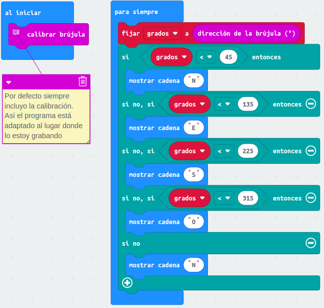  
*Brújula N,S,E,O*

Podemos ver el funcionamiento tanto en el simulador como en la realidad y apreciar la poca precisión que nos ofrece.

El programa lo podemos descargar de:

* [A11-Brújula-NSEO](../programas/makecode/microbit-A11-Brujula-NSEO.hex)

### A11-Brújula a 45º
Lo que vamos a hacer ahora es localizar las siguientes ocho direcciones, separadas entre si un ángulo de 45º: noroeste (NE), oeste (O), suroeste (SO), sur (S), sureste (SE), este (E), noreste (NE), norte (N). El margen o ángulo que va a englobar cada dirección estará ajustado dentro de otro ángulo de 45º dividido en dos iguales de 22.5º respecto a la dirección principal. Un gráfico nos aclara mejor la idea.

  
*Direcciones a 45º*

En lugar de letras ahora utilizaremos las flechas predefinidas en el bloque correspondiente.

El programa es:

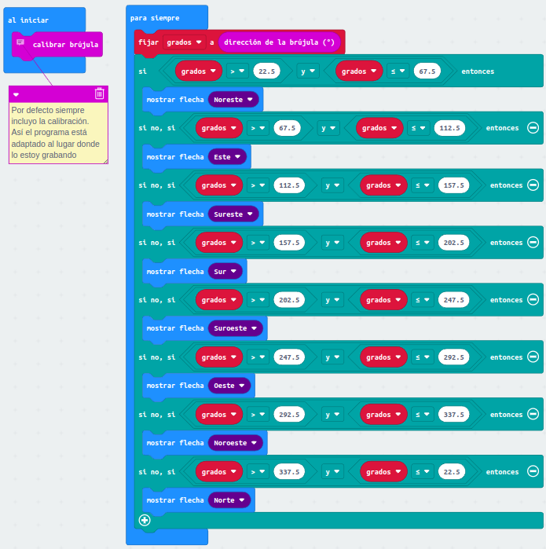  
*Brújula con direcciones a 45º*

El programa lo podemos descargar de:

* [A11_brujula45](../programas/makecode/microbit-A11_brujula45_MC.hex)

## **Editor Mu**

### A11-Brújula N,S,E,O
El programa, de muy poca precisión es el siguiente:

~~~py
from microbit import *

compass.calibrate()
while True:
    angulo = compass.heading()
    if angulo < 45:
        display.show("N")
    elif angulo < 135:
        display.show("E")
    elif angulo < 225:
        display.show("S")
    elif angulo < 315:
        display.show("O")
    else:
        display.show("N")
~~~

El programa lo podemos descargar de:

* [A11-Brújula-NSEO](../programas/ublocks/A11-Brujula-NSEO_Mu.py)

### A11-Brújula a 45º
Lo que vamos a hacer ahora es localizar las siguientes ocho direcciones, separadas entre si un ángulo de 45º: noroeste (NE), oeste (O), suroeste (SO), sur (S), sureste (SE), este (E), noreste (NE), norte (N). El margen o ángulo que va a englobar cada dirección estará ajustado dentro de otro ángulo de 45º dividido en dos iguales de 22.5º respecto a la dirección principal. Un gráfico nos aclara mejor la idea.

  
*Direcciones a 45º*

En el editor Mu también son válidas las definiciones predefinidas para las flechas.

El programa es:

~~~py
from microbit import *

compass.calibrate()
while True:
    angulo = compass.heading()
    if angulo > 22.5 and angulo <= 67.5:
        display.show(Image.ARROW_NE)
    elif angulo > 67.5 and angulo <= 112.5:
        display.show(Image.ARROW_E)
    elif angulo > 112.5 and angulo <= 157.5:
        display.show(Image.ARROW_SE)
    elif angulo > 157.5 and angulo <= 202.5:
        display.show(Image.ARROW_S)
    elif angulo > 202.5 and angulo <= 247.5:
        display.show(Image.ARROW_SW)
    elif angulo > 247.5 and angulo <= 292.5:
        display.show(Image.ARROW_W)
    elif angulo > 292.5 and angulo <= 337.5:
        display.show(Image.ARROW_NW)
    elif angulo > 337.5 and angulo <= 22.5:
        display.show(Image.ARROW_N)
~~~

El programa lo podemos descargar de:

* [A11-Brújula a 45º](../programas/ublocks/A11-Brujula45_Mu.py)

[Volver](#item0mag)

## - Acelerómetro -
Vamos a obtener las medidas de acelaración y ver los resultados en la consola serie. Una segunda actividad va a consistir en implementar un gradiómetro, que es un dispositivo que permite medir una componente del gradiente de un campo magnético. Cuando hablamos de campos magnéticos, gradiente hace referencia a las variaciones de los mismos en periodos de tiempo muy cortos.

## **MicroPython**

### A11-Aceleraciones
El programa lo vamos a hacer en el editor Mu para aprovechar su trazador gráfico.

~~~py
from microbit import *

while True:
    uart.write(str(accelerometer.get_values()) + "\r\n")
    sleep(1000)
~~~

Ponemos en marcha el trazador, y la comunicación serie REPL después de flashear el programa. Hacemos reset de la micro:bit y podemos ver la evolución de las lecturas con los movimientos de la placa.

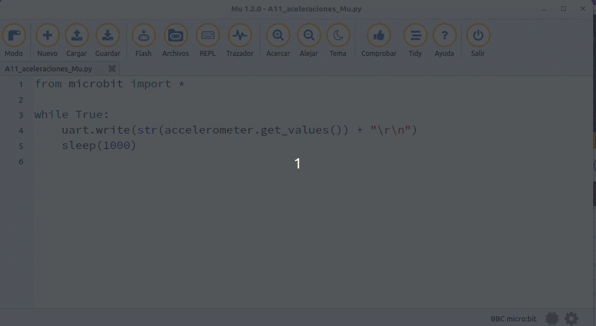  
*Aceleraciones en x, y, z*

El programa lo podemos descargar de:

* [A11_aceleraciones](../programas/upy/A11_aceleraciones_Mu.py)

### A11-Gradiómetro
El programa es:

~~~py
from microbit import *
# El brillo estara entre 0 y 9
brillo = 9 
# La funcion mapear ajusta los valores 
# leidos y los lleva al rango 0-4.
def mapear(valor):   
    if valor < -500:
        valor=-500
    elif valor > 500:
        valor=500
    valor=(valor+500)/250
    return int(valor)

while True:
    # Lee la aceleración en x e y con un
    #rango que va de -2000 a 2000.
    roll_x = accelerometer.get_x()
    pitch_y = accelerometer.get_y()
    # No necesitamos un rango tan amplio por
    # eso lo bajamos de -500 a 500
    x=mapear(roll_x)
    y=mapear(pitch_y)
    display.clear()
    display.set_pixel(x, y, brillo)
    sleep(500)
~~~

El programa lo podemos descargar de:

* [A11-A11_gradiometro](../programas/upy/A11_gradiometro_uP.hex)
* [A11-A11_gradiometro](../programas/upy/A11_gradiometro_uP-main.py)

## **MakeCode**

### A11-Aceleraciones
El programa para medir la aceleración en los tres ejes es:

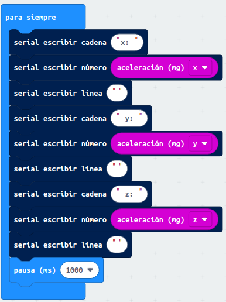  
*Aceleraciones en x, y, z*

Pero lo mejor del programa no es él en si mismo sino ver los resultados tanto de forma gráfica como numérica. Aquí los vemos en la simulación.

  
*Aceleraciones en x, y, z. Simulación*

Estos otros corresponden a una placa real.

  
*Aceleraciones en x, y, z. Realidad*

El programa lo podemos descargar de:

* [A11_aceleraciones](../programas/makecode/microbit-A11_aceleraciones_MC.hex)

### A11-Gradiómetro
El programa lo vemos en la figura siguiente.

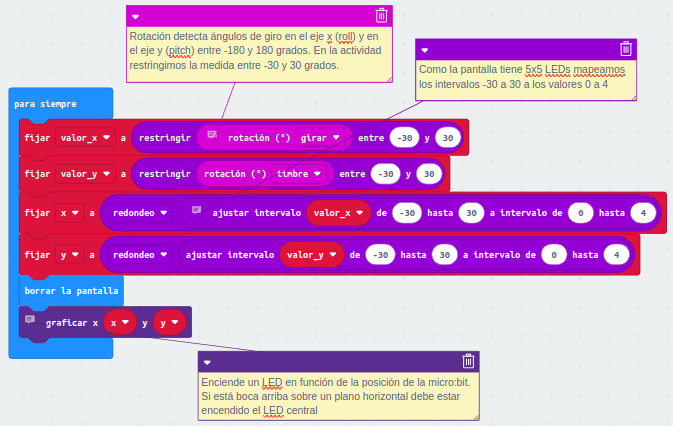  
*Gradiómetro*

En la animación vemos el funcionamiento en el simulador.

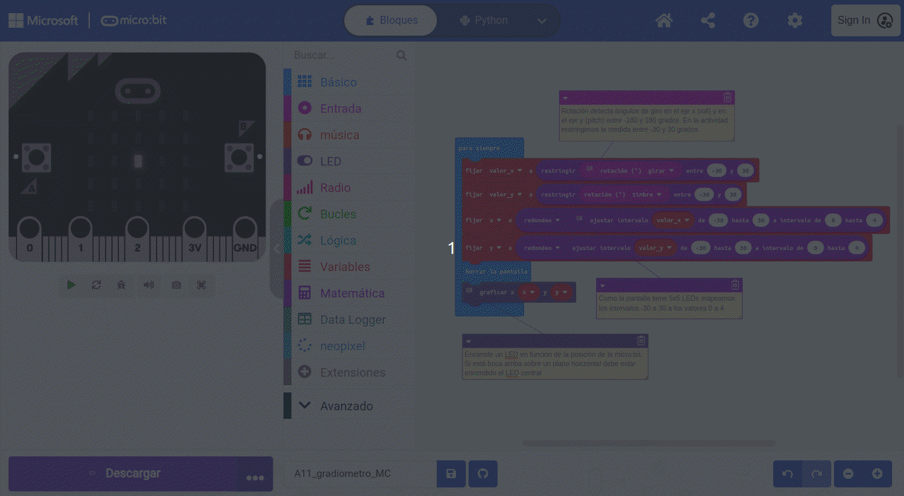  
*Gradiómetro en el simulador*

El programa lo podemos descargar de:

* [A11_gradiometro](../programas/makecode/microbit-A11_gradiometro_MC.hex)

## **MicroBlocks**

### A11-Aceleraciones
El programa para medir la aceleración en los tres ejes es:

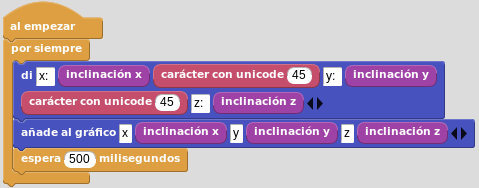  
*Aceleraciones en x, y, z*

El programa en funcionamiento es el siguiente:

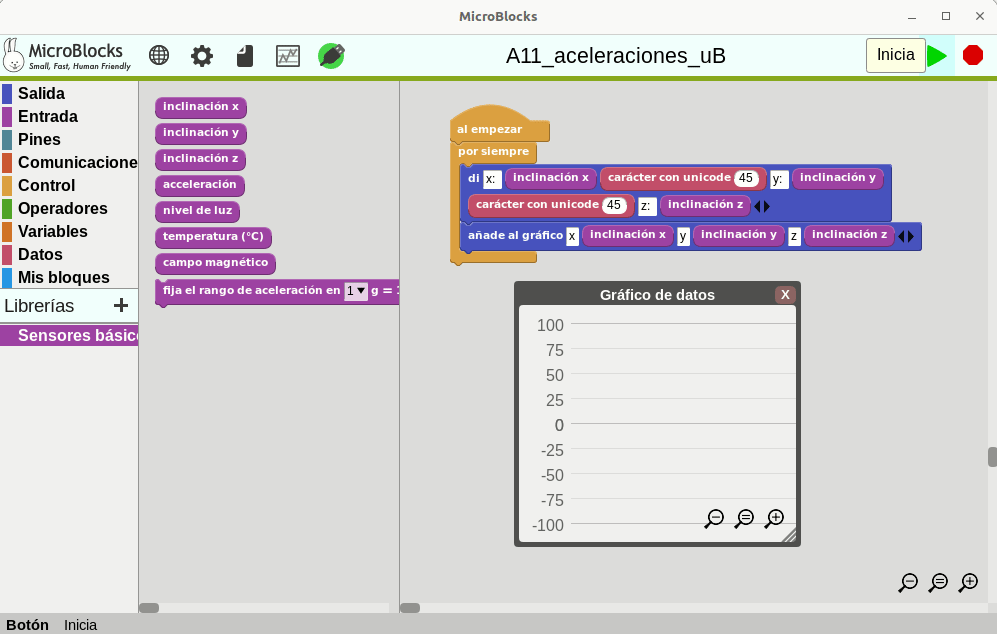  
*Aceleraciones en x, y, z*

El programa lo podemos descargar de:

* [A11_aceleraciones](../programas/ublocks/A11_aceleraciones_uB.ubp)

### A11-Gradiómetro
El programa es:

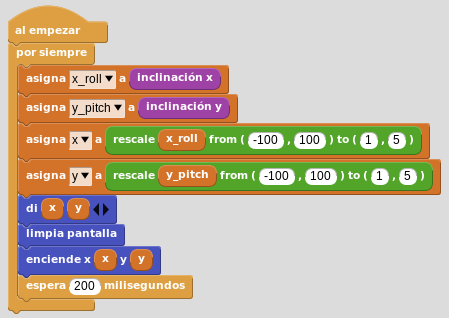  
*Gradiómetro*

El programa lo podemos descargar de:

* [A11_gradiometro](../programas/ublocks/A11_gradiometro.ubp)