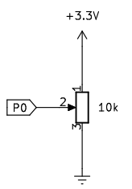
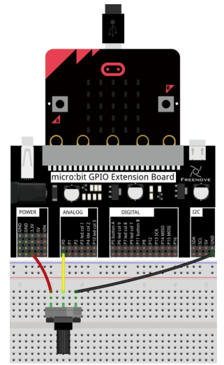
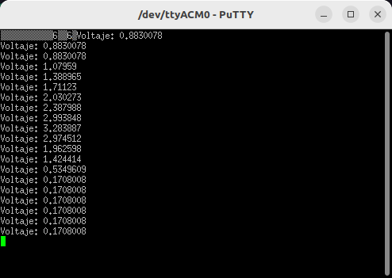
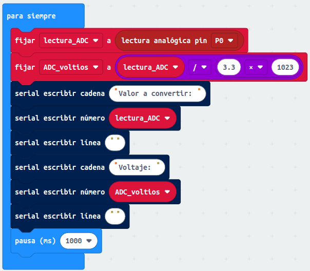
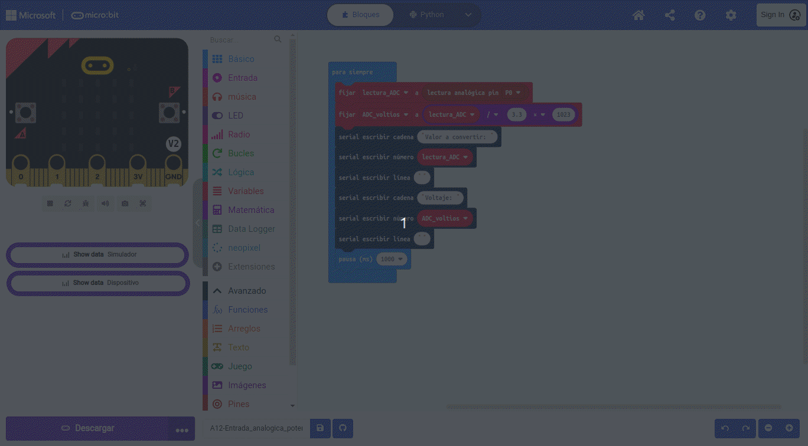
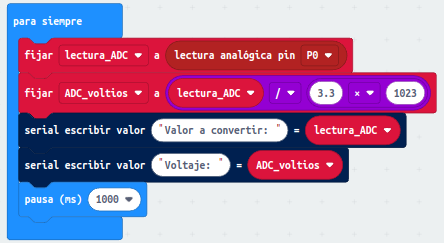
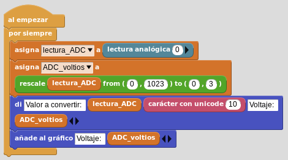
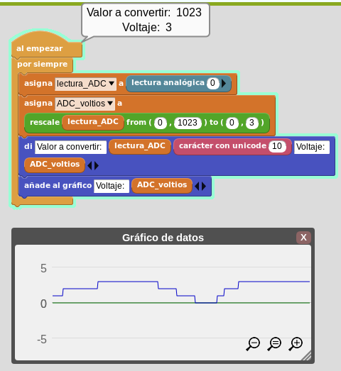

# Entrada analógica. El potenciómetro
Leer diferentes tensiones analógicas obtenidas a partir de un potenciómetro.

## **Circuito**
El esquema del circuito a montar es:

  
*Esquema de montaje*

El conexionado del potenciómetro es:

  
*Conexionado de la micro:bit*

## **MicroPython**
El programa para mostrar datos de forma numérica es el siguiente:

~~~py
from microbit import *

while True:
    lectura_ADC = pin0.read_analog()
    ADC_voltios = lectura_ADC/1024*3.3
    uart.write("Voltaje: " + str(ADC_voltios))
    uart.write("\r\n")
    sleep(1000)
~~~

Que arroja estos resultados en PuTTY:

  
*A12-Entrada_analogica_potenciometro en PuTTY*

El programa lo podemos descargar de:

* [A12-potenciómetro](../programas/upy/A12-Entrada_analogica_potenciometro.hex)
* [A12-potenciómetro](../programas/upy/A12-Entrada_analogica_potenciometro-main.py)

## **MakeCode**
El programa para mostrar datos de forma gráfica y numérica es el siguiente:

  
*A12-Entrada_analogica_potenciometro*

En la animación vemos el resultado práctico del programa.

  
*A12-Entrada_analogica_potenciometro*

El programa lo podemos descargar de:

* [A12-potenciómetro](../programas/makecode/microbit-A12-Entrada_analogica_potenciometro.hex)

Si tan solo necesitamos ver los datos de forma numérica el programa será:

  
*A12-Entrada_analogica_potenciometro*

## **MicroBlocks**
El programa lo haremos de la forma siguiente:

  
*A12-Entrada_analogica_potenciometro*

Una captura en un momento del funcionamiento es la siguiente:

  
*A12-Entrada_analogica_potenciometro*

El programa lo podemos descargar de:

* [A12-potenciómetro](../programas/ublocks/A12-Entrada_analogica_potenciometro.ubp)
