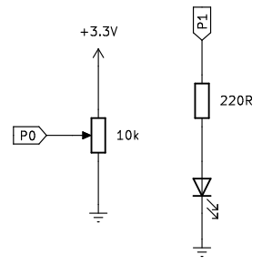
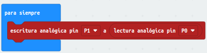
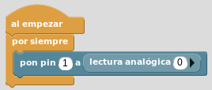
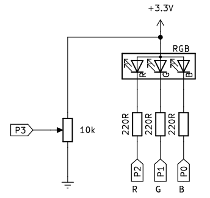
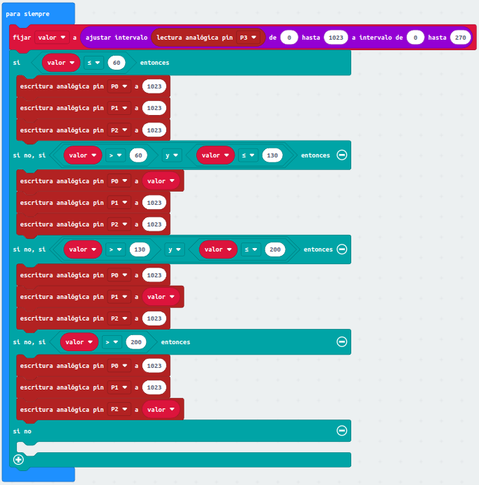
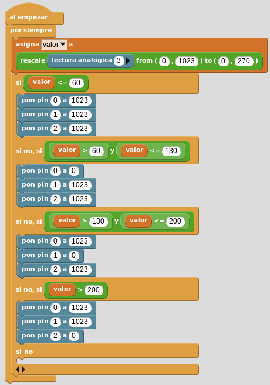
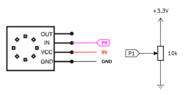
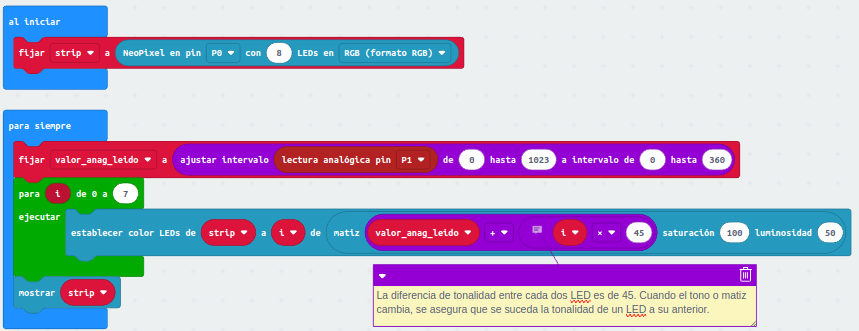
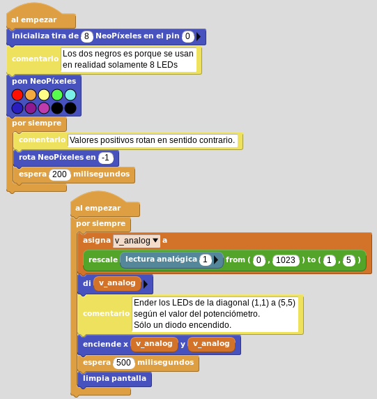

# Control con potenciómetro de LED, LED RGB y Neopixel
Dividiremos la actividad en tres, una para cada tipo de elemento.

[Diodo LED](#item1LED)
  [Diodo LED RGB](#item2LED)  
[LED RGB direccionable. Neopixel](#item3LED) 

[Volver](#item0LED)

<b>

Diodo LED

</b>

## **Circuito**
Vamos a montar el siguiente esquema:

  
*Esquema de montaje A13-1 LED*

## **MicroPython**
El programa es:

~~~py
from microbit import *

while True:
    pin1.write_analog(pin0.read_analog())
~~~

El programa lo podemos descargar de:

* [A13-1_control_LED_pot](../programas/upy/A13-1_control_LED_pot.hex)
* [A13-1_control_LED_pot](../programas/upy/A13-1_control_LED_pot-main.py)

## **MakeCode**
Leemos el valor analógico de tensión que entrega el pin P0 e indicamos que ese mismo valor se escriba en el pin P1. El programa es:

  
*Programa control LED con potenciómetro*

El programa lo podemos descargar de:

* [A13-1_control_LED_potenciometro](../programas/makecode/microbit-A13-1_control_LED_potenciometro.hex)

## **MicroBlocks**
El programa tiene este aspecto:

  
*Programa control LED con potenciómetro*

El programa lo podemos descargar de:

* [A13-1_control_LED_potenciometro](../programas/ublocks/A13-1_control_LED_potenciometro.ubp)

[Volver](#item0LED)

<b>

Diodo LED RGB

</b>

## **Circuito**
Vamos a montar el siguiente esquema:

  
*Esquema de montaje A13-2 LED RGB*

Vamos a mapear el valor analógico del pin P3 de 0-1023 a 0-270 (ángulo de giro del potenciómetro) de manera que durante los primeros 60º de recorrido los LEDs permacerán apagados, para posteriormente ir encendiendo un color cada 70º, es decir, azul entre 60 y 130, verde entre 130 y 200 y rojo para el resto del recorrido.

## **MicroPython**
El programa es:

~~~py
from microbit import *

display.off() #Necesario para poder leer Pin 3
def mapeo(valor,deBajo,deAlto,aBajo,aAlto):
    return (aAlto-aBajo)*(valor-deBajo) / (deAlto-deBajo) + aBajo 
def RGB(grados):
    if grados < 60:
        R = 0
        G = 0
        B = 0
    elif grados < 130:
        R = 0
        G = 0
        B = 255
    elif grados < 200:
        R = 0
        G = 255
        B = 0
    else:
        R = 255
        G = 0
        B = 0
    return R,G,B

while True:
    valor=mapeo(pin3.read_analog(),0,1023,0,270)
    rojo,verde,azul=RGB(valor)
    print(rojo,verde,azul)
    rojo=mapeo(rojo,0,255,1023,0)
    verde=mapeo(verde,0,255,1023,0)
    azul=mapeo(azul,0,255,1023,0)
    pin2.write_analog(int(rojo))
    pin1.write_analog(int(verde))
    pin0.write_analog(int(azul))
    sleep(50)
~~~

El programa lo podemos descargar de:

* [A13-2_control_RGB_pot](../programas/upy/A13-2_control_RGB_pot.hex)
* [A13-2_control_RGB_pot](../programas/upy/A13-2_control_RGB_pot-main.py)

## **MakeCode**
Leemos el valor analógico de tensión que entrega el pin P3, lo mapeamos y según el valor obtenido los escribimos de manera analógica en los pines P0, P1 y P2. El programa es:

  
*Programa control color LED RGB con potenciómetro*

El programa lo podemos descargar de:

* [A13-2_control_RGB_pot](../programas/makecode/microbit-A13-2_control_RGB_pot.hex)

## **MicroBlocks**
El programa tiene este aspecto:

  
*Programa control LED RGB con potenciómetro*

El programa lo podemos descargar de:

* [A13-2_control_RGB_pot](../programas/ublocks/A13-2_control_RGB_pot.ubp)

[Volver](#item0LED)

<b>

LED RGB direccionable. Neopixel

</b>

## **Circuito**
Vamos a montar el siguiente esquema:

  
*Esquema de montaje A13-3. Neopixel*

## **MicroPython**
El programa es:

~~~py
from microbit import *
import neopixel

# Establecemos el número de LEDs
neop = neopixel.NeoPixel(pin0, 8)
# Función para convertir color HSL en color RGB
# devuelve el valor RGB correspondiente al ángulo del matiz actual.

def HSL_RGB(grados):
    grados=grados/360*255
    if grados < 85:
        red = 255 - grados * 3
        green = grados * 3
        blue = 0
    elif grados < 170:
        grados = grados - 85
        red = 0
        green = 255 - grados * 3
        blue = grados * 3
    else:
        grados = grados - 170
        red = grados * 3
        green = 0
        blue = 255 - grados * 3
    return int(red),int(green),int(blue)

while True:
    for i in range(0, 8):
        # La lectura analogica se convierte al angulo del matiz actual.
        # La diferencia de tono entre cada dos led es de 45
        valor=pin1.read_analog()/1023*360+i*45
        if valor > 360 :
            valor = valor-360
        # Los colores serán los del arcoiris
        red,green,blue=HSL_RGB(valor)
        neop[i] = (red,green,blue)
    neop.show()
~~~

El programa lo podemos descargar de:

* [A13-3_control_Neo_pot](../programas/upy/A13-3_control_Neopixel_pot.hex)
* [A13-3_control_Neo_pot](../programas/upy/A13-3_control_Neopixel_pot-main.py)

## **MakeCode**
Leemos el valor analógico de tensión que entrega el pin P0 e indicamos que ese mismo valor se escriba en el pin P1. El programa es:

  
*Programa control Neopixel con potenciómetro*

El programa lo podemos descargar de:

* [A13-3_control_Neopixel_pot](../programas/makecode/microbit-A13-3_control_Neopixel_potenciometro.hex)

## **MicroBlocks**
En este caso vamos a realizar un ejemplo algo diferente para seguir mostrando el potencial del programa. Por un lado vamos a estar viendo de manera continua el valor leido del potenciómetro y por otro vamos a estar moviendo el color de los LEDs con los colores del arcoiris de una forma sencilla y automática. La idea es que tendremos dos bloques "al empezar" y otros dos bloques "por siempre" cada pareja haciendo un trabajo diferente.

En la imagen siguiente vemos el programa y la explicación se da en los comentarios.

  
*Programa control Neopixel con potenciómetro*

El programa lo podemos descargar de:

* [A13-3_Neo_y_pot](../programas/ublocks/A13-3_control_Neopixel_potenciometro.ubp)

