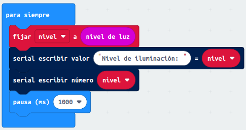
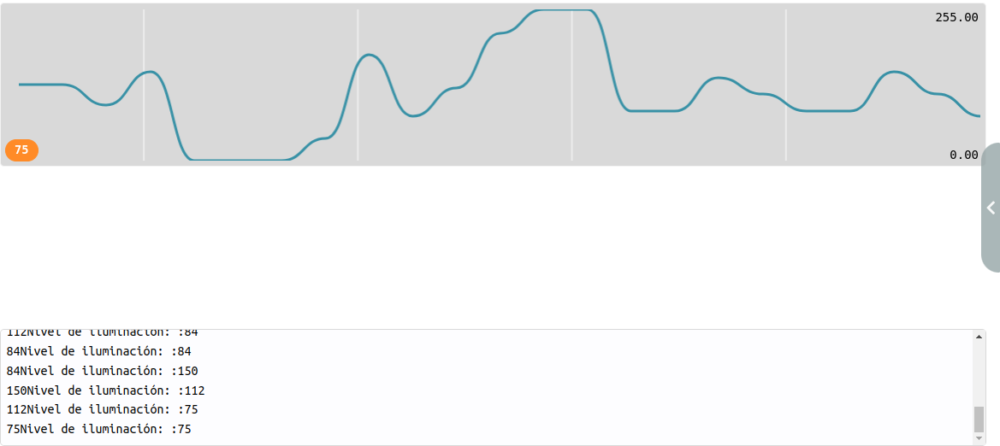
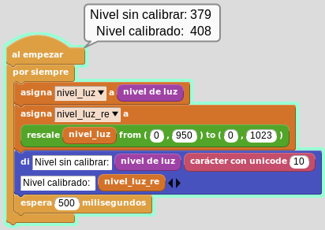
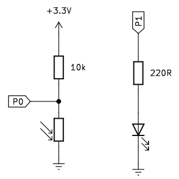
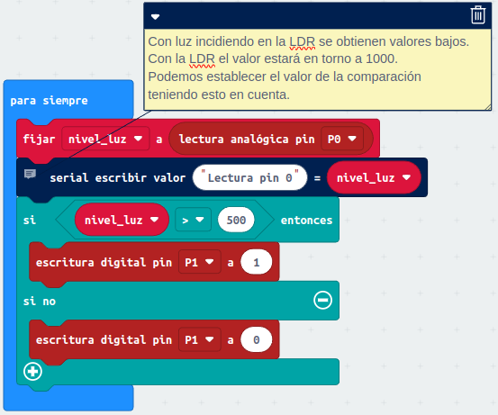
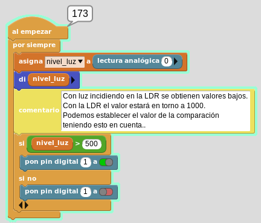

# Nivel de luz con micro:bit. La LDR
En primer lugar vamos a ver como utilizar la micro:bit como detector de luz, cosa que es bastante sencilla por la pantalla de LEDs que puede actuar como sensor.

Después veremos como detectar el nivel de luminosidad con un elemento externo como la LDR.

## **Luminosidad con la micro:bit**

[Luminosidad con la micro:bit](#item1A14)
  [Luminosidad con la LDR](#item2A14) 

[Volver](#item0A14)

<b>Luminosidad con la micro:bit</b>

### **MicroPython**
El programa es:

~~~py
from microbit import *

while True:
    nivel_luz = display.read_light_level()
    uart.write(str(nivel_luz) + "\r\n")
    sleep(1000)
~~~

El programa lo podemos descargar de:

* [A14-1-Midiendo el nivel de luz](../programas/upy/A14-1-Midiendo_nivel_luz.hex)
* [A14-1-Midiendo el nivel de luz](../programas/upy/A14-1-Midiendo_nivel_luz-main.py)

### **MakeCode**
El programa que vamos a crear es el siguiente:

  
*Programa para la actividad*

El resultado en el simulador es:

  
*Programa para la actividad. Simulador*

El programa lo podemos descargar de:

* [A14-1-Midiendo el nivel de luz](../programas/makecode/microbit-A14-1-Midiendo_nivel_luz.hex)

### **MicroBlocks**
El programa es el siguiente:

  
*Programa para la actividad*

El programa está diseñado para solucionar el problema que se suele dar de que la sensibilidad de los sensores de luz de la micro:bit varia de unas placas a otras.

El programa lo podemos descargar de:

* [A14-1-Midiendo el nivel de luz](../programas/ublocks/A14-1-Midiendo_nivel_luz.ubp)

## **Luminosidad con la LDR**

[Volver](#item0A14)

<b>Luminosidad con la LDR</b>

Vamos a montar el típico circuito de un interruptor crepuscular.

  
*Circuito del interruptor crepuscular*

### **MicroPython**
El programa es:

~~~py
from microbit import *

while True:
    nivel_luz = pin0.read_analog()
    # Con luz incidiendo en la LDR se obtienen valores bajos.
    # Con la LDR iluminada el valor estará en torno a 1000.
    # Podemos establecer el valor de la comparación 
    # teniendo esto en cuenta.
    uart.write(str(nivel_luz) + "\r\n")
    if nivel_luz > 500:
        pin1.write_digital(1)
    else:
        pin1.write_digital(0)
~~~

El programa lo podemos descargar de:

* [A14-2-Interruptor crepuscular](../programas/upy/A14-2-int_crep.hex)
* [A14-2-Interruptor crepuscular](../programas/upy/A14-2-int_crep-main.py)

### **MakeCode**
El programa es el siguiente:

  
*A14-2-Programa interruptor crepuscular*

El programa lo podemos descargar de:

* [A14-2-Interruptor crepuscular](../programas/makecode/microbit-A14-2-int_crep.hex)

### **MicroBlocks**

  
*A14-2-Programa interruptor crepuscular*

El programa lo podemos descargar de:

* [A14-2-Interruptor crepuscular](../programas/ublocks/A14-2-int_crep.ubp)
