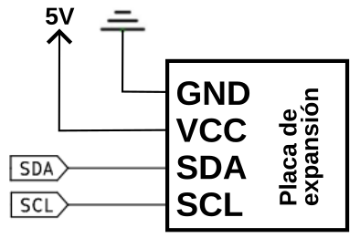
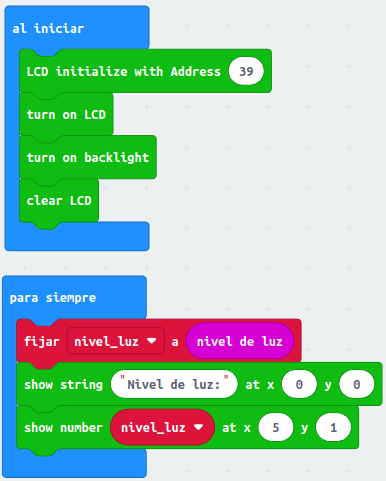
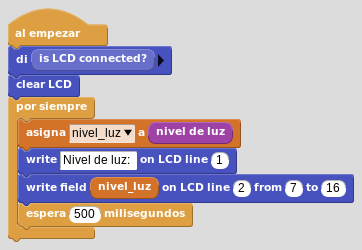

# LCD 1602 I2C
En micro:bit, la conexión I2C está disponible en los pines P19 (SCL) y P20 (SDA) por lo que se requiere de una placa de expansión para poder utilizar dispositivos I2C con ella.

## **Circuito**
Las cvonexiones que hay que realizar son bastante sencillas.

  
*Conexionado de la LCD I2C a la placa de expansión*

Hay que conectar el pin SCL del dispositivo al pin 19 de micro:bit, y el pin SDA del dispositivo al pin 20 de micro:bit. También hay que conectar la masa del dispositivo a la masa de la micro:bit (pin GND). Es posible que se necesite alimentar el dispositivo usando una fuente de alimentación externa a la micro:bit.

Hay resistencias pull-up internas en las líneas I²C de la placa, pero si usamos cables largos o conectamos un gran número de dispositivos es posible que necesitemos añadir resistencias pull-up adicionales, para asegurar una comunicación libre de ruido, tal y como se explica en el apartado I2C de [Conceptos técnicos. Señales](../conceptos/signals.md)

## **MicroPython**
Las funciones habituales para una LCD de inicializar, borrar, etc no están implementadas en https://python.microbit.org/v/3 por defecto y tenemos que recurrir a una librería externa que implementa una clase y hacer uso de ella. Se recomienda encarecidamente ver el apartado [Programación Orientada a Objetos](../guias/poo.md) de la entrada de menú Python.

~~~py
from microbit import *
from I2C_LCD1602 import *

# Creamos una instancia
lcd = I2C_LCD1602(0x27)
lcd.on()
lcd.backlight(1) #1=retroiliminación ON, 0=retroiluminacion OFF
lcd.clear()

while True:
    # Asigna a variable la lectura recibida por los LEDs de la pantalla
    nivel_luz = display.read_light_level()
    lcd.puts("Nivel de luz: ",0,0) 
    lcd.puts(str(nivel_luz),5,1)
~~~

El programa lo podemos descargar de:

* [A15-Nivel de luz con LCD](../programas/upy/A15-Nivel_luz_LCD.hex)
* [A15-Nivel de luz con LCD](../programas/upy/A15-Nivel_luz_LCD-main.py)

## **MakeCode**
El programa es el siguiente:

  
*A15-Nivel de luz con LCD*

El programa lo podemos descargar de:

* [A15-Nivel_luz_LCD](../programas/makecode/microbit-A15-Nivel_luz_LCD.hex)

## **MicroBlocks**
El programa es el siguiente:

  
*A15-Nivel de luz con LCD*

El programa lo podemos descargar de:

* [A15-Nivel_luz_LCD](../programas/ublocks/A15-Nivel_luz_LCD.ubp)

