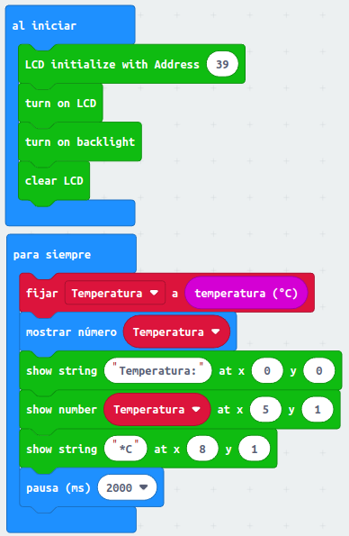
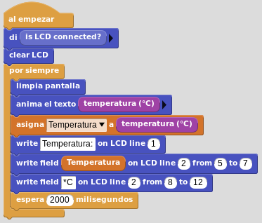
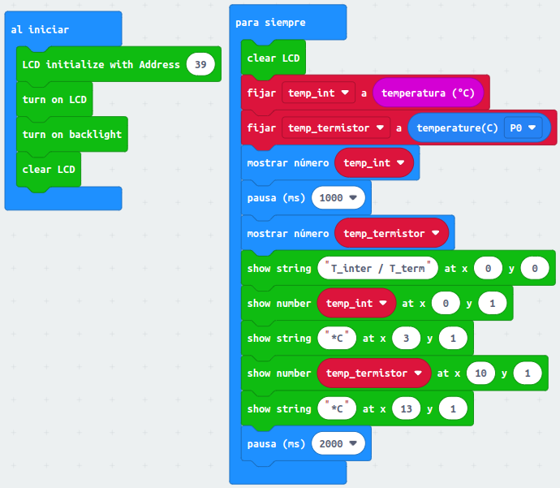

# Medidas de temperatura
Las vamos a ver tanto con el sensor interno de la micro:bit como con un termistor.

## **MicroPython**
El programa que muestra el valor de temperatura medida por el sensor interno de la micro:bit es:

~~~py
from microbit import *
from I2C_LCD1602 import *

# Creamos una instancia
lcd = I2C_LCD1602(0x27)
lcd.on()
lcd.backlight(1) #1=retroiliminacion ON, 0=retroiluminacion OFF
lcd.clear()

while True:
    Temperatura = temperature()
    display.scroll(Temperatura)
    lcd.puts("Temperatura: ",0,0) 
    lcd.puts(str(Temperatura),5,1)
    lcd.puts("*C ",8,1)
    sleep(2000)
~~~

El programa lo podemos descargar de:

* [A16-Med_temp_sensor_int_uP](../programas/upy/A16-Med_temp_sensor_int.hex)
* [A16-Med_temp_sensor_int_uP](../programas/upy/A16-Med_temp_sensor_int-main.py)

## **MakeCode**
El programa es muy sencillo, tan solo tenemos que poner el bloque en un mostrar número. Lo complicaremos un poco mostrando la temperatura también en la LCD I2C1602.

  
*A16-Medida de temperatura con sensor interno*

El programa lo podemos descargar de:

* [A16-Med_temp_sensor_int_MC](../programas/makecode/microbit-A16-Med_temp_sensor_int.hex)

## **MicroBlocks**
SEl programa que muestra la temperatura medida por el sensor interno de la micro:bit en la LCD y la pantalla es:

  
*A16-Medida de temperatura con sensor interno*

El programa lo podemos descargar de:

* [A16-Med_temp_sensor_int_uB](../programas/ublocks/A16-Med_temp_sensor_int.ubp)

## **Circuito**
Tenemos que montar y conectar correctamente el siguiente circuito:

  
*Circuito con termistor*

A continuación se muestran los programas para medir la temperatura desde un termistor. Estos programas son los mismos que anteriormente pero se ha añadido esta nueva lectura, así además podemos comparar.

## **MicroPython**
El programa que muestra el valor de temperatura medida por el sensor interno de la micro:bit y por el termistor es:

~~~py
from microbit import *
from I2C_LCD1602 import *
import math #para los cálculos

lcd = I2C_LCD1602(0x27)
lcd.on()
lcd.backlight(1) #1=retroiliminacion ON, 0=retroiluminacion OFF
lcd.clear()

while True:
    Temp_int = temperature()
    display.scroll(Temp_int)
    sleep(1000)
    lectura_ADC = pin0.read_analog()
    # Pasa la lectura analogica a voltios
    V = lectura_ADC*3.3/1023.0
    # Por teoria divisor de tension
    Rt = 10/((3.3/V)-1)
    # Calculo de la temperatura
    Temp_term = (1/(1/25 + math.log(Rt/10)/3997))
    Temp_term_int = round(Temp_term)
    lcd.puts("T_inter / T_term ",0,0)
    display.scroll(round(Temp_term_int))
    lcd.puts(str(Temp_int),0,1)
    lcd.puts("*C ",3,1)
    lcd.puts(str(Temp_term_int),10,1)
    lcd.puts("*C ",13,1)
    sleep(2000)
~~~

El programa lo podemos descargar de:

* [A16-Med_temp_sensor_int_term_uP](../programas/upy/A16-Med_temp_sensor_int_term.hex)
* [A16-Med_temp_sensor_int_term_uP](../programas/upy/A16-Med_temp_sensor_int_term-main.py)

## **MakeCode**
Gracias a la extensión de [Freenove](https://github.com/Freenove/Makecode-Extension-Starter-Kit) añadir al programa la lectura del termistor es muy simple, como vemos a continuación.

  
*A16-Medida de temperatura con sensor interno y termistor*

El programa lo podemos descargar de:

* [A16-Med_temp_sensor_int_term_MC](../programas/makecode/microbit-A16-Med_temp_sensor_int_term_MC)

## **MicroBlocks**
En MicroBlocks no hay una librería de matemáticas para añadir ni tampoco una librería para termistores y por lo tanto no es posible resolver esta activdad con este programa.

Si vamos a aprovechar para resolverla con el editor de MicroPython Mu.

~~~py
from microbit import *
import math  # para los cálculos

while True:
    Temp_int = temperature()
    display.scroll(Temp_int)
    sleep(1000)
    lectura_ADC = pin0.read_analog()
    # Pasa la lectura analogica a voltios
    V = lectura_ADC * 3.3 / 1023.0
    # Por teoria divisor de tension
    Rt = 10 / ((3.3 / V) - 1)
    # Calculo de la temperatura
    Temp_term = 1 / (1 / 25 + math.log(Rt / 10) / 3997)
    Temp_term_int = round(Temp_term)
    display.scroll(round(Temp_term_int))
    sleep(2000)
~~~

El programa lo podemos descargar de:

* [A16-Med_temp_sensor_int_term_Mu](../programas/ublocks/A16-Med_temp_sensor_int_Mu.py)