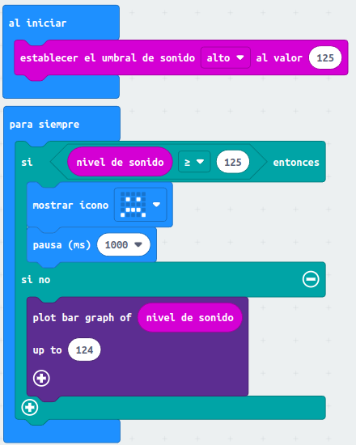
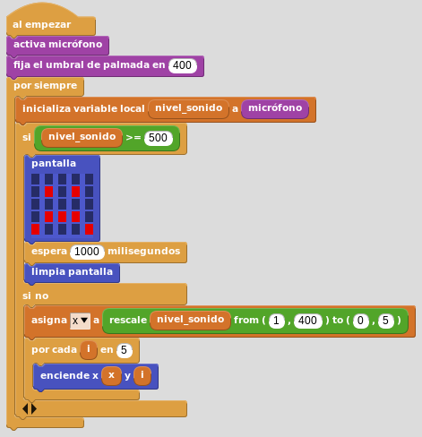

# Micrófono, solo en las versiones V2
La actividad va a consistir en crear un programa que establezca un nivel como umbral de sonido. Si el sonido supera el umbral se mostrará una carita triste durante un segundo y si está por debajo en la pantalla se verá un gráfico de barras en función del nivel de sonido.

## **MicroPython**
El programa es el siguiente:

~~~py
from microbit import *

# definicion funcion mapea para cambiar un rango de valores a otro
def mapea(valor, deMin, deMax, aMin, aMax):
    deRango = deMax - deMin
    aRango = aMax - aMin
    valorEsc_de = float(valor - deMin)/float(deRango)
    valorEsc_a = aMin + (valorEsc_de * aRango)
    return valorEsc_a

# Creamos los imagenes para el grafico de barras
grafico5 = Image("99999:"
                 "99999:"
                 "99999:"
                 "99999:"
                 "99999")

grafico4 = Image("00000:"
                 "99999:"
                 "99999:"
                 "99999:"
                 "99999")

grafico3 = Image("00000:"
                 "00000:"
                 "99999:"
                 "99999:"
                 "99999")

grafico2 = Image("00000:"
                 "00000:"
                 "00000:"
                 "99999:"
                 "99999")

grafico1 = Image("00000:"
                 "00000:"
                 "00000:"
                 "00000:"
                 "99999")
               
grafico0 = Image("00000:"
                 "00000:"
                 "00000:"
                 "00000:"
                 "00000")

graficos = [grafico0, grafico1, grafico2, grafico3, grafico4, grafico5]
               
# ignora el primer nivel de sonido leido
nivelSonido = microphone.sound_level()
sleep(200)
# establece un umbral para el nivel de sonido
umbral = microphone.set_threshold(SoundEvent.LOUD, 125)
while True:
    # si el umbral es superado se muestra una carita triste
    if microphone.sound_level() >= 125:
        display.show(Image.SAD)
        sleep(1000)
    else:
        # mapear nivel de sonido de 0-255 a 0-5 para escoger gráfico
        nivelSonido = int(mapea(microphone.sound_level(), 0, 255, 0, 5))
        display.show(graficos[nivelSonido])
~~~

El programa lo podemos descargar de:

* [A17-Sencillisimo sonómetro](../programas/upy/Sonometro_facil.hex)
* [A17-Sencillisimo sonómetro](../programas/upy/Sonometro_facil-main.py)

## **MakeCode**
El programa es el siguiente:

*A17-Sencillisimo sonómetro*

El programa lo podemos descargar de:

* [A17-Sonometro_facil](../programas/makecode/microbit-Sonometro_facil.hex)

## **MicroBlocks**
Sin entrar en demasiados detalles ni ajustar el programa para un funcionamiento idéntico a los otros lenguajes, podemos decir que mas o menos el programa de esta actividad sería:

*A17-Sencillisimo sonómetro*

El programa lo podemos descargar de:

* [A17-Sonometro_facil](../programas/ublocks/A17_P_uB.ubp)
