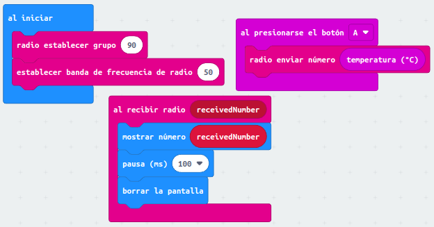
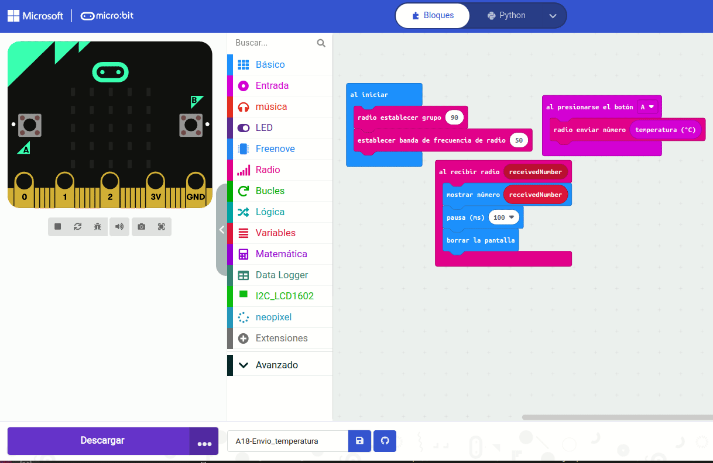
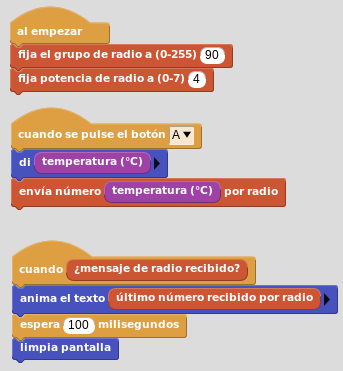
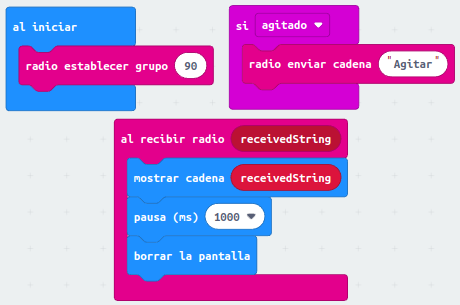
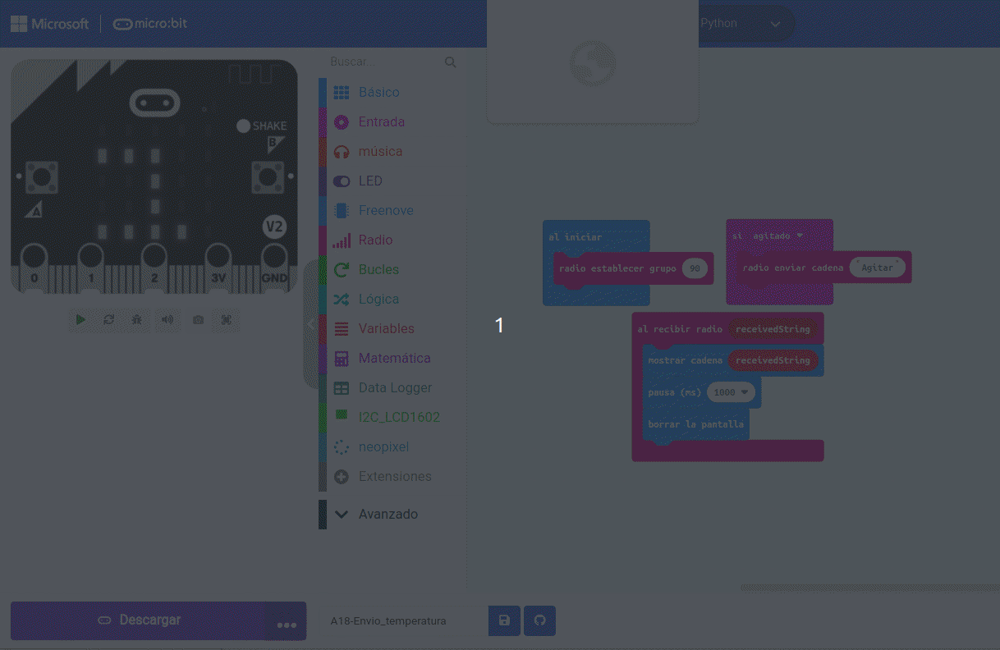
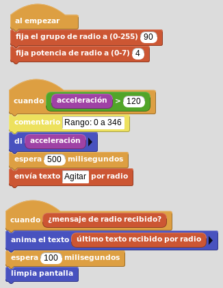

# Radio
Vamos a realizar dos actividades sencillas con la radio de la micro:bit.

En la primera vamos a enviar la temperatura medida por la placa y en el valor recibido vamos a calcular la diferencia entre la temperatura de la placa que recibe y la que envía, estableciendo así la diferencia de temperaturas entre, por ejemplo, una zona al sol y otra a la sombra.

En la segunda vamos a realizar una especie de juego en el que se envía el mensaje "agitar (shake)" a un grupo de micro:bits (podemos poner otras en un grupo diferente) cuando se realiza justamente ese gesto. Usaremos uno de los botones para salir del programa.

## **Enviar la temperatura**

### **MicroPython**
El código del programa es el siguiente:

~~~py
from microbit import *
import radio
radio.on()
radio.config(channel=50, group=90)

while True:
    if button_a.is_pressed():
       radio.send(str(temperature()))
    recibido = radio.receive()
    if recibido is not None:
        display.show(recibido)
        sleep(50)
    display.clear()
~~~

El programa lo podemos descargar de:

* [A18-Envio_temperatura](../programas/upy/A18-Envio_temperatura.hex)
* [A18-Envio_temperatura](../programas/upy/A18-Envio_temperatura-main.py)

### **MakeCode**
El programa es el siguiente:

  
*A18-Envio de la_temperatura*

A continuación vemos la simulación del programa. Estableciendo dos valores de temperatura diferentes en cada micro:bit podemos apreciar la diferencia entre ambas.

  
*A18-Simulación del envio de la_temperatura*

El programa lo podemos descargar de:

* [A18-Envio_temperatura](../programas/makecode/microbit-A18-Envio_temperatura.hex)

### **MicroBlocks**
Pondremos el mismo programa en dos micro:bits para las pruebas. Lógicamente se puede hacer que sean diferentes si quitamos del programa en un caso la parte receptora y en el otro la emisora.

  
*A18-Envio de la_temperatura*

El programa lo podemos descargar de:

* [A18-Envio_temperatura](../programas/ublocks/A18-Envio_temperatura.ubp)

## **Envía "Agitar" cuando se agita**

### **MicroPython**
El código del programa es el siguiente:

~~~py
from microbit import *
import radio
radio.on()
radio.config(channel=50, group=90)

while True:
    if accelerometer.is_gesture('shake'):
        radio.send("Agitar")
    recibido = radio.receive()
    if recibido is not None:
        display.show(recibido)
        sleep(50)
    display.clear()
~~~

El programa lo podemos descargar de:

* [A18-Envio_agitar](../programas/upy/A18-Envio_agitar.hex)
* [A18-Envio_agitar](../programas/upy/A18-Envio_agitar-main.py)

### **MakeCode**
El programa es el siguiente:

  
*A18-Envio_agitar*

A continuación vemos la simulación del programa. Agitamos las micro:bits moviendo rapidamente el ratón sobre ellas.

  
*A18-Simulación de Envio_agitar*

El programa lo podemos descargar de:

* [A18-Envio_agitar](../programas/makecode/microbit-A18-Envio_agitar.hex)

### **MicroBlocks**
El programa es:

  
*A18-Envio del texto "Agitar"*

El programa lo podemos descargar de:

* [A18-Envio_temperatura](../programas/ublocks/A18-Envio_Agitar.ubp)
