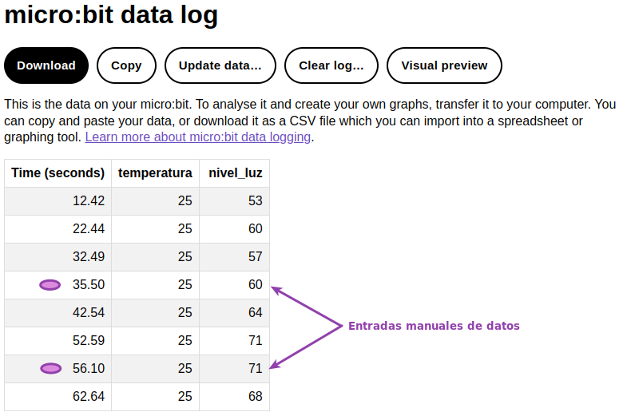
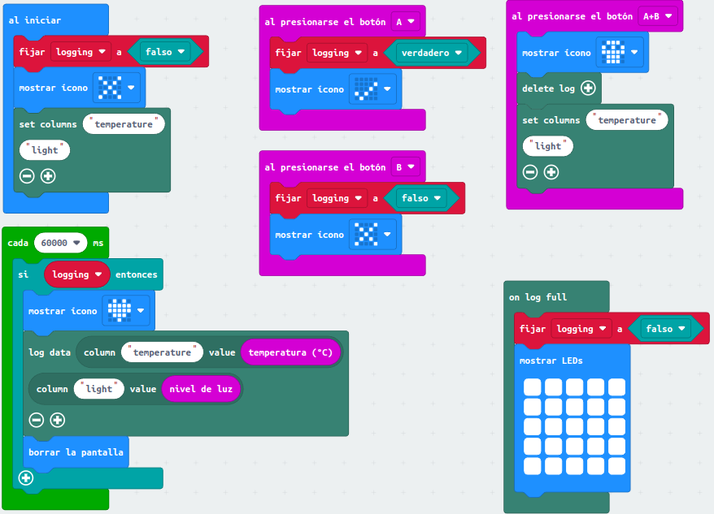
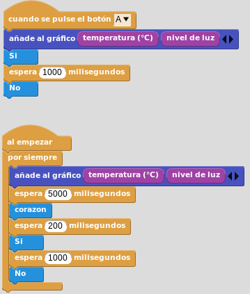
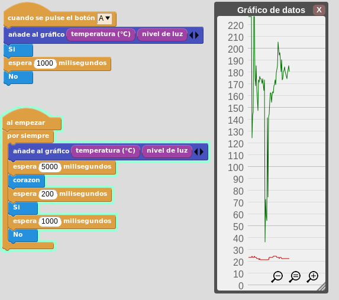
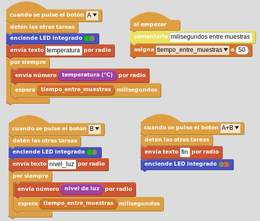
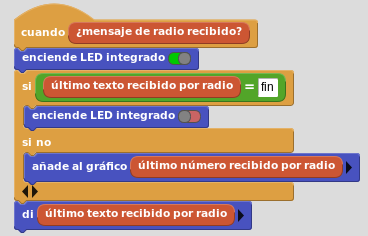
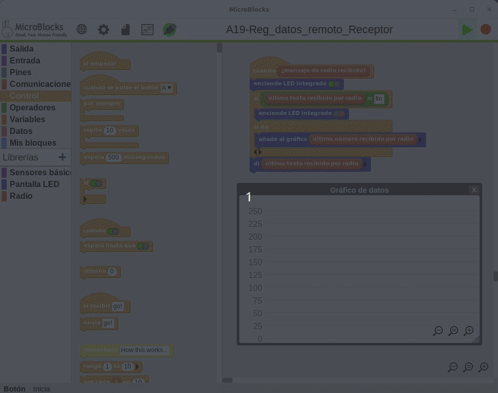

# Registro de datos
Vamos a realizar una actividad en la que registraremos la temperatura y la luz ambiente en la misma micro:bit que contiene el programa y, para el caso de MicroBlocks, vamos además a añadir otra en la que enviaremos los datos via radio desde una micro:bit para que los registre otra diferente.

## **MicroPython**
El programa que vemos a continuación realiza un registro automático cada 10 segundos o cuando pulsemos el botón A. Pulsando A+B se borran los datos registrados en la microbit.

~~~py
from microbit import *
import log

# Configurar etiquetas y establecer la unidad de tiempo
log.set_labels("temperatura", "nivel_luz", timestamp=log.SECONDS)
display.show(Image.NO)
sleep(1000)
# Enviar cada fila de datos a la salida serie
log.set_mirroring(True)

continue_registro = True

# Decorador programado para que se ejecute cada 10s durante 50ms
@run_every(s=10, ms=50)
def reg_dato():
    # Registra cada 10s temperatura y nivel de luz y muestra un icono
    global continue_registro
    if continue_registro:
        display.show(Image.YES)
        try:
            log.add(temperatura=temperature(), nivel_luz=display.read_light_level())
        except OSError:
            continue_registro = False
            display.show(Image.CHESSBOARD)
        sleep(500)

while True:
    if button_a.is_pressed() and button_b.is_pressed():
        display.show(Image.GHOST)
        # Borra el archivo de registro con la opcion "full" lo
        # que asegura el borrado de datos aunque tarde mas tiempo.
        log.delete(full=True)
        continue_registro = True
    elif button_a.is_pressed():
        display.show(Image.YES)
        sleep(500)
        log.add(temperatura=temperature(), nivel_luz=display.read_light_level())
        display.show(Image.HEART)
    else:
        display.show(Image.NO)
    sleep(500)
~~~

A continuación vemos el registro de datos tras unos segundos y un par de entradas manuales:

  
*A19-Registro de datos local. Resultado literal*

***Para que este registro se actualice en la pantalla del ordenador tenemos que desconectar y conectar nuestra micro:bit del puerto USB y esperar unos instantes.***

El programa lo podemos descargar de:

* [A19-Reg_datos_local](../programas/upy/A19-Reg_datos_local.hex)
* [A19-Reg_datos_local](../programas/upy/A19-Reg_datos_local-main.py)

## **MakeCode**
El programa es:

  
*A19-Registro de datos local*

El programa lo podemos descargar de:

* [A19-Reg_datos_local](../programas/makecode/microbit-A19-Reg_datos_local.hex)

## **MicroBlocks**
En MicroBlocks el registro de datos está incorporado al bloque de salida "añadir gráfico" y al botón "Gráfico". En este último es donde se visualizan los datos de forma gráfica y desde donde se pueden copiar o exportar como CSV haciendo clic derecho sobre el gráfico. El programa es:

  
*A19-Registro de datos local*

A continuación vemos el programa en funcionamiento junto con el gráfico que se está creando.

  
*A19-Gráfico de registro de datos local*

[Datos del gráfico en formato CSV](../img/actividades/A19/datos_A19_local.csv)

El programa lo podemos descargar de:

* [A19-Reg_datos_local](../programas/ublocks/A19-Reg_datos_local.ubp)

## **Registro de datos remoto con MicroBlocks**
En esta ocasión vamos a dividir el programa en dos diferentes, uno para la parte emisora de los datos y otro para la parte receptora, por lo que vamos a necesitar dipsoner de dos micro:bits. El receptor debe estar conectado a un ordenador para graficar y guardar los datos.

El programa del emisor es el siguiente:

  
*A19-Registro de datos remoto. Emisor*

El programa emisor lo podemos descargar de:

* [A19-Reg_datos_remotoE](../programas/ublocks/A19-Reg_datos_remoto_Emisor.ubp)

El programa del receptor es el siguiente:

  
*A19-Registro de datos remoto. Receptor*

En la animación siguiente vemos funcionando el programa receptor mientras se están emitiendo desde el emisor datos.

  
*A19-Registro de datos remoto. Receptor en funcionamiento*

El programa receptor lo podemos descargar de:

* [A19-Reg_datos_remotoR](../programas/ublocks/A19-Reg_datos_remoto_Receptor.ubp)
