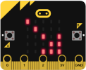

# Joystick

## **Circuito**
El esquema del montaje que vamos a realizar es el siguiente:

  
*Esquema de montaje del joystick*

Realizamos el montaje siguiente:

  
*Montaje del joystick*

## **Lectura del joystick**
Simplemente leemos los datos analógicos y digitales que suministran los potenciómetros y el pulsador.

### **MicroPython**
El programa es el siguiente:

~~~py
from microbit import *

while True:
    x = pin2.read_analog()
    y = pin1.read_analog()
    z = pin0.read_digital()
    print("x =",x,"y =",y,"z =",z)
    if z==1:
        display.show(0)
    else:
        display.show(1)
    sleep(1000)
~~~

En la siguiente animación vemos en la consola serie la variación de los datos.

  
*Lectura del joystick*

El programa de lectura del joystick lo podemos descargar de:

* [A20-Lectura del joystick](../programas/upy/A20-lec_joystick.hex)
* [A20-Lectura del joystick](../programas/upy/A20-lec_joystick-main.py)

### **MakeCode**
El programa es el siguiente:

  
*Lectura del joystick*

En la siguiente animación vemos en la consola serie la variación de los datos.

  
*Lectura del joystick*

El programa de lectura del joystick lo podemos descargar de:

* [A20-Lectura del joystick](../programas/makecode/microbit-A20-lec_joystick.hex)

### **MicroBlocks**
El programa es el siguiente:

  
*Lectura del joystick*

El programa de lectura del joystick lo podemos descargar de:

* [A20-Lectura del joystick](../programas/ublocks/A20-lec_joystick.ubp)

## **Direcciones con el joystick**
Mostraremos con flechas las orientaciones geográficas: N, NO, O, SO, S, SE, E, NE (N, NW, W, SW, S, SE, E, NE).

|Posición Joystick|Flecha|Posición Joystick|Flecha|
|:-:|:-:|:-:|:-:|
|| | | |
|||||
||||
||||
||||

Vamos establecer los pares de valores para las coordenadas (x,y) de cada orientación utilizando una aplicación como la vista anteriormente en la lectura del joystick y estableciendo dos valores estratégicos. A continuación vemos el razonamiento.

  
*Orientaciones geográficas*

### **MicroPython**
El programa es el siguiente:

~~~py
from microbit import *

while True:
    x = pin2.read_analog()
    y = pin1.read_analog()
    z = pin0.read_digital()
    if z == 0:
        display.clear()
        display.show("0")
    elif x<400 and y<700 and y>400:
        display.show(Image.ARROW_N)
    elif x>700 and y<700 and y>400:
        display.show(Image.ARROW_S)
    elif y>700 and x<700 and x>400:
        display.show(Image.ARROW_W)
    elif y<400 and x<700 and x>400:
        display.show(Image.ARROW_E)
    elif x<400 and y>700:
        display.show(Image.ARROW_NW)
    elif x<400 and y<400:
        display.show(Image.ARROW_NE)
    elif x>700 and y>700:
        display.show(Image.ARROW_SW)
    elif x>700 and y<400:
        display.show(Image.ARROW_SE)
    else:
        display.clear()
        display.show("1")
    sleep(250) # Evita parpadeo
~~~

El programa de mostrar direcciones de movimiento con el joystick lo podemos descargar de:

* [A20-Direcciones con joystick](../programas/upy/A20-dir_joystick.hex)
* [A20-Direcciones con joystick](../programas/upy/A20-dir_joystick-main.py)

### **MakeCode**
El programa es el siguiente:

  
*Direcciones con joystick*

El programa de mostrar direcciones de movimiento con el joystick lo podemos descargar de:

* [A20-Direcciones con joystick](../programas/makecode/microbit-A20-dir_joystick.hex)

### **MicroBlocks**
El programa es el siguiente:

  
*Direcciones con joystick*

El programa de mostrar direcciones de movimiento con el joystick lo podemos descargar de:

* [A20-Direcciones con joystick](../programas/ublocks/A20-dir_joystick.ubp)