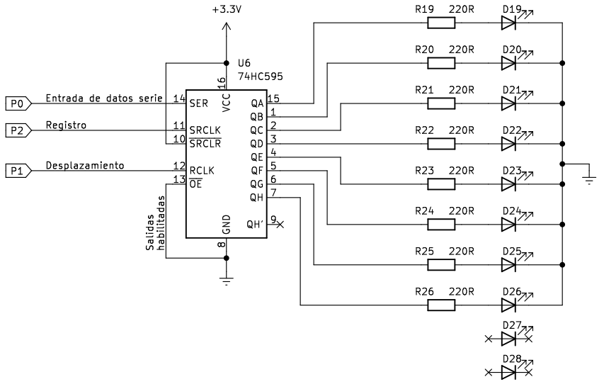
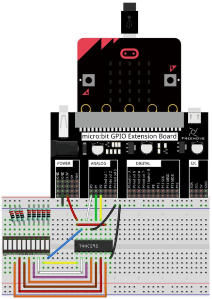
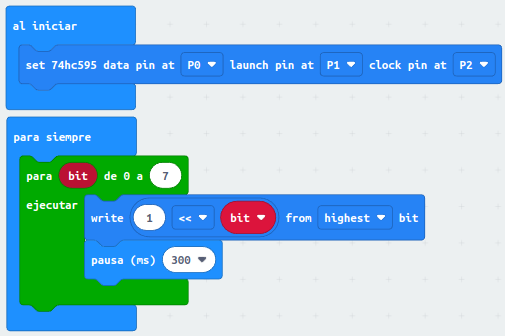
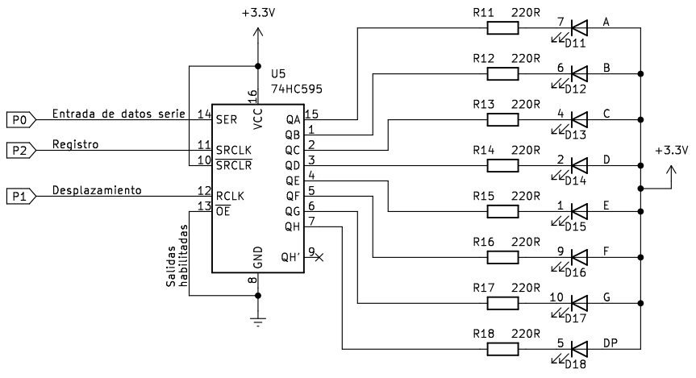
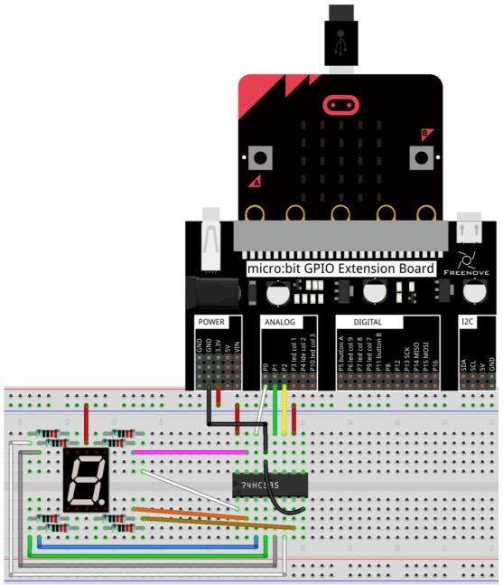
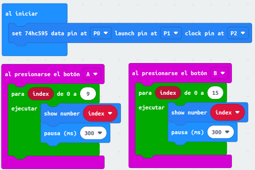

# Registro de desplazamiento
En esta actividad vamos a ver como control diodos LEDs individuales (tira de LED) y un display de 7 segmentos mediante el registro de desplazamiento 74HC595.

## **Barra de LEDs**
Vamos a controlar 8 de los diez LEDs que tiene la barra ya que el 74HC595 trabaja con 8 salidas de datos.

## **Circuito**
El esquema del montaje que vamos a realizar es el siguiente:

  
*Esquema de montaje para control de barra de LEDs con 74HC595*

Realizamos el montaje siguiente:

  
*Montaje para control de barra de LEDs con 74HC595*

## **MicroPython**
El programa es el siguiente:

~~~py
from microbit import *
# Poner valor al primero que entra
LSBFIRST=1
MSBFIRST=2

# Definir pines conectados al 74HC595
pinDatos=pin0 # Entrada datos serie - 74HC595(Pin14)
pinDesplaza=pin1 # Desplazamiento - 74HC595(Pin12)
pinRegistro=pin2 # Registro (reloj) - 74HC595(Pin11)

# Funcion para escribir datos en serie en el 74HC595
def desplazar(valor,dPin,cPin,sentido_desp):
    #En el bucle for, el valor de la variable se desplaza a la 
    #izquierda i-bit, la variable se escribe en el 74HC595 y
    #se encienden los LEDs uno a uno a través de la salida paralelo
    for i in range (8):
        cPin.write_digital(0)
        if sentido_desp==MSBFIRST:
            indicador=valor<<i & 0x80 # Cambia 1s a 0s
            if indicador==0x80:
                dPin.write_digital(1)
            else:
                dPin.write_digital(0)
        else:
            indicador=valor>>i & 0x01
            if indicador==0x01:
                dPin.write_digital(1)
            else:
                dPin.write_digital(0)
    cPin.write_digital(1)

while True:
    for i in range(8):
        valor=0x01<<i
        pinDesplaza.write_digital(0)
        desplazar(valor,pinDatos,pinRegistro,LSBFIRST)
        pinDesplaza.write_digital(1)
        sleep(200)
~~~

El programa lo podemos descargar de:

* [A21-LEDs_74HC595](../programas/upy/A21-LEDs_74HC595.hex)
* [A21-LEDs_74HC595](../programas/upy/A21-LEDs_74HC595-main.py)

## **MakeCode**
El programa es el siguiente:

  
*Barra de LEDs controlada por registro de desplazamiento*

En el bucle el número "1" se desplaza con la variable bit a la izquierda, escribe el valor via serie en el registro y muestra los datos en la salida paralela haciendo que se desplace el LED encendido.

El programa lo podemos descargar de:

* [A21-LEDs_74HC595](../programas/makecode/microbit-A21_LEDs_74HC595.hex)

## **Editor Mu**
El programa es el siguiente:

~~~py
from microbit import *

# Poner valor al primero que entra
LSBFIRST = 1
MSBFIRST = 2

# Definir pines conectados al 74HC595
pinDatos = pin0  # Entrada datos serie - 74HC595(Pin14)
pinDesplaza = pin1  # Desplazamiento - 74HC595(Pin12)
pinRegistro = pin2  # Registro (reloj) - 74HC595(Pin11)

# Funcion para escribir datos en serie en el 74HC595
def desplazar(valor, dPin, cPin, sentido_desp):
    # En el bucle for, el valor de la variable se desplaza a la
    # izquierda i-bit, la variable se escribe en el 74HC595 y
    # se encienden los LEDs uno a uno a través de la salida paralelo
    for i in range(8):
        cPin.write_digital(0)
        if sentido_desp == MSBFIRST:
            indicador = valor << i & 0x80  # Cambia 1s a 0s
            if indicador == 0x80:
                dPin.write_digital(1)
            else:
                dPin.write_digital(0)
        else:
            indicador = valor >> i & 0x01
            if indicador == 0x01:
                dPin.write_digital(1)
            else:
                dPin.write_digital(0)
    cPin.write_digital(1)

while True:
    for i in range(8):
        valor = 0x01 << i
        pinDesplaza.write_digital(0)
        desplazar(valor, pinDatos, pinRegistro, LSBFIRST)
        pinDesplaza.write_digital(1)
        sleep(200)
~~~

El programa lo podemos descargar de:

* [A21-LEDs_74HC595](../programas/ublocks/A21_LEDs_74HC595.py)

## **Display de 7 segmentos**
Creamos dos contadores, uno decimal asociado a pulsar el botón A y otro hexadecimal asociado a pulsar el botón B.

## **Circuito**
El esquema del montaje que vamos a realizar es el siguiente:

  
*Esquema de montaje para control de display de 7 segmentos con 74HC595*

Realizamos el montaje siguiente:

  
*Montaje para control de display de 7 segmentos con 74HC595*

## **MicroPython**
El programa es el siguiente:

~~~py
from microbit import *
# Definir listas con definición de caracteres (ver teoria)
num_decimal =[0xC0,0xF9,0xA4,0xB0,0x99,0x92,0x82,0xF8,0x80,0x90]
num_hexadecimal =[0xC0,0xF9,0xA4,0xB0,0x99,0x92,0x82,0xF8,0x80,0x90,0x88,0x83,0xC6,0xA1,0x86,0x8E]

# Poner valor al primero que entra
LSBFIRST=1
MSBFIRST=2

# Definir pines conectados al 74HC595
pinDatos=pin0 # Entrada datos serie - 74HC595(Pin14)
pinDesplaza=pin1 # Desplazamiento - 74HC595(Pin12)
pinRegistro=pin2 # Registro (reloj) - 74HC595(Pin11)
def desplazar(value,dPin,cPin,sentido_desp):
    for i in range (8):
        cPin.write_digital(0)
        if sentido_desp==MSBFIRST:
            indicador=value<<i & 0x80 # Cambia 1s a 0s
            if indicador==0x80:
                dPin.write_digital(1)
            else:
                dPin.write_digital(0)
        else:
            flag=value>>i & 0x01
            if flag==0x01:
                dPin.write_digital(1)
            else:
                dPin.write_digital(0)
        cPin.write_digital(1)
while True:
    if button_a.was_pressed():
        for numero in num_decimal:
            pinDesplaza.write_digital(0)
            desplazar(numero,pinDatos,pinRegistro,MSBFIRST)
            pinDesplaza.write_digital(1)
            sleep(300)
    if button_b.was_pressed():
        for numero in num_hexadecimal:
            pinDesplaza.write_digital(0)
            desplazar(numero,pinDatos,pinRegistro,MSBFIRST)
            pinDesplaza.write_digital(1)
            sleep(300)
~~~

El programa lo podemos descargar de:

* [A21-7segmentos](../programas/upy/A21-7segmentos.hex)
* [A21-7segmentos](../programas/upy/A21-7segmentos-main.py)

## **MakeCode**
El programa es el siguiente:

  
*Display de 7 segmentos controlado por registro de desplazamiento*

El programa lo podemos descargar de:

* [A21-7segmentos](../programas/makecode/microbit-A21-7segmentos.hex)

## **Editor Mu**
El programa es el siguiente:

~~~py
from microbit import *

# Definir listas con definición de caracteres (ver teoria)
num_decimal = [0xC0, 0xF9, 0xA4, 0xB0, 0x99, 0x92, 0x82, 0xF8, 0x80, 0x90]
num_hexadecimal = [
    0xC0,
    0xF9,
    0xA4,
    0xB0,
    0x99,
    0x92,
    0x82,
    0xF8,
    0x80,
    0x90,
    0x88,
    0x83,
    0xC6,
    0xA1,
    0x86,
    0x8E,
]

# Poner valor al primero que entra
LSBFIRST = 1
MSBFIRST = 2

# Definir pines conectados al 74HC595
pinDatos = pin0  # Entrada datos serie - 74HC595(Pin14)
pinDesplaza = pin1  # Desplazamiento - 74HC595(Pin12)
pinRegistro = pin2  # Registro (reloj) - 74HC595(Pin11)

def desplazar(value, dPin, cPin, sentido_desp):
    for i in range(8):
        cPin.write_digital(0)
        if sentido_desp == MSBFIRST:
            indicador = value << i & 0x80  # Cambia 1s a 0s
            if indicador == 0x80:
                dPin.write_digital(1)
            else:
                dPin.write_digital(0)
        else:
            flag = value >> i & 0x01
            if flag == 0x01:
                dPin.write_digital(1)
            else:
                dPin.write_digital(0)
        cPin.write_digital(1)

while True:
    if button_a.was_pressed():
        for numero in num_decimal:
            pinDesplaza.write_digital(0)
            desplazar(numero, pinDatos, pinRegistro, MSBFIRST)
            pinDesplaza.write_digital(1)
            sleep(300)
    if button_b.was_pressed():
        for numero in num_hexadecimal:
            pinDesplaza.write_digital(0)
            desplazar(numero, pinDatos, pinRegistro, MSBFIRST)
            pinDesplaza.write_digital(1)
            sleep(300)
~~~

El programa lo podemos descargar de:

* [A21-7segmentos](../programas/ublocks/A21_7segmentos.py)
