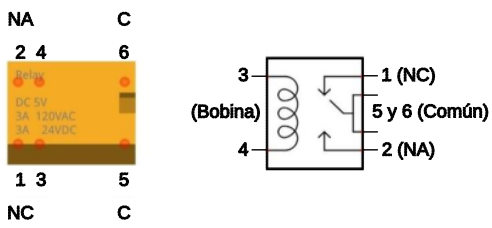
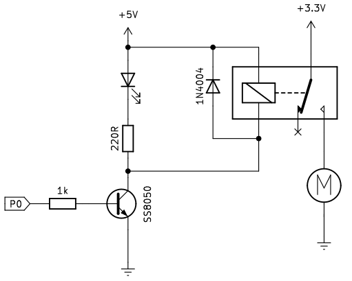
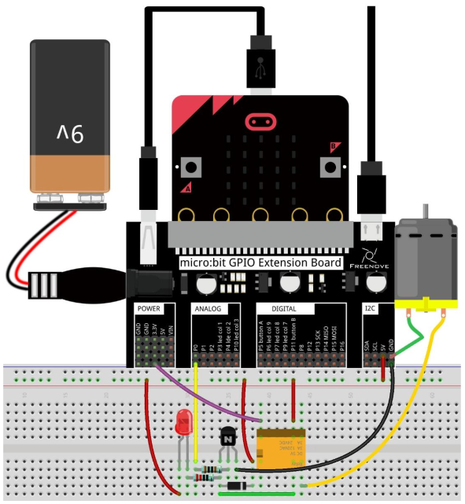
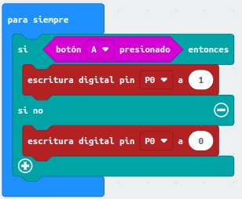
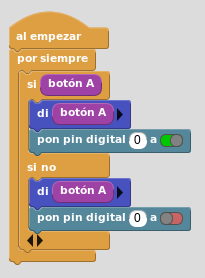

# A22. Control simple de un motor DC
Vamos a realizar el control todo o nada de un motor de corriente continua mediante un relé y un transistor de excitación de la bobina del mismo.

## **Circuito**
El relé que vamos a utilizar es un relé de pequeño tamaño de 5V con el aspecto y asignación de pines que vemos a continuación:

  
*Relé que usamos en la actividad*

El esquema del montaje que vamos a realizar es el siguiente:

  
*Esquema de montaje para control de motor DC*

Cuando en P0 tengamos un estado alto el transistor conduce, se ilumina el diodo LED, el relé se excita y el motor gira en un sentido. Si queremos cambiar el sentido de giro invertimos los pines del motor.

Realizamos el montaje siguiente:

  
*Montaje para control de motor DC*

## **MicroPython**
Un programa como el siguiente hace girar al motor mientras se mantiene presionado el botón A:

~~~py
from microbit import *

while True:
    if button_a.is_pressed():
        pin0.write_digital(True)
    else:
        pin0.write_digital(False)
~~~

Pero lo vamos a mejorar un poco haciendo que cuando se pulse A se active el motor si estaba apagado y lo desactive si estaba encendido. El programa es el siguiente:

~~~py
from microbit import *

CAMBIAR_estado = False

def write_pin0(CAMBIAR_flag):
    if CAMBIAR_flag:
        pin0.write_digital(1)
    else:
        pin0.write_digital(0)
        
while True:
    if button_a.was_pressed():
        CAMBIAR_estado = not CAMBIAR_estado
        write_pin0(CAMBIAR_estado)
~~~

El programa lo podemos descargar de:

* [A22-Control_Motor_DC](../programas/upy/A22-Control_Motor_DC.hex)
* [A22-Control_Motor_DC](../programas/upy/A22-Control_Motor_DC-main.py)

## **MakeCode**
El programa es el siguiente:

  
*Control simple de motor DC con transistor y relé*

El programa lo podemos descargar de:

* [A22-Control_Motor_DC](../programas/makecode/microbit-A22-Control_Motor_DC.hex)

## **MicroBlocks**
El programa es el siguiente:

  
*Control simple de motor DC con transistor y relé*

El programa lo podemos descargar de:

* [A22-Control_Motor_DC](../programas/ublocks/A22-Control_Motor_DC.ubp)
