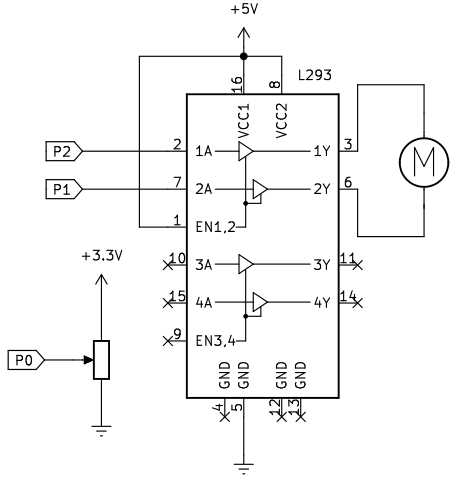
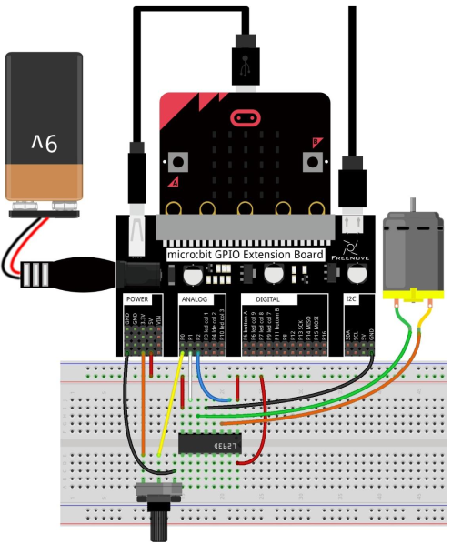
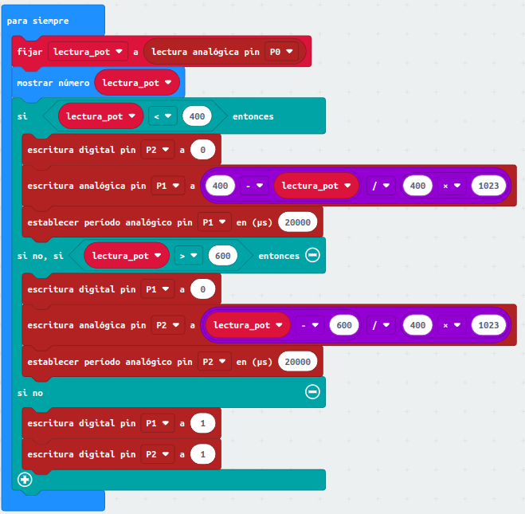
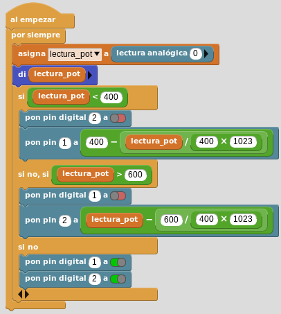

# A23. Control de un motor DC con potenciómetro
Vamos a realizar el control de un motor de corriente continua mediante un potenciómetro y el driver L293.

## **Circuito**
El esquema del montaje que vamos a realizar es el siguiente:

  
*Esquema de montaje para control de motor DC con potenciómetro*

Descargamos nuestro código en la micro:bit y giramos el potenciómetro. Las premisas de funcionamiento del motor serán:

* Potenciómetro en posición media: motor parado.
* Potenciómetro alejándose de la posición media: la velocidad del motor aumenta.
* Potenciómetro en el límite: velocidad máxima en un sentido de giro.
* Potenciómetro en el límite contrario: velocidad máxima en el sentido de giro contrario al anterior.

En el pin P0 leemos el valor analógico del potenciómetro y establecemos el siguiente sistema de funcionamiento:

* Valor analógico inferior a 400: el motor gira en un sentido
* Valor analógico mayor que 600: el motor gira en el otro sentido
* Valor analógico entre 400 y 600: motor parado.

Realizamos el montaje siguiente:

  
*Montaje para control de motor DC con potenciómetro*

## **MicroPython**
Un programa como el siguiente hace girar al motor mientras se mantiene presionado el botón A:

~~~py
'''Movemos el cursor del potenciometro lentamente mientras vamos 
viendo en el terminal serie el valor de lectura_pot. Mientras
lo hacemos observamos el funcionamiento del motor.
Debido a la inercia del motor es posible que no empiece a funcionar
en los valores exactos establecidos, dado que el valor PWM generado
no lo hace posible'''
from microbit import *
while True:
    lectura_pot=pin0.read_analog()
    print(lectura_pot) # Ayuda para mover el potenciometro
    if lectura_pot<=400:
        pin2.write_digital(0)
        pin1.write_analog(int((400-lectura_pot)/400*1023))
        pin1.set_analog_period(20)
    elif lectura_pot>=600:
        pin1.write_digital(0)
        pin2.write_analog(int((lectura_pot-600)/400*1023))
        pin2.set_analog_period(20)
    else:
        pin1.write_digital(1)
        pin2.write_digital(1)
~~~

El programa lo podemos descargar de:

* [A23-C_M_DC_Pot](../programas/upy/A23-C_M_DC_Pot.hex)
* [A23-C_M_DC_Pot](../programas/upy/A23-C_M_DC_Pot-main.py)

## **MakeCode**
El programa es el siguiente:

  
*Control de motor DC con potenciómetro*

El programa lo podemos descargar de:

* [A23-C_M_DC_Pot](../programas/makecode/microbit-A23-C_M_DC_Pot.hex)

## **MicroBlocks**
El programa es el siguiente:

  
*Control de motor DC con potenciómetro*

El programa lo podemos descargar de:

* [A23-C_M_DC_Pot](../programas/ublocks/A23-C_M_DC_Pot.ubp)
