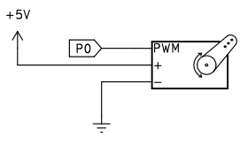
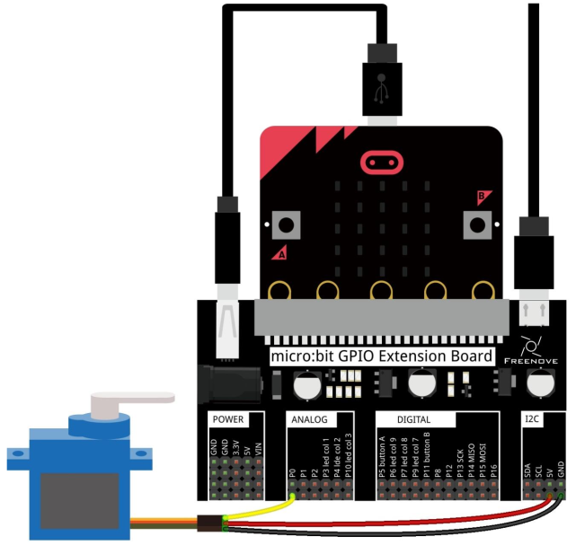
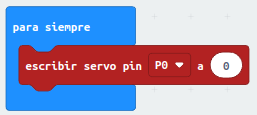
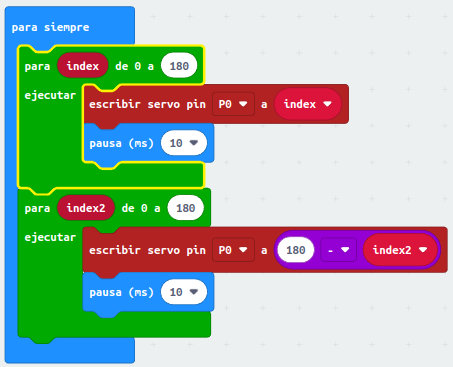
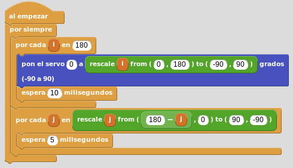
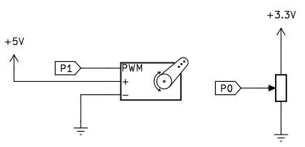
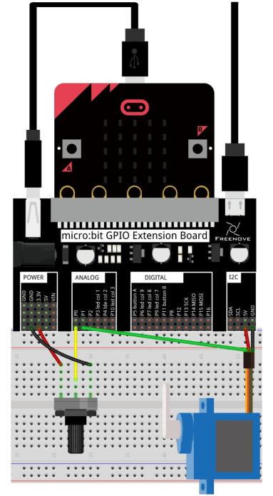
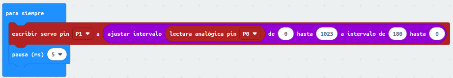
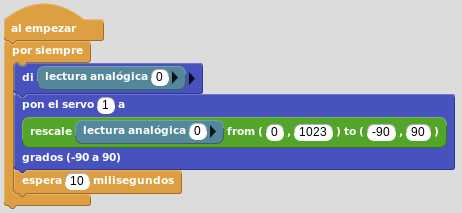

# A24. Servomotor
Vamos a realizar el control de un servomotor del tipo 9g para que se posiciones entre 0 y 180 grados.

## **Control automático**
Simplemente se trata de mover el servo entre sus dos posiciones límite de forma automática.

### **Circuito**
El esquema del montaje que vamos a realizar es el siguiente:

  
*Esquema de montaje para servo*

Realizamos el montaje siguiente:

  
*Montaje para control de servo*

Antes de hacer los programas vamos a posicionar el servo en el ángulo de cero grados para colocarle la pala que nos indicará el movimiento. Para ello creamos en MakeCode un sencillo programa como el siguiente:

  
*Posicionar servo en cero grados*

Tocando la rueda dentada del servo alimentamos el circuito y comprobamos el sentido en el que gira y justo en ese extremos estará situado el cero.

### **MicroPython**
Un programa como el siguiente hace que el servo se esté posicionando continuamente entre 0 y 180 grados.

~~~py
from microbit import *
# Ver la entrada servomotor de la sección componentes avanzados
# en el apartado Conceptos tecnicos:
# https://fgcoca.github.io/Guia-de-trabajo-para-microbit/conceptos/avanzados/#el-servomotor
while True:
    pin0.set_analog_period(20)
    for i in range(26,128,1):
        pin0.write_analog(i)
        sleep(10)
    for i in range(128,26,-1):
        pin0.write_analog(i)
        sleep(10)
~~~

El programa lo podemos descargar de:

* [A24-C_servo](../programas/upy/A24-C_servo.hex)
* [A24-C_servo](../programas/upy/A24-C_servo-main.py)

### **MakeCode**
El programa es el siguiente:

  
*Control de servomotor*

El programa lo podemos descargar de:

* [A24-C_servo](../programas/makecode/microbit-A24-C_servo.hex)

### **MicroBlocks**
Tenemos que añadir la libreria "Servomotores" para usar los bloques de la misma. El programa es el siguiente:

  
*Control de servomotor*

El programa lo podemos descargar de:

* [A24-C_servo](../programas/ublocks/A24-C_servo.ubp)

## **Control por potenciómetro**
Mover el servo entre sus dos posiciones límite accionando el cursor de un potenciómetro.

### **Circuito**
El esquema del montaje que vamos a realizar es el siguiente:

  
*Esquema de montaje de control de servo por potenciómetro*

Realizamos el montaje siguiente:

  
*Esquema de montaje de control de servo por potenciómetro*

### **MicroPython**
Un programa como el siguiente hace que el servo se posicione según la situación del cursor del potenciómetro.

~~~py
from microbit import *

def mapeo(valor,deBajo,deAlto,aBajo,aAlto):
    return (aAlto-aBajo)*(valor-deBajo) / (deAlto-deBajo) + aBajo 

while True:
    valor=pin0.read_analog()
    pin1.set_analog_period(20)
    # Ver apartado "Control de posición con Python" en el
    # apartado correspondiente
    pin1.write_analog(int((mapeo(valor,0,1023,128,25))))
~~~

El programa lo podemos descargar de:

* [A24-C_servo_pot](../programas/upy/A24-C_servo_pot.hex)
* [A24-C_servo_pot](../programas/upy/A24-C_servo_pot-main.py)

### **MakeCode**
El programa es el siguiente:

  
*Control de servomotor por potenciómetro*

El programa lo podemos descargar de:

* [A24-C_servo_pot](../programas/makecode/microbit-A24-C_servo_pot.hex)

### **MicroBlocks**
Tenemos que añadir la libreria "Servomotores" para usar los bloques de la misma. El programa es el siguiente:

  
*Control de servomotor por potenciómetro*

El programa lo podemos descargar de:

* [A24-C_servo_pot](../programas/ublocks/A24-C_servo_pot.ubp)
