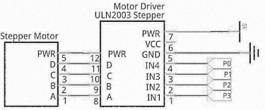
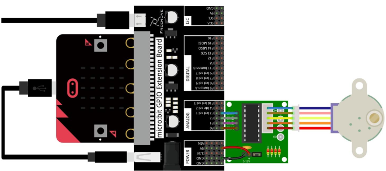
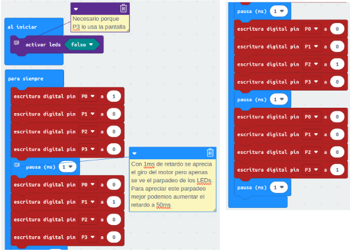
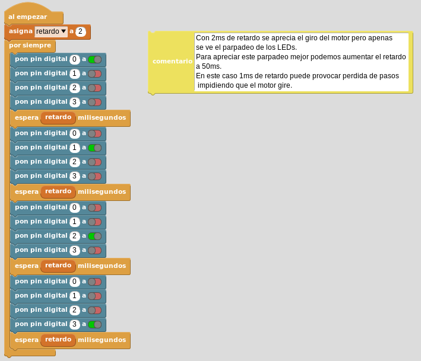

# Motor paso a paso
Vamos a crear el ejemplo base para hacer girar al motor a pasos completos por lo que vamos a necesitar 2048 pasos para dar una vuelta completa.

## **Circuito**
El esquema del montaje que vamos a realizar es el siguiente:

  
*Esquema de montaje para control de motor paso a paso 28BYJ-48*

Realizamos el montaje siguiente:

  
*Montaje para control de motor paso a paso 28BYJ-48*

## **MicroPython**
El programa es el siguiente:

~~~py
from microbit import *
display.off() #Necesario porque Pin3 lo usa la pantalla
Pin = [pin0, pin1, pin2, pin3]
while True:
    for i in Pin:
        for j in Pin:
            if i == j:
                j.write_digital(1)
            else:
                j.write_digital(0)
        #Con 2ms de retardo se aprecia el giro del motor pero apenas
        #se ve el parpadeo de los LEDs.
        #Para apreciar este parpadeo mejor podemos aumentar el retardo
        #a 50ms. En este caso 1ms de retardo puede provocar perdida de 
        #pasos impidiendo que el motor gire.
        sleep(2)
~~~

El programa lo podemos descargar de:

* [A25-C_28BYJ-48](../programas/upy/A25-C_28BYJ-48.hex)
* [A25-C_28BYJ-48](../programas/upy/A25-C_28BYJ-48-main.py)

## **MakeCode**
El programa es el que vemos en la imagen siguiente. Se han colocado parte de los bloques a un lado para mejor visualización.

  
*Control motor PaP 28BYJ-48*

El programa lo podemos descargar de:

* [A25-C_28BYJ-48](../programas/makecode/microbit-A25-C_28BYJ-48.hex)

## **MicroBlocks**
El programa lo vemos en la imagen siguiente:

  
*Control motor PaP 28BYJ-48*

El programa lo podemos descargar de:

* [A25-C_28BYJ-48](../programas/ublocks/A25-C_28BYJ-48.ubp)

