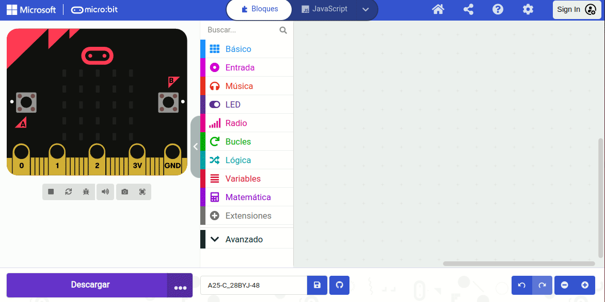

# <FONT COLOR=#8B008B>Sensor de temperatura y humedad DHT11</font>
Vamos a analizar para cada programa la forma de trabajar con este sensor.

## <FONT COLOR=#007575>**Circuito**</font>
El esquema del montaje que vamos a realizar es el siguiente:

<center>

  
*Esquema de montaje del sensor DHT11*

</center>

Realizamos el montaje siguiente:

<center>

  
*Montaje del sensor DHT11*

</center>

## <FONT COLOR=#007575>**MicroPython**</font>
En este caso resolvemos la actividad desde Mu Editor y para ello tenemos que ver la forma de trabajar. Lo primero que debemos hacer, y esto dependerá de nuestro sistema operativo, es localizar la carpeta de archivos del programa, que en mi caso es:

<center>

  
*Localización directorio de Mu Editor*

</center>

Debemos copiar el archivo [Lib_DHT11.py](../programas/upy/PythonLibrary/Lib_DHT11.py) en ese directorio una vez descargado.

Creamos el programa siguiente:

~~~py
from microbit import *
from DHT11_RW import *
uart.init(115200, 8, None, 1)

if name == "main":
    sensor = DHT11(pin0)
    while True:
        try:
            temperatura, humedad = sensor.read()
            uart_write("Temperatura:" + str(temperatura) + " C")
            uart_write("Humedad:" + str(humedad) + "%")
        except Exception as e:
            uart_write("Error: " + str(e))
        time.sleep(10)
~~~

En el editor Mu hacemos clic en "Archivos" y se mostrará la ventana siguiente, donde vemos el proceso para llevar el archivo libreria a nuestro programa. El proceso puede tardar un par de segundo y consiste en arrastrar y soltar el archivo de la ventana de la derecha en la de la izquierda.

<center>

  
*Incluir archivos en un proyecto en Mu editor*

</center>

Ya podemos grabar el programa con el botón "Flash" y ver en "REPL" los resultados.

Tras arrastrar el archivo libreria debemos tener la precaución de salvar nuestro proyecto.

El programa lo podemos descargar de:

* [A26-DHT11](../programas/upy/A26-DHT11.py)

En la figura siguiente vemos el mismo programa en el editor online con la libreria DHT cargada desde el menú Project.

<center>

  
*El programa en Python de microbit.org*

</center>

## <FONT COLOR=#007575>**MakeCode**</font>
Antes de entrar en el programa necesitamos ver como cargar la librería del sensor DHT11 y como utilizar los bloques que nos proporciona la misma.

Comenzamos por abrir la entrada "+ Extensiones" y teclear en la barra de búsqueda bien "Sensors" y localizar DHT11 o directamente "DHT11". En cualquier caso, cuando la localizamos hacemos clic sobre el icono y se no añadirá la entrada correspondiente en el menú.

<center>

  
*Localizar y añadir la libreria DHT*

</center>

La extensión puede utilizarse tanto con sensores DHT11 como DHT22. El bloque siguiente lo utilizaremos para seleccionar el tipo de sensor y configurar el mismo. Se recomienda esperar entre consultas al menos 1 segundo para el DHT11 y 2 segundos para el DHT22. Esta extensión también verifica la paridad o checksum de los sensores. Si la suma de comprobación es incorrecta, obtendremos como respuesta -999 para las lecturas de temperatura y humedad, y el bloque "¿Última consulta realizada correctamente?" (last query successful?) devolverá ```false```.

<center>

  
*Bloque de configuración del sensor*

</center>

* . Para leer el nivel de humedad (%) o la temperatura (celsius).
* . Para comprobar si los datos son correctos. Devueltre ```True``` si son correctos y ```False``` en caso contrario.
* . Por defecto la temperatura se devuelve en Celcius. Este bloque permite cambiar la lectura a Fahrenheit.

El módulo DHT puede no responder si lo consultamos inmediatamente después de encenderlo. Si estamos en este caso tendremos que reiniciar manualmente la micro:bit mientras se conecta a la alimentación, o añadir un pequeño retraso (100ms es suficiente) en el bloque "al  iniciar".

* . Permite saber si el sensor responde a la última consulta realizada.

El programa es el que vemos en la imagen siguiente:

<center>

  
*Sensor DHT11*

</center>

El programa lo podemos descargar de:

* [A26-DHT11](../programas/makecode/microbit-A26_DHT11.hex)

## <FONT COLOR=#007575>**MicroBlocks**</font>
En este caso vamos a valernos de una librería creada para otro dispositivo (Raspberry Pi pico) que nos ofrece los bloques necesarios para trabajar con los sensores DHT. Se trata de añadir la libreria PicoBricks que nos ofrece bloques para crear el programa.

<center>

  
*Agregar la libreria PicoBricks*

</center>

El programa lo vemos en la imagen siguiente, donde se ven datos obtenidos en un momento dado.

<center>

  
*Sensor DHT11*

</center>

El programa lo podemos descargar de:

* [A26-DHT11](../programas/ublocks/A26_DHT11.ubp)

<center>