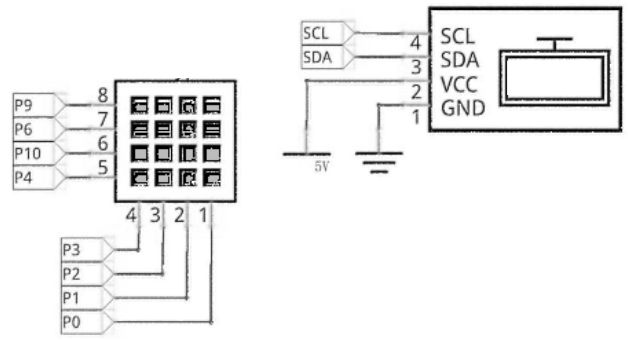
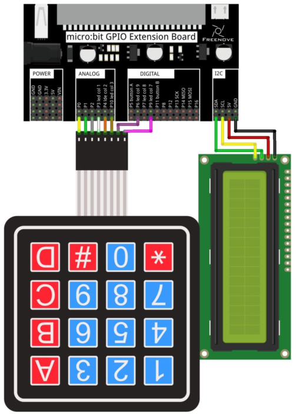
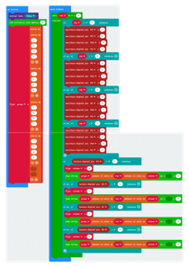
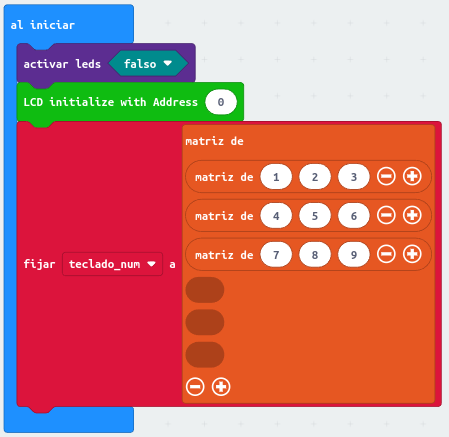
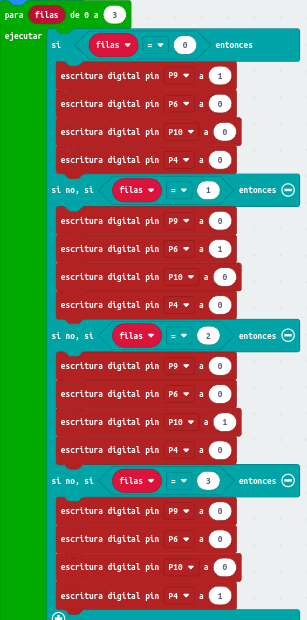
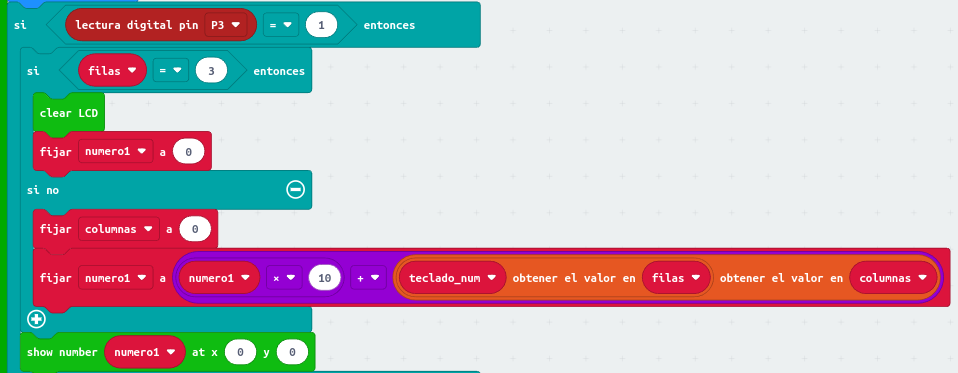
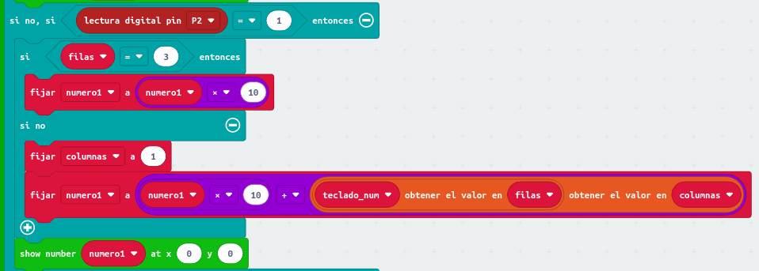
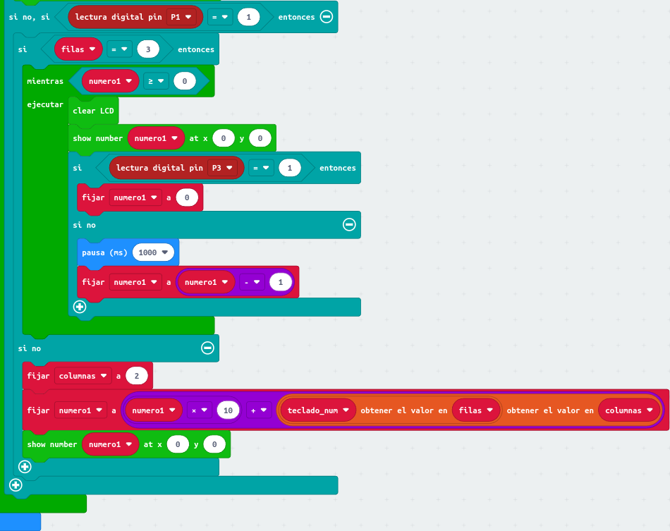

# <FONT COLOR=#8B008B>Teclado matricial de 4x4</font>
Con el mismo circuito de conexionado de una pantalla LCD1602 I2C y un teclado matricial de 4x4 vamos a crear dos ejemplos, uno para mostrar la tecla pulsada o de test y otro para crear un contador descendente o temporizador.

## <FONT COLOR=#007575>**Circuito**</font>
El esquema del montaje que vamos a realizar es el siguiente:

<center>

  
*Esquema de montaje LCD1602 I2C + teclado 4x4*

</center>

Realizamos el montaje siguiente:

<center>

  
*Montaje LCD1602 I2C + teclado 4x4*

</center>

## <FONT COLOR=#007575>**Prueba del teclado**</font>

### <FONT COLOR=#AA0000>**MicroPython**</font>
Añadimos la libreria desde el menú Project teniendo la precaución de seleccionar añadir y no reemplazar en la ventana emergente correspondiente.

El programa es el siguiente:

~~~py
from microbit import *
#agregar archivo a proyecto desde menu Project
from I2C_LCD1602 import *
display.off() #habilita pines GPIO
teclas=[["1", "2", "3", "A"], ["4", "5", "6", "B"], ["7", "8", "9", "C"], ["*", "0", "#", "D"]]
Filas = [pin9, pin6, pin10, pin4]
Columnas = [pin3, pin2, pin1, pin0]
lcd = I2C_LCD1602(0x27) #crea objeto lcd
lcd.clear()
#poner todos los pins a 0 -->>
for i in range(4):
    Filas[i].write_digital(0)
for i in range(4):
    Columnas[i].write_digital(0) # <<-- 
while True:
    for i in range(4):
        Filas[i].write_digital(1)
        for j in range(4):
            if Columnas[j].read_digital()==1:
                lcd.puts(teclas[i][j], 0, 0)
        Filas[i].write_digital(0)
~~~

El programa lo podemos descargar de:

* [A27-Test](../programas/upy/A27-Test.hex)
* [A27-Test](../programas/upy/A27-Test-main.py)

### <FONT COLOR=#AA0000>**MakeCode**</font>
El programa es el que vemos en la imagen siguiente. Se han colocado parte de los bloques a un lado para mejor visualización.

<center>

  
*Prueba teclado 4x4*

</center>

El programa lo podemos descargar de:

* [A27-Test](../programas/makecode/microbit-A27-Test.hex)

### <FONT COLOR=#AA0000>**Mu Editor**</font>
El programa es:

~~~py
from microbit import *
from I2C_LCD1602 import *  # Agregar desde Archivos

# Habilita pines GPIO
display.off()
teclado = [
    ["1", "2", "3", "A"],
    ["4", "5", "6", "B"],
    ["7", "8", "9", "C"],
    ["*", "0", "#", "D"],
]
Pines_filas = [pin9, pin6, pin10, pin4]
Pines_col = [pin3, pin2, pin1, pin0]
lcd = I2C_LCD1602(0x27)
lcd.clear()
# Se ponen todos los pines a 0 -->
for i in range(4):
    Pines_filas[i].write_digital(0)
for i in range(4):
    Pines_col[i].write_digital(0)  # <--
while True:
    for i in range(4):
        Pines_filas[i].write_digital(1)
    for j in range(4):
        if Pines_col[j].read_digital() == 1:
            lcd.puts(teclado[i][j], 0, 0)
    Pines_filas[i].write_digital(0)
~~~

El programa lo podemos descargar de:

* [A27-Test](../programas/ublocks/A27-Test_Mu.py)

## <FONT COLOR=#007575>**Contandor descendente o temporizador**</font>

### <FONT COLOR=#AA0000>**MicroPython**</font>
Añadimos la libreria desde el menú Project teniendo la precaución de seleccionar añadir y no reemplazar en la ventana emergente correspondiente.

El programa es el siguiente:

~~~py
from microbit import *
from I2C_LCD1602 import * # Agregar desde Archivos
display.off() # Habilita pines GPIO
teclado=[[1, 2, 3], [4, 5, 6], [7, 8, 9]]
Pines_filas = [pin9, pin6, pin10, pin4]
Pines_col = [pin3, pin2, pin1, pin0]
lcd = I2C_LCD1602(0x27)
lcd.clear()
numero=0
# Se ponen todos los pines a 0 -->
for i in range(4):
       Pines_filas[i].write_digital(0)
for i in range(4):
       Pines_col[i].write_digital(0)  # <--
while True:
    for i in range(4):
       Pines_filas[i].write_digital(1)
       for j in range(3):
           if Pines_col[j].read_digital()==1:
               sleep(100)
               if Pines_col[j].read_digital()==1:
                   if i==3 and j==0: #Al pulsar boton "*"
                       numero=0
                       lcd.clear()
                   elif i==3 and j==1:   #Al pulsar boton "0"
                        numero=numero*10
                   elif i==3 and j==2:   #Al pulsar boton "#"
                       while True:
                           lcd.clear()
                           lcd.puts(str(numero), 0, 0)
                           numero-=1
                           sleep(1000) # Velocidad decontar
                           if pin3.read_digital()==1 or numero==0:
                               numero=0
                               lcd.clear()
                               break
                   else:  #Al pulsar boton numerico
                       numero=numero*10+teclado[i][j]
                   lcd.puts(str(numero), 0, 0)
       Pines_filas[i].write_digital(0)
~~~

El programa lo podemos descargar de:

* [A27-temporizador](../programas/upy/A27-Temp.hex)
* [A27-temporizador](../programas/upy/A27-Temp-main.py)

### <FONT COLOR=#AA0000>**MakeCode**</font>
Vamos a ir poniendo el programa por partes explicando cada una de ellas. La primera parte es la correspondiente 'al iniciar', que desactiva la pantalla de LEDs, inicializa la LCD y almacena en una matriz las teclas numéricas del teclado.

<center>

  
*Programa del temporizador*

</center>

Se recorren las filas. Las patillas P9, P6, P10, P4 corresponden a la primera, segunda, tercera y cuarta filas. Pone los pines como salida de nivel alto por turno, mientras los otros pines son salidas de nivel bajo.

<center>

  
*Programa del temporizador*

</center>

Exploración de columnas. Los pines P3, P2, P1 corresponden a la primera, segunda y tercera columnas. Al leer un nivel alto, se ejecutan las instrucciones correspondientes.

Determina si la primera columna de la izquierda está pulsada y, a continuación, determina qué fila de la columna está está pulsada. Si se pulsa la tecla "*" (cuarta fila y primera columna), se borra el contenido de la pantalla LCD, y la variable ```numero1``` se le asigna 0; si se pulsan las otras teclas 1, 4 ó 7, la variable ```numero1``` se multiplica por 10 y se suma el valor de la tecla correspondiente, y luego se reasigna a ```numero1``` para lograr el efecto de acarreo.

<center>

  
*Programa del temporizador*

</center>

Determine si la segunda columna de la izquierda está pulsada y, a continuación, determina qué fila de la columna está pulsada. Si se pulsa la tecla "0" (cuarta fila y segunda columna), el valor de ```numero1``` se multiplica por 10, y luego se reasigna a la variable ```numero1```. Si se pulsan las otras teclas 2, 5 u 8, el valor de ```numero1``` se multiplica por 10 y se suma el valor de la tecla correspondiente, y se reasigna a ```numero1``` para lograr el efecto de acarreo.

<center>

  
*Programa del temporizador*

</center>

Determine si la tercera columna de la izquierda está pulsada y, a continuación, determina qué fila de la columna está está pulsada. Si se pulsa la tecla "#" (cuarta fila y tercera columna), se inicia la cuenta atrás mediante el bucle bucle while. Si se pulsan las otras teclas 3, 6, 9, el valor de ```numero1``` se multiplicará por 10 y el valor de la tecla correspondiente se reasigna a la variable ```numero1``` para lograr el efecto de acarreo. La variable ```numero1``` disminuirá una unidad cada segundo. Durante este ciclo, si se pulsa la tecla "*" o el valor de la variable ```numero1``` es menor o igual que 0, el bucle se termina.

<center>

  
*Programa del temporizador*

</center>

El programa lo podemos descargar de:

* [A27-temporizador](../programas/makecode/microbit-A27-Temp.hex)
