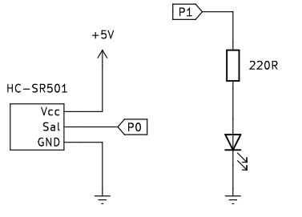
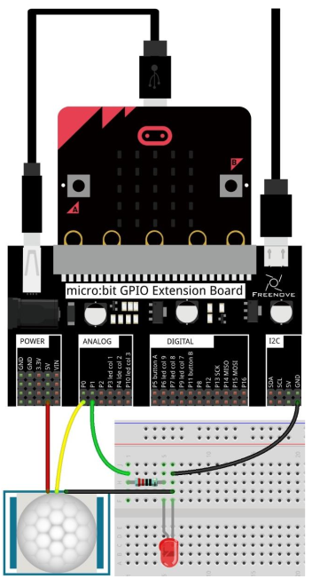
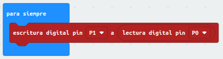
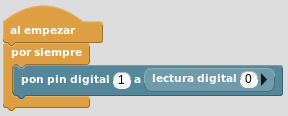

# Sensor de movimiento PIR HC-SR501

## **Circuito**
El esquema del montaje que vamos a realizar es el siguiente:

  
*Esquema de montaje del sensor PIR HC-SR501*

Realizamos el montaje siguiente:

  
*Montaje del sensor PIR HC-SR501*

## **MicroPython**
El programa es el siguiente:

~~~py
from microbit import *

while True:
    if pin0.read_digital()==1:
        pin1.write_digital(1)
    else:
        pin1.write_digital(0)
~~~

El programa lo podemos descargar de:

* [A28-Sensor PIR](../programas/upy/A28-Sensor_PIR_HC-SR501.hex)
* [A28-Sensor PIR](../programas/upy/A28-Sensor_PIR_HC-SR501-main.py)

## **MakeCode**
El programa es el que vemos en la imagen siguiente:

  
*Sensor PIR HC-SR501*

El programa lo podemos descargar de:

* [A28-Sensor PIR](../programas/makecode/microbit-A28-Sensor_PIR_HC-SR501.hex)

## **MicroBlocks**
El programa lo vemos en la imagen siguiente:

  
*Sensor PIR HC-SR501*

El programa lo podemos descargar de:

* [A28-Sensor PIR](../programas/ublocks/A28-Sensor_PIR_HC-SR501.ubp)

