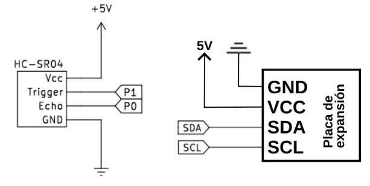
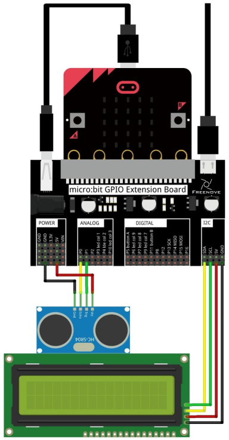
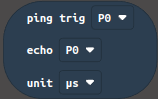
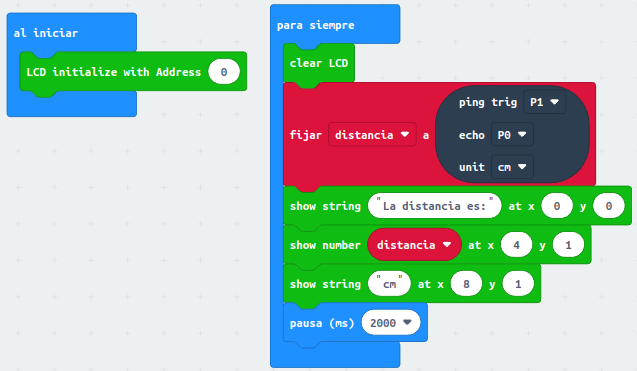
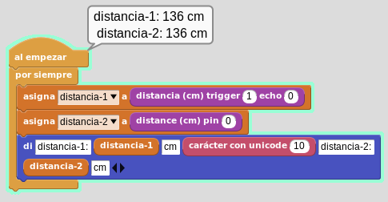

# Sensor de ultrasonidos HC-SR04

## **Circuito**
El esquema del montaje que vamos a realizar es el siguiente:

  
*Esquema de montaje del sensor de ultrasonidos HC-SR04*

Realizamos el montaje siguiente:

  
*Montaje del sensor de ultrasonidos HC-SR04*

## **MicroPython**
El programa es el siguiente:

~~~py
from microbit import *
from I2C_LCD1602 import *
from time import sleep_us,ticks_us
# Funcion para el calculo de la distancia
def calcular_distancia():
    distancia=0
    ## Genera el pulso de disparo -->
    pin1.write_digital(1)
    sleep_us(15)
    pin1.write_digital(0)
    ##<--
    while pin0.read_digital() == 0:
        pass #Maneja la condicion sin que el bucle este afectado 
    if pin0.read_digital() == 1:
        ts = ticks_us()
        while pin0.read_digital() == 1:
            pass
        te = ticks_us()
        tc = te - ts
        print(te,ts)
        distancia = (tc*170)*0.0001
    return distancia
lcd = I2C_LCD1602(0x27)
while True:
    distancia=round(calcular_distancia())
    lcd.clear()
    lcd.puts("La distancia es:",0,0)
    lcd.puts(str(distancia),5,1)
    lcd.puts("cm",9,1)
    sleep(2000)
~~~

El programa lo podemos descargar de:

* [A29-Sensor HC-SR04](../programas/upy/A29-Sensor_HC-SR04.hex)
* [A29-Sensor HC-SR04](../programas/upy/A29-Sensor_HC-SR04-main.py)

## **MakeCode**
Localizamos y añadimos de la forma habitual la librería "sonar", que dispone de un único bloque:

  
*Bloque librería Sonar*

El bloque nos permite configurar los pines de conexión y nos puede devolver, según nuestra elección en "unit", el tiempo transcurrido de la emisión de la señal hasta la recepción del rebote o la distancia, que puede devolverla en centímetros o en pulgadas.

El programa es el que vemos en la imagen siguiente:

  
*Sensor HC-SR04*

El programa lo podemos descargar de:

* [A29-Sensor HC-SR04](../programas/makecode/microbit-A29-Sensor_HC-SR04.hex)

## **MicroBlocks**
Añadimos el sensor desde la Libreria de Sensores. El programa lo vemos en la imagen siguiente:

  
*Sensor HC-SR04*

El programa lo podemos descargar de:

* [A29-Sensor HC-SR04](../programas/ublocks/A29-Sensor_HC-SR04.ubp)

