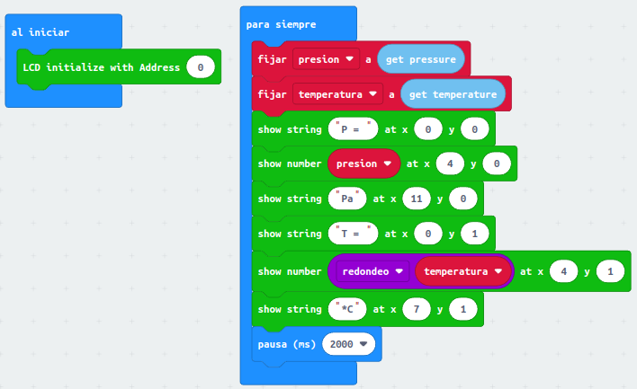
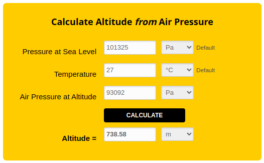

# Sensor barométrico BMP280
Realizamos el conexionado del sensor en modo I2C conectando la alimentación y los pines SDA y SCL a sus pares correspondientes de la placa de expansión. Aprovechando la doble conexión disponible utilizaremos la LCD I2C para viaulizar los datos.

Nos va a resultar útil disponer de una calculadora de presión atmotférica en altitud como [Air Pressure at Altitude Calculator](https://www.mide.com/air-pressure-at-altitude-calculator), muy sencilla de usar y donde además nos explican la relación entre presión y altitud.

## **MicroPython**
El programa, realizado con Mu Editor, es el siguiente:

~~~py
from microbit import *
import I2C_LCD1602
import BMP280

lcd = I2C_LCD1602(0x27)
lcd.on()
lcd.backlight(1)
lcd.clear()
sensor = BMP280.BMP280()
while True:
    presion = str(sensor.read_pressure)
    temperatura = str(sensor.read_temperature)
    lcd.puts("P = ", 0, 0)
    lcd.puts(presion, 4, 0)
    lcd.puts("Pa", 9, 0)
    lcd.puts("T = ", 0, 1)
    lcd.puts(temperatura, 4, 0)
    lcd.puts("*C", 7, 0)
    sleep(1000)
~~~

El programa lo podemos descargar de:

* [A30-Sensor BMP280](../programas/upy/A30-Sensor_BMP280.py)

## **MakeCode**
Localizamos y añadimos de la forma habitual la librería "BMP280".

El programa es el que vemos en la imagen siguiente:

  
*Sensor BMP280*

El programa lo podemos descargar de:

* [A30-Sensor BMP280](../programas/makecode/microbit-A30-Sensor_BMP280.hex)

Podemos introducir los datos obtenidos en la calculadora y comprobar la altitud a la que estamos situados.

  
*Calculadora*

## **MicroBlocks**
Añadimos el sensor desde la Libreria de Sensores. El programa lo vemos en la imagen siguiente:

  
*Sensor BMP280*

El programa lo podemos descargar de:

* [A30-Sensor BMP280](../programas/ublocks/A30-Sensor_BMP280.ubp)

