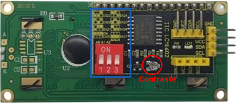
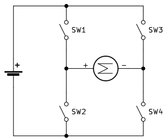

# Componentes avanzados
En este apartado iremos describiendo algunos componentes, sensores, actuadores, etc, que se utilizarán en los montajes.

## **LCD 1602 I2C**
Una pantalla LCD (del ingés, Liquid Cristal Display) I2C de 2 líneas de 16 caracteres por línea tiene el aspecto que vemos en la imagen siguiente.

  
*LCD 2x16 con módulo I2C*

En realidad el conjunto que vemos en la imagen anterior no es mas que una LCD 2x16 a la que se ha incorporado un módulo adaptador de LCD a I2C. Este modulo está especialmente diseñado para poder soldarlo directamente a la LCD y convertirla así en un dispositivo I2C que además ya lleva incorporado el potenciómetro de ajuste de contraste en alguno de los casos.

Este tipo de pantalla requiere cuatro cables para establecer las conexiones, dos cables SDA (datos) y SCL (reloj) para el bus de comunicaciones I2C y los dos cables de alimentación VCC y GND.

La dirección I2C por defecto de este tipo de módulos puede ser 0x3F o en otros casos 0x27, e incluso hay modelos en los que se puede cambiar. Para un correcto control es muy importante identificar correctamente la dirección I2C de nuestro modulo pues de otra forma nuestro programa no funcionará correctamente.

En la siguiente figura se muestra el sistema de distribución de filas y columnas.

  
*Sistema de coordenadas en una LCD 1602*

Es posible, y puede resultar necesario, cambiar la dirección física del dispositivo I2C. Esta tarea nos va a resultar especialmente útil si disponemos de LCDs I2C con una dirección fijada de fábrica y queremos conectar varias de ellas en nuestro proyecto.

### Cambiar dirección LCD SIN micro interruptores
La parte posterior de la LCD 1602 de Keyestudio tiene el aspecto de la imagen siguiente. Nos fijaremos especialmente en los tres grupos de agujeros enmarcados en rojo. Aunque en este caso no vienen nombrados los vamos a denominar A0, A1 y A2 de izquierda a derecha. En LCDs de otras marcas esto puede variar ligeramente.

  
*Pads configuración dirección física en la parte posterior LCD I2C*

La dirección por defecto de fábrica en este caso es la 0x27, pero se puede cambiar alterando la situación de conexionado de estos agujeros entre si según la tabla siguiente:

|A2|A1|A0|Dirección|
|:-:|:-:|:-:|:-:|
|0|0|0|0x27|
|0|0|1|0x26|
|0|1|0|0x25|
|0|1|1|0x24|
|1|0|0|0x23|
|1|0|1|0x22|
|1|1|0|0x21|
|1|1|1|0x20|

Para establecer los unos de la tabla anterior basta con cortocircuitar los dos pads correspondientes. En la imagen siguiente se ha establecido la dirección física como 0x26.

  
*Dirección 0x26 establecida*

#### Cambiar dirección LCD CON micro interruptores
La parte posterior de la LCD 1602 de Keyestudio con micro interruptores para cambiar su dirección física tiene el aspecto de la imagen siguiente. Nos fijaremos especialmente en el recuadro azul donde están los microinterruptores que permiten cambiar el estado del bit y encima de los mismo está la información de la dirección física que se asigna a cada combinación. La tabla es exactamente la misma que en el caso anterior.

  
*Configuración dirección física con microinterruptores*

## **Motores**
Apartado para describir los tipos de motores que habitualmente se utilizan en proyectos con micro:bit, como son los motores de corriente continua o motores DC y los servomotores.

### El motor de corriente continua
Se suelen denominar como motores DC (del inglés Direct Current) o motores CC como que son máquinas que convierten la energía eléctrica en mecánica en base a un campo magnético que provoca un movimiento de rotación en el eje del motor.

Un motor de corriente continua tiene dos partes bien diferenciadas:

>
* **Estator**. Es la parte fija del motor y son bobinas de hilo de cobre devanadas en núcleos magnéticos.
* **Rotor**. Es la parte movil del motor y suele tener forma de cilindro, también es un devanado con núcleo que se alimenta con corriente continua a través de las delgas.

En la animación de la figura siguiente vemos el principio de funcionamiento de un motor DC explicado a partir del caso de una espira conductora dentro de un campo magnético a la que se aplica una tensión entre sus extremos que hace circular por la misma una corriente eléctrica.

  
*Base de funcionamiento de un motor DC*  
**Fuente: [Wikipedia](https://es.wikipedia.org/wiki/Motor_de_corriente_continua)**

En esta imagen existe un campo magnético permanente producido por imanes en el estator. El flujo de corriente en el devanado del rotor produce una fuerza de Lorentz sobre el devanado, representada por las flechas verdes. Debido a que en este caso el motor tiene dos polos, la conmutación se hace por medio de un anillo partido a la mitad, donde el flujo de corriente se invierte cada media vuelta (180 grados).

En la figura siguiente vemos el esquema del funcionamiento de un motor de c.c. elemental de dos polos con una sola bobina y dos delgas en el rotor. Se muestra el motor en tres posiciones del rotor desfasadas 90° entre sí.

* 1, 2: Escobillas
* A, B: Delgas
* a, b: Lados de la bobina conectados respectivamente a las delgas A y B

  
*Esquema de funcionamiento de un motor DC*  
**Fuente: [Wikipedia](https://es.wikipedia.org/wiki/Motor_de_corriente_continua)**

En la figura siguiente vemos el aspecto de dos motores típicos.

  
*Aspecto de motores DC*

### Control de motores DC
Las salidas de la micro:bit no van a servir por si solas para el control de un motor DC que tendrá un consumo de hasta 1A. La solución está en realizar el control del motor a través de un controlador o driver que es gobernado por la placa de control, se alimenta de forma externa y excita al motor. En la figura siguiente vemos esquematizado el concepto.

  
*Concepto de control por driver*

El sistema mas sencillo de control todo o nada de un motor DC lo conseguimos a través de un transistor, tal y como vemos en la figura siguiente.

  
*Control de motor DC con transistor*

Pero es evidente que necesitamos un control mas completo del motor en el que se permita:

* Invertir el sentido de giro.
* Controlar la velocidad de giro.

Existen muchos drivers diferentes que consiguen estos objetivos y casi todos basan su funcionamiento en el denominado puente en H estando su principal diferencia en el circuito integrado que utilizan y la corriente máxima que es capaz de entregar.

#### Puente en H con interruptores
Vamos a explicar el funcionamiento de un puente en H utilizando para ello un circuito creado con interruptores y el principio básico de que en los motores DC el sentido de giro depende de la polaridad de alimentación. En la figura siguiente tratamos de expresar el hecho de que cambiando la polaridad de la batería cambia el sentido de giro del motor.

  
*Cambio de polaridad para cambiar sentido de giro*

El puente en H más básico que podemos construir lo vemos en la figura siguiente, donde observamos que su nombre se debe a la similitud que tiene el esquema con la letra H.

  
*Puente en H con interruptores*

Veamos las posibles combinaciones que podemos realizar accionando dos interruptores:

* **Cerramos SW1 y SW4**. Las conexiones son: positivo motor a positivo batería y negativo motor a negativo batería. Sentido de giro: horario.
* **Cerramos SW2 y SW3**. Las conexiones son: positivo motor a negativo batería y negativo motor a positivo batería. Sentido de giro: antihorario.
* **Cerramos SW1 y SW2 o SW3 y SW4**. Se provoca un CORTOCIRCUITO en la alimentación.
* **Cerramos SW1 y SW3 o SW2 y SW4**. Se cortocircuitan los terminales del motor lo que mantiene al motor frenado.

Es evidente que un puente en H así construido no nos va a servir para mucho mas que para explicar el funcionamiento del sistema, pero si reemplazamos los interruptores por un sistema de control que abra y cierre el circuito de cada interruptor es evidente que si tendremos un sistema de control del sentido de giro muy versátil.

#### Puente en H con transistores
Si a un transistor lo hacemos trabajar en conmutación su comportamiento es muy similar al de un interruptor asimilando el estado de corte del transistor al de interruptor abierto y el de saturación al de cerrado. Es entonces posible sustituir los interruptores por transistores y tendremos una configuración de puente en H como la de la figura siguiente. Este es un circuito simplificado donde además se ha añadido una lógica de control básica que permite explicar el funcionamiento.

  
*Puente en H con transistores*

Los transistores pueden ser NPN (el caso expuesto), PNP o pares complementarios y pueden ser de unión o MOSFET de potencia variando así la máxima corriente que son capaces de entregar y por lo tanto el tamaño del motor.

El funcionamiento del circuito es el siguiente:

* **Pin enable**. Si es 0 todas las puertas AND tendrán un cero en la salida un 0 con lo que los transistores están en corte y al motor no le llega alimentación. El pin enable a 1 habilita la otra entrada de las 4 puertas AND para que en la misma aparezca la otra entrada.
* **Enable = 1, IN1 = 1 e IN2 = 0**. Los transistores Q1 y Q4 se saturan por lo que el motor queda polarizado directamente tal y como se muestra en la imagen y por lo tanto girará en sentido horario.
* **Enable = 1, IN1 = 0 e IN2 = 1**. Los transistores Q2 y Q3 se saturan por lo que el motor queda polarizado inversamente y por lo tanto girará en sentido antihorario.
* **Enable = 1, IN1 = 1 e IN2 = 1**. Se saturan los transistores Q1 y Q3 y al motor solamente le llega el positivo de alimentación por lo que permanecerá parado.
* **Enable = 1, IN1 = 0 e IN2 = 0**. Se saturan los transistores Q2 y Q4 y el motor permanecerá frenado.

### El servomotor
Un servomotor o abreviado servo es un motor especial que puede posicionar su eje en un ángulo determinado y lo puede mantener en esta posición. Los servos estándar suelen girar 180º, pero es habitual encontrar servos que giran 90º y otros 360º, que son los conocidos como servos de rotación continua. En el interior del mismo están ubicados tanto la electrónica de control como los engranajes reductores que a su vez pueden llevar o no topes físicos que marquen el ángulo de giro. Para su funcionamiento sólo necesitan ser alimentados (conexiones GND y VCC o 5V) y una señal de control.

Los servomotores son en realidad motores de corriente continua a los que se les ha añadido una reductora, para que giren más despacio y con más fuerza, y un controlador electrónico que permite hacer que gire un determinado ángulo. Además, el servo en todo momento sabe en qué posición está, aunque se apague o reinicie. Esto significa que si a un servo que hemos movido a un determinado punto, lo hemos dejado sin alimentación y al alimentarlo de nuevo le indicamos que gire 90º, no va a girar 90º sino que se va a dirigir a su posición de 90º que tiene memorizada internamente.

En la figura siguiente vemos esquematizado el interior de un servo.

  
*Interior de un servo 9g*

Su aspecto real lo vemos en la figura siguiente donde también se aprecian las palas y tornilleria que lo acompañan.

  
*Aspecto real de un servo 9g*

Veamos su principio básico de funcionamiento: La electrónica de control del servomotor tiene un circuito de referencia incorporado que emite la señal de referencia, que es un ciclo de 20 ms con un ancho de pulso de 1,5 ms. Se compara la tensión de control recibida con la de referencia y se genera una diferencia de tensión. El circuito de control en la placa decidirá la dirección de rotación en consecuencia y accionará el motor. El sistema de engranajes o reductora convierten el giro del motor en un par de fuerza a través del eje. El sensor detecta que se ha alcanzado la posición enviada de acuerdo con la señal de retroalimentación. Cuando la diferencia de tensión existe el motor gira y cuando la diferencia se reduce a cero, el motor se detiene. Normalmente, el ángulo de rotación es de 0 a 180 grados, aunque existen servos de 90º y de rotación continua o 360º.

El servomotor viene con un conector hembra de tres pines para tres cables de conexión, que se distinguen por los colores marrón, rojo y naranja (diferentes marcas pueden tener diferentes colores).

El ángulo de rotación del servomotor se controla regulando el ciclo de trabajo de la señal PWM cuyo estándar es de 20 ms (50 Hz).

Existe un tipo especial de servomotor que permite la rotación continua. En algunos casos se trata de servomotores “trucados” de forma que se modifican para permitir la rotación continua quitando los topes mecánicos y se sustituye el potenciómetro por un divisor de tensión con dos resistencia iguales (en algunos casos no se ponen resistencias y se bloquea el potenciómetro para que no gire dejándolo justo en su punto central). Este tipo de modificación la podemos realizar nosotros (en la web existen multitud de tutoriales) o también podemos comprar un servomotor de rotación continua listo para funcionar sin tener que hacer ningún tipo de bricolaje.

A continuación vemos las partes de un servo típico.

  
*Despiece de un servo 9g*

### Control de un servomotor
Uno de los problemas que se nos plantean cuando cogemos un servo por primera vez es averiguar cual es su posición. Lo que nosotros hacemos cuando enviamos la señal PWM a la patilla de control del servo es indicarle a que posición queremos que se dirija. El servo a priori, mediante el potenciómetro y la electrónica de control, sabe en que posición está por lo que si le enviamos un dato con el que el servo no pueda posicionarse estará constantemente intentando buscar la posición.

En la imagen vemos las señales de posicionado del servo y los ángulos a los que se debe colocar.

  
*Señales PWM para posiconar servo*

La señal PWM debe ser tal que en un periodo (tiempo) de 20ms se debe generar un pulso de 1ms, 1.5ms o 2ms que el controlador interpretará como 0, 90 y 180 grados respectivamente. Es decir, el pulso entre 1 y 2ms irá siendo interpretado por el controlador para ir moviendo el servo hasta la posición de destino.

Lo que nosotros tendremos que programar cuando utilicemos un servo es, entre otras cosas, el ángulo en el que queremos posicionarlo que en los servos mas habituales estará comprendido entre 0 y 180º.

Una vez que hemos colocado y conectado el servo y lo posicionamos en sus distintos ángulos es momento de elegir la posición que mas nos interese para colocar la pala en su lugar, lo que dependerá de la aplicación, logicamente.

La velocidad del movimiento está condicionada por el diseño físico del propio servo y este se moverá a su máxima velocidad para cambiar de una posición a otra. Entre los movimientos programados a diferentes ángulos es conveniente programar un pequeño retardo para que al servo le de tiempo de llegar a una posición determinada antes de recibir la orden de moverse a otra. Si no lo hacemos así es muy posible que el servo inicie un movimiento de "vibración" intentando moverse de una posición a la otra.

Es evidente que habrá aplicaciones en las que nos interese controlar la velocidad a la que se mueve el servo y la forma mas sencilla de hacerlo es asociando el ángulo de giro a una variable e ir incrementando esta poco a poco. La velocidad se controla mediante el retardo entre el movimiento debido a un valor de la variable y el siguiente. Aquí debemos tener precaución con el valor del retardo y relacionarlo con el valor de incremento de la variable para que el tiempo sea suficiente para que se haga el movimiento pero no excesivamente largo que haría el movimiento global muy lento. También debemos poner un retardo fuera del bucle que provoca los movimientos para dar tiempo a que el servo retorne a su posición inicial. Lógicamente si queremos que este movimiento de regreso lo haga a velocidad controlada utilizaremos otro bucle decremental para ello.

## **Placas de expansión para micro:bit**
Aunque existen muchas versiones de distintos fabricantes en nuestro caso vamos a describir tres de ellas. Basicamente la funcionalidad de ampliación de pines es la misma en todas ellas y se distinguen porque incluyen diferentes funcionalidades, distribución de pines o drivers para motores.

### Freenove
Tiene el siguiente aspecto:

  
*Extension board de Freenove*

La placa viene preparada con:

* Un conector para alimentación externa de 7 a 12V
* Un puerto USB-Micro para conectarla al ordenador
* Un puerto USB-A colocado en vertivcal para conectar la micro:bit
* Un diodo LED D1 indicador de 5V
* Un diodo LED D2 indicador de 3.3V

### Keyestudio
Una micro:bit por si sola no tiene potencia suficiente para controlar directamente motores DC. La placa [KS4033 Keyestudio Micro bit DRV8833 Motor Driver Expansion Board](https://www.keyestudio.com/products/keyestudio-micro-bit-drv8833-motor-driver-expansion-board) incorpora un driver para motores DC con un chip DRV8833CPWP que entrega una corriente máxima de 700mA. Además, dispone de cuatro modos de control del motor: rotación en sentido horario, rotación en sentido antihorario, arranque y parada. PWM soporta frecuencias de hasta 100 kHz. Los motores van en el conector azul con clemas atornilladas para mayor facilidad y fiabilidad del conexionado. La placa también incorpora interfaces de 3 pines para conectar otros sensores.

Los pines A1, A2, B2 y B1 del conector azul de la placa de expansión son controlados por P13, P12, P15 y P16 de la placa micro:bit.

  
*Extension board de Keyestudio*

Las especificaciones técnicas de la placa son:

* Tensión de entrada VM: 5 a 10.8V DC
* Corriente de funcionamiento de la parte motriz: ≤700mA
* Configuración de salida para motor: doble puente en h
* Temperatura de trabajo: 0 a 50 ºC

A continuación vemos un diagrama típico de conexionado de motores y la alimentación de los mismos.

  
*Conexionado de la extension board de Keyestudio*

### DFROBOT
Esta placa de expansión de [DFROBOT](https://www.dfrobot.com/product-1738.html) con montaje vertical de la micro:bit tiene capacidad para controlar cuatro motores DC o dos motores paso a paso. Utiliza el controlador HR8833 con una corriente máxima de funcionamiento de 1,5A.

La placa de expansión incorpora en los conectores P, 9 pines GPIO de fácil conexionado pues incorporan Vcc y GND, En los conectores S hay disponibles 8 conexiones para servos, además de los conectores atornillados de motores.También dispone de un hub de dos conectores I2C. La placa soporta alimentación externa de 3.5V a 5.5V a través del conector DC de 2.1mm o de la clema para cables atornillados que se pueden conectar directamente a un portapilas con 3 pilas AA o AAA. La placa incorpora interruptor de encendido/apagado de la alimentación externa.

  
*Extension board de DFROBOT*

Tiene las siguientes especificaciones:

* Tensión de alimentación: 3.5 a 5.5V DC
* Tensión de salida digital: 0V / 3.3V
* Tensión de salida analógica: 0 a 3.3V DC
* Interface micro:bit: P0 P1 P2 P8 P12 P13 P14 P15 P16
* Interface servo: 8
* Interface motor: 4 motores DC / 2 motores paso a paso
