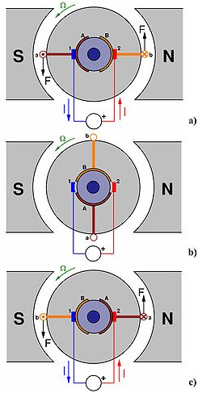
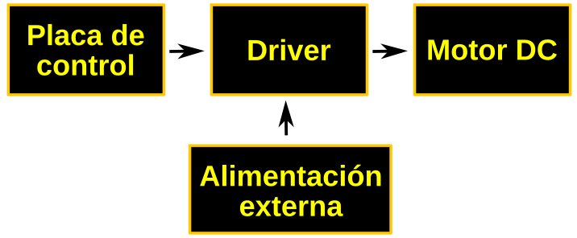

# <FONT COLOR=#8B008B>Componentes avanzados</font>
En este apartado iremos describiendo algunos componentes, sensores, actuadores, etc, que se utilizarán en los montajes.

## <FONT COLOR=#007575>**LED RGB direccionable**</font>
Comunmente se les conoce como Neopixel, que es una marca registrada por Adafruit Industries. Cada LED que componen la tira o matriz tiene los siguientes cuatro pines:

* Alimentación VDD: 5V. **MUY IMPORTANTE, 5V**
* Tierra: GND
* DI (Date Input): pin para recibir información
* DO (Date Output): pin para enviar inforamción

Cada uno de los LEDs es direccionable de manera individual gracias al circuito electrónico (circuito lógico) que incluyen con una memoria de un byte por color. Los tipos mas comunes son el SK6812, WS2811 o, el mas habitual de todos, el WS2812 cuyo [datasheet](../datasheet/WS2812.pdf) tenemos en el enlace.

El WS2812B incluye un oscilador interno de precisión y un circuito de control de corriente constante programable de 12 V, lo que garantiza de manera efectiva qimgue la intensidad del color sea consistente. El protocolo de transferencia de datos utiliza un único modo de comunicación de multiplexado NZR.

En la figura siguiente vemos el aspecto de un diodo LED RGB individual en formato inserción y SMD.

<center>

  
*Aspecto de un diodo LED RGB direccionable*

</center>

<a name="item0neo"></a>

[Aspectos previos](#item1neo)
<br> [Aspectos técnicos](#item2neo)</br><br>
[Alimentación: generalidades](#item3neo)</br><br>
[Alimentación: proyectos portátiles](#item4neo)</br><br>
[Alimentación: proyectos escritorio](#item5neo)</br><br>
[Alimentación: requisitos energia](#item6neo)</br>

<a name="item1neo"></a>

<FONT COLOR=#AA0000>Aspectos previos</font>

Para transmitir información digital esta se debe sincronizar mediante una convención especial, la codificación. Dos dispositivos llevan una comunicación por cable convirtiendo la información a transmitir en un flujo de bits (0 y 1) o "Dates" que se suele nombrar con la letra D y que va acompañada de una señal de reloj para sincronizar las transmisiones. La forma convencional de transmisión digital se componen de una línea de datos mas una línea de reloj. Ahora bien, cualquier ligera desviación en la longitud de estas líneas hará que eimgl receptor no cumpla con el tiempo de establecimiento del muestreo de datos, originando errores en los datos. La forma de asegurar que esas líneas son idénticas es que sean la misma línea, lo que hace que aparezcan códigos que fusionan los datos y el reloj, entre los que están los código RZ, NRZ y NRZI que vamos a ver someramente a continuación.

* **Codificación RZ**. El acrónimo de de "Return Zero" o retorno cero y su característica es que se transmiten bits de datos dentro de cada periodo de la señal. En la figura siguiente los datos se representan en rojo y vemos que ocupan una parte del periodo T, siendo cero el resto del tiempo. Este sistema se denomina RZ unipolar o retorno a cero unipolar y como se observa en la figura un nivel bajo indica 0 y un nivel positivo indica 1.

<center>

  
*Código RZ unipolar*

</center>

El código de retorno a cero se divide en un código de retorno a cero unipolar y un código de retorno a cero bipolar en el que el nivel alto indica 1 y el nivel negativo 0, tal y como vemos en la imagen siguiente:

<center>

  
*Código RZ bipolar*

</center>

* **Codificación NRZ**. El acrónimo es de "Not Return Zero" o código sin retorno a cero y se diferencia del RZ en que no necesita retornar a cero. En la figura siguiente vemos gráficamente el código.

<center>

  
*Código NRZ*

</center>

En el datasheet estos código se denominan T0H y T0L.

El funcionamiento de una agrupación en cascada como la de la figura siguiente se puede resumir diciendo que: el circuito integrado de cada LED puede almacenar 3 bytes (24 bits), un byte para cada color. Solo el primer LED está conectado al Pin de control, en este caso, un pin digital de nuestra placa, que enviará la cadena de todos los colores según el número de pixeles que estén conectados y a su vez el primer LED recibirá la información de todos los colores uno tras otro. La información se transmite de un LED a otro porque cuando un LED recibe 3 bytes nuevos de información entrega al siguiente LED los 3 bytes que contenía anteriormente, de esta manera cuando la placa con el programa termina de mandar todos los colores por el pin de datos el primer LED habría recibido y enviado todos los colores para quedarse finalmente con el color que le corresponde y así el resto de LEDs. De esta forma una tira de LEDs RGB direccionables es un dispositivo digital de salida, es decir su funcionamiento consiste en recibir la información del color a mostrar y mostrarlo.

<center>

  
*Conexión en cascada de LEDs RGB direccionables*

</center>

[Volver](#item0neo)
<a name="item2neo"></a>

<FONT COLOR=#AA0000>Aspectos técnicos</font>

Los LEDs RGB direccionables se suelen suministrar en tiras de diferentes longitudes y con distinto número de LEDs y a veces se dispone la tira en forma de matriz. En la figura siguiente vemos el aspecto de algunos tipos.

<center>

  
*Tira y matriz de LEDs RGB direccionables*

</center>

Tienen 3 cables asociados a un conector y dos cables extra para añadir alimentación externa cuando es necesario porque la placa de control no entrega suficiente corriente para alimentar al conjunto. Cuando se trabaja con una tira de pocos LEDs no es necesario añadir esta alimentación externa, ya que placas como Arduino UNO o la ESP32 STEAMakers pueden suministrar la corriente que necesitan.

Cualquier tira de LEDs RGB (sea cual sea su disposición en línea, como matriz, etc) debe utilizarse siempre en la dirección que marca el terminal hembra como entrada y el conector macho como salida. Las podemos ir conectando entre sí pero siempre respetando este sentido de la tira. Junto a cada led RGB está indicada la dirección de la tira mediante un triángulo y también a qué pin debe ir conectado cada cable. Vemos +5V que corresponde a Vcc, GND, y en medio que pone Din o D0 que corresponde al pin digital de entrada de datos que debemos conectar al pin de salida de la placa de control.

También las podemos cortar por cualquiera de las líneas existentes entre cada uno de los LEDs y que está marcado con la línea de corte. El corte debe hacerse dejando la mitad del pad de cobre a un lado y otro de la línea y así poder unir después entre ellas con conectores especializados o soldándolas.

<center>

  
*Dirección y línea de corte en tira de LEDs RGB direccionables*

</center>

Otra configuración con este tipo de dispositivos lo vemos a continuación:

<center>

  
*Módulo de 8 de LEDs RGB direccionables*

</center>

Estos módulos son enchufables y por tanto ampliables. En la parte posterior están claramente marcados los pines de entrada y los de salida por lo que podemos conectarlos en cascada.

<center>

  
*Conexionado de tres módulos de 8 LEDs RGB direccionables*

</center>

[Volver](#item0neo)
<a name="item3neo"></a>

<FONT COLOR=#AA0000>Alimentación de Neopixel</font>

Vamos a comenzar por dar de forma destacada las tres recomendaciones que indican en la guía de Adafruit, que son:

<center>

  

</center>

[Volver](#item0neo)
<a name="item4neo"></a>

<FONT COLOR=#FFA00FF>Proyectos portátiles</font>

Se configuran con relativamente pocos LEDs y por lo tanto no tienen un excesivo consumo por lo que podemos alimentarlos con pilas o baterías.

* Las baterías recargables de una celda (figura siguiente) de polímero de litio entregan 3,7V que son perfectos para alimentar microcontroladores y unos pocos LEDs direccionables.

<center>

  
*Baterías Lipo 1S*

</center>

* Pilas AA o AAA. Se pueden usar tres pilas alcalinas con su correspondiente portapilas. Esto proporciona 4.5V. El inconveniente respecto a las baterías lipo es que son mas grandes y pesadas y la ventaja es que son muy fáciles de conseguir.

* Pilas recargables de hidruro metálico de níquel. En este caso hay que utilizar cuatro unidades de 1.2V con su soporte de cuatro celdas. Esto nos va a proporcionar 4.8V. Tenemos que asegurarnos de usar solamente pilas NiMH porque si colocamos pilas normales de 1.5V estaremos creando una tensión total de 6V y esto es muy probable que rompa el microcontrolador o algún LED.

* Otros medios pueden ser utilizar porwerbanks de la tensión adecuada o alguna de las anteriores de mayor tensión intercalando un convertidor reductor que se adapte a las condiciones de entrada de tensión de que disponemos y que su salida suministre los 5V requeridos. Hay que tener en cuenta el rango de tensión de entrada que requiere el convertidor específico y la corriente máxima de salida.amperimetro

[Volver](#item0neo)
<a name="item5neo"></a>

<FONT COLOR=#FFA00FF>Proyectos de escritorio</font>

Si estamos hablando de tiras de hasta un metro con una fuente de alimentación conmutada de 5V/2A en CC típica tendremos suficiente.

Si se requiere mas corriente resulta tentador utilizar una fuente de laboratorio, pero hay que mucho cuidado porque pueden producir un gran pico de tensión cuando se encienden. Este pico es mas que suficiente para destruir instantáneamente los LEDs direccionables.

Si se usa una fuente de laboratorio, **NO** conectamos la tira directamente. Primero encendemos la fuente de alimentación, dejamos pasar unos segundo que el voltaje se estabilice, luego conectamos la tira, asegurándonos de conectar en primer lugar GND.

[Volver](#item0neo)
<a name="item6neo"></a>

<FONT COLOR=#FFA00FF>Requisitos de energia</font>

Cada LED individual consume hasta 60 miliamperios con el máximo brillo blanco (rojo + verde + azul). Sin embargo, en el uso real, es raro que todos los píxeles se enciendan de esa manera. Al mezclar colores y mostrar animaciones, el consumo puntual será mucho menor. Es imposible estimar un número para todas las circunstancias, pero se ha experimentado que usando la tercera parte de los 60 mA (20 mA por píxel) como regla general funciona correctamente. Pero si sabemos con certeza que necesitamos cada píxel con el máximo brillo, tenemos que usar la cifra 60 mA.

Para estimar las necesidades de suministro de energía, basta multiplicar la cantidad de píxeles por 20, o por 60 mA y obtendremos el consumo total en miliamperios. Por ejemplo:

<center>

8 LEDs x 20 mA = 160 mA (muy cercano a los 190 mA máximo de borde de placa en micro:bit)

60 LEDs × 20 mA = 1200 mA = 1.2 A como mínimo

60 LEDs × 60 mA = 3600 mA = 3.6 A como mínimo

256 LEDs x 20 mA = 5120 mA = 5.12 A como mínimo

256 LEDs x 60 mA = 15360 mA = 15.36 A como mínimo

</center>

Parece evidente que en casi todos los casos hay que recurrir a una alimentación externa, ya sea directamente a los LEDs o a través de una placa de expansión alimentada de manera adecuada para que no sea la micro:bit la que entrega la corriente demandada.

La elección de la fuente de alimentación depende de nosotros pero es evidente que la máxima seguridad y fiabilidad se consigue con una fuente de alimentación de dimensiones más generosas, y esto es lo que recomendamos. La mayoría de las fuentes de alimentación pueden entregar un poco de corriente adicional durante períodos breves de tiempo e incluso algunas contienen un fusible térmico y simplemente se apagarán si se sobrecargan. Por lo tanto, aunque técnicamente pueden funcionar, digamos que no es recomendable abusar de ellas.

Un factor a tener en cuenta es que si vamos a alimentar con baterías estas se vuelven progresivamente mas pesadas, costosas y peligrosas, así que por razones de seguridad habría que minimizar el tamaño de las baterías.

Por otro lado tenemos que tener en cuenta la sección del conductor que será más barato y menos pesado cuanto menor sea esta, es decir, cuanta menor corriente deba soportar y que cuanto menor sea la corriente menor será el calor generado.

En general podemos decir que:

* La regla general de los "60 miliamperios" es solo eso... una regla general, no ciencia pura.
* Al animar y mezclar colores, el consumo de corriente será menor. A veces mucho menos.
* Incluso cuando se establece el color en 0 (LEDs apagados), la lógica del controlador dentro de cada Pixel usa una pequeña cantidad de corriente por debajo de 1 miliamperio por píxel, pero con muchos píxeles esto debería también sumarse.

La biblioteca NeoMatrix utiliza la corrección gamma para seleccionar niveles de brillo que son visualmente (aunque no numéricamente) equidistantes. Hay 32 niveles para rojo y azul, 64 niveles para verde. La función Color() realiza la conversión necesaria; no necesitamos hacer ningún cálculo. Acepta valores de rojo, verde y azul de 8 bits y devuelve un color de 16 bits con corrección gamma.

La respuesta final a todo esto es que usualmente los LEDs no estarían encendidos todos juntos, por lo que elegir una fuente de alimentación se vuelve una adivinanza. Podemos asumir para nuestros proyectos que el 75% de los pixels están encendidos en cualquier momento y que cada uno tiene solo un color, con lo que las corrientes anteriores quedan así:

<center>

60 LEDs: 45×20 mA = 0.9 A

256 LEDs: 192 x 20 mA = 3.84 A

512 LEDs: 384 x 20 mA = 7.68 A

</center>

La única forma 100% segura de saber con certeza el consumo es programar las luces y medir el consumo de corriente con un amperímetro.

## <FONT COLOR=#007575>**Placas de expansión para micro:bit**</font>
Aunque existen muchas versiones de distintos fabricantes en nuestro caso vamos a describir tres de ellas. Basicamente la funcionalidad de ampliación de pines es la misma en todas ellas y se distinguen porque incluyen diferentes funcionalidades, distribución de pines o drivers para motores.

<a name="item0exp"></a>

[Freenove](#item1exp)
<br> [Keyestudio](#item2exp)</br><br>
[DFROBOT](#item3exp)</br>

<a name="item1exp"></a>

<FONT COLOR=#AA0000>Freenove</font>

Tiene el siguiente aspecto:

<center>

  
*Extension board de Freenove*

</center>

La placa viene preparada con:

* Un conector para alimentación externa de 7 a 12V
* Un puerto USB-Micro para conectarla al ordenador
* Un puerto USB-A colocado en vertivcal para conectar la micro:bit
* Un diodo LED D1 indicador de 5V
* Un diodo LED D2 indicador de 3.3V

Para los mas expertos (requiere bastantes conocimientos de electrónica) aquí dejo el [esquema de la placa de control](../datasheet/Esquema_ControlBoard.pdf)

[Volver](#item0exp)
<a name="item2exp"></a>

<FONT COLOR=#AA0000>Keyestudio</font>

Una micro:bit por si sola no tiene potencia suficiente para controlar directamente motores DC. La placa [KS4033 Keyestudio Micro bit DRV8833 Motor Driver Expansion Board](https://www.keyestudio.com/products/keyestudio-micro-bit-drv8833-motor-driver-expansion-board) incorpora un driver para motores DC con un chip DRV8833CPWP que entrega una corriente máxima de 700mA. Además, dispone de cuatro modos de control del motor: rotación en sentido horario, rotación en sentido antihorario, arranque y parada. PWM soporta frecuencias de hasta 100 kHz. Los motores van en el conector azul con clemas atornilladas para mayor facilidad y fiabilidad del conexionado. La placa también incorpora interfaces de 3 pines para conectar otros sensores.

Los pines A1, A2, B2 y B1 del conector azul de la placa de expansión son controlados por P13, P12, P15 y P16 de la placa micro:bit.

<center>

  
*Extension board de Keyestudio*

</center>

Las especificaciones técnicas de la placa son:

* Tensión de entrada VM: 5 a 10.8V DC
* Corriente de funcionamiento de la parte motriz: ≤700mA
* Configuración de salida para motor: doble puente en h
* Temperatura de trabajo: 0 a 50 ºC

A continuación vemos un diagrama típico de conexionado de motores y la alimentación de los mismos.

<center>

  
*Conexionado de la extension board de Keyestudio*

</center>

[Volver](#item0exp)
<a name="item3exp"></a>

<FONT COLOR=#AA0000>DFROBOT</font>

Esta placa de expansión de [DFROBOT](https://www.dfrobot.com/product-1738.html) con montaje vertical de la micro:bit tiene capacidad para controlar cuatro motores DC o dos motores paso a paso. Utiliza el controlador HR8833 con una corriente máxima de funcionamiento de 1,5A.

La placa de expansión incorpora en los conectores P, 9 pines GPIO de fácil conexionado pues incorporan Vcc y GND, En los conectores S hay disponibles 8 conexiones para servos, además de los conectores atornillados de motores.También dispone de un hub de dos conectores I2C. La placa soporta alimentación externa de 3.5V a 5.5V a través del conector DC de 2.1mm o de la clema para cables atornillados que se pueden conectar directamente a un portapilas con 3 pilas AA o AAA. La placa incorpora interruptor de encendido/apagado de la alimentación externa.

<center>

  
*Extension board de DFROBOT*

</center>

Tiene las siguientes especificaciones:

* Tensión de alimentación: 3.5 a 5.5V DC
* Tensión de salida digital: 0V / 3.3V
* Tensión de salida analógica: 0 a 3.3V DC
* Interface micro:bit: P0 P1 P2 P8 P12 P13 P14 P15 P16
* Interface servo: 8
* Interface motor: 4 motores DC / 2 motores paso a paso

## <FONT COLOR=#007575>**Conexionado con placa de expansión**</font>
Usaremos para explicarlo la placa de Freenove que es bastante completa en este aspecto. Tenemos varios casos posibles de conexionado según necesidades.

* **Directo**. Si el dispositivo externo no requiere tensiones diferentes de 3.3V y el consumo previsto es bajo. El conexionado puede ser:

<center>

  
*Conexionado directo*

</center>

* **Baja potencia y alimentación externa**. Si el dispositivo externo utiliza un voltaje de 5V, pero la potencia necesaria no es grande, se puede utilizar el siguiente sistema:

<center>

  
*Conexionado para dispositivo 5V y bajo consumo*

</center>

Los reguladores AMS1117 que incorpora la placa tienen capacidad de suministrar hasta 1A de corriente máxima para la alimentación de 3.3V.

* **Externa** . Si el dispositivo externo utiliza un voltaje de 5V y el consumo es elevado se puede utilizar el siguiente sistema:

<center>

  
*Conexionado para dispositivo 5V y consumo elevado*

</center>

## <FONT COLOR=#007575>**Modelo de color HSL**</font>
El modelo **HSL** o a veces **HSI** (siglas del inglés Hue, Saturation, Lightness o Intensity; traducido por, ‘matiz, saturación, luminosidad o intensidad’), define un modelo de color en términos de sus componentes constituyentes.

En el modelo de color **HSV**, un color se define por su matiz o tono (H), su saturación (S) y su luminosidad o intensidad (L). Ahora las siglas no significan colores como en RGB, sino parámetros.

La variedad de colores se obtiene cambiando los tres canales de color de tono (H), saturación (S) y luminosidad (L) y superponiéndolos entre sí. Este modo de color cubre los colores que puede percibir la visión humana.

Se suele representar mediante la rueda de color, como vemos a continuación:

<center>

  
*Rueda de color HSL*

</center>

* **Tono, matiz o Hue (H)**. En el círculo cromático el grado 0 (o 360º si hemos dado una vuelta completa) del Hue es el color rojo. El circulito rodeado corresponde al ángulo en la rueda de color. Cada ángulo representa un color. En esa posición la saturación S por defecto tomma su valor máximo de 100, y el brillo (L) es de 50. Nos podemos mover con estas condiciones por la rueda y obtener los distintos colores para esos valores de saturación o brillo.

<center>

  
*Cambios de tono (H) en la rueda de color HSL*

</center>

* **Saturación o Saturation (S)**. Indica la intensidad de un tono concreto. Los valores varian entre 0 y 100, siendo 100 el máximo de saturación posible y 0 el mínimo, que dará como resultado, gris. El parámetro cambia sus valores moviendose dentro del triángulo en la línea del díametro del círculo que corresponde a la posición del ángulo determinado por H.

<center>

  
*Cambios de saturación (S) en la rueda de color HSL*

</center>

Observamos que al acercarnos al gris el valor de H se restablece a su valor por defecto. Hasta ese punto el tono se mantiene en el valor definido.

* **Luminosidad o Lightness (L)**. El parámetro se refiere a como de claro u oscuro es un color. Si queremos aclarar un color nos moveremos hacia el blanco y si quiero oscurecerlo hacia el negro.

<center>

  
*Cambios de luminosidad (L) en la rueda de color HSL*

</center>

Hay un parámetro que suele acompañar a la rueda de color que es el Alfa (A), que puede variar entre 0 y 100 y se refiere al grado de opacidad del color, correspondiendo 100 a totalmente opaco y 0 a totalmente transparente.

<FONT COLOR=#AA0000>Convertir RGB a HSL</font>

Nos vamos a basar en un ejemplo descrito por los valores R=90, G=220, B=80 correspondiente a un tono verde oscuro.

<center>

  
*R=90, G=220, B=80*

</center>

* **Paso 1. Máximo y Mínimo**. Convertimos los valores RGB a valores en el rango 0-1 dividiendo por 255 cada valor.

<center>

$R = \dfrac{90}{255}= 0.353 \space; \space G = \dfrac{220}{255}= 0.863 \space; \space B = \dfrac{80}{255}= 0.314$

$\boxed{R = 0.353 \space; \space G = 0.863 \space(Max) \space; \space B = 0.314 \space(Min)}$

</center>

* **Paso 2. Luminancia**. Calculamos la Luminancia sumando los valores máximo y mínimo obtenidos en el paso 1 y lo dividimos por 2.

<center>

$L \space = \space \dfrac{0.863 + 0.314}{2} \space= \space 0.5885 \space\approx59 \%$

$\boxed{L \space = \space 0.5885 \space \approx 59 \%}$

</center>

* **Paso 3. Saturación**. A la hora de calcular la saturación S tendremos en cuenta que:

>
- <b>Si los valores máximo y mínimo son iguales: No hay saturación.
- Si todos los valores RGB son iguales: Tono gris mas o menos oscuro o claro dependiendo de la luminosidad.
- Si no hay saturación el Tono será 0º.</b>

Si no se da alguna de las condiciones anteriores sabemos que hay Saturación, que se calcula según sea el nivel de Luminancia:

$\Rightarrow$ **Si $L \leq 0.5$**

<center>
$S = \dfrac{Max-Min}{Max+Min}$
</center>

$\Rightarrow$ **Si $L > 0.5$**

<center>
$S = \dfrac{Max-Min}{2.0-Max-Min}$

$S = \dfrac{0.863-0.314}{2-0.863-0.314} = \dfrac{0.549}{0.823}=0.667 \approx 67 \%$

$\boxed{S = 0.667 \approx 67 \%}$

</center>

* **Paso 4. Tono**. La fórmula del Tono depende de qué canal de color RGB es el valor máximo. Las tres fórmulas diferentes son:

$\Rightarrow$  Si **Rojo** es el máximo, entonces:

<center>
$H = \dfrac{G-B}{Max-Min}$
</center>

$\Rightarrow$  Si **Verde** es el máximo, entonces:

<center>
$H = 2.0 + \dfrac{B-R}{Max-Min}$

$H = 2.0 + \dfrac{0.314-0.353}{0.863-0.314} = 2.0 + \dfrac{(-0.039)}{0.549} = 1.929$

$\boxed{H=1.929}$
</center>

$\Rightarrow$  Si **Azul** es el máximo, entonces:

<center>
H = 4.0 + \dfrac{R-G}{Max-Min}$
</center>

El valor obtenido de H lo multiplicamos por 60 para convertirlo en grados en el círculo cromático. Si resulta un valor negativo de H le sumamos 360.

<center>

$H = 1.929 \times 60 = 115.74 \approx 116 \space grados$

$\boxed{H=116 \space grados}$

</center>

Resultado final:

<center>
R = 90, G = 220, B = 80

H = 116, S = 67, L = 59
</center>

<FONT COLOR=#AA0000>Convertir HSL a RGB</font>

En el mismo sitio en que hemos basado la conversión de RGB a HSL de [Nikolai Waldman](https://www.niwa.nu/2013/05/math-behind-colorspace-conversions-rgb-hsl/) está documentado como hacerlo a la inversa, pero nosotros no lo vamos a hacer de este modo.

Se encuentran facilmente en la web páginas con calculadoras que permiten convertir de un modelo a otro con tan solo introducir los valores. Algunas incluso indican las fórmulas de cálculo, que usualmente están basadas en la entrada [HSL and HSV](https://en.wikipedia.org/wiki/HSL_and_HSV#Converting_to_RGB) de la Wikipedia. A título de ejemplo aquí pongo la de [rapidtables](https://www.rapidtables.org/convert/color/hsl-to-rgb.html), que ofrece muchas calculadoras en línea gratuitas

Hay una forma de hacerlo a partir de un programa libre como es Inkscape, publicado bajo licencia **GNU General Public License, version 3** y que hemos utilizado para las animaciones donde se han explicado los conceptos y donde además se pueden obtener otros datos y por supuesto modificarlos.

Es muy sencillo de utilizar y nos ofrece además otras posibilidades interesantes. Veamos como llegar a ello una vez abierto Inkscape con un archivo en blanco.

Dibujamos cualquier cosa y abrimos las opciones de Relleno y borde del objeto y desde ahí ya podemos cambiar el modelo de color, activar la rueda, mover la rueda o los valores lineales, volver a cambiar de modelo, etc y se nos irán mostrando los valores convetidos de uno a otro, como se observa en la animación siguiente cuando cambiamos del modelo HSL a RGB.

<center>

  
*Modelos de color con Inkscape*

</center>

## <FONT COLOR=#007575>**LCD 1602 I2C**</font>
Una pantalla LCD (del ingés, Liquid Cristal Display) I2C de 2 líneas de 16 caracteres por línea tiene el aspecto que vemos en la imagen siguiente.

<center>

  
*LCD 2x16 con módulo I2C*

</center>

En realidad el conjunto que vemos en la imagen anterior no es mas que una LCD 2x16 a la que se ha incorporado un módulo adaptador de LCD a I2C. Este modulo está especialmente diseñado para poder soldarlo directamente a la LCD y convertirla así en un dispositivo I2C que además ya lleva incorporado el potenciómetro de ajuste de contraste en alguno de los casos.

Este tipo de pantalla requiere cuatro cables para establecer las conexiones, dos cables SDA (datos) y SCL (reloj) para el bus de comunicaciones I2C y los dos cables de alimentación VCC y GND.

La dirección física I2C por defecto de este tipo de módulos depende del circuito integrado utilizado para realizar la conversión paralelo a serie. Los mas habituales son el PCF8574T que tiene la dirección 0x27 o bien el PCF8574AT que tienen la dirección 0x3F. También es habitual que se pueda cambiar la dirección física dentre de un rango de 8 valores (3 bits). Para un correcto control es muy importante identificar correctamente la dirección I2C de nuestro modulo pues de otra forma nuestro programa no funcionará correctamente.

En la siguiente figura se muestra el sistema de distribución de filas y columnas.

<center>

  
*Sistema de coordenadas en una LCD 1602*

</center>

Es posible, y puede resultar necesario, cambiar la dirección física del dispositivo I2C. Esta tarea nos va a resultar especialmente útil si disponemos de LCDs I2C con una dirección fijada de fábrica y queremos conectar varias de ellas en nuestro proyecto.

### <FONT COLOR=#AA0000>Cambiar dirección LCD SIN micro interruptores</font>
La parte posterior de la LCD 1602 de Keyestudio tiene el aspecto de la imagen siguiente. Nos fijaremos especialmente en los tres grupos de agujeros enmarcados en rojo. Aunque en este caso no vienen nombrados los vamos a denominar A0, A1 y A2 de izquierda a derecha. En LCDs de otras marcas esto puede variar ligeramente.

<center>

  
*Pads configuración dirección física en la parte posterior LCD I2C*

</center>

La dirección por defecto de fábrica en este caso es la 0x27, pero se puede cambiar alterando la situación de conexionado de estos agujeros entre si según la tabla siguiente:

<center>

|A2|A1|A0|Dirección|
|:-:|:-:|:-:|:-:|
|0|0|0|0x27|
|0|0|1|0x26|
|0|1|0|0x25|
|0|1|1|0x24|
|1|0|0|0x23|
|1|0|1|0x22|
|1|1|0|0x21|
|1|1|1|0x20|

</center>

Para establecer los unos de la tabla anterior basta con cortocircuitar los dos pads correspondientes. En la imagen siguiente se ha establecido la dirección física como 0x26.

<center>

  
*Dirección 0x26 establecida*

</center>

### <FONT COLOR=#AA0000>Cambiar dirección LCD CON micro interruptores</font>
La parte posterior de la LCD 1602 de Keyestudio con micro interruptores para cambiar su dirección física tiene el aspecto de la imagen siguiente. Nos fijaremos especialmente en el recuadro azul donde están los microinterruptores que permiten cambiar el estado del bit y encima de los mismo está la información de la dirección física que se asigna a cada combinación. La tabla es exactamente la misma que en el caso anterior.

<center>

  
*Configuración dirección física con microinterruptores*

</center>

## <FONT COLOR=#007575>**Motores**</font>
Apartado para describir los tipos de motores que habitualmente se utilizan en proyectos con micro:bit, como son los motores de corriente continua o motores DC y los servomotores.

### <FONT COLOR=#AA0000>El motor de corriente continua</font>
Se suelen denominar como motores DC (del inglés Direct Current) o motores CC como que son máquinas que convierten la energía eléctrica en mecánica en base a un campo magnético que provoca un movimiento de rotación en el eje del motor.

Un motor de corriente continua tiene dos partes bien diferenciadas:

>
* **Estator**. Es la parte fija del motor y son bobinas de hilo de cobre devanadas en núcleos magnéticos.
* **Rotor**. Es la parte movil del motor y suele tener forma de cilindro, también es un devanado con núcleo que se alimenta con corriente continua a través de las delgas.

En la animación de la figura siguiente vemos el principio de funcionamiento de un motor DC explicado a partir del caso de una espira conductora dentro de un campo magnético a la que se aplica una tensión entre sus extremos que hace circular por la misma una corriente eléctrica.

<center>

  
*Base de funcionamiento de un motor DC*  
**Fuente: [Wikipedia](https://es.wikipedia.org/wiki/Motor_de_corriente_continua)**

</center>

En esta imagen existe un campo magnético permanente producido por imanes en el estator. El flujo de corriente en el devanado del rotor produce una fuerza de Lorentz sobre el devanado, representada por las flechas verdes. Debido a que en este caso el motor tiene dos polos, la conmutación se hace por medio de un anillo partido a la mitad, donde el flujo de corriente se invierte cada media vuelta (180 grados).

En la figura siguiente vemos el esquema del funcionamiento de un motor de c.c. elemental de dos polos con una sola bobina y dos delgas en el rotor. Se muestra el motor en tres posiciones del rotor desfasadas 90° entre sí.

* 1, 2: Escobillas
* A, B: Delgas
* a, b: Lados de la bobina conectados respectivamente a las delgas A y B

<center>

  
*Esquema de funcionamiento de un motor DC*  
**Fuente: [Wikipedia](https://es.wikipedia.org/wiki/Motor_de_corriente_continua)**

</center>

En la figura siguiente vemos el aspecto de dos motores típicos.

<center>

  
*Aspecto de motores DC*

</center>

### <FONT COLOR=#AA0000>Control de motores DC</font>
Las salidas de la micro:bit no van a servir por si solas para el control de un motor DC que tendrá un consumo de hasta 1A. La solución está en realizar el control del motor a través de un controlador o driver que es gobernado por la placa de control, se alimenta de forma externa y excita al motor. En la figura siguiente vemos esquematizado el concepto.

<center>

  
*Concepto de control por driver*

</center>

El sistema mas sencillo de control todo o nada de un motor DC lo conseguimos a través de un transistor, tal y como vemos en la figura siguiente.

<center>

  
*Control de motor DC con transistor*

</center>

Pero es evidente que necesitamos un control mas completo del motor en el que se permita:

* Invertir el sentido de giro.
* Controlar la velocidad de giro.

Existen muchos drivers diferentes que consiguen estos objetivos y casi todos basan su funcionamiento en el denominado puente en H estando su principal diferencia en el circuito integrado que utilizan y la corriente máxima que es capaz de entregar.

* <FONT COLOR=#AA0000>Puente en H con interruptores</font>
Vamos a explicar el funcionamiento de un puente en H utilizando para ello un circuito creado con interruptores y el principio básico de que en los motores DC el sentido de giro depende de la polaridad de alimentación. En la figura siguiente tratamos de expresar el hecho de que cambiando la polaridad de la batería cambia el sentido de giro del motor.

<center>

  
*Cambio de polaridad para cambiar sentido de giro*

</center>

El puente en H más básico que podemos construir lo vemos en la figura siguiente, donde observamos que su nombre se debe a la similitud que tiene el esquema con la letra H.

<center>

  
*Puente en H con interruptores*

</center>

Veamos las posibles combinaciones que podemos realizar accionando dos interruptores:

* **Cerramos SW1 y SW4**. Las conexiones son: positivo motor a positivo batería y negativo motor a negativo batería. Sentido de giro: horario.
* **Cerramos SW2 y SW3**. Las conexiones son: positivo motor a negativo batería y negativo motor a positivo batería. Sentido de giro: antihorario.
* **Cerramos SW1 y SW2 o SW3 y SW4**. Se provoca un CORTOCIRCUITO en la alimentación.
* **Cerramos SW1 y SW3 o SW2 y SW4**. Se cortocircuitan los terminales del motor lo que mantiene al motor frenado.

Es evidente que un puente en H así construido no nos va a servir para mucho mas que para explicar el funcionamiento del sistema, pero si reemplazamos los interruptores por un sistema de control que abra y cierre el circuito de cada interruptor es evidente que si tendremos un sistema de control del sentido de giro muy versátil.

* <FONT COLOR=#AA0000>Puente en H con transistores</font>
Si a un transistor lo hacemos trabajar en conmutación su comportamiento es muy similar al de un interruptor asimilando el estado de corte del transistor al de interruptor abierto y el de saturación al de cerrado. Es entonces posible sustituir los interruptores por transistores y tendremos una configuración de puente en H como la de la figura siguiente. Este es un circuito simplificado donde además se ha añadido una lógica de control básica que permite explicar el funcionamiento.

<center>

  
*Puente en H con transistores*

</center>

Los transistores pueden ser NPN (el caso expuesto), PNP o pares complementarios y pueden ser de unión o MOSFET de potencia variando así la máxima corriente que son capaces de entregar y por lo tanto el tamaño del motor.

El funcionamiento del circuito es el siguiente:

* **Pin enable**. Si es 0 todas las puertas AND tendrán un cero en la salida un 0 con lo que los transistores están en corte y al motor no le llega alimentación. El pin enable a 1 habilita la otra entrada de las 4 puertas AND para que en la misma aparezca la otra entrada.
* **Enable = 1, IN1 = 1 e IN2 = 0**. Los transistores Q1 y Q4 se saturan por lo que el motor queda polarizado directamente tal y como se muestra en la imagen y por lo tanto girará en sentido horario.
* **Enable = 1, IN1 = 0 e IN2 = 1**. Los transistores Q2 y Q3 se saturan por lo que el motor queda polarizado inversamente y por lo tanto girará en sentido antihorario.
* **Enable = 1, IN1 = 1 e IN2 = 1**. Se saturan los transistores Q1 y Q3 y al motor solamente le llega el positivo de alimentación por lo que permanecerá parado.
* **Enable = 1, IN1 = 0 e IN2 = 0**. Se saturan los transistores Q2 y Q4 y el motor permanecerá frenado.

### <FONT COLOR=#AA0000>El servomotor</font>
Un servomotor o abreviado servo es un motor especial que puede posicionar su eje en un ángulo determinado y lo puede mantener en esta posición. Los servos estándar suelen girar 180º, pero es habitual encontrar servos que giran 90º y otros 360º, que son los conocidos como servos de rotación continua. En el interior del mismo están ubicados tanto la electrónica de control como los engranajes reductores que a su vez pueden llevar o no topes físicos que marquen el ángulo de giro. Para su funcionamiento sólo necesitan ser alimentados (conexiones GND y VCC o 5V) y una señal de control.

Los servomotores son en realidad motores de corriente continua a los que se les ha añadido una reductora, para que giren más despacio y con más fuerza, y un controlador electrónico que permite hacer que gire un determinado ángulo. Además, el servo en todo momento sabe en qué posición está, aunque se apague o reinicie. Esto significa que si a un servo que hemos movido a un determinado punto, lo hemos dejado sin alimentación y al alimentarlo de nuevo le indicamos que gire 90º, no va a girar 90º sino que se va a dirigir a su posición de 90º que tiene memorizada internamente.

En la figura siguiente vemos esquematizado el interior de un servo.

<center>

  
*Interior de un servo 9g*

</center>

Su aspecto real lo vemos en la figura siguiente donde también se aprecian las palas y tornilleria que lo acompañan.

<center>

  
*Aspecto real de un servo 9g*

</center>

Veamos su principio básico de funcionamiento: La electrónica de control del servomotor tiene un circuito de referencia incorporado que emite la señal de referencia, que es un ciclo de 20 ms con un ancho de pulso de 1,5 ms. Se compara la tensión de control recibida con la de referencia y se genera una diferencia de tensión. El circuito de control en la placa decidirá la dirección de rotación en consecuencia y accionará el motor. El sistema de engranajes o reductora convierten el giro del motor en un par de fuerza a través del eje. El sensor detecta que se ha alcanzado la posición enviada de acuerdo con la señal de retroalimentación. Cuando la diferencia de tensión existe el motor gira y cuando la diferencia se reduce a cero, el motor se detiene. Normalmente, el ángulo de rotación es de 0 a 180 grados, aunque existen servos de 90º y de rotación continua o 360º.

El servomotor viene con un conector hembra de tres pines para tres cables de conexión, que se distinguen por los colores marrón, rojo y naranja (diferentes marcas pueden tener diferentes colores).

El ángulo de rotación del servomotor se controla regulando el ciclo de trabajo de la señal PWM cuyo estándar es de 20 ms (50 Hz).

Existe un tipo especial de servomotor que permite la rotación continua. En algunos casos se trata de servomotores “trucados” de forma que se modifican para permitir la rotación continua quitando los topes mecánicos y se sustituye el potenciómetro por un divisor de tensión con dos resistencia iguales (en algunos casos no se ponen resistencias y se bloquea el potenciómetro para que no gire dejándolo justo en su punto central). Este tipo de modificación la podemos realizar nosotros (en la web existen multitud de tutoriales) o también podemos comprar un servomotor de rotación continua listo para funcionar sin tener que hacer ningún tipo de bricolaje.

A continuación vemos las partes de un servo típico.

<center>

  
*Despiece de un servo 9g*

</center>

* <FONT COLOR=#AA0000>Control de un servomotor</font>
Uno de los problemas que se nos plantean cuando cogemos un servo por primera vez es averiguar cual es su posición. Lo que nosotros hacemos cuando enviamos la señal PWM a la patilla de control del servo es indicarle a que posición queremos que se dirija. El servo a priori, mediante el potenciómetro y la electrónica de control, sabe en que posición está por lo que si le enviamos un dato con el que el servo no pueda posicionarse estará constantemente intentando buscar la posición.

En la imagen vemos las señales de posicionado del servo y los ángulos a los que se debe colocar.

<center>

  
*Señales PWM para posiconar servo*

</center>

La señal PWM debe ser tal que en un periodo (tiempo) de 20ms se debe generar un pulso de 1ms, 1.5ms o 2ms que el controlador interpretará como 0, 90 y 180 grados respectivamente. Es decir, el pulso entre 1 y 2ms irá siendo interpretado por el controlador para ir moviendo el servo hasta la posición de destino.

Lo que nosotros tendremos que programar cuando utilicemos un servo es, entre otras cosas, el ángulo en el que queremos posicionarlo que en los servos mas habituales estará comprendido entre 0 y 180º.

Una vez que hemos colocado y conectado el servo y lo posicionamos en sus distintos ángulos es momento de elegir la posición que mas nos interese para colocar la pala en su lugar, lo que dependerá de la aplicación, logicamente.

La velocidad del movimiento está condicionada por el diseño físico del propio servo y este se moverá a su máxima velocidad para cambiar de una posición a otra. Entre los movimientos programados a diferentes ángulos es conveniente programar un pequeño retardo para que al servo le de tiempo de llegar a una posición determinada antes de recibir la orden de moverse a otra. Si no lo hacemos así es muy posible que el servo inicie un movimiento de "vibración" intentando moverse de una posición a la otra.

Es evidente que habrá aplicaciones en las que nos interese controlar la velocidad a la que se mueve el servo y la forma mas sencilla de hacerlo es asociando el ángulo de giro a una variable e ir incrementando esta poco a poco. La velocidad se controla mediante el retardo entre el movimiento debido a un valor de la variable y el siguiente. Aquí debemos tener precaución con el valor del retardo y relacionarlo con el valor de incremento de la variable para que el tiempo sea suficiente para que se haga el movimiento pero no excesivamente largo que haría el movimiento global muy lento. También debemos poner un retardo fuera del bucle que provoca los movimientos para dar tiempo a que el servo retorne a su posición inicial. Lógicamente si queremos que este movimiento de regreso lo haga a velocidad controlada utilizaremos otro bucle decremental para ello.

## <FONT COLOR=#007575>**Magnetómetro y acelerómetro**</font>
La placa BBC micro:bit lleva incorporado un LSM303AGR que es un módulo brújula ultracompacto de alto rendimiento: acelerómetro y magnetómetro. El acelerómetro es capaz de detectar dirección del movimiento en tres ejes y el magnetómetro es capaz de detectar campos magnéticos en tres direcciones.

<center>

  
*Direcciones de detección de LSM303AGR*

</center>

### <FONT COLOR=#AA0000>Magnetómetro</font>
<a name="item0MC"></a>

[MakeCode](#item1MC)
<br> [Python](#item2MC)</br>

Medir el campo magnético en tes direcciones es posible en dispositivos como la micro:bit por la propiedad que tienen los semiconductores denominada "Efecto Hall". En la entrada [Efecto Hall](https://es.wikipedia.org/wiki/Efecto_Hall) de la wikipedia está descrito con detalle el efecto.

Los magnetómetros se utilizan en sistemas de navegación para establecer las direcciones que deben seguir aviones y barcos.

En BBC micro:bit, la primera vez que grabamos un programa relacionado con el magnetómetro nos va a salir por pantalla el mensaje:

<center>

**Tilt to Fill Screen** (**Inclinar para llenar la pantalla**)

</center>

Una vez que desaparece el texto se ilumina un solo pixel de la pantalla y según inclinemos la micro:bit la pantalla se irá llenando. El objetivo es llenar de punto toda la pantalla. Cuando el proceso de calibración fizaliza con éxito aparece una carita sonriente en la pantalla.

En la ayuda y soporte de microbit nos explican como funciona la calibración en la entrada [Calibrating the micro:bit Compass](https://support.microbit.org/support/solutions/articles/19000008874-calibrating-the-micro-bit-compass-what-does-it-mean-when-the-micro-bit-says-tilt-to-fill-screen-).

<hr width=100%  size=10 noshade="noshade">
<center>**Calibración de la brújula**</center>

Lo primero que nos indican es que la brújula que incorpora micro:bit debe calibrar la primera vez que se usa para otner mediciones precisas.

La brújula micro:bit está configurada para ser utilizada en posición horizontal, igual que una brújula analógica. La calibración en el dispositivo V2 es un poco más sensible, por lo que es importante calibrar el dispositivo lentamente, desde una posición horizontal y dejar algo de tiempo una vez que el programa se está ejecutando para dejar que los valores se asienten, por ejemplo añadiendo una pausa después de que la rutina de calibración se complete y/o entre lecturas.

Una vez que carguemos un programa que intente leer la brújula, aparecerán las letras y debemos sostener la micro:bit horizontalmente e ir inclínandola sobre el punto intentando rellenar la pantalla. Una vez finalizado el proceso nuestro programa se ejecutará.

La rutina de calibración se ejecuta en segundo plano mientras las letras se desplazan por la pantalla, por lo que es posible empezar a inclinar mientras las palabras se desplazan. Esto acelera la rutina de calibración.

<FONT COLOR=#FF0000>**Consejos**</font>
<hr width=25%  size=10 noshade="noshade">

* Calibrar en el entorno de uso para obtener la máxima precisión.
* Si utilizamos batería para alimentarla calibramos con la batería conectada.
* No fijar o apoyar sobre objetos metálicos por la sensibilidad a los campos magnéticos.
* Si estamos utilizando un imán con la micro:bit habrá que recalibrar entre actividades.
* El "valor máximo de campo" para el magnetómetro es de 10.000 gauss (1 Tesla). Pensemos que un imán de nevera es de alrededor de 0,001 Tesla y un imán de un altavoz alrededor de 1 Tesla.
<hr width=25%  size=10 noshade="noshade">

Al flashear desde el editor MakeCode, la calibración de la brújula se almacena en la memoria, por lo que al resetear o apagar y encender la micro:bit esta reecordará la calibración porque solo se actualiza la parte del programa que cambia. Sin embargo, esta memoria se borra cuando actualizamos con un nuevo programa mediante la técnica de arrastrar y soltar, por lo que tendremos que volver a calibrarla de nuevo. MakeCode dispone de un bloque específico para calibrar.

<center>


</center>

En el editor online python.microbit y en el editor Mu la calibración de la brújula no se almacena por lo que es necesario realizar el proceso de calibración cada vez que se resetee o restablezca la alimentación de la micro:bit. Para incluir la calibración en un programa disponemos de la instrucción:

~~~py
compass.calibrate()
~~~

<hr width=100%  size=10 noshade="noshade">

En el video de Javier Quintana [Calibración brújula microBIT](https://www.youtube.com/watch?v=jvK0ql_u5F0) publicado en youtube podemos apreciar el proceso.

[Volver](#item0MC)
<a name="item1MC"></a>

<FONT COLOR=#AA0000>MakeCode</font>

Basándonos en la definición de Azimut (o acimut) como el ángulo que forman el norte geográfico y la proyección vertical de un cuerpo sobre el horizonte del observador situado a una determinada latitud, vamos a crear un sencillo ejemplo que nos devuelva el valor del mismo ll micro:bit.

La latitud es el ángulo entre el ecuador y un punto cualquiera del planeta medido a lo largo del meridiano en el que se encuentra dicho punto.

<center>

  
*Angulo entre el polo norte y la dirección de la micro:bit*

</center>

En MakeCode tenemos el bloque  que nos da un número entre 0 y 359 según la orientación de la micro:bit. 

El programa siguiente nos calcula el ángulo que forma la micro:bit respecto al polo norte magnético con el logo como indicador de la dirección.

[Descargar el programa](../ejemplos/microbit-Ejemplo_azimut.hex)

<center>

  
*Ejemplo de medida de azimut*

</center>

Si activamos Show data en el Simulador y movemos la aguja que simula la brújula podemos ver los datos mas o menos así:

<center>

  
*Simulación del ejemplo de medida de azimut*

</center>

Si flasheamos el programa en la micro:bit podemos ver los datos reales. Esto siempre después de realizar la calibración del magnetómetro explicada.

<center>

  
*Datos reales del ejemplo de medida de azimut*

</center>

[Volver](#item0MC)
<a name="item2MC"></a>

<FONT COLOR=#AA0000>Python</font>

Recordemos que en Python es necesario calibrar el magnetómetro antes de nada. Hacemos un programa como el siguiente:

~~~py
from microbit import *

compass.calibrate()
while True:
    azimut = compass.heading()
    uart.write(str(azimut)+"\r\n")
    sleep(1000)
~~~

Hasta que no finalicemos la calibración no entramos en el bucle ```while```. En la imagen siguiente vemos el programa en el editor Mu junto con los resultados tras realizar la calibración.

<center>

  
*Ejemplo de medida de azimut en Python*

</center>

[Descargar el programa](../ejemplos/ejem_azimut.py)

### <FONT COLOR=#AA0000>Acelerómetro</font>
Ya dijimos al principio que el LSM303AGR incorpora también un acelerómetro, pero recordemos brevemente algunos conceptos:

* Se puede decir que la velocidad es una medida de la distancia que recorre un objeto en un tiempo dado.
* La aceleración es una medida de cómo cambia la velocidad. La aceleración es algo que estamos acostumbrados a sentir en nuestro día a día, por ejemplo cuando avanzamos con un coche o cuando frenamos, o en un autobús, o la gravedad que nos atrae al lugar en el que estamos parados.

Esto tiene su principio en la primera Ley de Newton o ley de inercia, que viene a decir que un cuerpo en reposo, permanecerá en reposo hasta que una fuerza lo haga moverse, y al contrario, un cuerpo en movimiento se mantendrá en movimiento hasta que una fuerza lo detenga.

Técnicamente es posible conseguir fabricar un condensador en el que la energia almacenada en el mismo, que depende de su geometria y de la distancia entre sus placas, pueda traducirse en saber la aceleración que tiene.

Un acelerómetro es un dispositivo capaz de medir la aceleración inercial ($a = dv/dt$) que sufre el componente.

La asegunda Ley de Newton o ley fundamental de la dinámica, nos indica que el cambio de movimiento es proporcional a la fuerza motriz que lo provoca, quedando descrito por su momento:

<center>$p = m \cdot v \space ; \space F =dp/dt \to F = m \cdot a$</center>

Un sensor de este tipo utiliza internamente componentes denominados MEMS (MicroElectroMechanical Systems) que son sistemas que llevan partes móviles en su interior de forma que tenemos un cuerpo sólido, en cuyo interior hay una masa sujeta por muelles al cuerpo exterior. La idea se explica mucho mejor observado la siguiente animación extraida de [https://howtomechatronics.com/](https://howtomechatronics.com/how-it-works/electrical-engineering/mems-accelerometer-gyrocope-magnetometer-arduino/).

<center>

  
*Principio de funcionamiento de un acelerómetro*

</center>

Este principio aplicado a tres direcciones es lo que lleva el chip incorporado en la micro:bit, así que dependiendo de como la agitemos lo puede interpretar. Como la gravedad también influye en la separación de las placas es posible dfeterminar la orientación de la placa.

Quizá el ejemplo mas recurrente de todos los posibles aplicando el acelerómetro sea la creación de un dado electrónico consistente en que al agitar la micro:bit se muestre un número aleatorio entre 1 y 6. El programa es tan simple como vemos a continuación:

<center>

  
*Ejemplo creación de un dado*

</center>

El bloque si agitado inicia un manejador de eventos (parte del programa que se ejecutará cuando algo suceda). Este manejador funciona cuando haces un gesto (como agitar el micro:bit). A su vez gesto significa la forma en que se sostiene la micro:bit, que puede tomar como valores: agitar, logo arriba, logo abajo, pantalla arriba, pantalla abajo, inclinar a la izquierda, inclinar a la derecha, caída libre, 3g, o 6g. En inglés se denominan shake, logo up, logo down, screen up, screen down, tilt left, tilt right, free fall, 3g, or 6g.

Este mismo programa en Python sería:

~~~py
from microbit import *

import random
while True:
    if accelerometer.was_gesture('shake'):
        dado = random.randint(1, 6)
        display.clear()
        display.show(dado)
~~~

Vemos el ejemplo en funcionamiento en el simulador.

<center>

  
*Ejemplo creación de un dado*

</center>

El mismo ejemplo se puede resolver a través del bloque "Is gesture" (es un gesto), así:

<center>

  
*Ejemplo creación de un dado*

</center>

