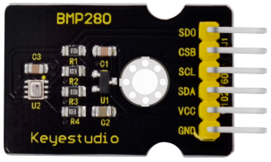
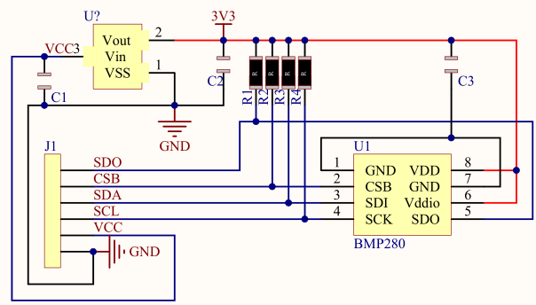

# Sensor de temperatura y presión barométrica MBP280

## **Conceptos previos**
La presión atmosférica es la fuerza que ejerce el aire (atmósfera) sobre la superficie de la tierra. La presión atmosférica se debe al peso de la columna de aire sobre determinada área, es por esta razón que al medir la presión atmosférica en puntos con mayor altitud, el valor de la presión es menor por ser menor la cantidad de aire. La presión atmosférica también varía con el clima, principalmente con la temperatura, pues esta hace cambiar la densidad del aire, que se ve reflejado en un cambio en el peso y por consiguiente en un cambio de presión.

La presión atmosférica varía con la temperatura y la altitud, estas dos variables son las más representativas para el cambio de presión. Factores como la humedad relativa y la velocidad del viento también influyen en la presión atmosférica en menor forma y pueden ser obviados.

Lo que miden este tipo de sensores es la presión absoluta (Barométrica) y la temperatura, lo que nos permite compensar su influencia en la presión y asi determinar con mayor exactitud la altitud.

Se puede decir que la magnitud escalar Presión (P) es directamente proporcional a la fuerza normal (F) que se aplica de manera uniforme a una superficie plana (S):

$P=\dfrac{F}{S}$

La unidad de medida es el Pascal (Pa): $1 \space Pa = 1 \space N/m^2$

También se expresa por:

$1 \space bar = 10^5 \space Pa$

$1 \space atm = 101325 \space Pa$

$1 \space libra \space fuerza \space por \space pulgada \space cuadrada \space (psi) = 1/14.696 \space atm$

La presión atmosférica medida a nivel del mar es de 101325 Pa o 101,3 kPa.

## **Sensor BMP280**
Es la evolución del BMP180 que solamente mide la presión barométrica, es el BMP280 que se suele comercializar montado en un módulo con conectividad I2C, de pequeño tamaño y bajo consumo.

Nosotros vamos a trabajar con el módulo de Keyestudio, que incorpora tecnología de sensor de presión piezorresistivo de gran precisión y linealidad, así como estabilidad a largo plazo. Las múltiples opciones de funcionamiento del dispositivo proporcionan la máxima flexibilidad; podemos optimizar el dispositivo en términos de consumo de energía, resolución y rendimiento de filtrado.

El módulo dispone de dos modos de trabajo: Comunicación I2C y comunicación SPI, que podemos elegir según nuestras necesidades.

  
*Módulo BMP280*

Parámetros:

* Tensión de alimentación: 5V DC
* Rango de medida de la presión atmosférica 300 hPa~1100 hPa (elevación +9000 a -500m)
* Error de medida de la presión atmosférica: ±1 hPa (±1m)
* Precisión de medida de la presión atmosférica: 0,18Pa
* Rango de medida de la temperatura: 0℃ a 65℃
* Error de medida de temperatura: ±0,5℃, máximo ±1℃
* Precisión de medida de temperatura: 0.1℃

Entre sus campos de aplicación tenemos:

* Control de temperatura
* Detección de la presión atmosférica
* Detección de altitud
* Navegación en interiores (inspección de suelos, inspección de ascensores)
* Navegación en exteriores, ocio y aplicaciones deportivas
* Aplicaciones sanitarias como la espirometría

El esquema del circuito que monta el módulo es el siguiente:

  
*Esquema del módulo BMP280 de Keyestudio*

Existe un sensor muy similar de nombre BME280 que además de presión y temperatura mide humedad relativa. Los sensores son físicamente iguales incluso el módulo en el que se montan. El BME280 es una actualización del BMP280, aunque el BMP280 es más económico.

Se puede decir que el BME280 sacrifica presición en la medida de presión para suministrar medidas de humedad, por lo tanto, si queremos observar el entorno de forma amplia, el BME280 es la mejor opción. Si vamos a obtener una lectura precisa de la presión atmosférica,  usamos BMP280.
