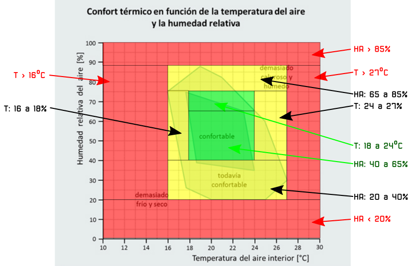
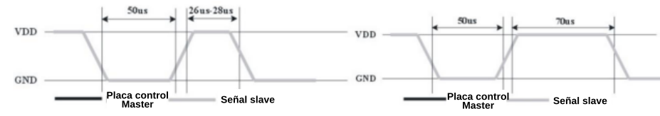

# Temperatura y humedad, como nos afectan
Vamos a ver en que consiste el estado de confort para un ser humano y analizamos los sensores DHTxx.

## **Estado de confort**
En la web ARQUITECTURA & ENERGÍA podemos encontrar un artículo donde se nos explica con bastante profundad el tema del [corfort térmico](http://www.arquitecturayenergia.cl/home/el-confort-termico/).

Puede definirse confort térmico, o más propiamente comodidad higrotérmica, como la ausencia de malestar térmico. En fisiología, se dice que hay confort higrotérmico cuando no tienen que intervenir los mecanismos termorreguladores del cuerpo para una actividad sedentaria y con una indumentaria ligera. Esta situación puede registrarse mediante índices que no deben ser sobrepasados para que no se pongan en funcionamiento los sistemas termorreguladores (metabolismo, sudoración y otros).

En la imagen siguiente vemos los valores de temperatura y humedad que delimitan las zonas de confortabilidad.

  
*Confort térmico en función de temperatura y humedad*

Sobre el gráfico vamos a delimitar zonas de temperatura y humedad para establecer su color. Por motivos de simplicidad lo vamos a hacer delimitando zonas rectangulares, pero comprobamos que no cometemos grandes errores y para nuestro propósito nos sirve.

**1.- Zona Roja**: en la imagen siguiente tenemos delimitadas las zonas:

* Humedad Relativa: superior al 85% e inferior al 20%
* Temperatura: superior a 27ºC e inferior a 16ºC

  
*Delimitación color rojo zona de confort*

**2.- Zona Amarilla**: en la imagen siguiente tenemos delimitadas las zonas:

* Humedad Relativa: entre el 20% y el 40% y entre el 65% y el 85%
* Temperatura: entre 16ºC y 18ºC y entre 24ºC y 27ºC

  
*Delimitación color amarillo zona de confort*

**3.- Zona Verde, rojo y amarillo**: en la imagen siguiente tenemos delimitadas todas las zonas, correspondiendo a la verde los siguientes datos:

* Humedad Relativa: entre el 40% y el 65%
* Temperatura: entre 18ºC y 24ºC

  
*Delimitación colores amarillo zona de confort*

## **Sensores DHTxx**
La familia de sensores DHTxx tiene disponibles dos tipos, el [DHT11](../datasheet/DHT11.pdf) y el [DHT22](../datasheet/DHT22.pdf) cuyos datasheet se pueden obtener de los enlaces anteriores y que vamos a analizar de forma rápida. Disponen en su interior de un sensor capacitivo para medir la humedad y de un termistor para medir la temperatura. La información la proporcionan mediante una señal digital de impulsos eléctricos que contiene la información de ambos parámetros.

### DHT11
El DHT11 es un modelo de sensor que permite realizar la medición simultánea de temperatura y humedad. Dispone de un procesador interno que es el encargado de realizar la medición entregando la información mediante una señal digital.

Se presenta en un encapsulado plástico típico de color azul. Sus principales características son:

* Muy económico
* Rango de temperatura: 0 a 50ºC
* Precisión de la medida de temperatura: ±2ºC
* Rango de humedad: 20 a 80%
* Precisión en la medida de humedad: ±5%.
* Lecturas de temperatura y humedad como valores enteros
* Frecuencia de muestreo: 1 muestra por segundo (1 Hz)

El DHT11 es un sensor bastante limitado que podemos usar con fines de formación, pruebas, o en proyectos que realmente no requieran una medición precisa.

El aspecto del sensor es el siguiente:

  
*Sensor DHT11*

### DHT22
Si necesitamos mayor precisión y rango podemos recurrir al DHT22 que es de la misma familia y lo único que cambia es sus características y el precio. Sus características son:

* Muy económico, pero mas caro que el DHT11
* Rango de temperatura: -40 a 125ºC
* Precisión de la medida de temperatura: ±0.5ºC
* Rango de humedad: 0 a 100%
* Precisión en la medida de humedad: ±2 a 5%
* Frecuencia de muestreo: 2 muestras por segundo (2 Hz)

En la imagen siguiente vemos el aspecto de este sensor:

  
*Sensor DHT22*

## **Comunicación con un solo hilo**
Vamos a ver como se realizan las comunicaciones serie mediante monohilo bidireccional para entender mejor pro qué los DHT necesitan solamente de un pin digital para enviarnos la información que recogen.

* Bus de un hilo

Los DHT utilizan una comunicación simplificada de bus de un hilo como línea de datos. Se realiza con un dispositivo de tipo master/slave (maestro/esclavo) a través de un puerto de drenador abierto o tri-estado conectado a la línea de datos para permitir que el dispositivo no envía datos liberando el bus. Generalmente requieren una resistencia externa de pull-up de unos 5kΩ, de manera que cuando el bus está inactivo, su estado es alto. La estructura master/slave hace que cuando la placa (master) llama al slave, este responde y sólo cuando master lo hace. Este tipo de comunicación es estricta en su formato y si por algún motivo se vuelve caótica, el dispositivo slave no responderá al master.

* Transferencia de datos

**DATA**. Para la comunicación y sincronización entre la placa de control y el DHT mediante bus de un hilo se utiliza un formato de datos que realiza una transmisión de 40 bits de datos, siendo el mas significativo el primero en salir. El formato de los datos es:

(8 bits de datos enteros + 8bits de datos decimales) para la humedad + (8 bits de datos enteros + 8 bits de datos fraccionarios) para la temperatura + 8 bits para la paridad o checksum.

La paridad es el resultado de la suma de los otros datos.

Para ver el funcionamiento haremos un ejemplo de datos en el que el dato es correcto y otro en el que no lo es.

* Ejemplo de dato válido y su conversión a valores: Se reciben lo 40 bits de datos siguientes:

Donde:

* Byte alto de Humedad, es el número entero que indica el valor de la Humedad relativa en porcentaje
* Byte bajo de Humedad, es la parte fraccionaria de la Humedad.
* Byte alto de Temperatura, es el número entero que indica el valor de la Temperatura en ºC.
* Byte bajo de Temperatura, es la parte fraccionaria de la Temperatura.
* Byte de Paridad, es la suma de todos los anteriores:

Interpretamos esos datos:

* **Checksum**. Se ha recibido el byte 01001101 como dato de comprobación de la paridad y la suma de los valores es exactamente igual al dato recibido, lo que indica que el dato recibido es correcto.
* **Humedad**. 00110101 = 0x35 = 53 % HR
* **Temperatura**. 00011000 = 0x18 = 24 ℃

Ejemplo de dato **NO** válido y su conversión a valores: Se reciben lo 40 bits de datos siguientes:

Calculamos el byte de Paridad como la suma de todos los anteriores:

Interpretamos esos datos:

* **Checksum**. Se ha recibido el byte 01001001 como dato de comprobación de la paridad y la suma de los valores es 01001101 por lo que el dato recibido **NO** es correcto. Se descarta y se prepara para recibir un nuevo dato.

El proceso que hay que seguir para la lectura de datos desde una placa de control suele estar resuelto por la existencia de librerias para este tipo de dispositivos. En general estas librerías son programas que siguen esta secuencia de pasos:

* **Paso 1**. Después de alimentar el DHT esperamos un segundo sin hacer nada para estabilizar el sensor, tras lo que el sensor está listo para registrar los datos de humedad y temperatura ambientales. Si hemos colocado una resistencia de pull-up el pin DATA del DHT se mantiene en estado alto y es un pin de entrada y es el momento de detección de señales.
* **Paso 2**. La patilla de entrada/salida de la placa de control se mantiene en estado bajo por al menos 18ms tras los cuales se libera el bus para recibir datos. El proceso sería algo similar a la figura siguiente:

  
*Señal enviada por la placa de control*

* **Paso 3**. El pin DATA del DHT detecta una señal de estado bajo y espera durante 80 microsegundos una señal de respuesta seguida por una notificación de otros 80 microsegundos durante los que la placa de control estará como entrada para a continuación recibir el dato.

* **Paso 4**. La salida del DHT envia los 40 bits de datos que recibe la placa de control según la siguiente secuencia de tiempos:

A la izquierda tenemos el formato de un bit "0" del bit de datos y a la derecha el formato de un bit "1".

* **Paso 5**. Se mantiene la salida en bajo durante 50 microsegundos y se cambia el estado de entrada permitiendo que la resistencia pull-up se ponga en alto. El DHT internamente mide la temperatura y la humedad y las graba esperando la llegada de la señal de la placa de control.

En los datasheet citados al principio hay mas detalles al respecto.
