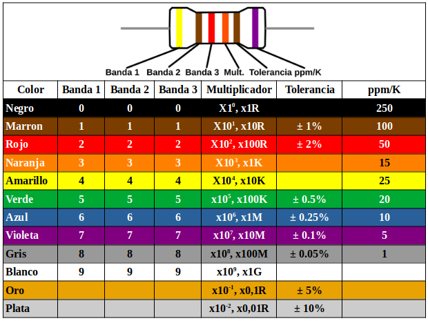
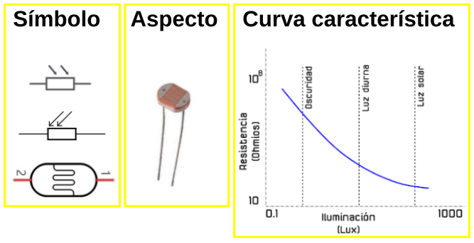
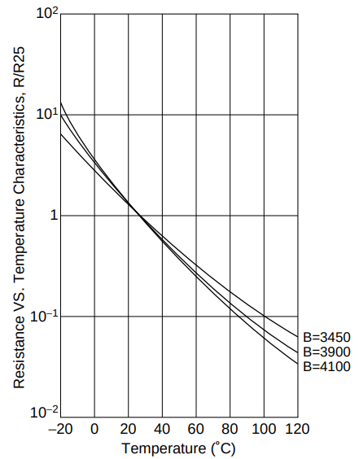
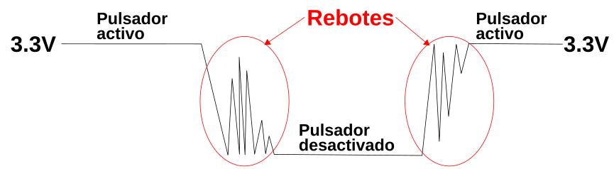
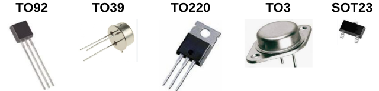
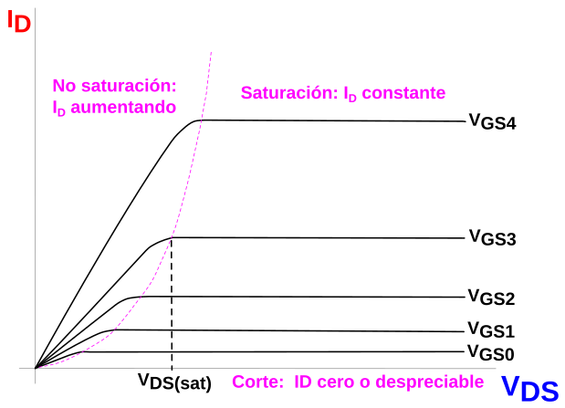
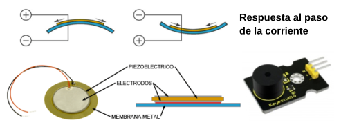
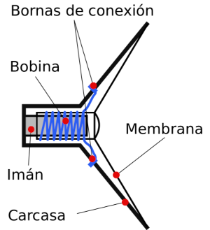

# Componentes discretos
Se describen brevemente las características y principio de funcionamiento de los componentes básicos para construir circuitos que se montan para pruebas.

## **Cables y conectores**
En electrónica se utilizan multitud de cables y conectores especializados por características y por aplicación. Para lo que nos interesa existen unos componentes básicos conocidos como puentes, jumpers o cables dupont que están diseñados para interconectar componentes mediante la inserción de sus dos terminales.

Estos cables utilizan en sus extremos (lo llevan crimpado) o bien conectores macho (Male) o bien hembra (Female), por lo que se pueden clasificar en los tres tipos siguientes, que se comercializan en diferentes colores y longitudes.

|Conexiones|Cable|
|:-:|:-:|
|macho-macho (M/M)||
|hembra/hembra (F/F)||
|macho/hembra (M/F)||

## **Protoboard**
También conocida como breadboard es una placa con multitud de agujeros interconectados de una determinada manera formando grupos de conexiones. Permiten montar de forma rápida circuitos mas o menos sencillos. Existen de muchos tamaños diferentes de los que vemos una muestra en la imagen.

  
*Placas protoboard*

Hay dos cosas importantes en este tipo de componente, la primera es no introducir en los agujeritos componentes o cables de mas de 0.5mm de diámetro porque a la larga esto provocará falsos contactos con otros componentes y la segunda es tener muy claro como van conectados internamente los agujeros.

  
*Conexiones internas en placas protoboard*

## **Resistencias**

  [4 bandas](#item1R)  
[5 bandas](#item2R)  
[6 bandas](#item3R) 

### Fijas

La resistencia es un componente electrónico del grupo denominado pasivos que está diseñado para oponerse al paso de la corriente. El valor de la resistencia se expresa en ohmios o sus múltiplos. Se fabrican principalmente de carbón (la mina de un lápiz es una resistencia) o de pelicula metálica y se comercializan en una amplia gama de valores. Su aspecto lo vemos en la imagen.

  
*Resistencias*

Las resistencias están definidas por tres características fundamentales:

- el valor resistivo
- la potencia máxima que puede disipar
- la tolerancia

Hay resistencias con valores de Ohmios (Ω), Kilohmios (KΩ), Megaohmios (MΩ) y otros múltiplos y submúltiplos. La equivalencias entre ellas es:

* 1 Kilohmio (KΩ) = 1,000 Ohmios (Ω)
* 1 Megaohmio (MΩ) = 1,000,000 Ohmios (Ω) = 1,000 Kilohmios (KΩ)

Para poder saber que valor y tolerancia tiene una resistencia, existe un código de colores que nos ayuda a obtener con facilidad estos valores. La potencia no se indica expresamente en este tipo de resistencias y depende de su tamaño, por lo que con el uso nos iremos acostumbrando.

Existen resistencia de 3 (en desuso), 4, 5 y 6 bandas de colores y cada una se lee de manera diferente aunque parecida. Veamoslas.

Existen muchas páginas y aplicaciones que nos ayudan a averiguar el valor de una resistencia por sus bandas de color. Una muy completa y fácil de usar es la de [Digikey](https://www.digikey.es/es/resources/conversion-calculators/conversion-calculator-resistor-color-code), una tienda de componentes que además nos ofrece otras muchas calculadoras que nos resultarán útiles.

[Volver](#item0R)

4 bandas

En estas, una de las bandas estará más cercana al terminal o patilla, puede ser mas ancha y es esa su primera cifra significativa o banda 1, la siguiente es la banda 2, la siguiente es la banda multiplicadora y la cuarta banda es la banda de tolerancia, esta banda normalmente es mas estrecha. A continuación vemos como se leen estas resistencias.

  
*Resistencias de cuatro bandas*

El valor se obtendría poniendo: 56 x 10⁴ = 560k +/- 5%

[Volver](#item0R)

5 bandas

En este caso hay tres cifras significativas y se leen como vemos a continuación.

  
*Resistencias de cinco bandas*

El valor se obtendría poniendo: 247 x 10² = 24700 = 24K7 +/- 5%

[Volver](#item0R)

6 bandas

A estas resistencias se añade una sexta banda como última banda para indicar el coeficiente de temperatura y también tienen tres cifras signiticativas. A continuación vemos como se leen. El coeficiente de temperatura indica cuanto cambia el valor de la resistencia en función de la temperatura utilizando normalmente ppm/K (partes por millón por grado Kelvin) como unidad. Es muy raro ver resistencias de seis bandas como componente habitual.

  
*Resistencias de seis bandas*

El valor se obtendría poniendo: 412 x 10³ = 412K +/- 1% y 5 ppm/K

### El potenciómetro
Se trata de un tipo de resistencia en la que es posible cambiar su valor. Es un dispositivo que normalmente tiene tres terminales. Un potenciómetro suele estar formado por un material resistivo (un hilo de cobre u otro material conductor o un elemento de carbón) y una escobilla (denominada cursor) de contacto móvil. Cuando el cursor se desplaza a lo largo del elemento resistivo, se produce un cambio en la resistencia entre el terminal unido a este y los terminales extremos que es entre los que está la resistencia total fija característica del potenciómetro.

  
*Conexión habitual del potenciómetro*

En la imagen siguiente vemos el aspecto de un modelo concreto de potenciómetro así como los símbolos habituales del mismo. La numeración indica lo siguiente:

* Terminales 1 y 3 son los contactos unidos a los extremos de la resistencia fija o resistencia total del potenciómetro.
* Terminal 2 es el contacto que va unido al cursor o parte móvil que se desliza sobre la resistencia fija haciendo que la resistencia entre un terminal y el cursor varíe en función de la posición de este.

  
*Aspecto y símbolo del potenciómetro*

La posición del cursor se determina de forma mecánica y son adecuados para usarlos como elementos de control de tensión (conexión en serie) o de corriente (conexión en paralelo). Los potenciómetros del tipo que estamos viendo (existen de otros muchos tipos) tienen un funcionamiento en forma de rotación con un ángulo de unos 270 grados entre los puntos mas extremos.

### Sensor de luz. LDR.

[Detección de luz con la micro:bit](#item1LDR)
  [La fotoresistencia LDR](#item2LDR) 

La micro:bit monta en su parte frontal una matriz de 5x5 LEDs que se corresponden con el siguiente esquema:

  
*Esquema de la matriz de LEDs*

Se pueden utilizar estos LEDs en modo de polarización inversa para detectar la cantidad de luz que incide sobre la pantalla. El valor retornado será un número entero entre 0 y 255 y representa el nivel de luz de menor a mayor.

COL1 a COL5 trabajan normalmente como salidas del nRF52 que se utilizan para iluminar selectivamente los LEDs. Aunque COL1, COL3 y COL5 están conectadas a pines aptos para ADC, la detección de luz se hace de manera digital.

ROW1 a ROW5 suelen ser salidas que suministran corriente para los LEDs. Pero también se utilizan como entradas digitales cuando queremos detectar luz.

En resumen, la micro:bit detecta la intensidad de la luz ambiente a través de la matriz de LED. En el modo de polarización directa, la pantalla LED funciona como una pantalla. En el modo de polarización inversa, la pantalla LED funciona como un sensor de luz básico que se puede utilizar para detectar la luz ambiente.

[Volver](#item0LDR)

<b>Detección de luz con la micro:bit</b>

El diodo LED está compuesto por una unión PN de dos materiales semiconductores uno de ellos dopado con cargas de tipo P y el otro con cargas de tipo N. Con la creación de esta unión, y precisamente en esa zona, se crea lo que se denomina barrera de potencial.

  
*Barrera de potencial en la unión PN*

Esa unión PN cuando se dispone adecuadamente con distintos materiales tiene la capacidad de emitir luz visible debida al calor generado en la recombinación de electrones.  En los años que van de 1960 a 1990, se utilizaban como materiales para la construcción del LED el Aluminio (Al), Galio (Ga), Indio (In), Arsénico (As) y Fósforo (P) y con ellos se logró la obtención de luz con longitudes de onda entre 660 y 590 nm, con tonos rojos, naranjas y ámbar. Posteriormente se introdujo Nitrógeno (N), junto con el Indio y el Galio, lo que dio paso a la obtención de radiaciones de longitud de onda entre 585 y 430 nm, de tonos verdes y azules. En 1992 se consigue la luz blanca con la ayuda del Fósforo (P) que al ser atravesado por luz azul produce luz blanca. La combinación del Galio con distintos elementos da origen a las diferentes longitudes de onda y por tanto a los diferentes colores.

Cuando un LED se polariza inversamente circula por el mismo una corriente muy pequeña y se puede comprobar que depende de la luz, lo que podemos utilizar para medir el nivel de luminosidad en crudo. Es decir, podemos detectar como de brillante es la luz en el entorno del LED. Si miramos un diodo LED con un lupa o cámara que permita aumentar bastante el zoom podemos llegar a ver la zona que emite luz.

  
*Diodo LED muy de cerca*

En la zona tipo P las cargas positivas se pueden mover libremente mientras que en la zona N lo hacen las negativas. Cuando se crea la unión las cargas mas cercanas de cada zona se recombinan creando la denominada barrera de potencial, donde no hay movimiento de cargas. Esto se puede considerar como un aislante que separa a dos conductores, o lo que es lo mismo, un condensador, eso si de muy baja capacidad. Sabemos también que la capacidad de un condensador viene dada por:

$C = \epsilon_{0} \cdot \dfrac{S}{d}$

donde $\epsilon_{0}$ es la permitividad en el vacio, S es la superficie de las placas y d es la distancia que las separa.

Esa barrera de potencial cambia según la luz que incide sobre sobre la misma, aumentando a mayor luminosidad y disminuyendo a menor luminosidad. El aumento de la barrera hace que la disminuya la superficie de las zonas P y N. Un sencillo experimento no permite medir los cambios de esa capacidad demostrando así que un LED puede ser un sensor de luz.

En mi caso voy a utilizar el medidor de componentes [GSM328A](https://github.com/fgcoca/Medidor-componentes-GM328A/wiki) que es un medidor de muy bajo coste (se puede encontrar por menos de 8€) pero que resulta bastante útil para este tipo de tareas.

Siguiendo las instrucciones del manual colocamos el diodo LED en la posición central y rotando el encoder localizamos la posición de medida de baja capacidad y pulsamos para activar.

  
*Posicionado del LED y selección de medida en el GSM328A*

Medidas con diferentes grados de iluminación obtenidos simplemente tapando el LED.

  
*Meidas de capacidad del LED con el GSM328A*

En la micro:bit la medida del nivel de iluminación consiste principalmente en medir la capacidad de unos determinados LEDs de la pantalla obteniendo el promedio y devolviendo un número entre 0 y 255.

  
*LEDs de la micro:bit implicados en la medida de luminosidad*

[Volver](#item0LDR)

<b>La Fotorresistencia LDR</b>

Existe también un tipo de resistencia especial denominado fotoresistencia o fotoresistor que es un componente electrónico cuya resistencia disminuye de forma exponencial con el aumento de la intensidad de luz incidente. Las siglas LDR vienen de su nombre en inglés, que es Light Dependent Resistor. En la imagen siguiente tenemos el símbolo, el aspecto real de una LDR y su curva característica de variación de resistencia con la iluminación.

  
*Símbolo, aspecto y curva característica de la LDR*

La resistencia de una LDR varia en proporción a la luz ambiental detectada. Con esta característica, podemos utilizar una LDR para detectar la intensidad de la luz.

A continuación vemos los circuitos que se utilizan para detectar el cambio del valor de resistencia de una LDR cuando la conectamos a una micro:bit:

  
*Circuitos para detectar variaciones de R en la LDR*

En estos circuitos, cuando el valor de la resistencia de la LDR cambia debido a un cambio en la intensidad de la luz, las tensiones en la LDR y la resistencia fija también cambiarán. Podemos hacer que el valor de la intensidad de la luz se corresponda con esa tensión.

### El termistor
El termistor (contracción de térmico y resistor) es una resistencia sensible a la temperatura, es decir, que cuando se produce un cambio de temperatura, la resistencia del termistor varía. Normalmene tiene forma de pequeña gota o perla, disco tipo lenteja o un cilindro encapsulado.

Hay dos tipos de termistores, los que tienen un Coeficiente de Temperatura Negativo (NTC) y lo que tienen un Coeficiente de Temperatura Positivo (PTC). En un termistor NTC cuando la temperatura aumenta su resistencia disminuye y a la inversa, cuando baja la temperatura su resistencia aumenta. Esta característica la podemos aprovechar para medir temperaturas.

En un termistor PTC cuando aumenta la temperatura lo hace su resistencia y cuando disminuy la temperatura también lo hace su resistencia. Este tipo de termistor se usa principalmente como fusible térmico.

El símbolo de un termistor es:

  
*Símbolo usuales del termistor*

Existen muchas y variadas formas de encapsulados de termistores y en la [Wikipedia](https://es.wikipedia.org/wiki/Termistor) aparecen clasificados por su forma.

  
*Encapsulados de los termistores*

La curva característica de un termistor NTC es la siguiente:

  
*Curva Resistencia/Temperatura termistor NTC*

La ecuación que relaciona el valor de resistencia y la temperatura es:

$R = R_0 \cdot e^{\beta \cdot (\dfrac{1}{T} -\dfrac{1}{T_0})}$

Donde:

* R es la resistencia a temperatura ambiente T
* $R_0$ es la resistencia a la temperatura ambiente $T_0$
* $\beta$ es la constante del termistor

La constate $\beta$ viene dada por:

$\beta = \ln\dfrac{\dfrac{R}{R_0}}{\dfrac{1}{T}-\dfrac{1}{T_0}}$

Los valores de resistencia nominal dados a 25ºC para termistores comerciales habituales son de 1K, 10K y 100K, aunque existen de otro valores.

El esquema de conexionado mas sencillo de un termistor es como el siguiente:

  
*Esquema base de conexionado de un termistor NTC*

En ese circuito es muy fácil saber el valor de la tensión en P0, ya que por teoría del divisor de tensión tenemos que:

$V_{P_0} = 3.3 \cdot\dfrac{R_t}{R+R_t} \Rightarrow R_t = \dfrac{R}{\dfrac{3.3}{V_{P_0}}-1}$

Podemos utilizar el valor analógico medido en el pin P0 para obtener el valor de resistencia del termistor poder obtener la temperatura a partir de la ecuación:

$T = (\dfrac{1}{T_0}+\dfrac{\ln(\dfrac{R}{R_0})}{\beta})^{-1}$

El rango de temperatura en la que el termistor tiene un comportamiento muy estable y de gran sensibilidad se sitúa en torno a los 50ºC sobre una temperatura central. Otras ventajas de este tipo de termistores es que son muy económicos y que tienen un durabilidad muy alta. Sus principales desventajas son que no tienen un comportamiento lineal, su tiempo de respuesta es relativamente lento (entre 7 y 10 segundos) y su rango de temperatura es limitado.

Un ejemplo de termistor NTC es el del [datasheet](https://www.rinconingenieril.es/wp-content/uploads/2017/08/NTC_Vishay.pdf) en el que el fabricante nos suministra los valores de $R_0, \space T_0 \space y \space \beta$. En la tabla extraida del datasheet podemos ver estos datos para distintas resistencias, en nuestro caso trabajamos con una que con $T_0 = 25ºC, \space R_0 = 10K \space y \space \beta = 3977$

La curva característica de un termistor PTC es la siguiente:

  
*Curva Resistencia/Temperatura termistor PTC*

El circuito típico de aplicación de un termistor PTC es el siguiente:

  
*Esquema base de conexionado de un termistor PTC*

Los termistores tienen diversas utilizaciones y algunas de ellas pueden ser:

* Control de temperatura de extrusor y cama caliente en impresoras 3D de fusión de material.
* Termostatos.
* Control de temperatura de aceite en automóviles.
* Control de temperatura en frigorificos y hornos.
* Protección contra sobretensiones.
* Control de temperatura en la carga de baterias.

## **El diodo semiconductor**
Son dispositivos que permiten el paso de la corriente electrica en un solo sentido y la bloquean en el contrario. Se suelen conocer también como rectificadores por su capacidad de convertir la corriente alterna en corriente continua pulsatoria. Existen diferentes tipos de diodos y nos centraremos en describir como funcionan los diodos de estado sólido sin entrar en demasiados fundamentos científicos. El símbolo del diodo es un triángulo que viene a indicar el sentido permitido de circulación de corriente y la barrera que se opone en el contrario.

  
*Símbolo usuales del diodo*

El funcionamiento del diodo se basa en su construcción y esta se realiza mediante la unión de dos materiales semiconductores de un determinado tipo (normalmente silicio) dopados de forma controlada con carga de electrones (zona de tipo N) y otra con carga de protones o huecos o ausencia de electrones (zona de tipo P). Esto crea una unión PN en la que la zona tipo N recibe el nombre de cátodo (K) y la zona de tipo P de ánodo (A). Polarizando directamente la unión se reduce la barrera de la unión facilitando el paso de la corriente y si se polariza inversamente ocurre lo contrario y se impide la circulación de corriente.

  
*Funcionamiento esquematizado de un diodo*

Los tipos de diodos se caracterizan de manera básica por los materiales con los que están fabricados y por la cantidad de impurezas dopantes. Entre otros nos podemos encontrar con:

* **Laser**. Son capaces de generar un rayo de luz laser con una longitud de onda entre 800 y 850 nanómetros. Se aplica en fibra óptica, punteros laser, lectores de código de barras, etc.
* **Zener**. Están diseñados para trabajar en polarización inversa de forma que al alcanzar un determinado nivel de tensión inversa (tensión zener) comienza a conducir manteniendo practicamente constante esa tensión de ruptura zener. Su aplicación fundamental está en los reguladores de tensión constante.
* **Schottky**. Debe el nombre a su inventor [Walter Schottky](https://es.wikipedia.org/wiki/Walter_H._Schottky) y se conoce también como diodo de conmutación rápida, ya que esta es su principal característica. Esta rapidez es posible porque son sufientes 0.3V de diferencia de tensión para que se produzca el cambio de conducción. Tienen aplicación allí donde son necesarias las altas velocidades de conmutación.
* **LED**. Basan su funcionamiento en la generación de fotones por recombinación de los portadores de cargas. Existen de diversos colores y se aplican en muchos sitios diferentes. En el apartado siguiente se explica algo mas de los mismos.
* **Shockley**. No confundir con ***Schottky***. Está formado por cuatro capas alternando zonas P y N, lo que lo convierten básicamente en un tipo de tiristor. Su funcionamiento se basa en pasar de un estado de baja impedancia (conducción) a otro de alta impedancia (corte) por disminución de la tensión con el consiguiente aumento de corriente. A la inversa se pasa de saturación a corte. El invento es debido al físico [William Shockley](https://es.wikipedia.org/wiki/William_Bradford_Shockley) uno de los descubridores del transistor.

La simbología de los diferentes diodos gira en torno a variaciones del símbolo fundamental visto. En la entrada [Símbolo electrónico
](https://es.wikipedia.org/wiki/S%C3%ADmbolo_electr%C3%B3nico) se pueden consultar junto con los de otros muchos componentes.

En la infografia [Funcionamiento y polarización del diodo semiconductor](../img/aux/infograf_func_diodo.svg) tenemos un resumen de sus características tensión/corriente y su funcionamiento. [Aquí está](../img/aux/infograf_func_diodo.pdf) el archivo en formato pdf.

## **El diodo LED**

[Matriz de de barras de LEDs](#item1LED)
  [LED RGB](#item2LED) 

El diodo LED (Light Emitting Diode) es un diodo semiconductor capaz de emitir luz, lo mas usuales dentro del espectro visible aunque también pueden ser de infrarrojos, laser, etc. Su uso mas habitual es como indicador y, últimamente cada vez mas frecuentes en iluminación. Sus principales ventajas frente a luces incandescentes son:

* Menor consumo de energía
* Mayor vida útil
* Menor tamaño
* Gran durabilidad y fiabilidad
* En la imagen siguiente vemos el aspecto físico que tiene y su símbolo electrónico.

  
*Aspecto y símbolo del LED*

El color de la cápsula es simplemente orientativo, es la longitud de onda quien define realmente el color de la luz emitida. Por ello el LED con la cápsula transparente puede emitir en cualquiera de los colores del espectro visible.

La forma de la capsula mas habitual es cilíndrica de 3 o 5 mm de diámetro, aunque existen otras formas menos usuales como las que vemos en la imagen siguiente:

  
*Tipos de encapsulados para LEDs*

El LED es un dispositivo que tiene polaridad siendo su comportamiento el siguiente: En polarización directa (ánodo a positivo y cátodo a negativo) el LED emite luz y en polarización inversa (ánodo negativo y cátodo positivo) se comporta prácticamente como un interruptor abierto.

Para su correcto funcionamiento el diodo LED se polariza poniéndole en serie una resistencia que limita la corriente que pasa a través del mismo y, por tanto, determina el nivel de brillo de la luz emitida.

Sin entrar en detalles en la tabla siguiente se dan los valores de tensión directa (VF) y corriente directa (IF) para los colores mas habituales de LEDs. A partir de estos valores y el valor de tensión de alimentación de nuestro LED podemos calcular el valor de la resistencia serie sin mas que aplicar la formula indicada.

  
*Tensión y corriente para distintos colores*

[Volver](#item0LED)

Matriz de de barras de LEDs

Estas matrices de LED pueden tener distinto número de elementos y están diseñadas para mostrar información en forma de gráfico de barras fácilmente reconocible. Los elementos suelen ser acoplables por los extremos y, por tanto, tienen capacidad de extensión. El uso de estas matrices de gráficos de barras elimina los problemas de alineación, intensidad y coincidencia de colores asociados a los LED discretos. Existen modelos en que todos los LEDs son del mismo color y existen otros en los que cada LED es de un color diferente, por ejemplo rojos, amarillos y verdes. En definitiva son LED individuales dispuestos en el encapsulado en forma de barra.

Normalmente un barra tiene 10 LEDs integrados en un mismo encapsulado con dos filas de pines que permiten manejarlos como LEDs individuales. En la imagen vemos su aspecto real y el diagrama de pines.

  
*Aspecto real y diagrama de pines de barra de 10 LEDs*

Dependiendo del fabricante tendremos disponibilidad de mas datos sobre nuestra barra concreta o no, entre ellos la posibilidad de identificar los pines como ánodo o como cátodo.

[Volver](#item0LED)

LED RGB

Un LED RGB es en realidad un encapsulado que incorpora tres diodos LED, uno por cada color fundamental y una patilla común que puede ser el ánodo o el cátodo de los tres diodos.

Los colores primarios en óptica son el rojo, el verde y el azul y la correcta combinación, en términos de intensidad, de ellos originará cualquiera de los colores secundarios. Las siglas RGB son el acrónimo de Red, Green y Blue. En la imagen siguiente vemos el modelo aditivo de los colores rojo, verde y azul.

  
*RGB*   
*Imagen obtenida de [Wikipedia](https://es.wikipedia.org/wiki/RGB)*

Existen dos tipos de LEDs RGB según están conectados internamente y pueden ser de cátodo común o de ánodo común. El símbolo y la representación de este componente lo vemos en la imagen siguiente, correspondiendo la pareja de la izquierda a los de cátodo común y la pareja de la derecha a los de ánodo común:

  
*Símbolo y representación LED RGB*

El pin mas largo es el común, el de su izquierda es el rojo (R), el de su derecha es el verde (G) y el último por la derecha el azul (B).

Teóricamente, cada uno de los LEDs podría adoptar 256 (valores entre 0 y 255) colores diferentes, es decir, un total de 16.777.216 (256x3) posibles colores diferentes con un LED RGB. En realidad el ojo humano solamente puede ver unos 10 millones de colores definidos por lo que se conoce como **espacio de color**, que tiene como referencia estándar habitual el **espacio de color** el denominado **CIELAB** o **CIEXYZ**, diseñados especificamente para abarcar lo que el ojo humano ve.

## **Pulsador**
Un botón pulsador o abreviadamente pulsador es un componente eléctrico que permite o impide el paso de la corriente eléctrica cuando se acciona. El pulsador solo permanece abierto o cerrado cuando lo presionamos y unicamente mientras lo mantenemos presionado. Al soltarlo vuelve a su posición inicial o de reposo.

En función de como están los contactos cuando el pulsador está en reposo, tenemos dos tipos diferentes: Normalmente Abierto y Normalmente Cerrado. Siendo el mas utilizado es pulsador normalmente abierto.

El funcionamiento del pulsador normalmente abierto es:

- Pulsador en reposo: el pulsador esta abierto y la corriente no puede pasar a través del mismo.
- Pulsador accionado: se conoce como posición de Trabajo y mientras se mantenga pulsado la corriente puede pasar por el pulsador.

En la tabla siguiente vemos la simbología y algunos ejemplos del aspecto físico de estos elementos del tipo que habitualmente se utiliza con este tipo de placas.

  
*Símbolos y aspecto real de un pulsador*

Existen muchos tipos y formas de pulsadores, pero los mas utilizados con este tipo de placas los vemos a continuación. Los de mayor tamaño suelen ir acompañados de una pieza de diferentes colores para colocar por presión en la parte amarilla (puede ser de otros colores) el pulsador y crear una tecla. Se aprecian las dimensiones así como la forma en que van conectados internamente los pines.

  
*Pulsadores mas usuales*

Mediante la configuración adecuada podemos convertir un pulsador en un elemento de entrada a algún pin de nuestra placa de control. Las configuraciones más básicas posibles con pulsadores las podemos ver en la imagen siguiente.

  
*Configuración circuito elemental con pulsador*

### Rebotes
Cuando accionamos un pulsador, este no cambia de un estado a otro inmediatamente. En el proceso de cambio de estado del pulsador se producen pequeñas vibraciones mecánicas que provocan una serie de efectos transitorios que pueden llegar a convertirse en un problema real. Supongamos que estamos contando pulsaciones, si cada vez que pulsamos esos efectos dan como resultado mas de un pulsación, es evidente que tenemos un problema. Estos efectos se estabilizan muy rapidamente porque duran muy poco tiempo y por tanto a nivel humano no son detectables, pero a nivel de microcontrolador si lo son. El fenomeno también ocurre al soltar el pulsador. Este fenómeno no deseado es lo que se conoce como "rebote".

  
*Fenomenos transitorios de rebotes en un pulsador*

Por lo tanto, es muy posible que, cuando detectamos el estado de un pulsador, obtengamos múltiples acciones de pulsación y liberación en un ciclo de pulsación. Este rebote puede llegar a confundir el funcionamiento del microcontrolador debido a la alta velocidad a la que trabaja. Por eso es conveniente eliminar el efecto de los rebotes en nuestros circuitos. Se puede hacer por hardware, colocando un condensador de 1uF, o incluso de mas capacidad, en paralelo con el pulsador. Tambien se pueden eliminar por software dejando transcurrir unos 150ms entre el momento que se acciona el pulsador y el momento en que la lectura se hace efectiva o bien comprobando el estado del botón varias veces y cuando ha transcurrido un tiempo considerar el estado del botón como estable. Dicho de otro modo, con una serie de lecturas y retardos del estado del pulsador se desechan esas pulsaciones no deseadas.

## Interruptor
La diferencia entre un pulsador y un interruptor radica en que el pulsador no mantiene su posición de trabajo si dejamos de accionarlo mientras que el interruptor si mantiene la posición, permaneciendo en la misma hasta que volvamos a accionarlo. Es decir, el interruptor cambia de posición cada vez que lo accionamos siendo totalmente estable cada posición. Hay ocasiones en que visualmente incluso pueden parecer iguales y solo se diferencian en su modo de funcionamiento.

Los interruptores se clasifican en función del tipo de conexión que realizan, como son el número de polos (Pole) y el de circuitos (Throw). Se define el número de polos como el número de circuitos capaz de controlar el interruptor. Puden ser unipolares, para un solo circuito o bipolares para controlar dos circuitos separados. Podemos decir que un interruptor bipolar son dos interruptores unipolares accionados por el mismo actuador. Por otro lado Throw se refiere al número de salidas que tiene cada polo. En base a esto tenemos:

|Tipo|Procedencia|Significado|Símbolo|
|:-:|---|---|:-:|
|SPST|Single Pole, Single Throw|Un polo, un circuito||
|SPDT|Single Pole, Double Throw|Un polo, dos circuitos||
|DPST|Double Pole, Single Throw|Dos polos, un circuito||
|DPDT|Double Pole, Double Throw|Dos polos, dos circuitos||

En la imagen siguiente quedará mas claro el tema de Pole y Throw.

  
*SPST, SPDT, DTSP y DPDT*

En el caso de los interruptores también pueden ser Normalmente Abiertos o Normalmente Cerrados y existen de muchos tipos en función de la aplicación que se les va a dar. También existen de mas de dos circuitos e incluso de varios polos.

Por su forma de accionamiento pueden ser: rotatorios, basculantes, deslizantes, tipo DIP, etc. En la imagen vemos el aspecto real de algunos de ellos.

  
*Diversos tipos de interruptores*

## El transistor bipolar o BJT
Las siglas BJT corresponden a Bipolar Junction Transistor, haciendo el término bipolar referencia al hecho de que en la conducción de la
corriente intervienen los dos tipos de portadores (electrones y huecos) y Juntion a como está fabricado el dispositivo, que básicamente son dos uniones PN.

  
*Uniones transistor BJT*

Cuando nuestro proyecto utilice un dispositivo que requiera una corriente mayor que la que puede entregar un pin GPIO será hora de recurrir a este tipo de dispositivo, que basicamente es un amplificador de corriente.

En la figura siguiente aparecen los símbolos del dispositivo con representación de convenio de sentido de corrientes.

  
*Símbolos transistor BJT*

No vamos a entrar en detalles de funcionamiento interno, simplemente indicar que en su forma básica de funcionamiento dispone de tres zonas de trabajo: corte (interruptor abierto), saturación (interruptor cerrado) y zona líneal. Según la aplicación nos va a interesar que trabaje en conmutación, con un cambio lo más rápido posible entre corte y saturación; o bien en zona lineal si lo que pretendemos es que se comporte como amplificador.

Quizá el simil que mejor explica el funcionamiento, al menos desde mi punto de vista, es el que podemos encontrar en la página de facebook de [Ingenieria Mecafenis](https://www.facebook.com/Mecafenix/posts/una-manera-sencilla-de-entender-como-funcionan-los-transistores/1634596350007190/?locale=es_LA) y que reproduzca aquí.

  
*Simil hidraúlico de funcionamiento del transistor*

 
Existen tres tipos básicos según la potencia que son capaces de manejar: baja potencia o de señal, mediana potencia y alta potencia. Además de por sus características electricas se distinguen por su encapsulados, de plástico para baja potencia, mixto plástico metal para mediana potencia y totalmente metálico para alta potencia. En la figura vemos ejemplos de los mismos con el nombre del encapsulado.

  
*Aspecto físico en diferentes encapsulados*

En nuestro caso tendremos suficiente con transistores de señal tanto NPN como PNP. Hay miles de modelos de estos transistores. A continuación dejamos una pequeña tabla con los más comunes por parejas de complementarios y el acceso a sus hojas de datos, aspecto fundamental a conocer cuando se trabaja con estos dispositivos.

|Modelo|Capsula|Tipo|$V_{CE}$|Ic|hFE|Potencia|
|:-:|:-:|:-:|:-:|:-:|:-:|:-:|
|[2N3904](../datasheet/2N3904.PDF)|TO92|NPN|40 V|200 mA|100 min|625 mW|
|[2N3906](../datasheet/2N3906.pdf)|TO92|PNP|40 V|200 mA|100 min|625 mW|
|[BC547](../datasheet/BC547.pdf)|TO92|NPN|45 V|100 mA|110 min|625 mW|
|[BC557](../datasheet/BC557.PDF)|TO92|PNP|45 V|100 mA|110 min|625 mW|
|[S8050](../datasheet/SS8050.pdf)|TO92|NPN|25 V|1.5 A|40 min|1 W|
|[S8550](../datasheet/SS8550.pdf)|TO92|PNP|25 V|1.5 A|40 min|1 W|
|[MMBT3904](../datasheet/MMBT3904.PDF)|SOT23|NPN|40 V|200 mA|100 min|225 mW|
|[MMBT3906](../datasheet/MMBT3906.PDF)|SOT23|PNP|40 V|200 mA|100 min|225 mW|

Dependiendo de la aplicación que pretendamos dar a nuestro transistor habrá que montar uno u otro circuito con mas o menos resistencias para mejorar su estabilidad. En la figura siguiente se exponen los tres circuitos básicos de polarización de un transistor montado en configuración de emisor común. Se denomina de emisoar común porque esta es la patilla común al circuito de entrada (base) y el de salida (colector).

  
*Circuitos de polarización*

Para nuestros propósitos el circuito de polarización por resistencia de base será mas que suficiente para cualquiera de los transistores citados en la tabla anterior y el dispositivo a alimentar será el sustituto de la resistencia de carga.

En el tema [teoria del transistor BJT](../conceptos/teoria_transistor_BJT.pdf) obtenido de **OpenCourseWare (OCW)** del [Instituto Tecnológico de Massachusetts (MIT)](https://ocw.mit.edu/) que adopta la [Universidad del País Vasco / Euskal Herriko Unibertsitatea](http://www.ehu.es/) con el fin de poner a disposición de la sociedad los materiales creados en la comunidad universitaria, se puede profundizar mas en el tema.

## **Transistor MOSFET**
La palabra MOSFET es un compuesto de dos terminos: MOS (Metal Oxido Semiconductor) en referencia al dieléctrico utilizazo y FET (Field Effect Transistor o transistor de efecto de campo) en referencia a su modo de conducción por campo magnético. Es un transistor que se activa por tensión, es decir que aplicar tensión conduce la corriente entre dos de sus patillas y esta es controlada por la tercera patilla llamada "Puerta o Gate". Las otras dos patillas son "Surtidor o Fuente" y "Dreandor". La principales ventajas de un transistor MOSFET frente a un BJT son:

* Su patilla G se activa por tensión en lugar de por corriente.
* Se pueden construir en tamaños mas pequeños.
* Su velocidad de conmutación corte/saturación es del orden de nanosegundos.
* La conducción de corriente se controla por un campo electrico.
* Para su funcionamiento requieren menos potencia y por tanto disipan menos energia.

Existen dos tipos de transistores MOSFET, los de canal N y los de canal P cuyos símbolos vemos a continuación:

  
*Símbolos MOSFET*

Un transistor MOSFET controla la corriente entre el surtidor (entrada) y el drenador (salida) mediante una tensión aplicada en la puerta denominada "tensión de umbral". Es un interruptor controlado por tensión.

La base de su funcionamiento la vemos a continuación.

  
*Polarización MOSFET*

A continuación vemos definidas las zonas de funcionamiento sobre la curvas caracteerísticas tensión / corriente de un transistor genérico.

  
*Curvas caracteerísticas tensión / corriente*

Las zonas de funcionamiento son:

* **Corte**. La corriente $I_D$ es nula independientemente del valor de $V_{DS}$. A efectos prácticos es el eje horizontal.
* **No saturación**. Es la zona definida desde el codo de las curvas hacia la izquierda, es decir cuando la $V_{DS}$ está por debajo del valor de saturación. Es una zona de aumento de corriente donde el transistor tiene un comportamiento similar al de una resistencia variable controlada por la tensión de la puerta.
* **Saturación**. Corresponde a la zona plana de las curvas con $I_D$ constante definida desde el codo de saturación hasta el valor máximo de $V_{DS}$ que se conoce como tensión de ruptura y que es propio de cada transistor. En esta zona podemos asimilar el comportamiento del transistor como una fuente de corriente constante controlada por la tensión de puerta.

## **Zumbador o buzzer**
Antes de entrar en descripciones técnicas de componentes vamos a hablar un poco del sonido, sin entrar en profundidad, y como reproducirlo con una micro:bit.

[Zumbador pasivo](#item1Buzz)
  [Zumbador activo](#item2Buzz)  
[Módulo amplificador](#item3Buzz)  
[Auriculares](#item4Buzz)  
[Sonido micro:bit V1](#item5Buzz)  
[Sonido micro:bit V2](#item6Buzz) 

Uno de los parámetros que caracterizan a un sonido es su frecuencia de emisión, siendo la frecuencia el número de veces que se repite por unidad de tiempo (segundo). La transmisión del sonido se realiza por ondas a través en cualquier medio (sólido, líquido o gaseoso) excepto en el vacío. La frecuencia de un sonido nos indica cuantos ciclos por segundo tiene una onda.

En la imagen y la tabla siguientes vemos un dibujo con un fragmento de las teclas de un piano estando todo referido a una nota estándar, la nota "La" central que tiene una frecuencia de 440 Hz. Podemos ver la nota musical que reproduce, en las dos notaciones más comunes de los sonidos (Inglés: C D E F G A B, Alemán: C D E F G A H, Español, italiano y francés: Do Re Mi Fa Sol La Si) y además se encuentra la frecuencia que produce esa nota musical.

  
*Sección de piano y notas*

Otro de los parámetros que caracterizan al sonido es su nivel y en sonido se caracteriza con los decibelios (dB) que es la forma de medir la intensidad del sonido. La percepción del sonido depende de factores como la intensidad, el tiempo que dura, las frecuencias o tonos y el entorno donde estamos. Vamos a introducir brevemente como medir la intensidad del sonido.

Los decibelios (dB) son la unidad de medida de presión acústica. Medimos presión, luego estamos midiendo una fuerza y mas concretamente una fuerza por unidad de superficie. Un sonido pierde intensidad según nos alejamos de la fuente y lo hace a un ritmo de unos 6 dB cada que vez que se duplica la distancia. Vemos un ejemplo: supongamos que escuchamos un sonido de 45 dB a una distancia de un metro, cuando nos pongamos a dos metros escucharemos 39 dB, cuando estemos a 4 metros, será de 33 dB y cuando estemos a 8 metros, de 27 dB.

La escala de medida en dB no es lineal, es logaritmica porque representa mejor la forma en que sentimos los cambios de la intensidad del sonido con nuestro oido. Algunos datos para reflexionar sobre el ruido:

* El sonido se vuelve dañino para el ser humano a partir de los 75 dB.
* Alrededor de los 120 dB causa dolor. Una exposición de dos horas a 100 dB necesita un día completo para que el oido compense la exposición.
* Sonido en torno a 180 dB pueden ocasionar la muerte.

En la tabla vemos algunos ejemplos del día a día:

|nivel de sonido|Percepción|Situación|
|---|---|---|
|0 dB|Muy bajo|Nivel de audición humano|
|10 a 30 dB|Nivel bajo|Conversación tranquila. Biblioteca|
|30 a 50 dB|Nivel bajo|Conversación normal. Motor frigorifico. Agua saliendo del grifo|
|55 a 75 dB|Nivel considerable|Aspirador. Calle con trafico denso. Despertador. Batidora|
|75 a 100 dB|Nivel alto|Sensación molesta. Atasco de tráfico. Sirena de policia|
|100 a 120 dB|Muy alto|Taladro/claxon/concierto R&R = 120 dB. Interior discoteca = 110 dB|
|mas de 120 dB|Dolor|Avión despegando a 25 metros. Petardo a un metro|

Una equivalencia que nos puede ayudar a familiarizarnos con esta unidad es la tabla de equivalencias entre potencias y dBm (decibelios milivatio):

| P (mW) | dBm | P (mW) | dBm | P (mW) | dBm | P (mW) | dBm |
|:-:|:-:|:-:|:-:|:-:|:-:|:-:|:-:|
| 1 | 0 | 16 | 12 | 250 | 24 | 4 W | 36 |
| 1.3 | 1 | 20 | 13 | 315 | 25 | 5 W | 37 |
| 1.6 | 2 | 25 | 14 | 400 | 26 | 6 W | 38 |
| 2 | 3 | 32 | 15 | 500 | 27 | 8 W | 39 |
| 2.5 | 4 | 40 | 16 | 630 | 28 | 10 W | 40 |
| 3.2 | 5 | 50 | 17 | 800 | 29 | 13 W | 41 |
| 4 | 6 | 64 | 18 |  1 W | 30 | 16 W | 42 |
| 5 | 7 | 80 | 19 | 1.3 W | 31 | 20 W | 43 |
| 6 | 8 | 100 | 20 | 1.6 W | 32 | 25 W | 44 |
| 8 | 9 | 125 | 21 | 2 W | 33 | 32 W | 45 |
| 10 | 10 | 158 | 22 | 2.5 W | 34 | 40 W | 46 |
| 13 | 11 | 200 | 23 | 3 W | 35 | 50 W | 47 |

Si observamos cuidadosamente la tabla veremos que la potencia se duplica o divide por dos, según recorramos la tabla, cada 3 dB.

[Volver](#item0Buzz)

Zumbador pasivo

Un zumbador o buzzer pasivo no es mas que un pequeño altavoz que nos sirve para convertir una señal eléctrica en una onda de sonido. Son dispositivos que no disponen de ningún tipo de electrónica interna, por lo que tenemos que proporcionar una señal eléctrica para conseguir el sonido deseado.

Normalmente estos dispositivos se incluyen en un módulo que incorpora un transistor y una resistencia de polarización del mismo para hacer funcionar al altavoz que actúa como carga.

Un buzzer se basa en un transductor piezoeléctrico que es capaz de variar su volumen con el paso de la corriente eléctrica, fenómeno que se aprovecha para hacer vibrar la membrana del altavoz. Esquemáticamente vemos esto en la figura siguiente:

  
*Funcionamiento y aspecto de un buzzer pasivo*

Un zumbador pasivo requiere para su funcionamiento una señal de tipo PWM para poder indicarle la frecuencia y la duración de la señal.

El aspecto por ambos lados nos ayudará a distinguirlo del activo.

  
*Aspecto de un buzzer pasivo*

[Volver](#item0Buzz)

Zumbador activo

Este tipo de zumbador incluye un oscilador que genera una frecuencia audible fija y que se conoce como zumbador pasivo y en realidad es el que de forma correcta se puede denominar como zumbador. Este es mucho mas sencillo de usar ya que basta con conectarlo a un pin digital y cuando pongamos a nivel alto este pin el zumbador generará su zumbido característico durante el tiempo que establezcamos. Con este tipo de zumbador no se pueden generar melodías.

Cuando está nuevo se distingue del zumbador pasivo o altavoz por la pegatina de protección que lo acompaña, pero esta hay que quitarla para oir el zumbido y sin ella es difícil distinguir un tipo del otro, salvo por su reverso. Es aconsejable marcar alguno de los dos cuando podemos distinguirlos, sobre todo si van a ir montados sobre una PCB. Una buena idea puede ser utilizar la propia pegatina en el lateral del mismo para distinguirlo a primera vista.

Un zumbador activo produce un tono audible fijo con tan solo aplicarle tensión.

El aspecto por ambos lados nos ayudará a distinguirlo del pasivo.

  
*Aspecto de un buzzer activo*

[Volver](#item0Buzz)

Módulo amplificador

Existen módulos compuestos por un pequeño altavoz junto con su amplificador. El módulo amplificador KS0374 de keyestudio integra un potenciómetro para ajuste del volumen, un altavoz y el amplificador de audio 8002B. El chip es un amplificador de 2W clase AB capaz de entregar los 2W de potencia a una carga de tres ohmios con una distorsión menor al 10% a partir de una alimentación de 5V. Típicamente el amplificador entrega en torno a los 2W para una carga de ocho ohmios.

Lo mas apropiado es ajustar el volumen del sonido al mínimo antes de usarlo, para luego aumentarlo a voluntad, evitando así sobresalto y que se estropee el altavoz.

Sus parámetros principales son:

* Chip amplificador: SC8002B
* Tensión de alimentación: 5V DC
* Consumo: ≥500MA
* Potencia máxima: 2W
* Temperatura de funcionamiento: de 0 a 40°
* Volumen de sonido del altavoz: 80db

  
*Aspecto del módulo KS0374*

Se puede observar que el altavoz es de membrana y bobina móvil por lo que es algo similar a lo que vemos en la figura siguiente:

  
*Altavoz de bobina móvil*

[Volver](#item0Buzz)

Auriculares

Existen de muchos tipos, formas y aplicaciones. Veamos un breve resumen de los mismos:

* **Circumaurales**. Seguramente los mejores de todos en cuanto a calidad de sonido. Se conocen también por auriculares HiFi. Son caros.
* **Supraurales**. Se suelen conocer como portátiles. Centra el apoyo en la oreja lo que los hace algo incomodos. Buena calidad de sonido. Suelen ser plegables.
* **Mini supra**. Pueden ser tipo diadema o con enganche para la oreja. Peor calidad de sonido que los anteriores. Suelen usarse cuando tenemos que estar en movimiento.
* **Intra aurales**. Se introducen en el conducto auditivo al estilo de los audifonos, lo que aisla muy bien del sonido exterior. Son de última generación y dan una calidad de sonido muy buena. Suelen seer inalámbricos.
* **De botón**. Parecidos a los intra aurales pero sin entrar en el conducto auditivo, solo en la oreja. Son los que peor calidad de sonido ofrecen dado que no aislan nada del exterior.

  
*Auriculares*

[Volver](#item0Buzz)

Sonido micro:bit V1

Las versiones anteriores a V2 de micro:bit no llevan altavoz de ningún tipo, por lo que reproducir sonido con las mismas va a requerir del uso de algún elemento externo como auriculares o buzzer. Las opciones que vamos a ver de reproducir sonidos en versiones V1 es, logicamente, aplicable a placas V2.

Quizá la opción mas simple para crear sonidos en micro:bit sea utilizar unos auriculares y un par de pinzas de cocodrilo para conectarlos al borde de la placa. En el enlace [Primeros pasos. Salida de sonido](https://microbit.org/es-es/get-started/first-steps/sound-output/) tenemos un par de videos introductorios que se pueden subtitular en español y tres grupos de ejemplos, algunos de los que vamos a repasar a continuación o en el apartado de la versión V2.

El esquema de montaje que vamos a realizar para estos proyectos es el siguiente:

  
*Conexión de unos auriculares*

<b>

Ejemplo 1. Melodia

</b>

Sin entrar en mas detalles sobre la descripción de los bloques, simplemente dejamos la melodia por defecto del bloque y ya podemos reproducirla tanto en el simulador, conectando el sonido multimedia de nuestro ordenador para escucharla o haciendo el montaje y descargando el programa en la placa.

El programa es:

  
*Ejemplo 1. Melodia*

En las actividades se desarrollan ejemplos con otros elementos de reproducción del sonido.

[Volver](#item0Buzz)

Sonido micro:bit V2

Si montamos el ejemplo 1 anterior en una micro:bit V2 va a funcionar exactamente igual que antes. La diferencia está en que se puede silenciar el altavoz y el sonido seguirá saliendo en los pines para escucharlo en auriculares. En MakeCode, utilizamos el bloque de música "apagar altavoz interno". Si configuramos el bloque en "DESACTIVADO" el sonido solamente sale por los auriculares y si lo configuramos como "ACTIVADO" sale por ambos sitios. La diferencia no se puede apreciar en el simulador, hay que hacer el montaje externo.

El programa ahora es:

  
*Ejemplo 1. Melodia V2*

Antes de ver mas explicaciones hagamos un ejemplo para probar.

  
*Ejemplo 2. Emociones*

El esquema del circuito del altavoz lo vemos en la figura siguiente:

  
*Esquema circuito altavoz*

*[Obtenido de](https://github.com/microbit-foundation/microbit-v2-hardware/blob/main/V2.21/MicroBit_V2.2.1_nRF52820%20schematic.PDF)*

Vemos que básicamente está compuesto por un transistor BSS816NW, que es un MOSFET de canal N, de 20V $V_{DS}$ y 1.4A de $I_D$ en encapsulado SOT23. El MLT-8530 es un buzzer electro magnético de 3.6V que trabaja a una frecuencia de 2700 Hz y es capaz de entregar 80 dB @ 5V a 10 cm con una corriente máxima de 95 mA. El diodo de conmutación rápida BAS16LD evita que la alimentación positiva llegue al buzzer y provoque un zumbido continuado.

## **Micrófonos**
Un micrófono es un dispositivo de entrada que sirve para transformar ondas sonoras en energia electrica y vicerversa en procesos de grabación.

Existe multitud de tipos de micrófonos para distintas aplicaciones en las que no vamos a entrar. En el [enlace](https://es.wikipedia.org/wiki/Micr%C3%B3fono#:~:text=Un%20micr%C3%B3fono%20funciona%20como%20un,su%20intensidad%2C%20transmitirla%20y%20registrarla.) tienes un amplio artículo sobre los mismos.

Existe un tipo denominado MEMs ("Microelectromechanical systems" en inglés) que también se denominan chips microfónicos y son variantes del micrófono a condensador. El diafragma sensible está grabado sobre la oblea de silicio y suelen integrarse con un amplificador incorporado.

La micro:bit V2 tiene un micrófono MEMS integrado. Puede usarse como una entrada simple (encender luces cuando se aplaude) o tambien se puede medir la cantidad de sonido, por lo que puede hacer un medidor de nivel de ruido o sonómetro básico, tambien podemos hacer que las luces se enciendan en modo disco, al compás de la música. Un micrófono funciona como un transductor o sensor electroacústico y convierte el sonido (ondas sonoras) en una señal eléctrica para aumentar su intensidad, transmitirla y registrarla.

El micrófono está en la parte trasera de la micro:bit, mientras que en la parte delantera hay un nuevo LED, que es el de actividad del micrófono. El LED está junto al orificio que deja pasar el sonido.

  
*Esquema circuito altavoz*

El SPU0410LR5H-QB consta de un sensor acústico, un búfer de entrada de bajo ruido y un amplificador de salida. El dispositivo tiene un alto rendimiento acústico de banda ancha y RF. Es un micrófono omnidireccional, en el que se considera que su respuesta es como una esfera en tres dimensiones.
