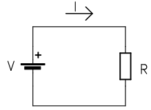
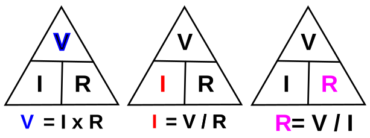
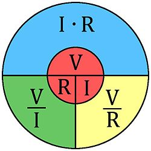
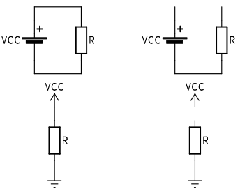
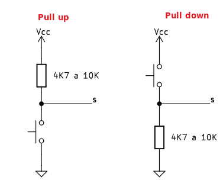

# Ley de Ohm
Es una ley que publica el físico alemán **Georg Simón Ohm** en 1827. Su descubrimiento consistió en ver que una corriente electrica (I) que circula a través de un conductor es proporcional a la diferencia de potencial (V) entre los extremos del conductor e inversamente proporcional a la resistencia eléctrica (R) del mismo. La ley de Ohm establece esta relación:

$I = \dfrac {V}{R} \space;\space R = \dfrac {V}{I} \space;\space V = I \cdot R$

  
*Circuito base de la ley de Ohm*

## **Unidades**
La ley de Ohm relaciona tres magnitudes eléctricas que se denominan, representan habitualmente y su unidad fundamental de medida es:

* Voltaje o tensión, se representa por la letra V y a veces por la U y se mide en voltios, que se representan por V.
* Intensidad de corriente, se representa por la letra I y se mide en Amperios que se representan por A.
* Resistencia eléctrica, se representa por la letra R y se mide en Ohmios que se representan por $\Omega$ o por facilidad de escritura con una R, o incluso se omite para valores bajos de resistencia.

* La unidad de corriente (I) es el amperio (A). En electrónica las corrientes de amperios no son muy usuales y se suelen usar los submúltiplos de, así que 1A = 1000mA (miliamprerios) y 1A = 1000000μA (microamperios) o lo que es lo mismo, 1mA = 1000μA.

* La unidad de tensión (V) es el voltio. Otras unidades habituales son 1kV (kilovoltio) = 1000V, 1V = 1000 mV (milivoltio), 1mV = 1000μV (microvoltio).

* La unidad de resistencia es el ohmios ($\Omega$ que, por facilidad, se suele sustituir por R). 1K $\Omega$ (kilohmio) = 1K = 1000R, 1M $\Omega$ (megaohmio) = 1000K = 1000000R.

## **Ecuaciones de la ley de Ohm**
Una forma clásica de representar la ley de Ohm es mediante un triángulo equilatero dividido en tres partes (ver imagen siguiente) donde la división horizontal interior representa la línea de fracción y la vertical la multiplicación. De esta forma es fácil recordarla.

  
*Triángulo nmemónico de la ley de Ohm*

Tapando la unidad que buscamos aparece la relación entre las otras dos.

Otro diagrama que muestra la forma en que se relacionan las magnitudes que intervienen en la ley de Ohm es:

  
*Diagrama circular de la ley de Ohm*

## **Circuito**
Para que la corriente circule es necesario un circuito o lazo cerrado formado por componentes electrónicos. En la figura siguiente, a la izquierda vemos representado un circuito de bucle cerrado, por lo que la corriente circula a través del mismo. A la derecha vemos un circuito abierto por el que no circula corriente.

  
*Triángulo nmemónico de la ley de Ohm*

## **Resistencias pull-up y pull-down**
Cuando necesitamos conectar ciertos elementos a algún pin de entrada, como por ejemplo un pulsador externo, no se puede hacer directamente porque cuando se acciona el pulsador se crea un cortocircuito en la alimentación que puede incluso dañar de manera irreversible nuestro dispositivo.

Lo que se hace es colocar un resistencia de alto valor (4K7 a 10K) entre Vcc y GND en serie con el pulsador y tomar la señal de salida de la unión de ambos elementos. Según situémos el pulsador y la resistencia tendremos uno u otro caso.

  
*Pull-up y pull-down externos*

Hay algunos pines que tienen la posibilidad de habilitar su propia resistencia que ya llevan incorporada hablándose entonces de pull-up o pull-down interno.
