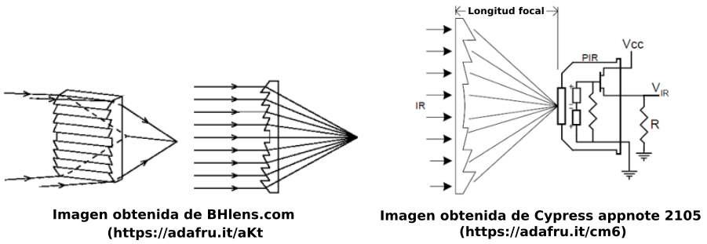

# Sensor de movimiento PIR
Los detectores PIR (del inglés 'Pyroelectric Infrared' o 'Passive Infrared') son sensores de movimiento por infrarrojos, y se caracterizan por su reducido tamaño, bajo costo, no ser influenciados por la luz natural, tener un bajo consumo de energía y ser de muy fácil manejo.

Todos los cuerpos (especialmente los vivos), emiten radiación electromagnética infrarroja, debido a la temperatura a la que se encuentran. A mayor temperatura, la radiación aumenta. Esta característica ha dado lugar al diseño de sensores de infrarrojo pasivos, en una longitud de onda alrededor de los 9.4 micrones, los cuales permiten la detección de movimiento, típicamente de seres humanos ó animales.

Los detectores PIR son dispositivos que detectan variaciones de la radiación infrarroja en su área de cobertura, por lo que son especialmente útiles para detectar la presencia de personas o animales a través del calor que emiten sus cuerpos.

Aunque en el enunciado del apartado pone "Sensor de movimiento PIR", el concepto PIR es solamente uno de los métodos posibles de detección de movimiento, pero es el que nos ocupa y en proyectos con este tipo de placas es muy común asociar ambos conceptos.

## **Tería base de funcionamiento**
Los sensores PIR son mas complicados de explicar que la mayoría de sensores (fotocélulas, sensores de golpe, etc) porque hay muchas variables que afectan a la entrada y salida del sensor. Para explicar de forma sencilla como trabaja el sensor nos vamos a basar en el diagrama de la figura siguiente:

  
*Explicación sensor PIR*

El sensor PIR en sí tiene dos ranuras, cada ranura está hecha de un material especial que es sensible a los infrarrojos. La lente utilizada aquí realmente no está haciendo mucho, por lo que vemos que las dos ranuras pueden 'ver' más allá de cierta distancia (básicamente, la sensibilidad del sensor).

Cuando el sensor está inactivo, ambas ranuras detectan la misma cantidad de infrarrojos, la cantidad ambiental radiada desde la habitación, las paredes o el exterior. Cuando pasa un cuerpo caliente como por ejemplo una persona o un animal, primero intercepta la mitad del sensor PIR, lo que provoca un cambio diferencial positivo entre las dos mitades. Cuando el cuerpo caliente sale del área de detección, ocurre lo contrario, por lo que el sensor genera un cambio diferencial negativo. Estos pulsos de cambio son lo que se detectan.

El sensor IR en sí está dentro de una caja metálica sellada herméticamente para mejorar la inmunidad al ruido/temperatura/humedad. Esta caja dispone de una ventana hecha de material transmisor de infrarrojos (típicamente silicona recubierta) que protege el elemento sensor con los dos sensores equilibrados.

La mayor parte de la verdadera magia ocurre con la óptica, una lente de Fresnel que permite cambiar la amplitud, el rango y el patrón de detección muy fácilmente. Según la [Wikipedia](https://es.wikipedia.org/wiki/Lente_de_Fresnel) es un diseño que permite construir lentes de gran apertura y distancia focal corta con materiales ligeros y económicos. En la figura siguiente vemos un corte transversal de una lente de Fresnel comparada con una plano-convexa tradicional.

  
*Lentes de Fresnel y convexa*

En la figura siguiente vemos gráficamente el funcionamiento del sistema y como la lente Fresnel condensa la radiación infrarroja al sensor.

  
*Funcionamiento de una lente Fresnel*

Explicación del funcionamiento basada en en el documento de [Adafruit](https://www.adafruit.com/) titulado [PIR Motion Sensor - Created by lady ada](https://cdn-learn.adafruit.com/downloads/pdf/pir-passive-infrared-proximity-motion-sensor.pdf).

En la figura siguiente vemos la ventana del sensor PIR en un módulo al que se le ha retirado la lente.

  
*Ventana del sensor PIR en el módulo de Keyestudio*

Las características del módulo de keyestudio son:

* Tensión de alimentación: de 3.3 a 5V DC
* Consumo 15 uA
* Temperatura de trabajo: de -20 a 85 ºC
* Salidas: 3V = nivel alto y 0V = nivel bajo
* Tiempo de retardo en la salida para el nivel alto: 2.3 a 3 segundos
* Ángulo de detección: 100º
* Distancia de detección: 3 a 4 metros
* LED indicador: Si la salida está en nivel alto el LED se enciende.
* Corriente límite por el pin de señal: 100 mA

Algunas aclaraciones que nos hace el fabricante:

* La distancia máxima es de 3-4 metros.
* Antes de probar la primera vez quitamos la lente blanca, se puede ver la ventana de detección rectangular. Cuando el lado mayor del rectángulo es paralelo al suelo, la distancia de detección es la mejor.
* Para comenzar a probar el sensor debe cubrirse con la lente blanca; de lo contrario, afectará a la distancia.
* La distancia de detección óptima se da a 25 ℃ y se acorta cuando supera los 30 ℃.
* Cuando carguemos nuestro código debemos esperar de 5 a 10 segundos para que el módulo sea sensible y luego comenzar a probar.

## **Módulo sensor infrarrojo de movimiento PIR HC-SR501**
Éste módulo sensor PIR [HC-SR501](../datasheet/HC-SR501.pdf) es sencillo de utilizar y dispone de dos potenciómetros de ajuste que permiten controlar tanto la sensibilidad como el tiempo de pulso. Una vez detectado un movimiento, emitirá un pulso por su pin de salida durante el intervalo ajustado.

Sus principales características son:

* Usa el PIR LHI778 y el controlador BISS0001
* Sensibilidad ajustable
* Tiempo de pulso ajustable
* Alimentación: de 4.5 a 12V
* Consumo promedio: menor de 1mA
* Ángulo de visión: 110 grados
* Distancia máxima de detección: ajustable de 3 a 7 metros
* Ajustes: 2 potenciómetros para ajuste de rango de detección y tiempo de alarma activa.
* Jumper para configurar la salida de alarma en modo mono-disparo ó disparo repetitivo (‘rettrigerable’)
* Salida de alarma de movimiento con ajuste de tiempo entre 3 segundos a 5 minutos.
* Salida de alarma activa Vo con nivel alto de 3.3V y 5mA
* Tiempo de inicialización: después de alimentar el módulo HC-SR05, debe transcurrir 1 minuto antes de que inicie su operación normal. Durante ese tiempo, es posible que el módulo active 2 ó 3 veces su salida
* Tiempo de salida inactiva: cada vez que la salida pase de activa a inactiva, permanecerá en ese estado los siguientes 3 segundos Cualquier evento que ocurra durante ese lapso es ignorado.
* Temperatura de operación: -15° a +70° C.

Su aspecto es el siguiente:

  
*Aspecto del sensor PIR HC-SR501*

En la imagen siguiente vemos el sensor PIR con la lente de Fresnel separada. La lente de Fresnel es un encapsulado con forma de semiesféra construido de polietileno de alta densidad. La misión de la lente es actuar como un filtro que permita el paso de la radiación infrarroja en un rango que va desde los 8 a los 14 micrones. La lente está diseñada para ofrecer detección en un ángulo de apertura de 110°. La lente también se encarga de concentrar la energía en la superficie de detección del sensor PIR, permitiendo una mayor sensibilidad del dispositivo.

  
*Aspecto del sensor PIR HC-SR501 abierto*

En la imagen siguiente se aprecia el área cónica cubierta por el sensor según el ajuste de la distancia de detección.

  
*Cono de detección del sensor PIR HC-SR501*

En la imagen siguiente tenemos una imagen de la parte posterior de la placa con la descripción de sus principales elementos.

  
*Descripción gráfica del sensor PIR HC-SR501*

Si colocamos la placa en una posición que nos permita ver en primer plano los potenciómetros veremos algo similar a lo siguiente:

  
*Ajustes del sensor PIR HC-SR501*

Respecto a la posición del jumper vemos que se puede trabajar en 2 modos de operación:

- 1 solo disparo: en este modo, cuando ocurre una detección de movimiento (‘evento’), la salida del sensor se activa durante el tiempo que se haya ajustado a través del potenciómetro correspondiente, y durante ese tiempo no se detectan nuevos eventos.
- Disparos repetitivos: en este modo, cada evento detectado genera un nuevo tiempo de activación. Cada detección genera un evento y el tiempo prestablecido se suma al que reste del evento anterior y así sucesivamente.

En cualquier caso, si la salida regresa a su estado inactivo, habrá un lapso de 3 segundos durante los cuales los nuevos eventos no serán considerados. Pasados esos 3 segundos, el dispositivo regresa a su funcionamiento normal.
