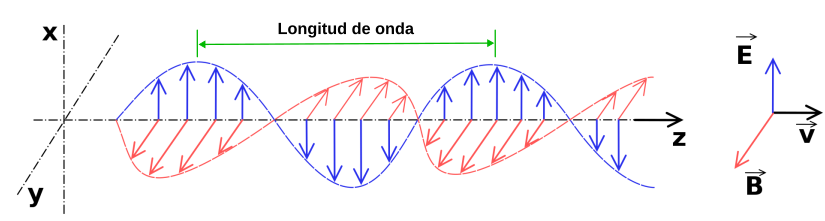
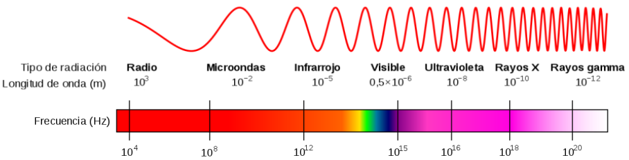
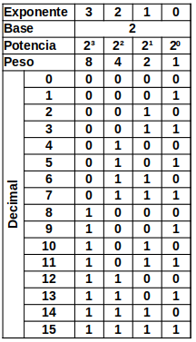
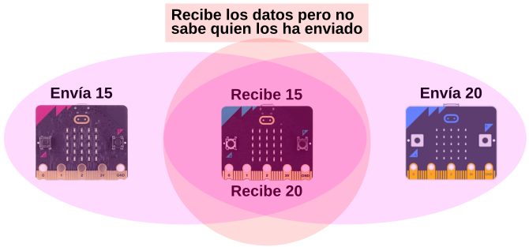

# <FONT COLOR=#8B008B>Radio en micro:bit</font>

## <FONT COLOR=#007575>**Introducción**</font>
Estamos bastante acostumbrados a utilizar la comunicación inalámbrica por radio, como por ejemplo en WiFi o Bluetooth. En el caso de micro:bit, además de la comunicación por Bluetooth, la comunicación por radio permite conectar unas placas con otras.

La idea es que aprendamos a utilizar la radio de la micro:bit y también algo de la comunicación broadcast (difusión). Las comunicaciones por radio suelen ser boradcast permitiendo que una micro:bit pueda enviar mensajes a otras muchas micro:bits.

<hr width=100%  size=10 noshade="noshade">

<FONT COLOR=#FF00FF>**Definiciones sobre broadcast**</font>

***Broadcast***: Cuando estamos hablando de redes de comunicaciones se entiende por broadcast o difusión que cuando un mensaje es enviado por un remitente se transmite a todos los receptores de la red.

***Dirección broadcast***: Es una dirección especial que indica que todos los dispositivos de la red deben recibir un mensaje determinado.

<hr width=100%  size=10 noshade="noshade">

Un receptor puede negarse a recibir mensajes de difusión si estos no están etiquetados con una dirección broadcast. En el caso de la micro:bit esta dirección se configura estableciendo un ID de grupo de la radio, como veremos. Entonces todas las micro:bits deben tener la misma dirección para que la comunicación broadcast funcione.

## <FONT COLOR=#007575>**Pinceladas sobre radiocomunicaciones**</font>
La radiocomunicación es una forma de telecomunicación que se realiza a través de ondas de radio u ondas hertzianas, la que a su vez está caracterizada por el movimiento de los campos eléctricos y campos magnéticos. La comunicación vía radio se realiza a través del espectro radioeléctrico cuyas propiedades son diversas dependiendo de sus bandas de frecuencia.

Las ondas de radio son radiadas por cargas eléctricas que sufren una aceleración.​ Se generan artificialmente mediante corrientes eléctricas que varían en el tiempo y que consisten en electrones que fluyen de un lado a otro en un conductor metálico llamado antena. En la transmisión, un transmisor genera una corriente alterna de radiofrecuencia que se aplica a una antena y esta irradia la potencia de la corriente en forma de ondas de radio. Cuando las ondas chocan con la antena de un receptor de radio, empujan los electrones del metal de un lado a otro, induciendo una pequeña corriente alterna. El receptor de radio conectado a la antena receptora detecta esta corriente oscilante y la amplifica.

La radiación electromagnética es un tipo de campo electromagnético variable, es decir, una combinación de campos eléctricos y magnéticos oscilantes, que se propagan a través del espacio transportando energía de un lugar a otro.

Las ondas electromagnéticas pueden ser representadas como campos eléctricos y magnéticos autopropagados en forma de onda transversal. El diagrama siguiente muestra una onda plana linealmente polarizada que se propaga de izquierda a derecha. El campo eléctrico (<FONT COLOR=#0000FF>vector $\vec{E}$ en azul</font>) está sobre el plano vertical y el campo magnético (<FONT COLOR=#FF0000>vector $\vec{B}$ en rojo</font>) sobre el plano horizontal. Los campos eléctrico y magnético en este tipo de ondas siempre están en fase a 90° una respecto a la otra.

<center>

  
*Onda electromagnetica*

</center>

La frecuencia de una onda electromagnética es el número de veces que cambia el sentido del campo en la unidad de tiempo. Se mide en ciclos por segundo, o herzios.

La longitud de onda es la distancia entre crestas de una onda y se mide en metros. Cuanto menor es la longitud de onda, más alta es la frecuencia.

El conjunto de todos los tipos de radiación se denomina espectro electromagnético. La radiación electromagnética se denomina espectro electromagnético o simplemente espectro cuando se refiere a un objeto. El espectro se extiende desde la radiación de menor longitud de onda (rayos gamma o rayos X) hasta las ondas de mayor longitud (ondas de radio) pasando por radiación ultravioleta, visible e infrarroja.

<center>

  
*Espectro electromagnético*

</center>

La radiación electromagnética (similar a la luz visible) tiene propiedades como su amplitud, fase o anchura de pulso, que pueden ser moduladas por un transmisor de tal forma que la información puede codificarse y, por tanto, emitirse. Cuando las ondas de radio encuentran un conductor eléctrico (por ejemplo, una antena), provocan una corriente alterna de la que se puede extraer la información contenida en las ondas y transformarla de nuevo en su forma original.

Las redes de comunicaciones se construyen por capas. Uno de los requisitos fundamental para una red es tener algún tipo de conexión que permita viajar a las señales. Esta conexión puede ser por cable o por radio. La siguiente capa tiene que ver, en el caso de radio, con la parte útil mas pequeña de una señal, que en el caso de la micro:bit es un byte. Un byte es una unidad de información que contiene ocho bits, siendo un bit la unidad más pequeña posible de información digital (1 o 0). Según la posición que ocupa un bit dentro del byte así es su pondereación o peso. En la tabla siguiente vemos los valores que puede ir tomando un byte en binario y decimal obtenidos de forma sencilla a partir de los pesos.

<center>

  
*Tabla para 4 bits*

</center>

Existen código admitidos internacionalmente como el [ASCII](https://elcodigoascii.com.ar/), abreviatura de American Standard Code for Information Interchange, que se pronuncia ˈæski y en el que se codifican mediante un caracteres imprimibles y no imprimibles o de control. Podemos decir que el código se divide en tres partes:

* Caracteres ASCII de control (0 a 31).
* Caracteres ASCII imprimibles (32 a 126). Letras mayúsculas y minúsculas, números y signos de puntuación usuales.
* ASCII extendido (128 a 255). Caracteres especiales, acentos, símbolos, etc.
* ASCII 127 reservado para DEL

Una vez puestos de acuerdo en la codificación ya tenemos claro lo que representa cada número de loos 256, que están codificados con tamaño de un byte, y podemos empezar a enviar texto de un byte (caracter a caracter).

## <FONT COLOR=#007575>**Información técnica**</font>
La CPU de la micro:bit es un chip nRF51822 de Nordic Semiconductor, que además de ser un procesador de propósito general, también contiene un módulo de radio de 2,4 GHz integrado. Esta radio puede configurarse de varias maneras y está diseñada principalmente para ejecutar el protocolo Bluetooth Low Energy (BLE). Sin embargo, también se puede colocar en un modo mucho más simple de funcionamiento que permite la comunicación directa de micro:bit a micro:bit.

El alcance en un área abierta y sin muchos dispositivos informáticos a su alrededor la señal de radio de la micro:bit puede alcanzar unos 65 o 70 metros.

El componente ```MicroBitRadio``` se compone de tres clases:

* ```MicroBitRadio```
* ```MicroBitRadioEvent```
* ```MicroBitRadioDatagram```

Estas clases proporcionan la capacidad de enviar paquetes de datos de propósito general de una micro:bit a otra, pero también se puede extender como un bus de mensajes para abarcar múltiples micro:bits que lo recibirán usando el mecanismo normal de escucha.

No es posible ejecutar MicroBitRadio y Bluetooth Low Energy (BLE) al mismo tiempo. Para usar la funcionalidad MicroBitRadio, hay que deshabilitar la pila BLE en la micro:bit.

El componente proporciona un canal de radio fácil de usar y flexible. Cualquier cosa que se envía desde una micro:bit, puede ser recibida por cualquier otra micro:bit cercana. Está diseñado para proporcionar una introducción potente pero sencilla al mundo de las comunicaciones inalámbricas, y puede permitir crear toda una gama de aplicaciones, desde construir nuestros propios detectores de amigos hasta crear coches teledirigidos.

Un principio clave de este componente es la privacidad, que se incorpora desde el principio. Así, cuando envías cualquier dato, no hay nada inherente a este protocolo que pueda utilizarse para identificarnos a nosotros o a nuestra micro:bit. Todos los dispositivos parecen idénticos. Por lo tanto, si queremos tener capacidad de identificarnos hay que añadirla a los datos.

<center>

  
*Privacidad de los datos y de las placas*

</center>

A continuación se resumen las principales capacidades de la radio micro:bit:

<center>

|Capacidad|Descripción|
|---|---|
|Frecuencia|1MHz banda estrecha, típicamente 2,407 GHz. Uso configurable en la banda de 2,400 GHz a 2,499 GHz.|
|Tasa de canal|1 Mbps|
|Transferencia máxima|Típica de 32 bytes, pero confugurable por código hasta 1024 bytes|
|Direccionamiento|Todos los dispositivos comparten la misma dirección para garantizar la privacidad del usuario|
|Encriptación|Ninguna. Se debe considerar el cifrado a nivel de usuario (o BLE) si se requieren canales securizados|
|Mallado|Ninguno (aún)|
|Detección de errores|Por redundancia ciclica por hardware de 16 bits. CRC (Cyclical Redundancy Checking)|
|Potencia de transmisión|Ocho niveles configurables por el usuario de 0 (-30dbm) a 7 (+4dbm)|
|Alcance de la transmisión|Aproximadamente 20m a 0dbm|

</center>
