# <FONT COLOR=#8B008B>Las comunicaciones serie</font>
La [comunicación serie o serial communication](https://es.wikipedia.org/wiki/Puerto_serie) son comunicaciones bidireccionales a través de la UART integrada en el microcontrolador. Es importante tener siempre presente que el puerto serie es el que se utiliza para "subir" el firmware o programa a la placa.

Una UART (Universal Asynchronous Receiver / Transmitter) es un circuito integrado que se encarga de gestionar las comunicaciones a través de un puerto serie en un equipo. Las placas micro:bit integran su propia UART. En micro:bit, el módulo UART nos permite comunicarnos con un dispositivo conectado a la placa mediante una interfaz serie a través del puerto serie USB. En los tres programas que estamos manejando son tratadas las comunicaciones serie y es lo que vamos a describir a continuación.

Para ver los datos serie en el ordenador puede que necesitemos lo que se conoce como terminal serie, que no es otra cosa que un programa para visualizar estas comunicaciones.

Dependiendo del sistema operativo con el que estemos trabajando el uso de las comunicaciones serie requieren un poco de configuración. En nuestro caso vamos a ver dos formas de hacerlo pero siempre bajo sistema operativo Linux, en concreto Ubuntu 22.04 LTS.

## <FONT COLOR=#007575>Instalar PuTTY en Ubuntu 22.04 LTS</font>
[PuTTY](https://www.putty.org/) está disponible para varias distribuciones Linux y vamos a ver la forma de instalarlo desde una terminal de Ubuntu. Como en todas las instalaciones es buena costumbre actualizar la lista de paquetes antes de proceder a instalar el software desde el respositorio por defecto.

~~~bash
sudo apt update
~~~

<center>

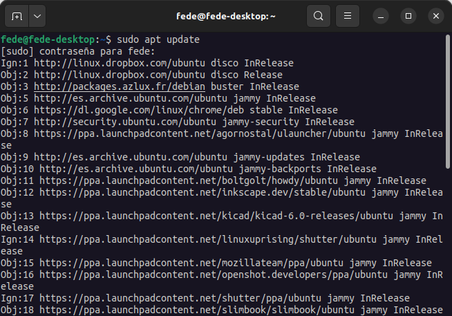  
*Actualizar lista de paquetes*

</center>

También podemos comprobar que versión de PuTTY está disponible:

~~~bash
apt show putty
~~~

<center>

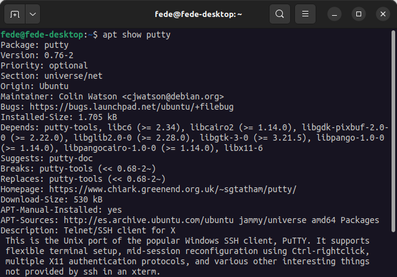  
*Comprobación de la versión disponible de PuTTY*

</center>

En el momento de la captura la versión disponible es la 0.76-2

Ya podemos instalar PuTTY haciendo:

~~~bash
sudo apt install putty -y
~~~

Tras instalar comprobamos la versión haciendo:

~~~bash
putty --version
~~~

<center>

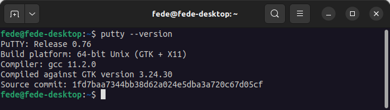  
*Comprobación de la versión de PuTTY*

</center>

Invocamos a la aplicación desde la terminal:

<center>

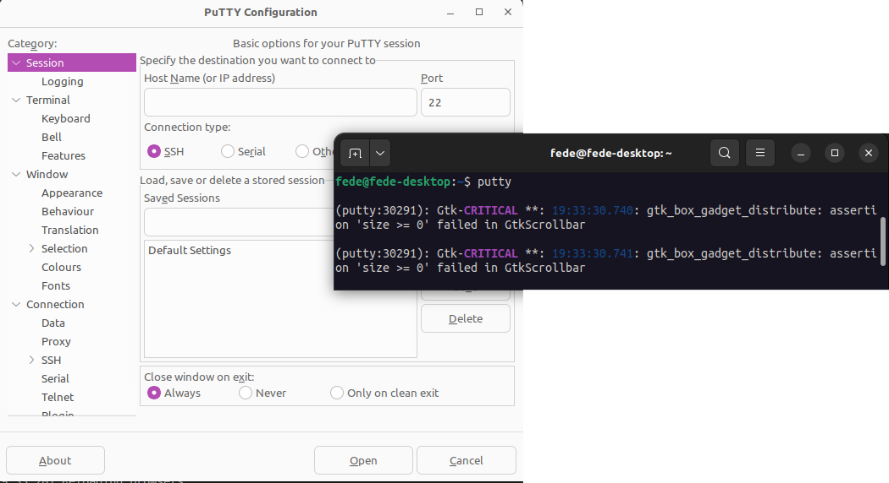  
*Ejecución de PuTTY*

</center>

La GUI (Interfaz gráfica) de PuTTY se inicializará y se puede utilizar para conectarse a otras máquinas escribiendo el nombre de host o la dirección IP:

<center>

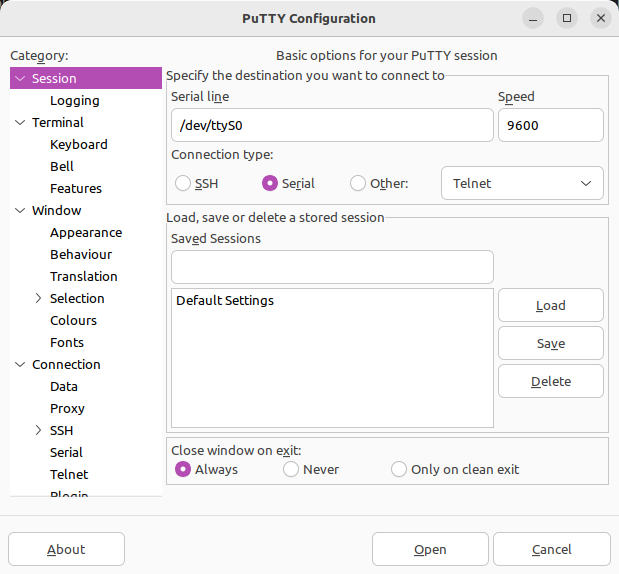  
*GUI de PuTTY*

</center>

Si por algún motivo tenemos que desintalar PuTTY de nuestro sistema hacemos:

~~~bash
sudo apt purge putty -y
~~~

Y PuTTY se elimina de Ubuntu junto con sus ficheros de configuración.

## <FONT COLOR=#007575>Instalar *screen* en Ubuntu 22.04 LTS</font>
Es otro sencillo programa para trabajar con datos serie. Para instalarlo en el sistema:

~~~bash
sudo apt install screen
~~~

<center>

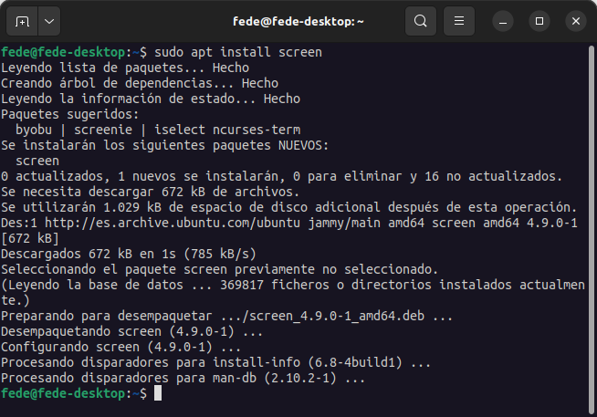  
*Intalar screen*

</center>

Con nuestra placa conectada a un puerto USB del ordenador tenemos que encontrar el nodo asignado a la micro:bit mediante:

~~~bash
ls /dev/ttyACM*
~~~

Habitualmente será */dev/ttyACM0*

<center>

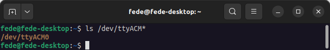  
*Nombre asignado a micro:bit*

</center>

La opción mas conveniente para ejecutar screen es como root, por lo que lo invocamos haciendo:

~~~bash
sudo screen /dev/ttyACM0 115200
~~~

La terminal del sistema pasa a una terminal serie lista para recibir datos desde la micro:bit.

Para volver a la terminal del sistema hay que pulsar la secuencia de teclas Ctrl-A Ctrl-D.

## <FONT COLOR=#007575>**MakeCode**</font>
El menú de bloques serial soporta la comunicación serial entre la BBC micro:bit y el ordenador. Básicamente, estos bloques permiten enviar datos desde la micro:bit al ordenador, lo que resulta muy útil para depuración ya que podemos añadir aclaraciones en el código que podemos ver en el ordenador mientras el programa se ejecuta.

El código de abajo muestra un simple script que envía una línea cuando la BBC micro:bit arranca y otra línea cada vez que se pulsa el botón A.

<center>

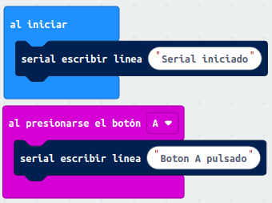  
*Comunicación serie base*

</center>

Los datos también se transmiten automáticamente via serie por el bloque "gráfico de barras" y son recogidos por el editor. Estos datos también pueden transmitirse a la nube.

Vamos a comprobar el funcionamiento de la transmisión serie en PuTTY y para ello debemos asegurarnos que el puerto USB asignado a la micro:bit no está siendo utilizado por ningún otro programa. Una vez estemos seguros que el puerto está libre invocamos PuTTY desde una terminal y configuramos la conexión serie así:

<center>

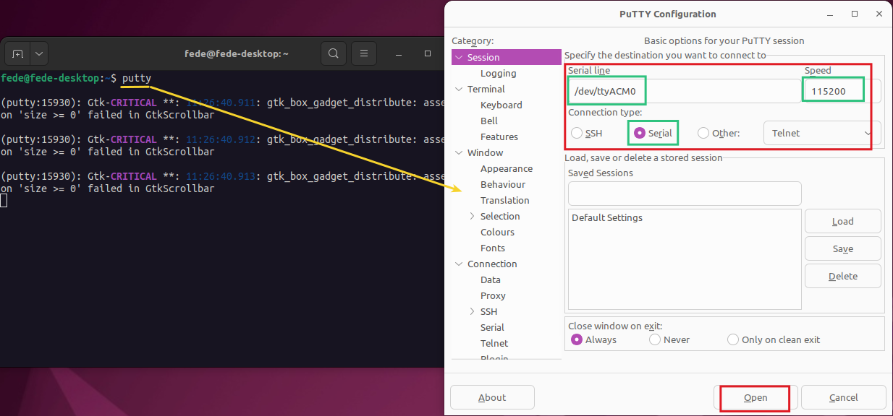  
*Comunicación serie micro:bit - PuTTY*

</center>

Después de hacer clic en el botón "Open" se nos abre una terminal serie lista para recibir datos y si pulsamos el botón A varias veces obtendremos un resultado como el siguiente:

<center>

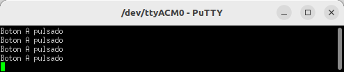  
*Terminal de comunicación serie micro:bit - PuTTY*

</center>

Hacemos lo mismo con la aplicación screen:

<center>

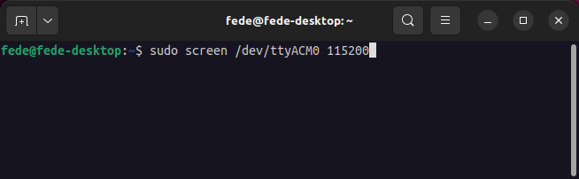  
*Comunicación serie micro:bit - screen*

</center>

Al pulsar la tecla "entrar" en la ventana anterior se muestra la terminal de *screen* y tras pulsar varias veces el botón tenemos:

<center>

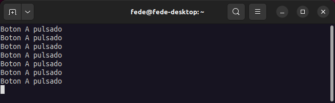  
*Terminal de comunicación serie micro:bit - screen*

</center>

Podemos observar que, aunque muy similares, las terminales serie de ambos programas son diferentes.

## <FONT COLOR=#007575>**MicroPython. UART**</font>
En MicroPython es el módulo *uart* el que permite comunicarse a través de la interfaz serie entre la micro:bit y el ordenador. El módulo tiene diferentes funciones encomendadas a realizar diferentes tareas de comunicación serie, pero sobre todo hay una fundamental que es la de inicializar la micro:bit para trabajar.

~~~py
microbit.uart.init(baudrate=9600, bits=8, parity=None, stop=1, *, tx=None, rx=None)
~~~

Inicializa la comunicación serie con los parámetros especificados en los pines *Tx* y *Rx* especificados. Hay que tener en cuenta que, para que la comunicación sea correcta, los parámetros deben ser los mismos en los dispositovos que se comunican. En la función tenemos:

* **baudrate**. Define la velocidad de la comunicación en baudios y puede ser: 9600, 14400, 19200 (2x9600), 28800 (14400x2), 38400 (2x19200), 57600 (28800x2) o 115200 (57600x2).
* **bits**. El parámetro *bits* define el tamaño de los bytes que se transmiten. Micro:bit solamente soporta 8 bits.
* **parity**. El parámetro *paridad* define la forma de comprobación de la paridad pudiendo valer: ```none```, ```microbit.uart.ODD``` o ```microbit.uart.EVEN```, lo que indica: ninguna, impar o par respectivamente. La paridad es una forma de comprobar que el dato transmisitido y el recibido coinciden.
* **stop**. Este parámetro indica el número de bits de parada, que en el caso de la micro:bit es uno.
* **Tx y Rx**. Son los pines de transmisión (Tx) y recepción (Rx) de la placa. Si no se especifican se utilizan los internos de USB/UART. Se puede especificar cualquier otro pin.

<hr width=100%  size=10 noshade="noshade">
Notas:

1. Inicializar la UART en pines diferentes a los establecidos por defecto para USB puede originar que la consola de Python deje de ser accesible, ya que utiliza el mismo hardware. Para recuperar la consola hay que reinicializar la UART sin pasar nada por Tx o Rx (o pasando None a estos argumentos). Es decir, llamar a ```uart.init(115200)``` es suficiente para restaurar la consola Python.
2. Las conexiones de dispositivos mediante Tx y Rx requieren "cruzar" los cables, de forma que el pin TX de la placa esté conectado al Rx del otro dispositivo y el pin Rx, con el pin Tx. De esta forma lo que uno transmite el otro lo escucha. También es imprescindible que los dispositivos tengan un GND común.
<hr width=100%  size=10 noshade="noshade">

El ejemplo siguiente nos va a permitir comprobar la comunicación serie desde MicroPython. Grabamos el programa en la micro:bit.

~~~py
from microbit import *

uart.init(115200,8,None,1)
while True:
    if button_a.was_pressed():
        #"\n" indica un salto de linea
        #\r" indica un retorno de carro
        #Con los dos se salta una linea y se lleva
        #el curso al principio
        uart.write("Python: Boton A pulsado\n\r")
~~~

Abrimos y configuramos PuTTY y la consola nos muestra:

<center>

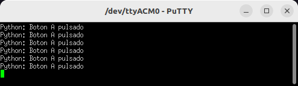  
*Terminal de comunicación serie micro:bit - PuTTY*

</center>

A continuación vemos el resultado en la consola de *screen*.

<center>

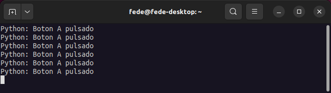  
*Terminal de comunicación serie micro:bit - screen*

</center>

## <FONT COLOR=#007575>**Acceso a REPL**</font>
[REPL](https://es.wikipedia.org/wiki/REPL) son iniciales de Read-Evaluate-Print-Loop y es lo que permite a la micro:bit leer y evaluar código en tiempo real mientras lo escribimos.

### <FONT COLOR=#AA0000>Editor web MicroPython</font>
Aunque no se ha explicado hasta este momento, el editor Python basado en navegador que venimos utilizando tiene soporte REPL integrado, al que se puede acceder usando WebUSB. Para utilizar el REPL tenemos que:

* Flashear un programa Python en micro:bit, el mismo que antes nos vale.
* Seleccionar *Show Serial* para abrir la ventana REPL. Está debajo del simulador.
* Usaremos la combinación CTRL-C del teclado para REPL.
* Usaremos la combinación CTRL + C del teclado para reiniciar.

En la animación siguiente vemos el funcionamiento.

<center>

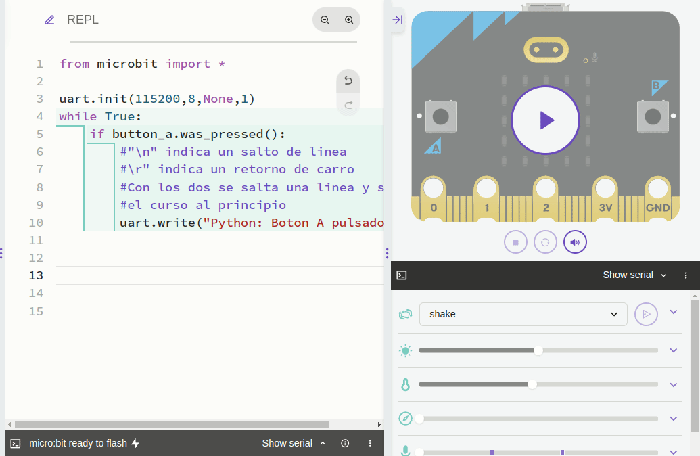  
*Terminal de comunicación REPL micro:bit - editor web*

</center>

Lógicamente la micro:bit tiene el programa grabado y está conectada al ordenador. En caso contrario se generará un error como:

<center>

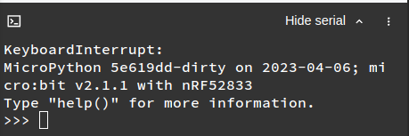  
*Error terminal de comunicación REPL micro:bit - editor web*

</center>

### <FONT COLOR=#AA0000>Editor Mu</font>
El editor Mu es compatible con REPL e incluso incluye un plotter de datos en tiempo real.

Como con el resto de programas lo mas conveniente es desconectar y conectar la micro:bit antes de hacer ninguna otra cosa para que el puerto serie USB quede disponible. Con una placa conectada iniciamos Mu y veremos lo siguiente:

<center>

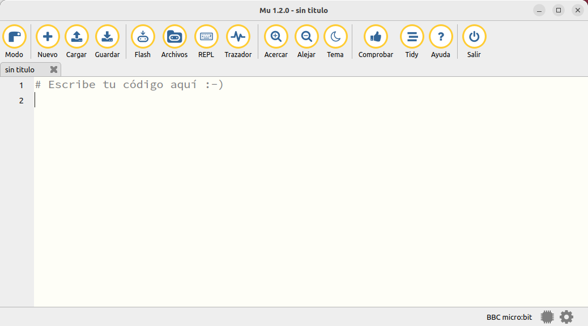  
*Ventana del IDE de Mu con una micro:bit conectada*

</center>

La selección de la placa se realiza desde el icono "Modo".

<center>

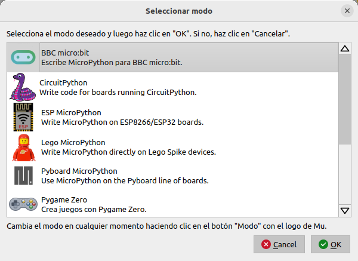  
*Modo*

</center>

Escribimos nuestro programa, que ahora va a ser:

~~~py
from microbit import *

uart.init(115200, 8, None, 1)
while True:
    if button_a.was_pressed():
        uart.write("Mu Editor: Boton A pulsado\n\r")
~~~

<center>

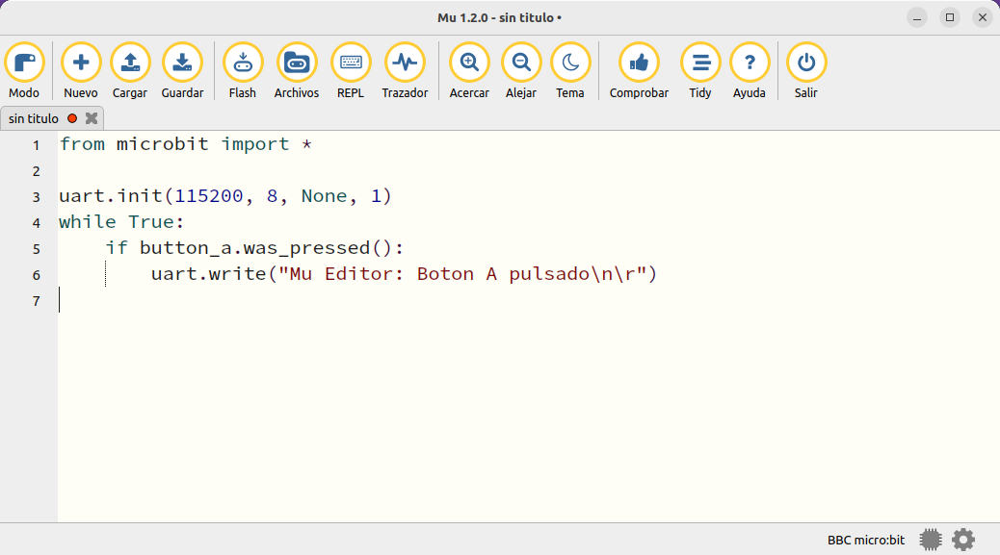  
*Programa en Mu para prueba serial*

</center>

Flasheamos nuestro programa en la micro:bit haciendo clic en el icono "Flash" y abrimos REPL y una vez abierto reseteamos la micro:bit para asegurar la conexión. Ya está lista la terminal para recibir datos, como vemos en la animación.

<center>

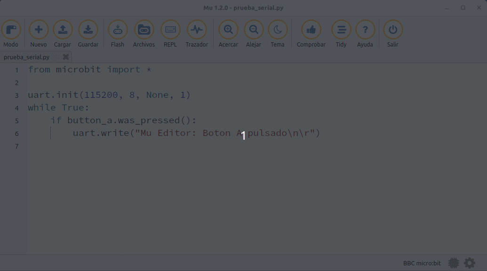  
*REPL en Mu*

</center>
