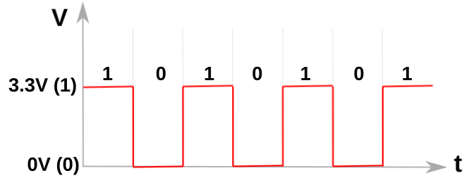
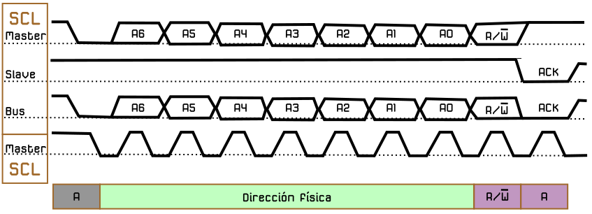

# Conceptos técnicos
Sección dedicada al estudio inicial de las señales en este tipo de electrónica y algunas formas de trabajar con las mismas.

## **Señales digitales y analógicas**
Vamos a ver una muy breve introducción a los circuitos digitales y analógicos que nos permita distinguir unos de otros y como tratar sus señales.

Una señal digital es una señal discreta en el tiempo y por tanto está formada por una secuencia de cantidades. Una señal digital puede cambiar instantaneamente su valor, como por ejemplo el estado de un pulsador, que puede estar accionado o no. En la práctica son señales que se denominan cuadradas, por su forma.

La electrónica digital utiliza magnitudes con dos valores discretos conocidos como '0 - 1, alto - bajo, on - off, High - Low', etc, y que se corresponden con la presencia o no de tensión en un determinado punto. Estos valores discretos pueden sufrir pequeñas variaciones en alguna variable del circuito pero, si no cambia el valor discreto no se produce ningún cambio en el comportamiento del circuito por lo que podemos decir que este no depende del valor exacto de la señal. En la figura siguiente vemos una señal digital típica.

  
*Señal digital*

Una señal analógica es una señal que cambia de valor con el tiempo de manera continuada. En la vida real la mayoría de las señales son analógicas, como por ejemplo la temperatura, que a lo largo de un día está cambiando continuamente pero en valores discretos y no con cambios importantes. En la práctica son ondas que varian en función del tiempo.

La electrónica analógica por contra emplea magnitudes con valores continuos o variables continuas. Una pequeña variación en una variable puede producir un gran cambio en el comportamiento del circuito. En la imagen vemos un ejemplo de señal analógica simple.

  
*Señal analógica*

En las placas micro:bit disponemos de 25 conectores situados en el borde inferior. En general diremos que los pines son de tipo GPIO o pines de entrada/salida de propósito general. Algunos pines son para E/S serie, SPI e I2C

Un pin **GPIO** (General Purpose Input/Output, Entrada/Salida de Propósito General) es un pin genérico, cuyo comportamiento (incluyendo si es un pin de entrada o de salida) se puede programar por el usuario en tiempo de ejecución. En el apartado de información técnica siguiente se profundiza en que es cada pin.

## **PWM**
PWM son siglas en inglés que significan <b>P</b>ulse <b>W</b>idth <b>M</b>odulation, que lo podemos traducir a español como modulación de ancho de pulso. Los pines PWM permiten generar una señal analógica mediante una salida digital mapeada con 8 bits, o lo que es lo mismo, valores del 0 al 255, es decir mediante una salida PWM podemos emular una señal analógica.

En realidad una placa microcontrolada no es capaz de generar una salida analógica y lo que se hace es emplear un truco que consiste en activar una salida digital durante un tiempo y el resto del tiempo del ciclo mantenerla desactivada. El valor promedio de la salida es el valor analógico. En el tipo de modulación PWM mantendremos constante la frecuencia, o lo que es lo mismo, el tiempo entre pulsos y lo que se hace es variar la anchura del pulso.

La proporción de tiempo que está encendida la señal, respecto al total del ciclo, se denomina ciclo de trabajo o Duty cycle, y generalmente se expresa en tanto por ciento. En la imagen siguiente vemos señales con distintos ciclos de trabajo.

  
*Distintos Duty cicle*

Las señales PWM emulan una señal analógica para aplicaciones como variar la luminosidad de un LED y variar la velocidad de motores de corriente continua.

Por limitaciones impuestas por la circuitería de micro:bit solamente pueden coexistir tres pines PWM de manera simultanea. Si intentamos habilitar un cuarto pin PWM se desabilitará algún otro pin PWM.

## **El bus I2C**
Las siglas I2C corresponden en realidad a I²C que tiene su origen en las iniciales del inglés Inter-Integrated Circuit (IIC = I²C) y que siginifican Circuito Inter-Integrado y vamos a explicar un poco en que consiste este sistema de conexionado.

El bus conocido por las siglas I2C, IIC o I²C, es un bus serie de datos desarrollado en 1982 por Philips Semiconductors (hoy NXP Semiconductors, parte de Qualcomm). Se utiliza principalmente internamente para la comunicación entre diferentes partes de un circuito, por ejemplo, entre un controlador y circuitos periféricos integrados. Posteriormente fue adoptado progresivamente por otros fabricantes hasta convertirse en un estándar del mercado con miles de circuitos integrados de diferentes fabricantes.

I2C también se denomina TWI (Two Wired Interface) únicamente por motivos de licencia, denominación introducida por Atmel. No obstante, la patente caducó en 2006, por lo que actualmente no hay restricción sobre el uso del término I2C.

El bus I2C requiere únicamente dos cables o lineas de señal para su funcionamiento, uno para la señal de reloj (SCL, Serial Clock) y otro para el envío de datos (SDA, Serial Data). Ambas líneas precisan resistencias de pull-up hacia Vcc. Cualquier dispositivo conectado a estas líneas es de drenador o colector abierto (Open Collector), lo cual en combinación con las resistencias pull-up, crea un circuito Wired-AND. En la imagen siguiente vemos el diagrama básico de conexionado del bus con algunos ejemplos de dispositivos. La señal de reloj siempre es generada por el circuito que actúa como Master.

  
*Diagrama de conexión del bus I2C*

Para ser reconocido en el bus, cada dispositivo dispone de una dirección física, que se emplea para acceder a cada uno de ellos de forma individual. Esta dirección puede ser fijada por hardware, en cuyo caso se pueden modificar los últimos 3 bits mediante “jumpers” o microinterruptores, o por software.

En general, cada dispositivo conectado al bus debe tener una dirección única. Si tenemos varios dispositivos similares tendremos que cambiar la dirección o, en caso de no ser posible, implementar un bus secundario.

El bus I2C tiene una arquitectura de tipo master-slave, lo que indica que el master es el encargado de controlar al resto de dispositivos tipo slave con los que se comunica y que se comunican con el, teniendo siempre el master prioridad absoluta. El dispositivo master es el que inicia la comunicación con los slaves. Los slaves no pueden iniciar la comunicación (el master tiene que preguntarles), ni hablar entre si directamente.

El bus I2C debe ser por lo tanto síncrono, es decir debe existir una señal de reloj que controle las comunicaciones. Es el master el que proporciona la señal de reloj, que mantiene sincronizados a todos los dispositivos del bus. De esta forma, se elimina la necesidad de que cada dispositivo tenga su propio reloj, de tener que acordar una velocidad de transmisión y mecanismos para mantener la transmisión sincronizada como en UART o SPI. En la imagen vemos un cronograma ejemplo del funcionamiento del sistema.

  
*Cronograma de trabajo del bus I2C*

El protocolo de comunicación I2C sigue la siguiente secuencia:

>
* Primero, el master genera la señal de reloj del bus (SCL).
* Se inicia la comunicación por orden del master al establecer la condición de START, que se produce cuando SDA pasa de uno a cero y se mantiene en cero durante un tiempo.
* El master direcciona a los slaves.
* El master indica si se va a leer o escribir.
* El slave direccionado responde con una señal de conformidad ACK (acknowledge).
* Se transmite los datos byte a byte desde SDA al receptor. Por cada pulso desde SCL se transmite un bit de información.
* El destinatario de la información responde con una señal de conformidad ACK.
* Se acaba la comunicación cuando el master establece la condición de STOP, que se produce cuando SDA, por orden del master pasa de cero a uno y se mantiene en uno durante un tiempo.

Son muchos los dispositivos I2C que se pueden direccionar por este bus I2C, siendo lo más común en los dispositivos para I2C que utilicen direcciones de 7 bits, aunque existen dispositivos de 10 bits, pero es un caso raro. Una dirección de 7 bits implica que se pueden poner hasta 128 (27) dispositivos sobre un bus I2C. Hemos visto que las direcciones son de 8 bits y esto es porque el bit extra de los 7 de la dirección lo emplea el master para informar al slave si va a leer o escribir. Si el bit de lectura/escritura es cero, el dispositivo master está escribiendo en el slave. Si el bit es 1 el master está leyendo desde el slave. La dirección de 7 bit se coloca en los 7 bits más significativos del byte y el bit de lectura/escritura es el bit menos significativo.

## **Conversión ADC y DAC**
En un sistema microcontrolado como el de micro:bit (y otros) existe la necesidad de poder trabajar con señales que no sean digitales, como lo son la mayoría de las variables que nos rodean, por lo tanto se hace necesario implementar una conversión de la información de entrada analógica a digital y el dispositivo se encargará también de convertir al contrario.

* La conversión analógica a digital la realiza el dispositivo ADC (Analog to Digital Converter)
* La conversión digital a analógica la realiza un dispositivo DAC (Digital to Analog Converter)

Ya hemos visto anteriormente como una señal analógica se representa mediante valores discretos y cambian continuamente con el tiempo mientras que una señal digital se representa mediante valores discretos.

Un conversor ADC se utiliza para convertir señales analógicas, como tensiones, en señales digitales o binarias formada por unos y ceros.

El rango del módulo ADC que lleva la micro:bit es de 10 bits, lo que significa que su resolución es de $2^{10}=1024 \space bits$, por lo que su rango (a 3,3V) se dividirá en 1024 partes iguales.

Cualquier valor analógico puede ser mapeado a un valor digital usando la resolución del conversor. Por tanto, cuantos más bits tenga el ADC, de más precisión será el muestreo del analógico y mayor la precisión de la conversión resultante. Así tenemos que:

$0 \space (digital) = \dfrac{0 - 3.3}{1024}$

$1 \space (digital) = {\dfrac{3.3}{1024}-\dfrac{2 \times 3.3}{1024}}$

