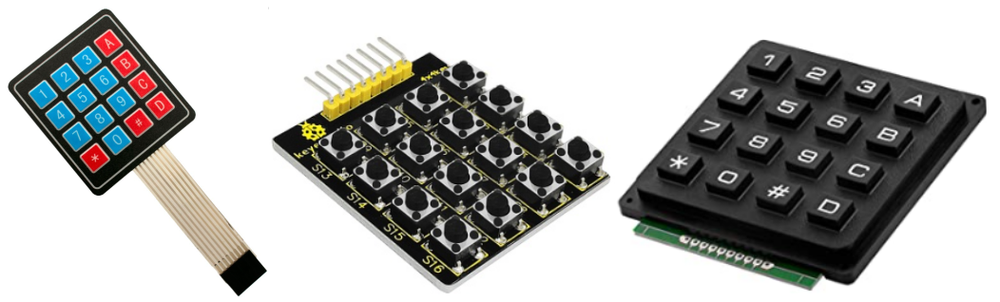

# Teclado matricial de 4x4
También conocidos como keypad, generalmente nos vamos a encontrar con dos tipos de teclados de 4x4 matriciales, unos basados en botones clásicos y otros de tipo membrana. En la figura siguiente vemos ejemplos de los mismos.

  
*Teclados de 4x4 matriciales*

En nuestro caso utilizaremos el de membrana, pero cualquiera de ellos se corresponde con un esquema de conexionado como el de la figura siguiente:

  
*Esquema conexiones teclados de 4x4 matriciales*

Detectar la pulsación de una tecla concreta es totalmente similar a la lectura simple de un pulsador. En nuestro caso las filas van determinadas por los pines 5, 6, 7 y 8 del conector del teclado y las columnas por los pines 1, 2, 3 y 4.

  
*El teclado matricial sw 4x4*

Para utilizar el teclado realizamos un escaneo de fila o columna que detectará el estado de cada tecla. Si por ejemplo enviamos un nivel bajo a la primera columna (pin 1) basta con detectar el nivel de las filas 8, 7, 6 y 5 para saber si se ha pulsado A, B, C o D. La relación de pines del conector con filas y columnas la hacemos numerando de derecha a izquierda como C1, C2, C3, C4, F5, F6, F7, F8. Las combinaciones de filas y columnas para cada tecla son:

* **1**: F8 y C4 -- **2**: F8 y C3 -- **3**: F8 y C2 -- **A**: F8 y C1
* **4**: F7 y C4 -- **5**: F7 y C3 -- **6**: F7 y C2 -- **B**: F7 y C1
* **7**: F6 y C4 -- **8**: F6 y C3 -- **9**: F6 y C2 -- **C**: F6 y C1
* **\***: F5 y C4 -- **0**: F5 y C3 -- **#**: F5 y C2 -- **D**: F5 y C1

