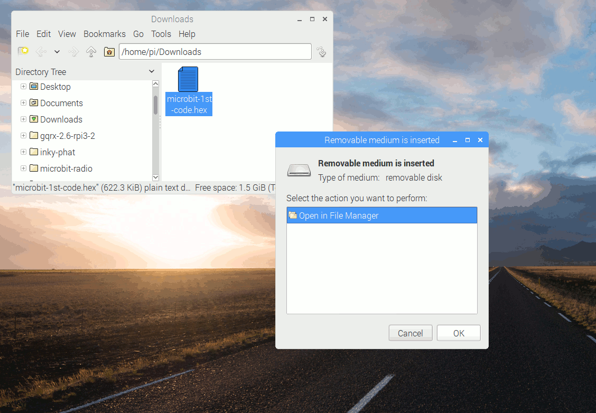

# Configurar nuestra micro:bit
Para poder continuar le tenemos que decir a la micro:bit lo que queremos que haga. Esto es dar a la micro:bit una serie de instrucciones contenidas en programas. Estos programas, en el caso de micro:bit, se pueden escribir de diferentes maneras y nosotros vamos a ver fundamentalmente como hacerlo en los editores online de bloques **MakeCode** y **MicroBlocks** o **Python** de texto.

Debemos disponer de un ordenador, un teléfono o una tableta para escribir el código, conectar la micro:bit a nuestro dispositivo lo que haremos de alguna de estas formas:

* Con ordenador. Es la forma mas usual y sencilla y consiste en utilizar un cable microUSB para realizar la conexión de la micro:bit al ordenador. Esta forma la vamos a describir de manera mas extensa a continuación.
* Teléfono o tableta. En este caso debemos utilizar Bluetooth para conectar ambos dispositivos de manera inalámbrica. Podemos consultar mas detalles en [Transferir desde la aplicación móvil](https://microbit.org/es-es/get-started/first-steps/set-up/), web que además nos va a servir de referencia para el resto de este apartado.

## **Transferir desde ordenador**
Los programas de usuario se copian en la memoria flash (no volatil) de la micro:bit por lo que a esta operación se le suele conocer como flasheo. La V1 tiene 256 KB de memoria flash y la V2 512 KB

Cuando se está flasheando un programa la micro:bit pausa la ejecución del programa que tenga en memoria y el LED amarillo de la cara posterior estará parpadeando mientras se esté copiando el nuevo programa. Una vez finalizada la copia, el nuevo programa comienza a ejecutarse en la micro:bit.

### Arrastrar y soltar
El proceso es exactamente igual que cuando transferimos un archivo desde el ordenador a un pendrive o memoria USB y funciona en cualquier ordenador. Lo que tenemos que hacer es:

* Descargar el programa como un archivo .hex desde el editor de código al ordenador, habitualmente al directorio de descargas. Finalmente se arrastra y suelta el archivo .hex en la unidad MICROBIT.
* Después de transferir el archivo .hex, la unidad MICROBIT se desconectará y reconectará según la micro:bit se reinicia. El archivo .hex no aparecerá en la unidad MICROBIT dado que la micro:bit no es un dispositivo de almacenamiento flash, aunque el ordenador lo muestra como tal para facilitar la transferencia de archivos .hex.

En el enlace [Transferir desde la aplicación móvil](https://microbit.org/es-es/get-started/first-steps/set-up/) hay disponibles videos que muestran cómo funciona este sistema. Simplemente elegimos nuestro sistema operativo (Windows, Mac, Chromebook o Linux/Raspberry Pi) y vemos el proceso.

En la animación siguiente (descarga de la web citada en el párrafo anterior) vemos el proceso completo en el caso de Linux.

  
*Flasheo mediante arrastrar y soltar*

### Flasheo directo
Se pueden enviar programas directamente desde los editores de código en línea a la micro:bit sin necesidad de descargar el archivo .hex y seguir el proceso anterior, lo que resulta fácil y rápido.

El flasheo directo solamente funciona en los navegadores Chrome o Edge que soportan webUSB. También es necesario tener actualizado el firmware de la micro:bit, especialmente si es un modelo que tiene mucho tiempo.

**IMPORTANTE**: EL flasheo directo es rápido y fácil, y excelente para la depuración, pero no SE guarda una copia del programa en el ordenador. Si pra nosotros es importante mantener una copia del código, es preferible utilizar el método de arrastrar y soltar, o en su defecto tener siempre la precaución de descargar el archivo .hex o .py o .ubp cuando se ha completado exitósamente el proyecto aunque durante el proceso se relicen pruebas del funcionamiento o depuración del código mediante este método.

En la web de referencia tenemos disponibles videos demostrativos de como se realiza el proceso.
