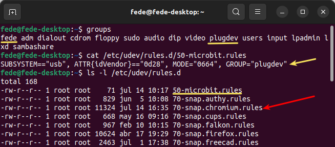
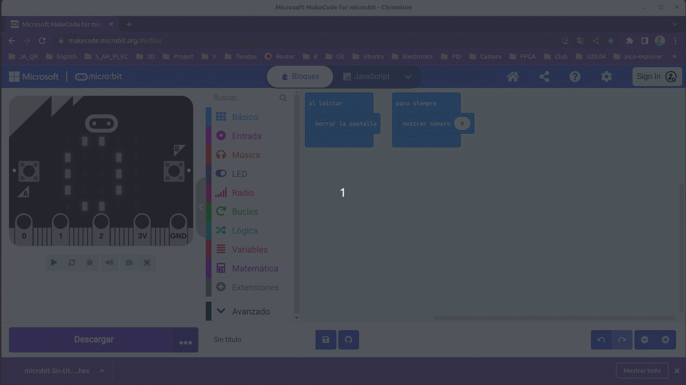

# Flasheo directo
Vamos a repetir y repasar todo lo necesario para poder grabar firmware en la micro:bit desde la página web del editor que estemos utilizando mediante webUSB.

## **Repaso**

* Estoy trabajando con sistema operativo Ubuntu 22.04.2 LTS de 64 bits.
* Inicialmente el navegador utilizado ha sido Chromium Versión 114.0.5735.198 (Build oficial) snap (64 bits). Con este navegador se consigue conectar con la micro:bit desde remoto pero sin éxito en el volcado del firmware.
* El flasheo directo solamente funciona en los navegadores Chrome o Edge que soportan webUSB. Opto finalmente por utilizar Google Chrome para flashear.
* Recordemos que también es necesario tener actualizado el firmware de la micro:bit.
* Seguir los pasos descritos en el [Solución de problemas de WebUSB](https://support.microbit.org/support/solutions/articles/19000105428-webusb-troubleshooting).

Se han llevado a cabo los pasos siguientes:

* Cuando trabajamos con distribuciones Linux como Ubuntu hay que declarar una regla udev. Para hacerlo: cerramos el navegador, nos aseguramos de que existe el grupo plugdev haciendo:

~~~
getent group
~~~

* Si no existe el grupo lo creamos con:

~~~
getent group plugdev >/dev/null || sudo groupadd -r plugdev
~~~

* Si es necesario agregamos nuestro usuario al grupo plugdev (reemplazamos "tu-nombre-de-usuario" con el nombre real de usuario):

~~~
sudo usermod -a -G plugdev <tu-nombre-de-usuario>
~~~

* Creamos un archivo en el directorio */etc/udev/rules.d* que llamaremos *50-microbit.rules* haciendo:

~~~
sudo nano/etc/udev/rules.d/50-microbit.rules
~~~

* Introducimos la línea que vemos en la imagen.

*Creación regla udev*

~~~
SUBSISTEMA=="usb", ATTR{idVendor}=="0d28", MODO="0664", GRUPO="plugdev"
~~~

* Reiniciamos las reglas udev

~~~
sudo udevadm control --reload-rules 
~~~

* Cerramos sesión o reiniciamos el sistema y ya podemos trabajar de nuevo.

## **Pruebas finales**
Para comprobar que todos los cambios propuestos anteriormente se han realizado correctamente vamos a ejecutar desde una terminal los comandos siguientes:

~~~
groups
cat /etc/udev/rules.d/50-microbit.rules
ls -l /etc/udev/rules.d
~~~

Como vemos en la imagen siguiente, el primer comando nos indica que el usuario está en el grupo requerido, el segundo nos muestra la sintaxis de la regla creada y con el tercero simplemente comprobamos que el fichero creado efectivamente está y además en el directorio correspondiente.

*Creación regla udev*

En la imagen se ha indicado la existencia del archivo de reglas udev creado con la instalación del navegador Chromium, pero en este no existe ninguna regla para micro:bit y personalmente no he querido tocar el mismo.

## **MakeCode**
Iniciamos el navegador Chromium o Google Chrome, este último preferiblemente desde un perfil sin cuenta o con una cuenta que tenga poca actividad.

Conectamos nuestra micro:bit a un puerto USB y procedemos a emparejarla con el navegador. Si nos da algún tipo de error debemos probar a desconectar y volver a conectar la micro:bit del USB y repetir la operación.

Para el caso de Chromium será algo similar a lo siguiente:

*Flasheo directo en Chromium*

Para el caso de Chrome será algo similar a lo siguiente:

*Flasheo directo en Chrome*

## **Python**
Para el caso de Chromium será algo similar a lo siguiente:

*Flasheo directo en Chromium*

Para el caso de Chrome será algo similar a lo siguiente:

*Flasheo directo en Chrome*

Tenemos que recordar siempre archivar nuestro trabajo.
