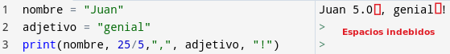

# <FONT COLOR=#8B008B>La consola serie</font>
El terminal o consola serie sirve para visualizar en un ordenador los datos recibidos a través del puerto serie y en realidad es una aplicación que controla las comunicaciones bidireccionales a través de la UART integrada en el microcontrolador. También sirve para enviar datos desde la consola a la placa.

Es muy importante tener siempre presente que el puerto serie es el que se utiliza para "subir" el firmware o programa a la placa, tarea que se realiza a través de una aplicación pregrabada en el microntrolador y que se denomina "bootloader".

## <FONT COLOR=#007575>**Uso de la consola**</font>
Para usar la consola serie hay que tener un dispositivo micro:bit conectado al ordenador, y usar un navegador que soporte WebUSB, como Chromium, Chrome o Edge. Conectamos y flasheamos en la micro:bit desde el botón "Enviar a micro:bit" y una vez completado el proceso, veremos aparecer una barra negra en la parte inferior del editor. 

<center>

  
*Acceso a la consola serie*

</center>

Si hacemos clic en "Mostrar consola serie" accedemos a la misma, desplegandose una ventana bash o de terminal.

<center>

  
*Consola serie*

</center>

La consola serie permite inspeccionar la salida de texto de un programa a través de la función ```print()```. Esto es particularmente útil para depuración o para revisar cómo el estado de un programa está cambiando con el tiempo. También es posible enviar texto utilizando en el programa la función ```input()```.

En la sección Referencia del menú del lateral izquierdo podemos encontrar el apartado "Entrada y salida de texto" donde se describe el uso del teclado y la pantalla del ordenador en programas de micro:bit. Probaremos los ejemplos que ahí se plantean mas adelante.

También puedes interrumpir y reiniciar el programa usando Ctrl+C y Ctrl+D, respectivamente.

En la parte superior derecha de la consola hay una 'i' rodeada de un círculo que nos muestra una ventana emergente donde aparece la siguiente información:

>
    **Consola serie: sugerencias y consejos**
La terminal serie muestra errores y otros resultados del programa que se ejecuta en el micro:bit. Por defecto, muestra el error más reciente del programa; expándelo para ver todos los resultados.

El programa puede imprimir mensajes usando la función ```print```. Prueba a añadir ```print('micro:bit es increíble')``` al programa.

Utiliza el atajo de teclado ```Ctrl + C``` para interrumpir el programa. Después podrás escribir comandos de Python para que los ejecute MicroPython. Es una gran manera de experimentar con algo nuevo.

Para reiniciar el programa, pulsa ```Ctrl + D```.

La consola serie también muestra la salida completa de los errores de ejecución, lo que puede ser útil cuando se depura. En [Python Editor: Troubleshooting errors](https://support.microbit.org/support/solutions/articles/19000135211-python-editor-troubleshooting-errors) encontramos mas detalles sobre errores.

## <FONT COLOR=#007575>**Ejemplo de escritura en la consola**</font>
Un programa como el siguiente:

~~~py
from microbit import *

while True:
    print("Nivel de luz: ")
    print(display.read_light_level())
    sleep(1000)
~~~

Nos imprime el nivel de luz actual una vez por segundo en la consola del ordenador, como vemos en la animación siguiente:

<center>

  
*Envio de datos a la consola serie*

</center>

Podemos poner el texto y el dato en una misma línea haciendo el programa así:

~~~py
from microbit import *

while True:
    print("Nivel de luz: " + str(display.read_light_level()))
    sleep(1000)
~~~

Para que la función print sea consistente no podemos mezclar una cadena de texto con un dato entero, por ese motivo se convierte la lectura numérica en una cadena con ```str```.

Existe mucha información en la web referente a la función print() de Python que se puede consultar cuando resulte necesario. Aquí daremos a continuación unas breves nociones.

## <FONT COLOR=#007575>**Ejemplo de lectura de la consola**</font>
Un programa como el siguiente:

~~~py
from microbit import *

while True:
    nombre = input('Dime un nombre ')
    print("Hola", nombre)
    sleep(1000)
~~~

Nos va a pedir en la consola un nombre cada segundo y cuando se lo escribamos y pulsemos la tecla Enter nos enviará un saludo también a la consola.

<center>

  
*Recepción de datos desde la consola serie*

</center>

## <FONT COLOR=#007575>**La función ```print()```**</font>
Las pantallas, como la que incorpora la micro:bit, las LCDs o las OLED son dispositivos de salida que tienen mucha utilidad en la visualización de información.

Python, ya desde su propio IDLE ya incorpora respuesta inmediata a cosas como por ejemplo indicar el valor de una variable con solo nombrarla e incluso puede realizar operaciones básicas con números o con variables.

En los programas tenemos que utilizar la función ```print()``` que nos permite mostrar texto en la pantalla, siendo este indicado como argumento de la función que se puede indicar tanto entre comillas dobles como simples.

Al final de cada ```print()``` Python añade de forma automática un salto de línea.

La función ```print()``` permite utilizar cadenas y números como argumentos, haciendo fácil mezclar números con textos.

Si necesitamos generar una línea en blanco dejaremos el argumento de la función vacio.

Si queremos evitar en salto de línea automático al final de la función tenemos que añadir ```end=""```.

<center>

  
*Algunos ejemplos en el IDLE*

</center>

Si dentro de una frase necesitamos utilizar comillas no podemos usarlas directamente porque se produce un error de sintaxis (los lenguajes de programación son 100% inflexivbles con estos errores) ya que Python entiende las comillas como que encierran una cadena y no pueden existir cadenas dentro de cadenas.

<center>

  
*Cadena entrecomillada que genera error*

</center>

Una primera solución es alternas los tipos de comillas que conforman las cadenas total y parcial:

<center>

  
*Cadena entrecomillada correcta*

</center>

La segunda solución para incluir comillas dentro de comillas, es escribir una contrabarra (\) antes de las comillas para que Python reconozca la comilla que le sigue como un carácter y no como un delimitador de la cadena:

<center>

  
*Cadena entrecomillada correcta*

</center>

La función ```print()``` muestra los argumentos separados por espacios, lo que nos permite crear frases como sucesión de argumentos, pero que nos genera espacios indebidos, como se ve a continuación:

<center>

  
*Cadena con espacios indebidos*

</center>

Se puede solucionar de diversas maneras, pero en la actualidad se hace utilizando lo que se conoce como ```f-Strings``` (formatted String literals), que se traduce como formateo literal de cadenas. Crear una ```f-String``` es tan sencillo como agregar una letra f o F dentante de las comillas. Por ejemplo:

~~~py
"cadena noraml"
f"cadena f-Strings"
~~~

Cuando queremos mostrar el valor de una variable utilizando ```f-Strings``` debemos especificar dicha variable entre llaves. Si se utilizan varias variables todas deben ir entre llaves.

<center>

  
*Cadena con espacios indebidos corregidos con ```f-Strings```*

</center>

Veamos otro ejemplo con argumentos numéricos:

<center>

  
*Cadena con ```f-Strings``` y operaciones con argumentos*

</center>

## <FONT COLOR=#007575>**La función ```input()```**</font>
Una forma de que un programa reciba datos del exterior es introducirlos mediante un teclado. En los ejemplos siguientes utilizaremos el teclado para enviar datos a la micro:bit y los visualizaremos en la consola de MicroPython. Comencemos por el ejemplo visto de la lectura de la consola:

<center>

  
*Ejemplo sencillo con ```input()```*

</center>

Una cuestión de criterio en el ejemplo puede ser que la respuesta que escribimos aparezca justo detrás del texto inicial para así compactar mas todo. Tarea que se hace de forma similar a la de la función ```print()``` y usar end="" para evitar el salto de línea.

<center>

  
*Ejemplo sencillo con ```input()``` sin salto de línea*

</center>

Se puede observar la diferente posición del cursor señalado en cada caso.

El mismo efecto se puede conseguir aprovechando que la función ```input()``` no realiza un salto de línea cuando envia un argumento:

<center>

  
*Ejemplo sencillo con ```input()``` sin salto de línea*

</center>

De forma predeterminada la función ```input()``` convierte lo que introduzcamos en una cadena, aunque sean números y por lo tanto no es posible realizar operaciones de esa forma.

<center>

  
*Ejemplo de cáculos con ```input()``` con error*

</center>

Para que Python interprete la entrada como un número, se debe utilizar la función ```int()``` o ```float()```, según necesitemos que sea entero o real:

<center>

  
*Ejemplo de cáculos con ```input()``` sin error*

</center>

Hay que recordar que al introducir una fracción de forma automática el ```int``` introducido se cambia al tipo ```float```.

Podemos pensar en este momento que sería útil usar ```f-Strings```, pero hay que indicar que en MicroPython no están soportadas, tal y como se indica en [Core language](https://docs.micropython.org/en/latest/genrst/core_language.html?highlight=f%20strings) de la documentación oficial de [MicroPython](https://micropython.org/)

La función ```input()``` sólo puede tener un argumento y no es posible utilizar ```f-Strings```, pero podemos incorporar variables en el argumento concatenandolas:

<center>

  
*Ejemplo de ```input()``` con variables como argumento*

</center>

Si queremos utilizar números debemos convertir los datos en cadenas con ```str```, para los cálculos los datos en ```int``` o en ```float``` y la separación entre argumentos se hace con la como (,):

<center>

  
*Ejemplo de ```input()``` con cálculos*

</center>
