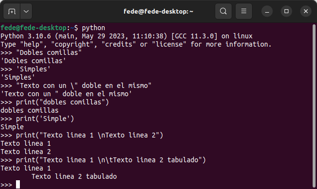
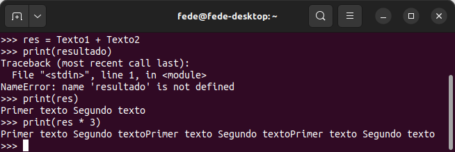
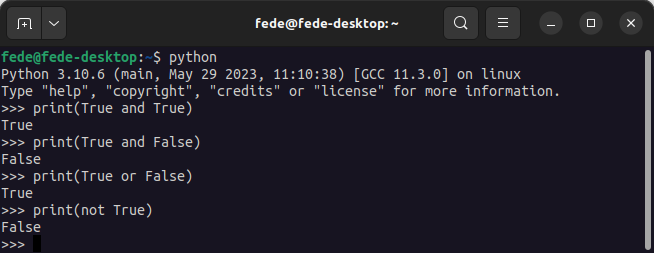

# <FONT COLOR=#8B008B>Introducción a Python</font>

## <FONT COLOR=#007575>**¿Que es Python y de donde viene?**</font>
Una breve introducción a cosas de Python que nos pueden ayudar con la guía de MicroPython. Al final se trata el asunto de los permisos en Linux, que aunque sea un poco "off topic" puede resultar útil.

### <FONT COLOR=#AA0000>Creador de Python</font>
Python es un lenguaje de programación interpretado (no hay que compilar los programas) cuya filosofía hace hincapié en una sintaxis que favorezca un código legible.

Python fue creado a finales de los ochenta, por el holandés [Guido van Rossum](https://es.wikipedia.org/wiki/Guido_van_Rossum) en el Centro para las Matemáticas y la Informática (CWI, Centrum Wiskunde & Informatica), en los Países Bajos.

El nombre del lenguaje proviene de la afición de su creador por los humoristas británicos Monty Python y no de la serpiente del mismo nombre. Aunque se suele usar un símbolo con una serpiente pitón para representarlo, de ahí la normal confusión.

Se trata de un lenguaje de programación multiparadigma o que soporta más de un paradigma de programación, representando un paradigma un enfoque particular o filosofía para la construcción del software. Python soporta:

* Orientación a objetos. En la programación orientada a objetos (OOP) los objetos manipulan los datos de entrada para la obtención de datos de salida específicos, donde cada objeto ofrece una funcionalidad especial. Los objetos permiten la agrupación en librerías y usualmente permiten al usuario la creación de sus propias librerías. Se basa en técnicas de herencia, cohesión, abstracción, polimorfismo, acoplamiento y encapsulamiento.
* Programación imperativa. Es la forma natural de programar un ordenador, es el estilo de programación que se utiliza en el ensamblador y el más cercano a la máquina. Sigue la arquitectura arquitectura clásica de Von Newmann con una memoria donde se almacenan los datos y el programa y una unidad de control que ejecuta las instrucciones del programa, conocida cómo contador del programa.
* Programación funcional. Es un estilo de programación cuyo método básico de computación es la aplicación de funciones a sus argumentos.

### <FONT COLOR=#AA0000>Filosofía Python</font>
Es muy parecida a la filosofía de Unix. El código que sigue los principios de Python de legibilidad y transparencia se dice que es "**pythonic**". Por el contrario, el código opaco u ofuscado es bautizado como "**unpythonic**". Los puntos que describen su filosofia son:

* Bello es mejor que feo.
* Explícito es mejor que implícito.
* Simple es mejor que complejo.
* Complejo es mejor que complicado.
* Plano es mejor que anidado.
* Disperso es mejor que denso.
* La legibilidad cuenta.
* Los casos especiales no son tan especiales como para quebrantar las reglas.
* Lo práctico gana a lo puro.
* Los errores nunca deberían dejarse pasar silenciosamente.
* A menos que hayan sido silenciados explícitamente.
* Frente a la ambigüedad, rechaza la tentación de adivinar.
* Debería haber una -y preferiblemente sólo una- manera obvia de hacerlo.
* Aunque esa manera puede no ser obvia al principio a menos que usted sea holandés (en clara referencia a su autor).
* Ahora es mejor que nunca.
* Aunque nunca es a menudo mejor que ya mismo.
* Si la implementación es difícil de explicar, es una mala idea.
* Si la implementación es fácil de explicar, puede que sea una buena idea.
* Los espacios de nombres (namespaces) son una gran idea **¡Hagamos más de esas cosas!**

El Zen de Python viene incorporado (en inglés) a partir de la versión 2.1.2 y podemos invocarlo con ```import this``` abriendo Python en una terminal en un sistema en el que lo tengamos instalado, lógicamente.

<center>

  
*Arrastrar y soltar un fragmento de código*

</center>

### <FONT COLOR=#AA0000>Tipos de permisos en Linux</font>
El comando CHMOD nos da la posibilidad de poder cambiar los permisos de los archivos y directorios combinando entre clases y tipos. Hay cuatro clases:

* Propietario (u). Creador del archivo o la carpeta
* Grupo (g). Usuarios que tendrán acceso al archivo o carpeta
* Otros (o). Todos los usuarios
* Todos (a). Todos los tipos de usuario (propietario, grupo y otros)

Hay tres tipos de permisos:

* Lectura ( r). Permite que el usuario vea el archivo pero no puede realizar cambios en el mismo ni copiarlo o borrarlo.
* Escritura (w). Se permite que los usuarios que acceden al archivo o carpeta puedan realizar sobre el mismo cualquier tipo de edición, copiar, cortar o borrar.
* Ejecutar (x). Al activar esta opción, la cual viene por defecto deshabilitada, podemos ejecutar archivos.

Hay tres modificadores para la tarea:

* +. Concede el permiso
* -. Deniega el permiso
* =. Sobreescribe un permiso con el permiso anterior.

En entornos Unix cada permiso tiene el siguiente valor:

* Lectura: 4
* Escritura: 2
* Ejecución: 1

Jugando con sumas de estos valores establecemos distintos permisos, por ejemplo, si queremos dar un permiso de escritura usaremos el 6 = 4 + 2 (Lectura + Escritura). Si queremos que pueda ejecutar usaremos el 7 = 4 + 2 + 1 (Lectura + Escritura + Ejecución).

En la tabla tenemos todos los valores posibles.

<center>

|**Dec.**|**Bin.**|**Permiso**|**read**|**write**|**exe**|
|:-:|:-:|---|:-:|:-:|:-:|
|0|000|Sin permisos|N|N|N|
|1|001|Ejecución|N|N|Y|
|2|010|Escritura|N|Y|N|
|3|011|Lectura y escritura|N|Y|Y|
|4|100|Lectura|Y|N|N|
|5|101|Lectura y ejecución|Y|N|Y|
|6|110|Lectura y escritura|Y|Y|N|
|7|111|Lectura, escritura y ejecución|Y|Y|Y|

</center>

El procedimiento para establecer el permiso es muy sencillo. Basta con ir a una terminal y ejecutar la siguiente orden:

~~~
chmod Tipo-permiso Ruta-Archivo
~~~

Ejemplos para modificar permisos en modo terminal:

~~~
chmod o=rwx * → Dar permisos de lectura, escritura y ejecución a los otros usuarios.

chmod go= * → Quitar todos los permisos a grupo y los otros usuarios.

chmod 666 /Documentos/curso-python/Ejercicios/holamundo.py
~~~

En sistemas Linux con letras veremos algo como lo siguiente:

* 0 → ---  → sin acceso
* 1 → --x → ejecución
* 2 → -w- → escritura
* 3 → -wx → escritura y ejecución
* 4 → r-- → lectura
* 5 → r-x → lectura y ejecución
* 6 → rw- → lectura y escritura
* 7 → rwx → lectura, escritura y ejecución

Por ejemplo: *chmod 777*. Le damos a los 3 tipos de usuarios permiso de lectura, ejecución y escritura (hemos sumado4+2+1).  Si queremos dar permisos de lectura y escritura sería 4+2 = 6 y si si lo que queremos es sólo dar lectura sería 4. Si lo que queremos es dar lectura y ejecución sería de sumar 4 + 1 = 5.

Diferentes combinaciones típicas:

* *chmod 755*. Permiso de lectura y ejecución (4+1) a todos los usuarios excepto al propietario que lo tiene completo (lectura, escritura, ejecución 4+2+1).
* *chmod 666*. Permisos de lectura y escritura a todos, excepto ejecución (4+2). Todos pueden acceder al archivo, leer su contenido y modificarlo.
* *chmod 644*. Se suele utilizar para no permitr la escritura a nadie que no sea el propietario. El 755 es similar, lectura y ejecución aunque este es más restrictivo (sólo lectura) y (lectura, escritura para propietario).

## <FONT COLOR=#007575>**Palabras reservadas e identificadores**</font>

### <FONT COLOR=#AA0000>Palabras reservadas</font>
Son palabras reservadas que tienen un significado especial para el compilador y que no podemos usar para poner nombres a variables o funciones. Todas las palabras, excepto ```True```, ```False``` y ```None``` se escriben en minúsculas. A continuación se da un listado de todas las palabras reservadas o keywords:

~~~python
False, None, True, and, as, assert, async, await, break, class, continue, 

def, del, elif, else, except, finally, for, from, global, if, import, in, 

is, lambda, nonlocal, not, or, pass, raise, return, try, while, with, yield
~~~

El listado al principio nos puede resultar abrumador, pero imaginemos un lenguaje con tan solo esas palabras y entenderemos que no resultará tan complejo familiarizarse, al menos con las mas usuales.

### <FONT COLOR=#AA0000>Identificadores</font>
Los identificadores son los nombres que se dan a variables, clases, métodos, etc. **No podemos** usar palabras reservadas para estos nombres.

Algunas reglas que nos pueden resultar útiles para nombrar idetificadores son:

* Los identificadores son sensibles a mayúsculas y minúsculas
* Los identificadores no pueden ser palabras reservadas
* Los espacios en blanco no están permitidos
* Un identificador puede ser una secuencia de letras y números. **Siempre** debe empezar por una letra o por el símbolo de subrayado "_". El primer carácter de un identificador **no puede** ser un número.
* No podemos utilizar caracteres especiales como la ñ, ¡, ¿ o letras con acentos.
* No podemos utilizar los símbolos como !, @, #, $, etc.

Nos va a resultar muy útil recordar lo siguiente:

* Python es un lenguaje que distingue entre mayúsculas y minúsculas. Esto significa que ```Variable``` y ```variable``` no son lo mismo
* Damos siempre a los identificadores un nombre que tenga sentido. Aunque que ```c = 10``` es un perfectamente válido, escribir ```contador = 10``` tendría más sentido, y sería más fácil averiguar lo que representa cuando miremo el código pasado un tiempo.
* Las palabras múltiples se pueden separar usando un guión bajo, como por ejemplo ```esto_es_un_nombre_de_variable_muy_largo```.

## <FONT COLOR=#007575>**Variables, constantes y literales**</font>

### <FONT COLOR=#AA0000>Variables</font>
En programación, una variable es un nombre que se utiliza para referirse a una posición de memoria donde se almacena un valor. De forma más abstracta, puede considerarse como una caja que almacena un valor. El nombre de la caja es el nombre de la variable y el contenido su valor. Todas las variables constan de tres partes: un nombre, un tipo de dato y un valor. En la figura siguiente vemos tres variables de distintos tipos:

<center>

  
*Concepto gráfico de variable*

[Enlace a la fuente](https://developer.mozilla.org/en-US/docs/Learn/JavaScript/First_steps/Variables)

</center>

La variable ```name``` contiene la cadena ```Bob```, la variable ```winner``` es cierta y la variable ```score``` contiene el valor ```35```.

Python no dispone de ningún comando para declarar variables. Una variable se crea cuando se le asigna valor por primera vez. La técnica de declarar variables es poner un nombre seguido del signo de asignación (=) y el valor asignado a la variable. En la declaración es importante tener claro que se distinguen mayúsculas de minúsculas y que no están permitidos los caracteres especiales.

En Python no se declara de forma explicita el tipo de la variable pues se trata de un lenguaje inferido. Las variables incluso pueden cambiar de tipo desde el que se establece al asignarle valor la primera vez. Es decir, si declaro ```valor = 5``` inicialmente la variable será de tipo entero (int), pero si en el programa se realizan operaciones que al final hacen que ```valor = 1.33``` ahora valor es de tipo float. Automáticamente sabe que ```valor``` es un número entero y declara la variable ```valor``` como un ```int```.

Aunque no es necesario si es posible especificar el tipo de dato de una variable, haciendo:

~~~python
x = str(22) # x será la cadena '22'
y = int(22) # y será el entero 22
z = float(22) # z será el número de coma flotante 22.0
~~~

Es posible saber el tipo de una variable en un momento dado con la sentencia ```type(variable)```.

Algunas reglas para nombrar variables que podemos tener en cuenta son:

>
* Los nombres pueden tener una combinación de letras minúsculas o mayúsculas o números o el símbolo de subrayado "_".
* Crear nombres que tengan sentido, aunque sean largos.
* Si usamos varias palabras para definir el nombre, estas las separamos por "_"
* Python es sensible a mayúsculas y minúsculas.
* Hay que evitar palabras reservadas en nombres de variables.

### <FONT COLOR=#AA0000>Constantes</font>
Una constante no es mas que un tipo especial de variable cuyo valor no puede modificarse.

En Python, las constantes suelen declararse y asignarse en un **módulo** (un nuevo archivo que contiene variables, funciones, etc y que se importa al archivo principal).

Veamos cómo declaramos constantes en un archivo separado y lo usamos en el archivo principal,

* Creamos un archivo que nombramos constantes.py y que contendrá:

~~~py
PI = 3.141592
FUERZA_GRAVEDAD = 9.82
~~~

* Creamos el archivo principal main.py, que contendrá:

~~~py
import constantes

print(constantes.PI)
print(constantes.FUERZA_GRAVEDAD)
~~~

En el ejemplo creamos el archivo de módulo constantes.py y asignamos el valor constante a PI y FUERZA_GRAVEDAD.

Después, creamos el archivo main.py e importamos el módulo constantes. Finalmente, imprimimos el valor de cada constante.

La convención es nombrarlas en mayúsculas para distinguirlas de las variables.

### <FONT COLOR=#AA0000>Literales</font>

* **Numéricos**

Los literales son representaciones de valores fijos en un programa. Pueden ser números, caracteres, cadenas, etc. Por ejemplo, "¡Hola, mundo!", 12, 23.0, "C", etc.

Los literales numéricos son inmutables (no pueden cambiar) y pueden pertenecer a uno de los tres tipos de datos numéricos posibles: Entero, Coma flotante y Complejo. Los tipos son:

* **Decimal**. Números regulares. Por ejemplo: 5, 22, -40
* **Binario**. Deben comenzar por 0b. Por ejemplo: 0b110, 0b11
* **Octal**. Deben empezar con 0o. Por ejemplo: 0o13, 0o7
* **Hexadedicmal**. Deben empezar con 0x. Por ejemplo 0x13, 0xFF
* **Coma flotante**. Contienen el punto decimal. Por ejemplo 10.2, 3.14
* **Complejo**. Tienen la forma ```a + bj```. Por ejemplo: 3 - 2j, -4 + j

* **Booleanos**

Solamente hay dos literales booleanos ```True``` y ```False```

* **Cadenas de caracteres**

Los literales de caracteres son caracteres [unicode](https://es.wikipedia.org/wiki/Unicode) encerrados entre comillas, por ejemplo ```S```. Los literales cadenas de caracteres son cadenas de csaracteres encerradas entre comillas, por ejemplo ```Python es divertido```.

* **Especiales**

En Python existe un literal especial, ```None```. Podemos usarlo, por ejemplo, para especificar una variable nula, por ejemplo:

~~~py
var = None
print(var)
# El resultado será: None
~~~

## <FONT COLOR=#007575>**Tipos de datos en Python**</font>
En Python, al igual que en programación en general, los tipos de datos especifican el tipo de datos que puede almacenarse en una variable.

### <FONT COLOR=#AA0000>Numéricos</font>
Contienen valores numéricos y sabemos que:

>
* Los números enteros son de tipo int
* Los fraccionarios son de tipo float
* La división (/) siempre devuelve un número en coma flotante
* Para obtener la parte entera de una división se usa el operador //
* Para calcular el resto de una división se usa el operador %
* Para calcular potencias podemos usar el operador **
* Los paréntesis se pueden usar para agrupar expresiones
* El signo igual (=) se utiliza para asignar un valor (números, booleanos, cadenas, …) a una variable
* El tipo de la variable será el del dato asignado, no se declara el tipo de la variable al crearla
* Por convención el nombre comienza en minúscula y si son varias palabras se unen por guión bajo

Los tipos básicos de datos son:

>
* **```int```**: números enteros con signo sin límite de tamaño, ejemplo: entero = 5
* **```float```**: números reales, decimales o de coma flotante con precisión de hasta 15 decimales, ejemplo: real = 5.6
* **```complex```**: números complejos, por ejemplo 5.5 - 5j
* Para averiguar el tipo de dato usamos la función ```type()```.

Podemos realizar conversión de tipos así:

* A entero int(variable)
* A real float(variable)

### <FONT COLOR=#AA0000>Cadenas</font>
Contienen secuencias de caracteres. Una cadena es una secuencia de caracteres representada entre comillas simples o dobles.

Las cadenas pueden estar encerradas entre comillas simples ('...') o dobles ("...") con el mismo resultado. Podemos usar \ para incluir comillas en una cadena.

La función print() devuelve la cadena que encierra entre los paréntesis, omitiendo las comillas que la encierran.

En la imagen siguiente se ven varios ejemplos con cadenas utilizando como editor el IDLE que por defecto se instala con Python y que se abre desde una terminal simplemente invocando a Python.

<center>

  
*Cadenas en el IDLE*

</center>

Una cadena raw (cruda) se interpreta tal como se escribe, es decir, se omiten los caracteres especiales expresados con \. Las cadenas raw se escriben entrecomilladas y van precedidas del carácter 'r'. En la imagen vemos un ejemplo.

<center>

  
*Cadena cruda en el IDLE*

</center>

Es posible aplicar la operación de multiplicar a textos haciendo que estos se repitan. En la imagen siguientes vemos ejemplos de concatenación y multiplicación, así como un error cometido.

<center>

  
*Concatenar y multiplicar textos en el IDLE*

</center>

### <FONT COLOR=#AA0000>Secuencias</font>
Contienen colecciones de datos, como las listas, las tuplas, las colecciones de datos (set) o los diccionarios.

Una lista es una colección ordenada de elementos similares o de distinto tipo separados por comas y encerrados entre corchetes [ ].

Tupla es una secuencia ordenada de elementos, igual que una lista. La única diferencia es que las tuplas son inmutables. Una vez creadas, las tuplas no pueden modificarse. En Python, se utilizan los paréntesis () para almacenar los elementos de una tupla.

Las colecciones de datos son un conjunto desordenada de elementos únicos. Una colección de datos se define por valores separados por comas dentro de llaves { }.

Un diccionario es una colección ordenada de elementos. Almacena los elementos como pares clave/valor. Siendo las claves identificadores únicos que se asocian a cada valor.

Estudiaremos estos últimos tipos mas extensamente cuando los necesitemos.

Los datos de tipo booleano solamente pueden contener ```True``` o ```False```.

Dado que en programación Python todo es un objeto, los tipos de datos son en realidad clases y las variables son instancias(objeto) de estas clases.

## <FONT COLOR=#007575>**Comentarios en Python**</font>

* Una sola linea: Escribiendo el símbolo almohadilla (#) delante del comentario.

* Multilinea: Escribiendo triple comillas dobles (“””) al principio y al final del comentario.

En los comentarios, pueden incluirse palabras que nos ayuden a identificar además, el subtipo de comentario:

~~~python
# TODO esto es algo por hacer
# FIXME (arreglarme) esto es algo que debe corregirse
# XXX esto también, es algo que debe corregirse
~~~

## <FONT COLOR=#007575>**Identation o sangria en Python**</font>
La sangría se refiere a los espacios al comienzo de una línea de código.

Mientras que en otros lenguajes de programación la sangría en el código es solo para facilitar la lectura, la sangría en Python es muy importante ya que se usa para indicar un bloque de código.

~~~python
if 5 > 2:
    print("Cinco es mayor que 2")
~~~

Lo siguiente sería un error de sintaxis.

~~~python
if 5 > 2:
print("Cinco es mayor que 2")
~~~

El número de espacios de la identation puede ser cualquiera siempre que al menos sea un espacio. **Siempre** hay que usar el mismo número de espacios en el mismo bloque de código.

## <FONT COLOR=#007575>**Operadores en Python**</font>
Los operadores son símbolos especiales que realizan operaciones con variables y valores.

A continuación tenemos una lista de los diferentes tipos de operadores de Python:

* Operadores aritméticos
* Operadores de asignación
* Operadores de Comparación
* Operadores Lógicos
* Operadores Bitwise
* Operadores especiales

### <FONT COLOR=#AA0000>Operadores aritméticos</font>
Los operadores aritméticos se utilizan para realizar operaciones matemáticas como sumas, restas, multiplicaciones, etc.

<center>

|Operador| Descripción| Ejemplo |
|:-:|---|---|
|+|Suma o concatenación en textos|```5+3=8```, ```"Hola" + "Mundo" = "Hola Mundo```|
|-|Diferencia|```6-3=3```|
|*|Multiplicación|```3*3=9```|
|/|División|```6/2=3```|
|//|Parte entera de un cociente|```10//3=3```|
|%|Resto de un cociente|```10%3=1```|
|**|Potenciación|```5**2=25```|

</center>

### <FONT COLOR=#AA0000>Operadores de asignación</font>
Los operadores de asignación se utilizan para asignar valores a variables.


<center>

|Operador| Descripción| Ejemplo |
|:-:|---|---|
|=|Asignación|```x=4```, ```a = a + 1```|
|+=|Suma y asignación|```x+=1``` equivale a ```x = x + 1```|
|-=|Diferencia y asignación|```x-=1``` equivale a ```x = x - 1```|
|*=|Multiplicación y asignación|```x*=3``` equivale a ```x = x * 3``` |
|/=|División y asignación|```x/=3``` equivale a ```x = x / 3``` |
|%=|Asignación de restos|```x%=3``` equivale a ```x = x % 3```|
|**=|Asignación de exponentes|```x**=3``` equivale a ```x = x ** 3```|

</center>

### <FONT COLOR=#AA0000>Operadores de Comparación</font>
Los operadores de comparación comparan dos valores/variables y devuelven un resultado booleano: Verdadero o Falso ```True``` o ```False```.

<center>

|Operador| Descripción|Ejemplo|
|:-:|---|---|
|==|Igual a| ```2==3``` retorna ```False```|
|!=|Distinto de|```2!=3``` retorna ```True```|
|<|Menor que|```2<3``` retorna ```True```|
|>|Mayor que|```2>3``` retorna ```False```|
|<=|Menor o igual que|```2<=3``` retorna ```True```|
|>=|Mayor o igual que|```2>=3``` retorna ```False```|

</center>

### <FONT COLOR=#AA0000>Operadores Lógicos</font>
Los operadores lógicos se utilizan para comprobar si una expresión es Verdadera o Falsa. Se utilizan en la toma de decisiones.


<center>

|Operador| Descripción|Ejemplo|
|:-:|---|---|
|and|AND lógica|```a and b #True si a y b son ciertos``` |
|or|OR lógica|```a or b #True si a o b son ciertos``` |
|not|NOT lógica|```not a #True si el operador a es falso```|

</center>

En la figura siguiente vemos un ejemplo con lo que devuelve en cada caso.

<center>

  
*Ejemplos en el IDLE de operadores lógicos*

</center>

### <FONT COLOR=#AA0000>Operadores Bitwise</font>
Los operadores bit a bit o bitwise actúan sobre los operandos como si fueran cadenas de dígitos binarios. Operan bit a bit, de ahí su nombre.

<center>

|Operador| Descripción|Ejemplo|
|:-:|---|---|
|&|AND bit a bit|```5&6 # 101 & 110 = 110 = 4``` |
|\||OR bit a bit|```5 \| 6 # 101 \| 110 = 111 = 7```|
|~|NOT bit a bit|```~3 # ~011 = 100 = -4```|
|^|XOR bit a bit|```5^3 # 101^011 = 110 = 6```|
|<<|Desplazamiento izquierda|```4<<1 # 100 << 1 = 1000 = 8```|
|>>|Desplazamiento derecha|```4 >> 1 # 100 >> 1 = 010 = 2```|

</center>

### <FONT COLOR=#AA0000>Operadores especiales</font>
El lenguaje Python ofrece algunos tipos especiales de operadores como el operador de identidad (```identity```) y el operador de pertenencia (```membership```).

* **Operadores ```identity```**

En Python, ```is``` e ```is not``` se utilizan para comprobar si dos valores se encuentran en la misma parte de la memoria. Dos variables que son iguales no implica que sean idénticas. Algunos ejemplos aclaran mejor lo dicho.

~~~py
x1 = 5
y1 = 5
x2 = 'Hello'
y2 = 'Hello'

print(x1 is not y1)  # False

print(x2 is y2)  # True
~~~

Vemos que x1 e y1 son enteros con los mismos valores, por lo que son iguales e idénticos. Lo mismo ocurre con x2 e y2 (cadenas).

* **Operadores ```membership```**

En Python, ```in``` y ```not in``` son los operadores de pertenencia. Se utilizan para comprobar si un valor o variable se encuentra en una secuencia (cadena, lista, tupla, conjunto y diccionario).

En un diccionario sólo podemos comprobar la presencia de la clave, no del valor.
