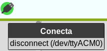
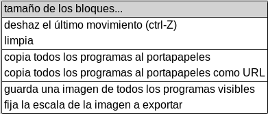

# Microblocks
Se trata de un software que puede trabajar online o localmente y que nos va a permitir programar diferentes placas, entre ellas la micro:bit.

En el apartado [Get Started](https://microblocks.fun/get-started) de su web tenemos descrito como trabajar desde un navegador y los distintos sistemas operativos así como los pasos a seguir para configurar nuestra placa y como comenzar a crear programas.

En esta ocasión vamos a trabajar de forma local [descargando](https://microblocks.fun/download) e instalando el programa en nuestro ordenador. En mi caso trabajaré con Linux de 64 bits instalando el paquete debian descargado 'ublocks-amd64.deb'. La forma elegida para instalarlo, suponiendo que el paquete está en Descargas, es:

~~~
sudo dpkg -i ~/Descargas/ublocks-amd64.deb
~~~

Tras la instalación verificamos que todo está correcto y que Linux ve la placa ejecutando en una terminal lo que vemos en la imagen siguiente.

  
*Verificación de conexión con micro:bit en Linux*

En el enlace [Mis notas sobre Linux trabajando con Ubuntu](https://fgcoca.github.io/Mis-notas-sobre-Linux-Ubuntu/) tenemos un par de entradas que describen problemas con el paquete *brltty* (Braille TTY). En el caso de placas con un chip microcontrolador de la serie USB CP210x, algunas de ellas compatibles con MicroBlocks. Si tenemos este caso el problema se puede resolver eliminando el paquete BRLTTY.

~~~
sudo apt remove brltty
~~~

El programa una vez instalado lo tenemos disponible en aplicaciones, como vemos en la imagen siguiente.

  
*App MicroBlocks disponible*

## **Descripción general**
En la imagen siguiente vemos los nombres de las distintas partes que componen el editor de MicroBlocks.

  
*Partes del editor*

* **Bloques**. Los bloques están organizados por categorias codificadas por colores. Cuando se selecciona una categoría se despliegan los correspondientes a esa categoria en la zona denominada **paleta de bloques**. En la wiki de MicroBlocks podemos encontrar una referencia completa a los bloques ([Block Reference](https://wiki.microblocks.fun/reference_manual)) con multitud de ejemplos resueltos.
* **Barra de menús**. Contiene, de izquierda a derecha, el icono en forma de globo terraqueo para configurar el idioma, la rueda dentada para entrar en opciones de MicroBlocks, la hoja de papel que muestra el menú archivo, el gráfico es un menú con opciones de graficar y conectar y el conector USB para el menú conectar.
* **Nombre del proyecto**. Es el nombre del proyecto actual.
* **Botones de inicio/parada**. Son dos iconos que sirven para controlar la ejecución de los programas.
* **Librerias**. Aquí se muestran las diversas bibliotecas que se cargan según sea requerido.
* **Área de bloques de programa**. Es donde se crea el programa o script de usuario y las funciones, que en MicroBlocks se conocen como bloques personalizados.
* **Barra de información**. Si vamos moviendo el ratón por los diversos bloques y áreas del IDE en esta barra se muestra el tipo de bloque y una breve información de ayuda sobre los bloques; así como la funcionalidad de las distintas áreas. La información detallada del bloque está disponible a través del menú contextual de cada bloque.
* **Controles tamaño bloques**. Estos tres controles permiten cambiar el tamaño de los bloques aumentando (+) o disminuyendo (-), así como establecerlos en el tamaño predeterminado o del 100% de zoom (=).

### Idioma
En la imagen siguiente vemos el menú desplegado.

  
*Idioma*

Simplemente tenemos que seleccionar el idioma deseado de entre los que está traducido MicroBlocks. Esto configura todos los menús, mensajes y bloques de código en ese idioma. La operación puede demorarse unos segundos dependiendo del equipo en el que se esté ejecutando el programa.

### MicroBlocks
En la figura siguiente vemos este menú desplegado.

  
*MicroBlocks*

* La opción 'acerca de...' nos muestra la información sobre MicroBlocks que vemos en la imagen siguiente.

  
*acerca de...*

* Actualizar el firmware de la placa es lo que permite al usuario cargar la última versión del firmware en la placa conectada. Dependiendo de los dispositivos conectados y de las condiciones se puede desplegar un menú para seleccionar el dispositivo concreto. Es la opción que utilizaremos para grabar los programas en la placa.
* Mostrar bloques avanzados modifica el menú MicroBlocks mostrando mas opciones, como vemos en la imagen siguiente.

  
*Bloques avanzados*

* La opción *versión de firmware* nos devuelve la versión de firmware de la máquina virtual para micro:bit, como vemos en la imagen siguiente.

  
*versión de firmware*

* La opción *borra y reparticiona el firmware en placa ESP* borra totalmente el contenido de la memoria y carga el programa actual en placas con capacidad EiFi tipo ESP.
* La opción *inicia el servidor HTTP*. Activa (o desactiva si está activo) el servidor HTTP de MicroBlocks en el puerto por defecto 6473, aunque este puede ser cambiado.
* La opción *desactiva autocarga de librerias de placa* permite desabilitar la funcionalidad de MicroBlocks de que intente automáticamente complementar las funcionalidades básicas del dispositivo conectado cargando varias bibliotecas.
* La opción *activar PlugShare en proyecto en blanco* es una función que si está habilitada hace que el editor de MicroBlocks cargue automáticamente un proyecto desde el microdispositivo conectado, siempre que no haya un proyecto cargado en el editor. Si el ícono de conexión no es verde y está habilitado PlugShare cuando estamos en un proyecto vacío, tan pronto como se establezca la conexión USB, MicroBlocks leerá y cargará el proyecto que contiene el dispositivo conectado.
* La opción *oculta los bloques avanzados* devuelve al menú MicroBlocks a su estado por defecto, que es la opción mas habitual.

### Archivo
En la figura siguiente vemos este menú desplegado.

  
*Archivo*

* **Guarda**. Cuando demos por finalizado un proyecto, o tengamos que dejarlo para otro momento sin perder el trabajo realizado, debemos guardarlo en el ordenador. Se nos abrirá una ventana como la de la imagen siguiente.

  
*Guarda fichero*

* **Nuevo**. Para crear nuevos proyectos. Si tenemos un programa cargado en el área de trabajo del editor, mostrará un mensaje solicitando confirmación para eliminar del editor el proyecto activo. En la imagen siguiente vemos el mensaje.

  
*Confirmacion*

Si la contestación es 'Si' el área de trabajo queda vacía y las bibliotecas añadidas por el usuario se borran.

* **Abre**. Esta opción permite cargar en el editor proyectos .ubp previamente guardados. Si hay un proyecto cargado en el área de trabajo, se mostrará un mensaje de confirmación (igual que en Nuevo) y se presenta una ventana de diálogo que permite localizar y abrir el archivo deseado. En la imagen siguiente vemos esta ventana.

  
*Diálogo abrir fichero*

En la categoría Ejemplos es donde se presentan muchos proyectos de MicroBlocks para diferentes microdispositivos y opciones de hardware.

* **Copia URL del proyecto al portapapeles**. Cuando trabajamos online permite compartir el proyecto.

### Conectar
En la figura siguiente vemos este menú desplegado. En esta ocasión hay un dispositivo ya conectado y por eso se muestra la opción *disconnect (/dev/ttyACM0)*.

  
*Conectar*

Si tenemos varios dispositivos conectados a puertos USB se nos mostrarán los mismos para que podamos escoger el dispositivo que nos interesa. Al seleccionar uno y hacer clic en Conectar se establecerá una conexión con el dispositivo correspondiente. Si la conexión tiene éxito, el ícono USB cambiará a uno con un fondo circular verde, como vemos en la imagen siguiente.

  
*Conectado*

Es importante prestar atención al estado de este icono. MicroBlocks ejecuta muchos procesos internos automatizados y la actualización y sincronización automática del código del proyecto en el dispositivo conectado es uno de ellos, pero esto solo es posible cuando el ícono está en modo verde.

Existen diversas razones por las que la conexión puede interrumpirse. Cuando esto ocurre el icono dejará de estar verde y debemos buscar el motivo de la desconexión.

### Botones de inicio/parada
MicroBlocks siempre está en conexión; se puede hacer clic en bloques o secuencias de comandos individuales para ejecutarlos sin hacer clic en el botón de 'Inicio'.

La función principal del botón 'Inicio' es simular el encendido del dispositivo iniciando todas las secuencias de comandos.

El botón 'STOP' detiene la ejecución del proyecto. Todas las variables son desasignadas. Todos los scripts se detienen.

El proyecto cargado en el dispositivo estará en el mismo hasta nueva grabación de firmware. De hecho, podemos desconectarlo, encenderlo desde una fuente externa y ejecutar el proyecto sin el editor.

## **Programando**
Dado que es la parte en la que mas se trabaja, la creación de programas, la vemos en su propio apartado.

Los bloques colocados en el área de trabajo los podemos mover a voluntad con el ratón, así como con los menús contextuales que aparecen al pulsar el botón derecho. Existen una serie de atajos asociados a las teclas Ctrl y Shift que se irán viendo.

### Arrastrar y soltar
El movimiento de arrastrar y soltar es el habitual de entornos de programación por bloques y además resulta muy intuitivo. Lo nuevo en Microblocks es que mientras se arrastra aparece una sombra paralela que pretende crear un efecto 3D de que el bloque en movimiento va flotando sobre el área de trabajo, incluso por encima del resto de bloques.

  
*Sombra paralela*

### Acoplar bloques
Cuando nos acercamos con un bloque o un conjunto de bloques a otro u otros bloques, aparecerá una línea blanca blanca horizontal que designa un punto de acople.

  
*Línea blanca mostrando punto de acople*

Si soltamos el botón del ratón cuando se ve esa línea blanca el bloque o bloques se acoplarán a los del otro lado de la línea.

### Menú contextual de bloques
Si situamos el cursor sobre un bloque que está en un grupo de bloques y hacemos clic con el botón secundario o derecho, nos aparece un menú contextual.

  
*Menú contextual en bloques*

Este menú contextual ofrece mas opciones si hemos seleccionado 'Mostrar bloques avanzados'.

  
*Menú contextual en bloques avanzados*

### Menú contextual de área de trabajo
Es el menú contextual que aparece cuando hacemos un clic derecho sobre cualquier zona vacía del área de trabajo.

  
*Menú contextual en área de trabajo*

* **tamaño de bloques**. Cuando se selecciona nos muestra una lista con porcentajes para escoger estándo tildado el valor actual.
* **deshaz el último movimiento**. Invierte el último movimiento de bloque completado.
* **limpia**. Organiza los conjuntos y los bloques sueltos en la pantalla en una disposición de arriba hacia abajo y de izquierda a derecha desde el lado izquierdo del área de trabajo. Los bloques se organizan en múltiples columnas determinadas por el ancho del área IDE. ¡Esta operación no se puede deshacer!
* **copia todos los programas al portapapeles**. Es la pareja de copiar al portapapeles. Mientras que el primero solamente copia el bloque o el programa, este copia todos los programas del proyecto.
* **copia todos los programas al portapapeles como URL**. Es lo mismo que el visto anteriormente.
* **guarda una imagen de todos los programas visibles**. Es la versión complementaria de la vista en el menú contextual de bloques.
* **fija la escala de la imagen a exportar**. Al seleccionarla nos muestra una lista con porcentajes para escoger estándo tildado el valor actual.

## **Crear un programa**
Por defecto, al iniciar Microblocks aunque se haga con la micro:bit conectada, no tendremos disponibles los bloques de manejo de la pantalla de 5x5 LEDs. Estos bloques se encuentran en la libreria 'Pantalla LED' que debemos añadir a nuestro programa. Desde 'Control debemos situar los bloques *'al empezar'* y *'por siempre'*.

Repetimos el 'Primer proyecto' en el que vamos a utilizar, además de los dos nombrados, el 'limpia pantalla' y 'muestra carácter'. En la animación siguiente vemos el proceso y la simulación.

  
*Primer proyecto*

Podemos observar que tras unos instantes el programa comienza a ejecutarse en la micro:bit conectada. En el caso de Microblocks el bloque usado solamente permite un carácter y no crea la animación si ponemos mas de uno. Para hacer esto tenemos disponible otro bloque.

Ya tenemos creado el programa y comprobado que funciona, es hora de salvarlo en el ordenador. Esto lo haremos asi principalmente para tener [disponibles todos los programas](../programas/lista.md) y poder enlazarlos donde convenga en estas notas. En la animación siguiente vemos el proceso de descarga del archivo.

  
*Descarga del archivo Primer-proyecto.ubp*

El [Primer proyecto](/docs/programas/ublocks/Primer-proyecto.ubp) lo podemos descargar desde este enlace.

Durante el proceso de cambios en el programa podemos comprobar que el conjunto de bloques esta rodeado de una línea verde que indica que el programa se está ejecutando en la micro:bit. Lo apropiado cuando vamos a realizar cambios es detener la ejecución, hacer los cambios y volver a poner la ejecución en marcha.

  
*Realizando cambios*

En la animación vemos junto a los botones de inicio/parada el icono indicador de progreso de la sincronización entre el IDE y la placa.

## **Enlaces útiles**

* En la web de Francisco Soldado denominada 'ardutaller' nos vamos a encontrar con una entrada [MicroBlocks -->> micro:bit](https://www.ardutaller.com.es/microblocks/microbit) donde aparece un video con detalles adicionales sobre el trabajo con esta pareja de software/hardware. En ese mismo enlace tenemos disponibles varias actividades totalmente resueltas tanto en catalán como español.

* Este es el video en [Youtube](https://www.youtube.com/) integrado en la web titulado [Introducion al Software Microblocks. Conexión a Microbit](https://www.youtube.com/watch?v=bMVCnjxcD2w)
