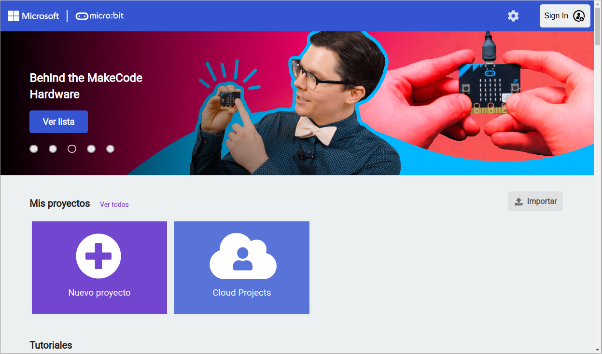
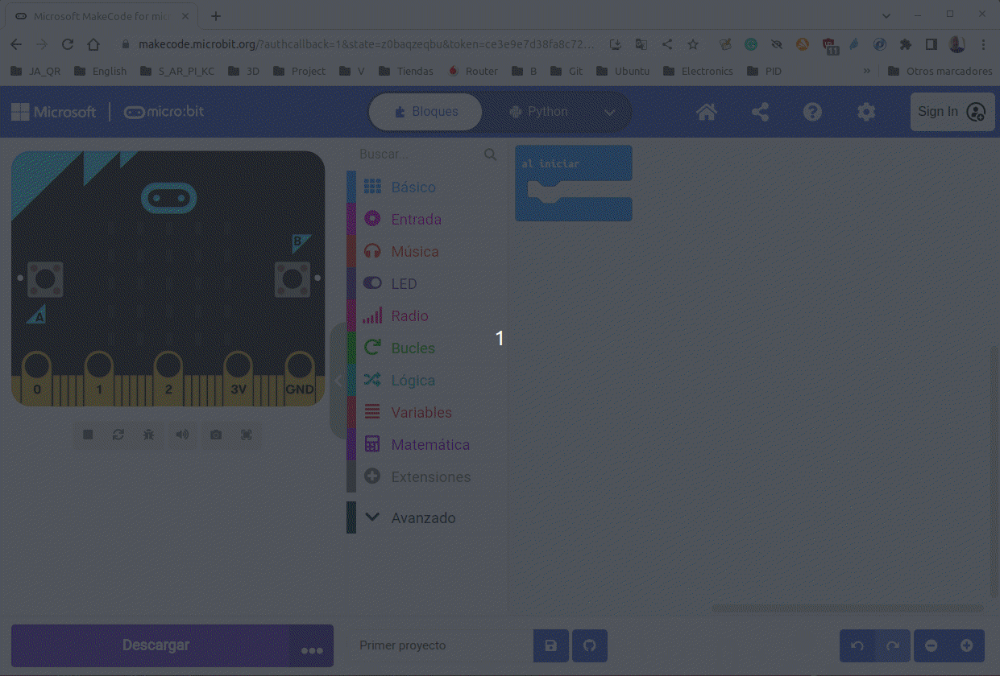
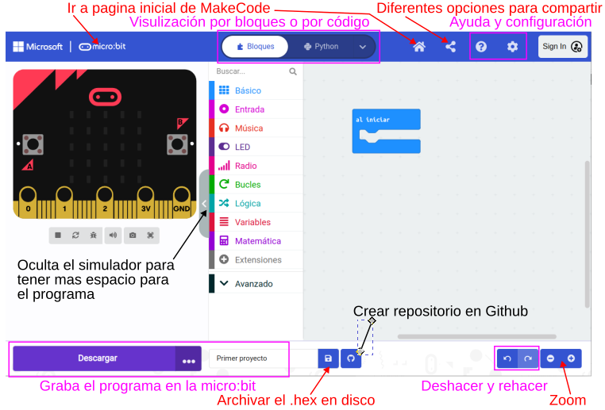
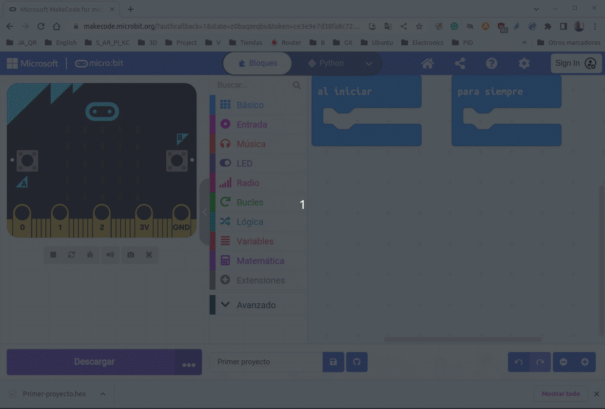
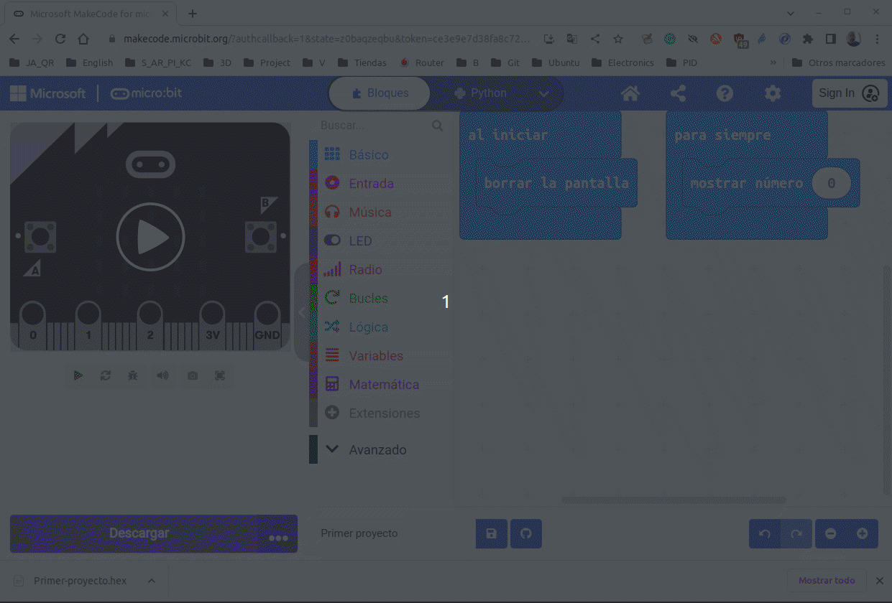
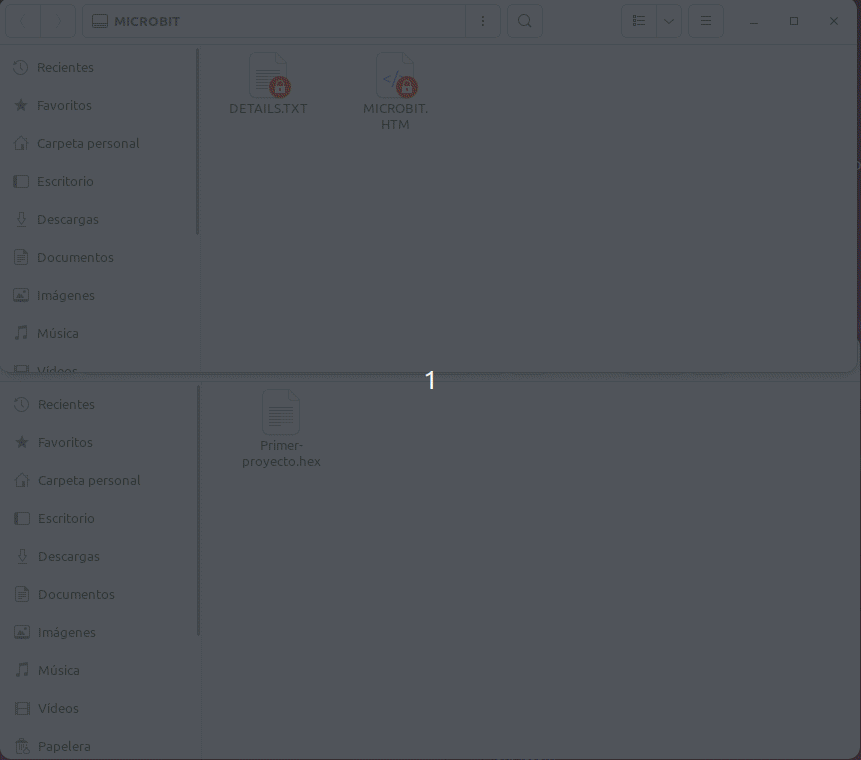

# Microsoft MakeCode
El editor MakeCode de Microsoft es una buena forma de comenzar a programar la BBC micro:bit según mi criterio. Se utiliza un sistema de bloques codificados por colores que resultan fáciles de usar y lo suficientemente potentes como para acceder a todas las [funciones de la placa](https://microbit.org/es-es/get-started/user-guide/overview/). También se puede cambiar el editor a JavaScript para ver el código equivalente a los bloques.

Se puede encontrar más información sobre cómo usar el editor MakeCode en las [Preguntas más frecuentes de MakeCode](https://makecode.microbit.org/faq).

Lo que vamos a mostrar aquí es una referencia de MakeCode a través del editor que podemos encontrar en:

 [Abrir el editor online MakeCode](https://makecode.microbit.org/#lang=es-ES)

Existen versiones descargables de MakeCode, pero no para Linux.

## **Primeros pasos**
El aspecto que se nos va a mostrar al entrar en el enlace anterior es el que vemos en la imagen siguiente, que se corresponde con la parte superior de la web. Es posible la primera vez se en inglés pero lo podemos cambiar haciendo clic en la rueda dentada y escogiendo el idioma entrando en la primera opción que se muestra.

  
*Pantalla inicial de MakeCode*

La ventana requiere pocas explicaciones y lo primero que vamos a hacer en crear un nuevo proyecto haciendo clic en el bloque de 'Nuevo proyecto'. Para crear proyectos en la nube tendremos que loguearnos mediante una cuenta válida. En la animación siguiente vemos como crear nuestro primer proyecto.

  
*Primer programa en MakeCode*

Al principio nos pide un nombre para el programa y nos ofrece la posibilidad de escoger como queremos trabajar en cuanto a código se refiere. Posteriormente lanza un pequeño tutorial, que aunque está en inglés, nos explica muy claramente como trabajar con el programa.

En la animación siguiente se recorren las opciones principales que están disponibles cuando estamos editando un proyecto.

  
*Ventana de edición de proyecto en MakeCode*

### Descripción de la ventana de proyecto

* En la parte superior izquierda de la pantalla es donde está situado el simulador que se muestra con una imagen de una micro:bit. Se trata de una sección muy importante porque nos permite trabajar con la mayor parte de los programas sin necesidad de tener una placa física conectada, además resultar útil para depurar el código.
* A la derecha del simulador se sitúa una columna con los bloques de programación organizados por categorias. Cuando hacemos clic en una categoria se despliegan, a la derecha, los bloques mas utilizados de esa categoria. Muchas veces, debajo del nombre correspondiente a esa categoria aparece un letrero ...mas, que si se pulsa muestra el resto de bloques de la categoria. Para llevar un bloque al área de programación basta con hacer clic sobre el mismo y arrastrarlo a la misma. En la parte superior de esta columna hay un buscador por si no recordamos muy bien donde está el bloque que buscamos.
* A la derecha de los bloques de programación está la zona de programación, que es donde se arrastran los bloques para crear el programa.
* Tanto en la parte superior como inferior de la pantalla tenemos enlaces a funcionalidades del programa que quedan resumidas en la imagen siguiente.

  
*Barras de herramientas de MakeCode*

### Crear un programa
Por defecto, al crear un proyecto, MakeCode sitúa dos bloques de eventos en el aŕea de programa, *'al iniciar'* y *'para siempre'*. Otros bloques que permiten iniciar el programa los podemos encontrar en 'Entrada'. Esta será la primera tarea a realizar en nuestro programa, decidir que evento es el que inicia el código.

El programa lo vamos creando arrastrando bloques al área de programación y podemos ir probando el funcionamiento en el simulador. Las opciones que permiten interactuar con el simulador son dependientes de los bloques introducidos.

Vamos a hacer algo en este 'Primer proyecto' que es el nombre que le dimos al primer programa. Simplemente vamos a utilizar dos bloques, uno va a ser 'Borrar la pantalla' y el otro 'Mostrar número', ambos en la sección 'Entrada'. El primero lo vamos a poner en el bloque 'al iniciar' de manera que cada vez que se inicia la micro:bit se apaguen todos los LEDs y el segundo lo pondremos en 'para siempre' y sin modificar nada vemos como el número 0 se muestra mientras está alimentada la micro:bit. En la animación siguiente vemos el proceso y la simulación.

  
*Primer proyecto*

Podemos hacer pruebas cambiando el número e incluso entrando números de varias cifras para ver lo que ocurre.

### Grabar código en la micro:bit
Aunque es posible utilizar el botón 'Descargar' para grabar directamente el programa en la memoria flash, el proceso que nosotros vamos a seguir siempre va a ser descargar el .hex y arrastrarlo a la unidad MICROBIT montada. Esto lo haremos asi principalmente para tener [disponibles todos los programas](../programas/lista.md) y poder enlazarlos donde convenga en estas notas. En la animación siguiente vemos el proceso de descarga del archivo.

*Descarga del archivo Primer-proyecto.hex*

El [Primer proyecto](../programas/makecode/Primer-proyecto.hex) lo podemos descargar desde este enlace.

Una vez descargado el .hex y conectada la micro:bit a un puerto USB procedemos a grabar el programa en la micro:bit para comprobar que funciona exactamente igual que en la simulación. El proceso lo vemos en la animación siguiente.

  
*Grabar en la micro:bit el archivo Primer-proyecto.hex*

Durante el proceso de grabación podemos comprobar el parpadeo del LED amarillo de la cara posterior y como se desmonta y monta la unidad MICROBIT reseteandose la placa.
